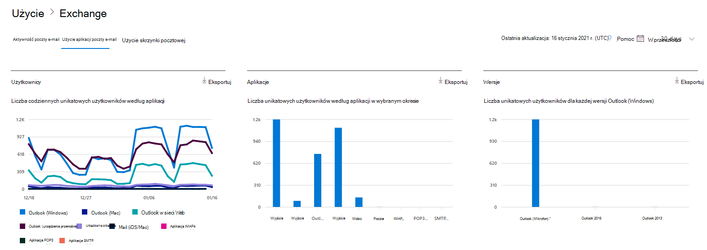

# Microsoft 365 w centrum administracyjnym — Użycie aplikacji poczty e-mail

Pulpit Microsoft 365 pulpitu nawigacyjnego Raporty zawiera informacje o aktywności dotyczącej wszystkich produktów w organizacji. Przechodząc do poziomu raportów dotyczących poszczególnych produktów, możesz uzyskać bardziej szczegółowe informacje o aktywności w poszczególnych produktach. Zobacz [temat zawierający omówienie pulpitu nawigacyjnego Raporty](activity-reports.md). W raporcie użycie aplikacji poczty e-mail możesz sprawdzić, ile aplikacji poczty e-mail łączy się z Exchange Online. Można też sprawdzić informacje o wersji aplikacji programu Outlook, z których korzystają użytkownicy, co umożliwia skontaktowanie się z tymi, którzy korzystają z nieobsługiwanych wersji, w celu zainstalowania wersji obsługiwanych.
  
## Jak uzyskać dostęp do raportu aplikacji poczty e-mail

1. W centrum administracyjnym przejdź do strony **Raporty** \> <a href="https://go.microsoft.com/fwlink/p/?linkid=2074756" target="_blank">Użycie</a>.
2. Wybierz pozycję **Wyświetl więcej w** obszarze **Aktywność poczty e-mail**. 
3. Z listy **rozwijanej** Aktywność poczty e-mail **wybierz pozycję** \> Exchange **użycie aplikacji poczty e-mail**.
  
## Interpretowanie raportu aplikacji poczty e-mail

Wykresy Użytkownicy i Klienci mogą chcieć zobaczyć aktywność w aplikacjach poczty **e-mail**. 
  

  
|Element|Opis|
|:-----|:-----|
|1.    |W **raporcie Użycie aplikacji poczty** e-mail można przeglądać trendy z ostatnich 7, 30, 90 lub 180 dni. Jeśli jednak wybierzesz określony dzień w raporcie, tabela będzie zawierała dane dla do 28 dni od bieżącej daty (nie daty wygenerowania raportu).    |
|2.    |Dane w poszczególnych raportach zazwyczaj obejmują od 24 do 48 godzin.    |
|3.    |W widoku **Użytkownicy** można sprawdzić liczbę unikatowych użytkowników, którzy łączyli się z usługą Exchange Online przy użyciu dowolnej aplikacji e-mail.    |
|4.    |W widoku **Aplikacje** można sprawdzić liczbę unikatowych użytkowników według aplikacji w wybranym okresie.    |
|5.    |W **widoku** Wersje można zobaczyć liczbę unikatowych użytkowników dla każdej wersji pakietu Outlook w Windows.    |
|6.    | Oś Y na wykresie na wykresie **Użytkownicy** reprezentuje całkowitą liczbę unikatowych użytkowników, którzy łączyli się z aplikacją dowolnego dnia w okresie raportowania.     Oś X na wykresie na wykresie **Użytkownicy** reprezentuje liczbę unikatowych użytkowników, którzy używali aplikacji w okresie raportowania.     Oś Y na wykresie **Aplikacje** przedstawia całkowitą liczbę unikatowych użytkowników, którzy używali konkretnej aplikacji w okresie raportowania.     Oś X na wykresie **Aplikacje** odpowiada liście aplikacji w organizacji.     Oś Y na wykresie na wykresie **Wersje** reprezentuje całkowitą liczbę unikatowych użytkowników korzystających z konkretnej wersji klasycznej programu Outlook. Jeśli nie będzie można rozpoznać numeru wersji Outlook, ta liczba będzie pokazywana jako **Nieustalona**.     Oś X na wykresie na wykresie **Wersje** odpowiada liście aplikacji w organizacji.    |
|7.    |Serie, które są na wykresie, można filtrować, zaznaczając je w legendzie.    |
|8.    | Być może nie wszystkie elementy poniższej listy będą widoczne od razu — musisz wtedy dodać odpowiednie kolumny.  **Nazwa** użytkownika to nazwa właściciela aplikacji poczty e-mail.    **Data ostatniego działania** to najpóźniejsza data przeczytania lub wysłania wiadomości e-mail przez użytkownika.    **Poczta na komputerze Mac**, **Outlook dla komputerów Mac**, **Outlook**, **Outlook Mobile** i **Outlook w sieci Web** to przykłady aplikacji e-mail, które mogą być używane w organizacji.     Jeśli zasady organizacji nie pozwalają na wyświetlanie raportów zawierających identyfikowalne dane użytkowników, możesz zmienić ustawienie prywatności dla wszystkich tych raportów. Zobacz sekcję **Ukrywanie szczegółów na poziomie użytkownika w** sekcji [Raporty aktywności w centrum administracyjne platformy Microsoft 365](activity-reports.md).    |
|9.    |Wybierz **pozycję Wybierz kolumny** , aby dodać lub usunąć kolumny z raportu.    |
|10.    |Dane raportu można również wyeksportować do pliku Excel .csv, wybierając link **Eksportuj**. Powoduje to wyeksportowanie danych wszystkich użytkowników oraz umożliwia wykonywanie prostego sortowania i filtrowania w celu dalszej analizy. Jeśli masz mniej niż 2000 użytkowników, możesz sortować i filtrować dane wewnątrz tabeli raportu. Jeśli masz więcej niż 2000 użytkowników, w celu filtrowania i sortowania należy wyeksportować dane.    |
|||
   
