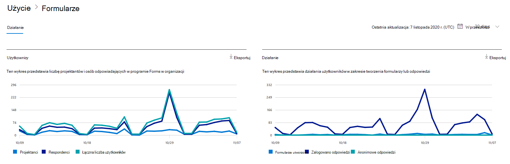
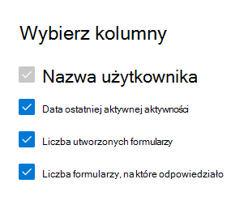

# Microsoft 365 w centrum administracyjnym — Aktywność formularzy

Pulpit Microsoft 365 pulpitu nawigacyjnego Raporty zawiera informacje o aktywności dotyczącej wszystkich produktów w organizacji. Przechodząc do poziomu raportów dotyczących poszczególnych produktów, możesz uzyskać bardziej szczegółowe informacje o aktywności w poszczególnych produktach. Zobacz [temat zawierający omówienie pulpitu nawigacyjnego Raporty](activity-reports.md).
  
Możesz na przykład zrozumieć działanie każdego użytkownika z licencją na używanie programu Microsoft Forms, patrząc na jego interakcję z formularzami. Ułatwia to również zrozumienie poziomu współpracy dzięki liczbie formularzy utworzonych przez użytkownika, na które użytkownik odpowiedział.
  
## Jak uzyskać dostęp do raportu aktywności formularzy

1. W centrum administracyjnym przejdź do strony **Raporty** \> <a href="https://go.microsoft.com/fwlink/p/?linkid=2074756" target="_blank">Użycie</a>. 
2. Na stronie głównej pulpitu nawigacyjnego kliknij przycisk **Wyświetl więcej** na karcie Formularze.
  
## Interpretowanie raportu aktywności w programie Forms

Możesz wyświetlić działania w raporcie formularzy, wybierając **kartę** Działanie. 

Wybierz **pozycję Wybierz kolumny** , aby dodać lub usunąć kolumny z raportu.    

Dane raportu można również wyeksportować do pliku Excel .csv, wybierając link **Eksportuj**. Powoduje to wyeksportowanie danych wszystkich użytkowników oraz umożliwia wykonywanie prostego sortowania i filtrowania w celu dalszej analizy. Jeśli masz mniej niż 2000 użytkowników, możesz sortować i filtrować dane wewnątrz tabeli raportu. Jeśli masz więcej niż 2000 użytkowników, w celu filtrowania i sortowania należy wyeksportować dane. 

W **raporcie** Aktywność formularzy można przeglądać trendy z ostatnich 7, 30, 90 lub 180 dni. Jeśli jednak wybierzesz określony dzień w raporcie, tabela będzie zawierała dane dla do 28 dni od bieżącej daty (nie daty wygenerowania raportu).
  
|Element|Opis|
|:-----|:-----|
|**Metryczny**|**Definicja**|
|Nazwa użytkownika    |Adres e-mail użytkownika, który wykonał działanie w aplikacji Microsoft Forms.    |
|Data ostatniego działania (UTC)    |Najpóźniejsza data działania formularza wykonanego przez użytkownika w wybranym zakresie dat. Aby zobaczyć działanie, które wystąpiło w konkretnym dniu, wybierz datę bezpośrednio na wykresie.  Spowoduje to filtrowanie tabeli w celu wyświetlenia danych dotyczących aktywności tylko tych użytkowników, którzy wykonywali działania w danym dniu.    |
|Liczba utworzonych formularzy    |Liczba formularzy utworzonych przez użytkownika.     |
|Liczba formularzy, na które odpowiedziało    |Liczba formularzy, na które użytkownik przesłał odpowiedzi.|
|||
