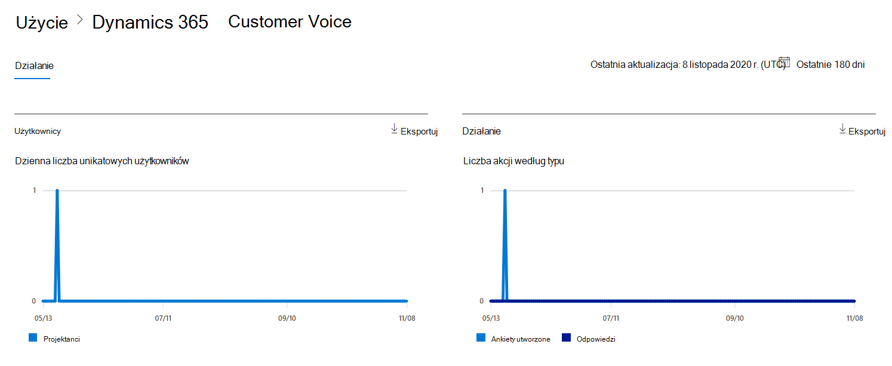
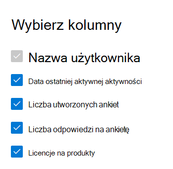

# Microsoft 365 Raporty w centrum administracyjnym — działanie usługi Dynamics 365 Customer Voice

Na pulpicie nawigacyjnym raportów Microsoft 365 przedstawiono omówienie działań w produktach w organizacji. Przechodząc do poziomu raportów dotyczących poszczególnych produktów, możesz uzyskać bardziej szczegółowe informacje o aktywności w poszczególnych produktach. Zobacz [temat zawierający omówienie pulpitu nawigacyjnego Raporty](activity-reports.md).
  
Na przykład możesz zrozumieć aktywność każdego użytkownika licencjonowanego do korzystania z usługi Microsoft Dynamics 365 Customer Voice, przeglądając ich interakcje z usługą Dynamics 365 Customer Voice. Pomaga to również zrozumieć poziom współpracy, analizując liczbę Pro ankiet utworzonych i Pro ankiet, na które użytkownicy odpowiedzieli. 
  
## Jak uzyskać dostęp do raportu aktywności usługi Dynamics 365 Customer Voice

1. W centrum administracyjnym przejdź do strony **Raporty** \> <a href="https://go.microsoft.com/fwlink/p/?linkid=2074756" target="_blank">Użycie</a>. 
2. Na stronie głównej pulpitu nawigacyjnego kliknij przycisk **Wyświetl więcej** na karcie Głos klienta usługi Dynamics 365.
  
## Interpretowanie raportu aktywności usługi Dynamics 365 Customer Voice

Możesz wyświetlić działania w raporcie Dynamics 365 Customer Voice, wybierając kartę **Działanie** . 

Wybierz pozycję **Wybierz kolumny** , aby dodać lub usunąć kolumny z raportu.    

Możesz również wyeksportować dane raportu do pliku Excel .csv, wybierając link **Eksportuj**. Powoduje to wyeksportowanie danych wszystkich użytkowników oraz umożliwia wykonywanie prostego sortowania i filtrowania w celu dalszej analizy. Jeśli masz mniej niż 2000 użytkowników, możesz sortować i filtrować dane wewnątrz tabeli raportu. Jeśli masz więcej niż 2000 użytkowników, w celu filtrowania i sortowania należy wyeksportować dane. 

Raport **aktywności Dynamics 365 Customer Voice** można wyświetlić dla trendów z ostatnich 7 dni, 30 dni, 90 dni lub 180 dni. Jeśli jednak wybierzesz konkretny dzień w raporcie, w tabeli będą wyświetlane dane przez maksymalnie 28 dni od bieżącej daty (a nie daty wygenerowania raportu).
  
|Element|Opis|
|:-----|:-----|
|**Metrycznych**|**Definicja**|
|Nazwa użytkownika    |Adres e-mail użytkownika, który wykonał działanie na Microsoft Forms.    |
|Data ostatniego działania (UTC)    |Ostatnia data wykonania działania formularza przez użytkownika dla wybranego zakresu dat. Aby zobaczyć działanie, które wystąpiło w konkretnym dniu, wybierz datę bezpośrednio na wykresie. Spowoduje to przefiltrowanie tabeli w celu wyświetlenia danych aktywności pliku tylko dla użytkowników, którzy wykonali działanie w danym dniu.    |
|Liczba utworzonych ankiet    |Liczba ankiet utworzonych przez użytkownika.     |
|Liczba odpowiedzi na ankietę    |Liczba odpowiedzi od osób odpowiadających, do których przeprowadzono ankietę.|
|||