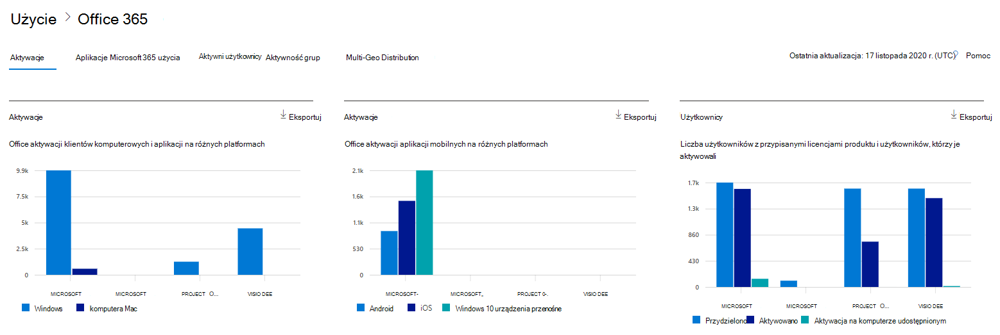
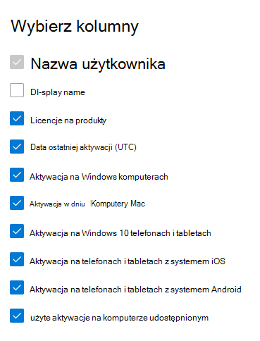

# Microsoft 365 Raporty w centrum administracyjnym — aktywacje Microsoft Office

Na pulpicie nawigacyjnym raportów Microsoft 365 przedstawiono omówienie działań w produktach w organizacji. Przechodząc do poziomu raportów dotyczących poszczególnych produktów, możesz uzyskać bardziej szczegółowe informacje o aktywności w poszczególnych produktach. Zobacz [temat zawierający omówienie pulpitu nawigacyjnego Raporty](activity-reports.md).
  
Raport Aktywacje pakietu Office zawiera informacje o użytkownikach, którzy aktywowali subskrypcję pakietu Office na co najmniej jednym urządzeniu. Zawiera ona podział aktywacji subskrypcji Aplikacje Microsoft 365 dla przedsiębiorstw, Project i Visio Pro dla Office 365, a także podział aktywacji na komputery stacjonarne i urządzenia. Ten raport może pomóc Ci w zidentyfikowaniu użytkowników, którzy mogą potrzebować dodatkowej pomocy w aktywowaniu swojej subskrypcji pakietu Office.
  
## Jak przejść do raportu dotyczącego aktywacji pakietu Office

1. W centrum administracyjnym przejdź do strony **Raporty** \> <a href="https://go.microsoft.com/fwlink/p/?linkid=2074756" target="_blank">Użycie</a>. 
2. Na stronie głównej pulpitu nawigacyjnego kliknij przycisk **Wyświetl więcej** na karcie aktywacji Office.
  
## Interpretowanie raportu dotyczącego aktywacji pakietu Office
  
Aktywacje można wyświetlić w raporcie Office 365, wybierając kartę **Aktywacje**. 

Wybierz pozycję **Wybierz kolumny** , aby dodać lub usunąć kolumny z raportu.    

Możesz również wyeksportować dane raportu do pliku Excel .csv, wybierając link **Eksportuj**. Powoduje to wyeksportowanie danych wszystkich użytkowników oraz umożliwia wykonywanie prostego sortowania i filtrowania w celu dalszej analizy. Jeśli masz mniej niż 2000 użytkowników, możesz sortować i filtrować dane wewnątrz tabeli raportu. Jeśli masz więcej niż 2000 użytkowników, w celu filtrowania i sortowania należy wyeksportować dane. 

|Element|Opis|
|:-----|:-----|
|**Metrycznych**|**Definicja**|
|Nazwa użytkownika    |Adres e-mail użytkownika.    |
|Nazwa wyświetlana    |Pełna nazwa użytkownika.    |
|Licencje na produkty    |Produkty przypisane do tego użytkownika.    |
|Data ostatniej aktywacji (UTC)    |Data aktywowania Office użytkownika na pulpicie lub urządzeniu.    |
|Aktywacja na komputerach Windows    |Liczba Windows pulpitów, na których użytkownik aktywował Office.    |
|Aktywacja na komputerach Mac   |Liczba komputerów Mac, na których użytkownik aktywował Office.|
|Aktywacja na Windows 10 telefonach i tabletach    |Liczba Windows 10 urządzeń przenośnych, na których użytkownik aktywował Office.    |
|Aktywacja na telefonach i tabletach z systemem iOS    |Liczba urządzeń z systemem iOS, na których użytkownik aktywował Office.|
|Aktywacja na telefonach i tabletach z systemem Android    |Liczba urządzeń z systemem Android, na których użytkownik aktywował Office.    |
|Aktywacja używanego komputera udostępnionego |Jest to prawdą, jeśli użytkownik użył Office za pośrednictwem aktywacji komputera udostępnionego.|
|||
   