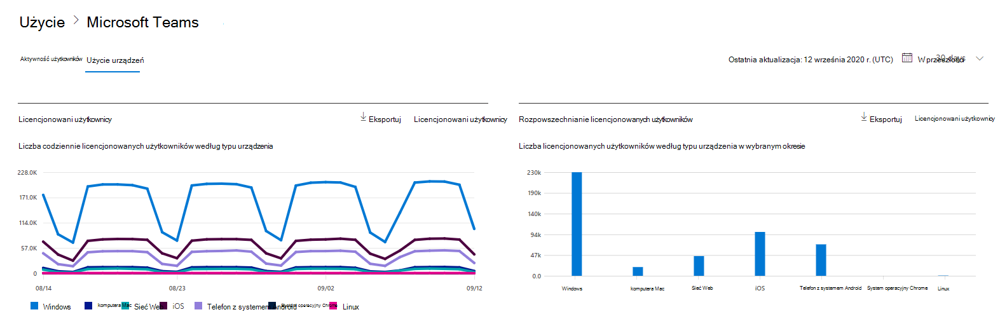
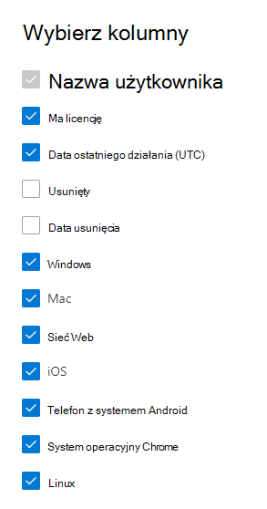

# Microsoft 365 w centrum administracyjnym — informacje o Microsoft Teams urządzeniach

Pulpit Microsoft 365 pulpitu nawigacyjnego Raporty zawiera informacje o aktywności dotyczącej wszystkich produktów w organizacji. Przechodząc do poziomu raportów dotyczących poszczególnych produktów, możesz uzyskać bardziej szczegółowe informacje o aktywności w poszczególnych produktach. Zobacz [temat zawierający omówienie pulpitu nawigacyjnego Raporty](activity-reports.md). Raport dotyczący użycia aplikacji Microsoft Teams pozwala uzyskać szczegółowe informacje o aplikacjach Microsoft Teams używanych w organizacji.
  
## Jak przejść do raportu użycia aplikacji Microsoft Teams

1. W centrum administracyjnym przejdź do strony **Raporty** \> <a href="https://go.microsoft.com/fwlink/p/?linkid=2074756" target="_blank">Użycie</a>. 
2. Na stronie głównej pulpitu nawigacyjnego kliknij przycisk **Wyświetl więcej** na Microsoft Teams karcie aktywność.
  
## Interpretowanie raportu użycia aplikacji Microsoft Teams

Możesz wyświetlić informacje o użyciu urządzenia w raporcie Teams, wybierając **kartę Użycie** urządzenia. 

Wybierz **pozycję Wybierz kolumny** , aby dodać lub usunąć kolumny z raportu.    

Dane raportu można również wyeksportować do pliku Excel .csv, wybierając link **Eksportuj**. Powoduje to wyeksportowanie danych wszystkich użytkowników oraz umożliwia wykonywanie prostego sortowania i filtrowania w celu dalszej analizy. Jeśli masz mniej niż 2000 użytkowników, możesz sortować i filtrować dane wewnątrz tabeli raportu. Jeśli masz więcej niż 2000 użytkowników, w celu filtrowania i sortowania należy wyeksportować dane. 

W raporcie **Użycie urządzeń z aplikacją Microsoft Teams** można przeglądać trendy z ostatnich 7, 30, 90 lub 180 dni. Jeśli jednak wybierzesz określony dzień w raporcie, tabela będzie zawierała dane dla do 28 dni od bieżącej daty (nie daty wygenerowania raportu).
  
|Element|Opis|
|:-----|:-----|
|**Metryczny**|**Definicja**|
|Nazwa użytkownika    |Nazwa wyświetlana użytkownika.    |
|System Windows    |Zaznaczona, jeśli użytkownik był aktywny w kliencie Teams klasycznego na Windows komputerze.    |
|Mac    |Zaznaczona, jeśli użytkownik był aktywny w kliencie Teams klasycznego na komputerze macOS.    |
|iOS    |Zaznaczona, jeśli użytkownik był aktywny w kliencie Teams dla systemu iOS.    |
|Telefon z systemem Android    | Zaznaczona, jeśli użytkownik był aktywny w kliencie Teams dla systemu Android.    |
|System operacyjny Chrome    |Zaznaczona, jeśli użytkownik był aktywny w kliencie Teams klasycznego na komputerze z systemem ChromeOS.|
|Linux    | Zaznaczona, jeśli użytkownik był aktywny w kliencie Teams klasycznego na komputerze z systemem Linux.    |
|Web    |Zaznaczona, jeśli użytkownik był aktywny w kliencie Teams sieci Web na urządzeniach.|
|Data ostatniego działania (UTC)    |Ostatnia data (UTC), w których użytkownik uczestniczył w Teams danych.    |
|Ma licencję|Zaznaczona, jeśli użytkownik ma licencję na używanie Teams.|
|||