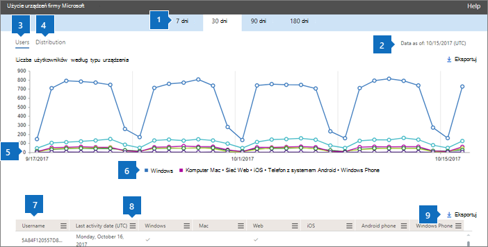
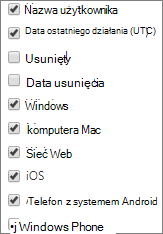

# Microsoft 365 w centrum administracyjnym — informacje o Microsoft Teams urządzeniach

Pulpit Microsoft 365 pulpitu nawigacyjnego Raporty zawiera informacje o aktywności dotyczącej wszystkich produktów w organizacji. Przechodząc do poziomu raportów dotyczących poszczególnych produktów, możesz uzyskać bardziej szczegółowe informacje o aktywności w poszczególnych produktach. Zobacz [temat zawierający omówienie pulpitu nawigacyjnego Raporty](activity-reports.md). Raport dotyczący użycia aplikacji Microsoft Teams pozwala uzyskać szczegółowe informacje o aplikacjach Microsoft Teams używanych w organizacji.
 
## Jak przejść do raportu użycia aplikacji Microsoft Teams

1. W centrum administracyjnym przejdź do strony **Raporty** \> <a href="https://go.microsoft.com/fwlink/p/?linkid=2074756" target="_blank">Użycie</a>.

    
2. Z listy **rozwijanej Wybierz raport** **wybierz pozycję** \> Microsoft Teams **Użycie urządzenia**.
  
## Interpretowanie raportu użycia aplikacji Microsoft Teams

Wgląd w użycie aplikacji Microsoft Teams możesz uzyskać, patrząc na wykresy **Użytkownicy** i **Dystrybucja**. 
  

  
|Element|Opis|
|:-----|:-----|
|1.    |W raporcie **Użycie urządzeń z aplikacją Microsoft Teams** można przeglądać trendy z ostatnich 7, 30, 90 lub 180 dni. Jeśli jednak wybierzesz określony dzień w raporcie, tabela (7) będzie zawierała dane dla do 28 dni od bieżącej daty (nie daty wygenerowania raportu).    |
|2.    |Dane w poszczególnych raportach zazwyczaj obejmują od 24 do 48 godzin.    |
|3.    |W widoku **Użytkownicy** można sprawdzić dzienną liczbę unikatowych użytkowników według aplikacji.    |
|4.    |W widoku **Rozkład** można sprawdzić liczbę unikatowych użytkowników według aplikacji w wybranym okresie.    |
|5.    | Na wykresie **Użytkownicy** oś Y przedstawia liczbę użytkowników według aplikacji.     Na wykresie **Rozkład** oś Y przedstawia liczbę użytkowników korzystających z określonej aplikacji.     Oś X na wykresach przedstawia wybrany w danym raporcie przedział czasu.    |
|6.    |Serie, które są na wykresie, można filtrować, zaznaczając je w legendzie. Na przykład na wykresie Użytkownicy  wybierz pozycję **Windows,** **Mac****, Połączenia**, **Sieć Web**, Telefon **z systemem Android** lub telefon Windows, aby wyświetlić tylko informacje dotyczące poszczególnych z nich. Zmiana ta nie ma wpływu na informacje w siatce tabeli.    |
|7.    | Lista wyświetlanych grup jest ustalana na podstawie zbioru wszystkich grup, które istniały (nie zostały usunięte) w najdłuższym (180-dniowym) przedziale czasu raportowania. Liczba działań zależy od wybranego przedziału dat.    UWAGA: Możesz nie widzieć wszystkich elementów na poniższej liście w kolumnach, dopóki ich nie dodasz.  **Nazwa użytkownika** to adres e-mail użytkownika. W tym polu może być wyświetlany rzeczywisty adres e-mail lub można ustawić je jako anonimowe.    **Data ostatniego działania (UTC)** odwołuje się do ostatniej daty, kiedy użytkownik uczestniczył w działaniu w aplikacji Microsoft Teams.    **Usunięte** wskazuje, czy zespół został usunięty. Jeśli zespół został usunięty, ale w okresie raportowania nastąpiła w nim aktywność, grupa ta pojawi się na siatce z parametrem Usunięte ustawionym na wartość Prawda.    **Data usunięcia** to data usunięcia zespołu.    Pole wyboru **Windows** jest zaznaczone, jeśli w danym okresie użytkownik korzystał z aplikacji dla systemu Windows.    Pole wyboru **Mac** jest zaznaczone, jeśli w danym okresie użytkownik korzystał z aplikacji dla komputerów Mac.    Pole wyboru **Sieć Web** jest zaznaczone, jeśli w danym okresie użytkownik korzystał z aplikacji sieci Web.    Pole wyboru **iOS** jest zaznaczone, jeśli w danym okresie użytkownik korzystał z aplikacji dla systemu iOS.    Pole wyboru **Telefon z systemem Android** jest zaznaczone, jeśli w danym okresie użytkownik korzystał z aplikacji dla telefonu z systemem Android.    Pole wyboru **Telefon z systemem Windows** jest zaznaczone, jeśli w danym okresie użytkownik korzystał z aplikacji dla telefonu z systemem Windows.     Jeśli zasady organizacji nie pozwalają na wyświetlanie raportów zawierających identyfikowalne dane użytkowników, możesz zmienić ustawienie prywatności dla wszystkich tych raportów. Zobacz sekcję **Ukrywanie szczegółów na poziomie użytkownika w** sekcji [Raporty aktywności w centrum administracyjne platformy Microsoft 365](activity-reports.md).    |
|8.    |Wybierz **pozycję** Kolumny, aby dodać lub usunąć kolumny z raportu.    |
|9.    |Dane raportu można również wyeksportować do pliku Excel .csv, wybierając link **Eksportuj**. Powoduje to wyeksportowanie danych wszystkich użytkowników oraz umożliwia wykonywanie prostego sortowania i filtrowania w celu dalszej analizy. Jeśli masz mniej niż 2000 użytkowników, możesz sortować i filtrować dane wewnątrz tabeli raportu. Jeśli masz więcej niż 2000 użytkowników, w celu filtrowania i sortowania należy wyeksportować dane.    |
|||
   
  

