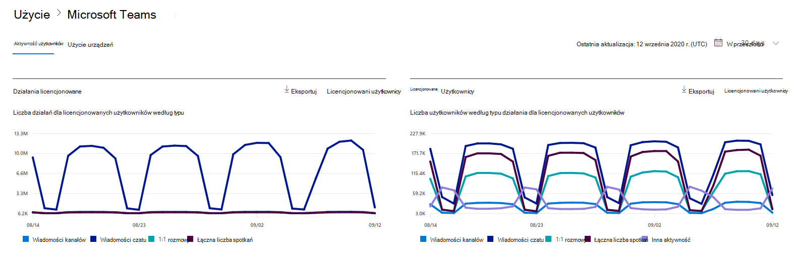

# Microsoft 365 w centrum administracyjnym — aktywność Microsoft Teams użytkowników

Pulpit Microsoft 365 pulpitu nawigacyjnego Raporty zawiera informacje o aktywności dotyczącej wszystkich produktów w organizacji. Przechodząc do poziomu raportów dotyczących poszczególnych produktów, możesz uzyskać bardziej szczegółowe informacje o aktywności w poszczególnych produktach. Zobacz [temat zawierający omówienie pulpitu nawigacyjnego Raporty](activity-reports.md). Raport dotyczący aktywności użytkowników aplikacji Microsoft Teams pozwala uzyskać szczegółowe informacje o aktywności związanej z aplikacją Microsoft Teams w organizacji.
 
## Jak przejść do raportu aktywności użytkowników aplikacji Microsoft Teams

1. W centrum administracyjnym przejdź do strony **Raporty** \> <a href="https://go.microsoft.com/fwlink/p/?linkid=2074756" target="_blank">Użycie</a>.
2. Na stronie głównej pulpitu nawigacyjnego kliknij przycisk **Wyświetl więcej** na Microsoft Teams karcie aktywność.

## Interpretowanie raportu aktywności użytkowników aplikacji Microsoft Teams

Możesz wyświetlić aktywność użytkowników w raporcie Teams, wybierając **kartę Aktywność** użytkownika.  

Wybierz **pozycję Wybierz kolumny** , aby dodać lub usunąć kolumny z raportu.    

Dane raportu można również wyeksportować do pliku Excel .csv, wybierając link **Eksportuj**. Powoduje to wyeksportowanie danych wszystkich użytkowników oraz umożliwia wykonywanie prostego sortowania i filtrowania w celu dalszej analizy. Jeśli masz mniej niż 2000 użytkowników, możesz sortować i filtrować dane wewnątrz tabeli raportu. Jeśli masz więcej niż 2000 użytkowników, w celu filtrowania i sortowania należy wyeksportować dane. Wyeksportowany format czasu **trwania dźwięku**, **czasu wideo** i udostępniania ekranu  jest zgodny z formatem czasu trwania ISO8601.

W raporcie **Aktywność użytkowników aplikacji Microsoft Teams** można przeglądać trendy z ostatnich 7, 30, 90 lub 180 dni. Jeśli jednak wybierzesz określony dzień w raporcie, tabela będzie zawierała dane dla do 28 dni od bieżącej daty (nie daty wygenerowania raportu).

Aby zapewnić jakość danych, przeprowadzamy codzienne testy sprawdzania poprawności danych z ostatnich trzech dni i zostaną wykryte wszelkie luki. W trakcie tego procesu możesz zauważyć różnice w danych historycznych.

|Element|Opis|
|:-----|:-----|
|**Metryczny**|**Definicja**|
|Nazwa użytkownika    |Adres e-mail użytkownika. W tym polu może być wyświetlany rzeczywisty adres e-mail lub można ustawić je jako anonimowe.     |
|Wiadomości kanałów     |Liczba unikatowych wiadomości opublikowanych przez użytkownika na czacie zespołu w określonym przedziale czasu.    |
|Wiadomości czatu     |Liczba unikatowych wiadomości opublikowanych przez użytkownika w czacie prywatnym w określonym przedziale czasowym.    |
|Łączna liczba spotkań     |Liczba spotkań online, w których uczestniczył użytkownik w określonym okresie.    |
|Rozmowy 1:1     | Liczba połączeń 1:1, w których uczestniczył użytkownik w określonym okresie.    |
|Data ostatniego działania (UTC)    |Ostatnia data, gdy użytkownik uczestniczył w Microsoft Teams aktywności.  |
|Spotkania, w których uczestniczyli ad hoc     | Liczba spotkań ad hoc, w których uczestniczył użytkownik w określonym przedziale czasu.    |
|Spotkania zorganizowane ad hoc   |Liczba spotkań ad hoc zorganizowanych przez użytkownika w określonym przedziale czasu.  |
|Łączna liczba zorganizowanych spotkań    |Suma spotkań zaplanowanych jednorazowo, cyklicznych, ad hoc i niesklasyfikowanych zorganizowanych przez użytkownika w określonym przedziale czasu.    |
|Łączna liczba spotkań, w których uczestniczyli    |Suma jednorazowych spotkań zaplanowanych, cyklicznych, ad hoc i niesklasyfikowanych, w których uczestniczył użytkownik w określonym okresie.    |
|Spotkania zorganizowane raz w harmonogramie    |Liczba spotkań planowanych jeden raz przez użytkownika w określonym przedziale czasu.    |
|Spotkania zorganizowane cyklicznie według harmonogramu    |Liczba spotkań cyklicznych zorganizowanych przez użytkownika w określonym przedziale czasu.    |
|Spotkania, w których wzięły udział spotkania zaplanowane jeden raz    |Liczba spotkań planowanych jeden raz, w których uczestniczył użytkownik w określonym okresie.    |
|Spotkania, w których uczestniczyli cyklicznie    |Liczba spotkań cyklicznych, w których uczestniczył użytkownik w określonym okresie.    |
|Ma licencję    |Zaznaczona, jeśli użytkownik ma licencję na używanie Teams.  |
|Inna aktywność   |Użytkownik jest aktywny, ale wykonał inne działania niż udostępniane typy akcji oferowane w raporcie (wysyłanie lub odpowiadanie na wiadomości kanałów i wiadomości czatu, planowanie lub uczestniczenie w połączeniach i spotkaniach 1:1). Przykładowe akcje to zmiana statusu Teams lub statusu Teams lub otwarcie wpisu w wiadomości kanału, ale nie odpowiada.   |
|Niesklasyfikowane spotkania  |Ten, który nie może być klasyfikowany jako harmonogram ani cykliczny ani ad hoc. Są to krótkie liczby, których na ogół nie można zidentyfikować z powodu informacji telemetrii, które zostały naruszone. |
|||
