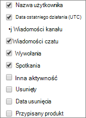

# centrum administracyjne platformy Microsoft 365 — aktywność Microsoft Teams użytkowników

Pulpit Microsoft 365 pulpitu nawigacyjnego Raporty zawiera informacje o aktywności dotyczącej wszystkich produktów w organizacji. Przechodząc do poziomu raportów dotyczących poszczególnych produktów, możesz uzyskać bardziej szczegółowe informacje o aktywności w poszczególnych produktach. Zobacz [temat zawierający omówienie pulpitu nawigacyjnego Raporty](activity-reports.md). Raport dotyczący aktywności użytkowników aplikacji Microsoft Teams pozwala uzyskać szczegółowe informacje o aktywności związanej z aplikacją Microsoft Teams w organizacji.
 
## Jak przejść do raportu aktywności użytkowników aplikacji Microsoft Teams

1. W centrum administracyjnym przejdź do strony **Raporty** \> <a href="https://go.microsoft.com/fwlink/p/?linkid=2074756" target="_blank">Użycie</a>.

    
2. Z listy **rozwijanej Wybierz** raport wybierz pozycję Aktywność **Microsoft Teams** \> **użytkowników**.
  
## Interpretowanie raportu aktywności użytkowników aplikacji Microsoft Teams

Wykresy **Aktywność** i **Użytkownicy** umożliwiają zapoznanie się z aktywnością użytkowników związaną z aplikacją Microsoft Teams. 
  
|Element|Opis|
|:-----|:-----|
|1.    |W raporcie **Aktywność użytkowników aplikacji Microsoft Teams** można przeglądać trendy z ostatnich 7, 30, 90 lub 180 dni. Jeśli jednak wybierzesz określony dzień w raporcie, tabela będzie zawierała dane dla do 28 dni od bieżącej daty (nie daty wygenerowania raportu).    |
|2.    |Dane w poszczególnych raportach zazwyczaj obejmują od 24 do 48 godzin.    |
|3.    |Aby zapewnić jakość danych, przeprowadzamy codzienne testy sprawdzania poprawności danych z ostatnich pięciu dni i będziemy wypełniać wszelkie wykryte luki. W trakcie tego procesu możesz zauważyć różnice w danych historycznych.    |
|4.    |W widoku **Aktywność** można sprawdzić liczbę działań w aplikacji Microsoft Teams według typu aktywności. Typy aktywności to liczba wiadomości czatu zespołu, wiadomości czatu prywatnego, połączeń lub spotkań.    |
|5.    |W widoku **Użytkownicy** można sprawdzić liczbę użytkowników według typu aktywności. Typy aktywności to liczba wiadomości czatu zespołu, wiadomości czatu prywatnego, połączeń lub spotkań.    |
|6.    | Oś Y **na wykresie Aktywność** przedstawia liczbę określonych działań.     Oś Y na **wykresie Pliki przedstawia** liczbę użytkowników uczestniczących w czatach zespołów, czatach prywatnych, połączeniach lub spotkaniach.     Oś X na wykresach to wybrany w raporcie przedział czasu.    |
|7.    |Serie, które są na wykresie, można filtrować, zaznaczając je w legendzie. Na  przykład na wykresie Aktywność wybierz **pozycję** Wiadomości kanałów **, Wiadomości** **czatu, Połączenia** lub **Spotkania, aby** wyświetlić tylko informacje dotyczące poszczególnych kanałów. Zmiana ta nie ma wpływu na informacje w siatce tabeli.    |
|8.    | Lista wyświetlanych grup jest ustalana na podstawie zbioru wszystkich grup, które istniały (nie zostały usunięte) w najdłuższym (180-dniowym) przedziale czasu raportowania. Liczba działań zależy od wybranego przedziału dat.    UWAGA: Możesz nie widzieć wszystkich elementów na poniższej liście w kolumnach, dopóki ich nie dodasz. **Nazwa użytkownika** to adres e-mail użytkownika. W tym polu może być wyświetlany rzeczywisty adres e-mail lub można ustawić je jako anonimowe.    **Data ostatniego działania (UTC)** odwołuje się do ostatniej daty, kiedy użytkownik uczestniczył w działaniu w aplikacji Microsoft Teams.    **Wiadomości kanałów** to liczba unikatowych wiadomości opublikowanych przez użytkownika w czacie zespołu w danym okresie.    **Wiadomości czatu** to liczba unikatowych wiadomości opublikowanych przez użytkownika w czacie prywatnym w danym okresie.    **Połączenia** to liczba połączeń, w których uczestniczył użytkownik w danym okresie.    **Spotkania** to liczba spotkań online, w których uczestniczył użytkownik w danym okresie.    **Inne działania** to liczba innych działań w zespole wykonanych przez użytkownika.    **Usunięte** wskazuje, czy zespół został usunięty. Jeśli zespół został usunięty, ale w okresie raportowania nastąpiła w nim aktywność, grupa ta pojawi się na siatce z parametrem Usunięte ustawionym na wartość Prawda.    **Data usunięcia** to data usunięcia zespołu.    **Przypisany produkt** to lista produktów przypisanych do użytkownika.     Jeśli zasady organizacji nie pozwalają na wyświetlanie raportów zawierających identyfikowalne dane użytkowników, możesz zmienić ustawienie prywatności dla wszystkich tych raportów. Zobacz sekcję **Ukrywanie szczegółów na poziomie użytkownika w** sekcji [Raporty aktywności w centrum administracyjne platformy Microsoft 365](activity-reports.md).    |
|9.    |Wybierz **pozycję** Kolumny, aby dodać lub usunąć kolumny z raportu.    |
|10.    |Dane raportu można również wyeksportować do pliku Excel .csv, wybierając link **Eksportuj**. Powoduje to wyeksportowanie danych wszystkich użytkowników oraz umożliwia wykonywanie prostego sortowania i filtrowania w celu dalszej analizy. Jeśli masz mniej niż 2000 użytkowników, możesz sortować i filtrować dane wewnątrz tabeli raportu. Jeśli masz więcej niż 2000 użytkowników, w celu filtrowania i sortowania należy wyeksportować dane.    |
|||
   

