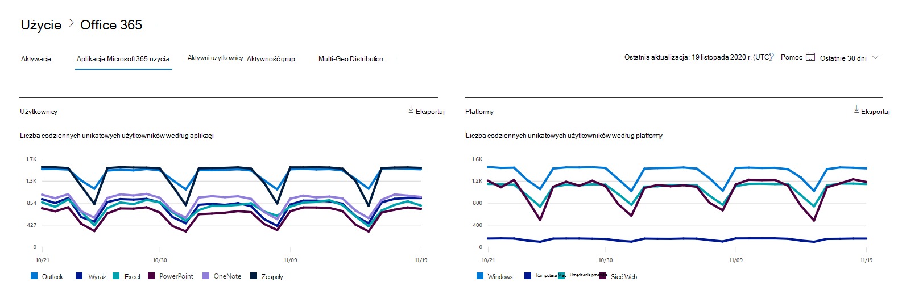

# Microsoft 365 Raporty w centrum administracyjnym — użycie Aplikacje Microsoft 365

Na pulpicie nawigacyjnym raportów Microsoft 365 przedstawiono omówienie działań w produktach w organizacji. Przechodząc do poziomu raportów dotyczących poszczególnych produktów, możesz uzyskać bardziej szczegółowe informacje o aktywności w poszczególnych produktach. Zobacz [temat zawierający omówienie pulpitu nawigacyjnego Raporty](activity-reports.md).

Na przykład możesz zrozumieć aktywność każdego użytkownika licencjonowanego do korzystania z Aplikacje Microsoft 365 aplikacji, analizując ich aktywność w aplikacjach i sposób ich wykorzystania na różnych platformach.

> [!NOTE]
> Aktywacje komputera udostępnionego nie są uwzględniane w tym raporcie.

## Jak uzyskać dostęp do raportu użycia Aplikacje Microsoft 365

1. W centrum administracyjnym przejdź do strony **Raporty** \> <a href="https://go.microsoft.com/fwlink/p/?linkid=2074756" target="_blank">Użycie</a>. 
2. Na stronie głównej pulpitu nawigacyjnego kliknij przycisk **Wyświetl więcej** na karcie Aktywni użytkownicy — Aplikacje Microsoft 365.

## Interpretowanie raportu użycia Aplikacje Microsoft 365

Możesz uzyskać widok aktywności Aplikacje Microsoft 365 użytkownika, przeglądając **wykresy Użytkownicy** i **platforma**.

> [!div class="mx-imgBorder"]
> 

|Element|Opis|
|---|---|
|1.|Raport **użycia Aplikacje Microsoft 365** można wyświetlić dla trendów z ostatnich 7 dni, 30 dni, 90 dni lub 180 dni. Jeśli jednak wybierzesz konkretny dzień w raporcie, w tabeli będą wyświetlane dane przez maksymalnie 28 dni od bieżącej daty (a nie daty wygenerowania raportu).|
|2.|Dane w każdym raporcie zwykle obejmują maksymalnie dwa ostatnie dni. Co sześć dni będziemy odświeżać raport z niewielkimi aktualizacjami, aby zapewnić jakość danych.|
|3.|Widok **Użytkownicy** pokazuje trend liczby aktywnych użytkowników dla każdej aplikacji — Outlook, Word, Excel, PowerPoint, OneNote i Teams. "Aktywni użytkownicy" to wszyscy, którzy wykonują zamierzone działania w tych aplikacjach.|
|4.|Widok **Platformy** przedstawia trend aktywnych użytkowników we wszystkich aplikacjach dla każdej platformy — Windows, Mac, Web i Mobile.|
|5.|Na wykresie **Użytkownicy** oś Y to liczba unikatowych aktywnych użytkowników dla odpowiedniej aplikacji. Na wykresie **Platformy** oś Y to liczba unikatowych użytkowników dla odpowiedniej platformy. Oś X na obu wykresach to data użycia aplikacji na danej platformie.|
 6.|Możesz filtrować serie widoczne na wykresie, wybierając element w legendzie. Na przykład na wykresie **Użytkownicy** wybierz pozycję Outlook, Word, Excel, PowerPoint, OneDrive lub Teams, aby wyświetlić tylko informacje związane z każdą z nich. Zmiana tego zaznaczenia nie powoduje zmiany informacji w poniższej tabeli siatki.|
|7.|W tabeli przedstawiono zestawienie danych na poziomie poszczególnych użytkowników. Możesz dodać lub usunąć kolumny z tabeli.    **Nazwa użytkownika** to adres e-mail użytkownika, który wykonał działanie na Microsoft Apps.  **Data ostatniej aktywacji (UTC)** to ostatnia data, w której użytkownik aktywował subskrypcję Aplikacje Microsoft 365 na komputerze lub rejestruje się na komputerze udostępnionym i uruchamia aplikację przy użyciu swojego konta.   **Data ostatniego działania (UTC)** to ostatnia data wykonania zamierzonego działania przez użytkownika. Aby zobaczyć działanie, które wystąpiło w konkretnym dniu, wybierz datę bezpośrednio na wykresie.  Pozostałe kolumny określają, czy użytkownik był aktywny na tej platformie dla tej aplikacji (w Aplikacje Microsoft 365) w wybranym okresie.|
|8.|Wybierz ikonę **Wybierz kolumny** , aby dodać lub usunąć kolumny z raportu.|
|9.|Możesz również wyeksportować dane raportu do pliku Excel .csv, wybierając link **Eksportuj**. Umożliwia to eksportowanie danych dla wszystkich użytkowników i umożliwia wykonywanie prostej agregacji, sortowania i filtrowania w celu dalszej analizy. Jeśli masz mniej niż 100 użytkowników, możesz sortować i filtrować w tabeli w samym raporcie. Jeśli masz więcej niż 100 użytkowników, aby filtrować i sortować, musisz wyeksportować dane.|
