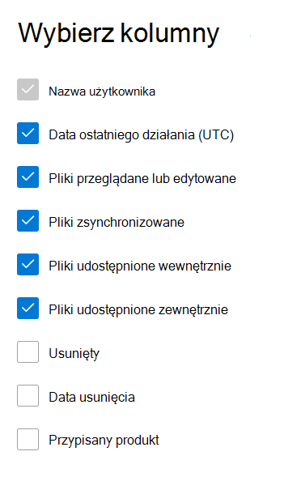

# Microsoft 365 w centrum administracyjnym — aktywność OneDrive dla Firm użytkowników

Pulpit Microsoft 365 pulpitu nawigacyjnego Raporty zawiera informacje o aktywności dotyczącej wszystkich produktów w organizacji. Przechodząc do poziomu raportów dotyczących poszczególnych produktów, możesz uzyskać bardziej szczegółowe informacje o aktywności w poszczególnych produktach. Zobacz [temat zawierający omówienie pulpitu nawigacyjnego Raporty](activity-reports.md).
  
Możesz na przykład zrozumieć działania wszystkich użytkowników z licencjami na używanie usługi OneDrive przez wyświetlanie ich interakcji z plikami w usłudze OneDrive. Ułatwia to także zrozumienie poziomu współpracy dzięki wyświetlaniu liczby udostępnionych plików.

## Jak przejść do raportu aktywności usługi OneDrive?

1. W centrum administracyjnym przejdź do strony **Raporty** \> <a href="https://go.microsoft.com/fwlink/p/?linkid=2074756" target="_blank">Użycie</a>. 
2. Na stronie głównej pulpitu nawigacyjnego kliknij przycisk **Wyświetl więcej** na karcie OneDrive głównej.
  
## Interpretowanie raportu aktywności usługi OneDrive dla Firm

Możesz wyświetlić działania w raporcie OneDrive, wybierając **kartę** Działanie. 

Wybierz **pozycję Wybierz kolumny** , aby dodać lub usunąć kolumny z raportu.    

Dane raportu można również wyeksportować do pliku Excel .csv, wybierając link **Eksportuj**. Powoduje to wyeksportowanie danych wszystkich użytkowników oraz umożliwia wykonywanie prostego sortowania i filtrowania w celu dalszej analizy. Jeśli masz mniej niż 2000 użytkowników, możesz sortować i filtrować dane wewnątrz tabeli raportu. Jeśli masz więcej niż 2000 użytkowników, w celu filtrowania i sortowania należy wyeksportować dane.

W raporcie **Aktywność usługi OneDrive dla Firm** można przeglądać trendy z ostatnich 7, 30, 90 lub 180 dni. Jeśli jednak wybierzesz określony dzień w raporcie, tabela będzie zawierała dane dla do 28 dni od bieżącej daty (nie daty wygenerowania raportu).
  
|Element|Opis|
|:-----|:-----|
|**Metryczny**|**Definicja**|
|Nazwa użytkownika    |Nazwa użytkownika właściciela konta OneDrive konta.    |
|Data ostatniego działania (UTC)    |Najpóźniejsza data aktywności dotyczącej plików na OneDrive w wybranym zakresie dat. . Aby zobaczyć działanie, które wystąpiło w konkretnym dniu, wybierz datę bezpośrednio na wykresie.    |
|Pliki przeglądane lub edytowane    |Liczba plików, które zostały przekazane, pobrane, zmodyfikowane lub wyświetlone.     |
|Pliki zsynchronizowane    |Liczba plików, które zostały zsynchronizowane z lokalnym urządzeniem użytkownika z kontem OneDrive konta.   |
|Pliki udostępnione wewnętrznie    | Liczba plików, które zostały udostępnione użytkownikom w organizacji lub użytkownikom w grupach (mogą to być użytkownicy zewnętrzni).    |
|Pliki udostępniane zewnętrznie    |Liczba plików, które zostały udostępnione użytkownikom spoza organizacji.  |
|Deleted    | Oznacza to, że licencja użytkownika została usunięta.    UWAGA: Działania usuniętego użytkownika nadal będą wyświetlane w raporcie, o ile usunięty użytkownik był licencjonowany w pewnym momencie w wybranym okresie. Kolumna **Usunięte** pozwala łatwo zauważyć użytkowników, którzy od dłuższego czasu nie byli aktywni, ale jednak ich dane zostały uwzględnione w raporcie.    |
|Data usunięcia    |Data usunięcia licencji użytkownika.  |
|Przypisany produkt    |Użytkownik Microsoft 365 produktów licencjonowanych na użytkownika.|
|||