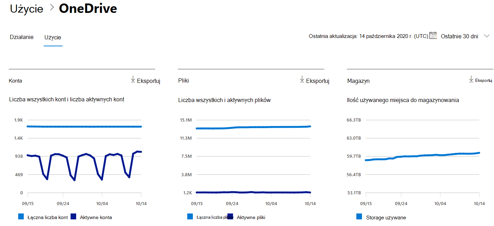

# Microsoft 365 Raporty w centrum administracyjnym — użycie OneDrive dla Firm

Na pulpicie nawigacyjnym raportów Microsoft 365 przedstawiono omówienie działań w produktach w organizacji. Przechodząc do poziomu raportów dotyczących poszczególnych produktów, możesz uzyskać bardziej szczegółowe informacje o aktywności w poszczególnych produktach. Zobacz [temat zawierający omówienie pulpitu nawigacyjnego Raporty](activity-reports.md).
  
Na przykład karta OneDrive na pulpicie nawigacyjnym zapewnia ogólny widok wartości uzyskiwanych z usługi OneDrive dla Firm dotyczących łącznej liczby plików i ilości przestrzeni dyskowej używanych w organizacji. Następnie można przejść do szczegółów, aby zrozumieć trendy dotyczące aktywnych kont usługi OneDrive, liczby plików, z którymi pracują użytkownicy oraz użytej przestrzeni dyskowej. Ten widok zawiera również szczegółowe informacje o koncie usługi OneDrive każdego użytkownika.

## Jak mogę przejść do raportu użycia OneDrive?

1. W centrum administracyjnym przejdź do strony **Raporty** \> <a href="https://go.microsoft.com/fwlink/p/?linkid=2074756" target="_blank">Użycie</a>. 
2. Na stronie głównej pulpitu nawigacyjnego kliknij przycisk **Wyświetl więcej** na karcie OneDrive.
  
## Interpretowanie raportu użycia usługi OneDrive

Możesz wyświetlić użycie w raporcie OneDrive, wybierając kartę **Użycie**. 

Wybierz pozycję **Wybierz kolumny** , aby dodać lub usunąć kolumny z raportu.    

Możesz również wyeksportować dane raportu do pliku Excel .csv, wybierając link **Eksportuj**. Powoduje to wyeksportowanie danych wszystkich użytkowników oraz umożliwia wykonywanie prostego sortowania i filtrowania w celu dalszej analizy. Jeśli masz mniej niż 2000 użytkowników, możesz sortować i filtrować dane wewnątrz tabeli raportu. Jeśli masz więcej niż 2000 użytkowników, w celu filtrowania i sortowania należy wyeksportować dane. 

Raport **użycia OneDrive dla Firm** można wyświetlić dla trendów z ostatnich 7 dni, 30 dni, 90 dni lub 180 dni. Jeśli jednak wybierzesz konkretny dzień w raporcie, w tabeli będą wyświetlane dane przez maksymalnie 28 dni od bieżącej daty (a nie daty wygenerowania raportu).
  
|Element|Opis|
|:-----|:-----|
|**Metrycznych**|**Definicja**|
|ADRES URL    |Adres internetowy OneDrive użytkownika.   |
|Deleted    |Stan usunięcia OneDrive. Oznaczanie kont jako usunięte trwa co najmniej 7 dni.    |
|Właściciel    |Nazwa użytkownika administratora podstawowego OneDrive.     |
|Główna nazwa właściciela    |Adres e-mail właściciela OneDrive.   |
|Data ostatniego działania (UTC)    | Ostatnia data wykonania działania pliku w OneDrive. Jeśli w usłudze OneDrive nie było aktywności dotyczących plików, pole wartości będzie puste.    |
|Pliki    |Liczba plików w OneDrive.  |
|Aktywne pliki    | Liczba aktywnych plików w okresie.  UWAGA: Jeśli pliki zostały usunięte w określonym okresie dla raportu, liczba aktywnych plików wyświetlanych w raporcie może być większa niż bieżąca liczba plików w OneDrive. >  Usunięci użytkownicy będą pokazywani w raportach przez 180 dni.    |
|Storage używane (MB)    |Ilość magazynu używanego przez OneDrive w MB. |
|||
   
> [!NOTE]
> Raport zawiera tylko użytkowników, którzy mają ważną licencję OneDrive dla Firm.
