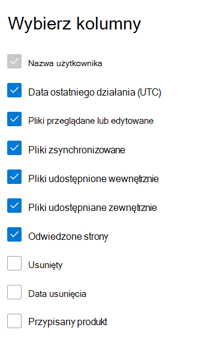

# Microsoft 365 Raporty w centrum administracyjnym — działanie SharePoint

Jako administrator Microsoft 365 pulpit nawigacyjny Raporty przedstawia omówienie działań w różnych produktach w organizacji. Umożliwia on przejście do bardziej szczegółowych informacji o aktywności specyficznej dla poszczególnych produktów. Zapoznaj się z [raportami aktywności w Centrum administracyjne platformy Microsoft 365](activity-reports.md).
  
Możesz na przykład zrozumieć działanie każdego użytkownika mającego licencję na używanie programu SharePoint poprzez wyświetlenie jego interakcji z plikami. Ułatwia to także zrozumienie poziomu współpracy przez wyświetlanie liczby udostępnionych plików.
  
## Jak dotrzeć do raportu aktywności programu SharePoint?

1. W centrum administracyjnym przejdź do strony **Raporty** \> <a href="https://go.microsoft.com/fwlink/p/?linkid=2074756" target="_blank">Użycie</a>. 
2. Na stronie głównej pulpitu nawigacyjnego kliknij przycisk **Wyświetl więcej** na karcie SharePoint.
  
## Interpretowanie raportu aktywności SharePoint

Możesz wyświetlić działania w raporcie SharePoint, wybierając kartę **Działanie**. 

Wybierz pozycję **Wybierz kolumny** , aby dodać lub usunąć kolumny z raportu.    

Możesz również wyeksportować dane raportu do pliku Excel .csv, wybierając link **Eksportuj**. Powoduje to wyeksportowanie danych wszystkich użytkowników oraz umożliwia wykonywanie prostego sortowania i filtrowania w celu dalszej analizy. Jeśli masz mniej niż 2000 użytkowników, możesz sortować i filtrować dane wewnątrz tabeli raportu. Jeśli masz więcej niż 2000 użytkowników, w celu filtrowania i sortowania należy wyeksportować dane. 

Raport **aktywności SharePoint** można wyświetlić dla trendów z ostatnich 7 dni, 30 dni, 90 dni lub 180 dni. Jeśli jednak wybierzesz konkretny dzień w raporcie, w tabeli będą wyświetlane dane przez maksymalnie 28 dni od bieżącej daty (a nie daty wygenerowania raportu).
  
|Element|Opis|
|:-----|:-----|
|**Metrycznych**|**Definicja**|
|Nazwa użytkownika    |Adres e-mail użytkownika, który wykonał działanie w witrynie SharePoint.    |
|Data ostatniego działania (UTC)    |Ostatnia data wykonania działania pliku lub odwiedzin strony dla wybranego zakresu dat. Aby zobaczyć działanie, które wystąpiło w konkretnym dniu, wybierz datę bezpośrednio na wykresie.    |
|Pliki wyświetlane lub edytowane    |Liczba plików przekazanych, pobranych, zmodyfikowanych lub wyświetlonych przez użytkownika.     |
|Zsynchronizowane pliki    |Liczba plików, które zostały zsynchronizowane z urządzenia lokalnego użytkownika z witryną SharePoint.   |
|Pliki udostępnione wewnętrznie    | Liczba plików udostępnionych użytkownikom w organizacji lub użytkownikom w grupach (które mogą obejmować użytkowników zewnętrznych).    |
|Pliki udostępnione zewnętrznie    |Liczba plików, które zostały udostępnione użytkownikom spoza organizacji.  |
|Odwiedzone strony    |Odwiedziny na unikatowych stronach przez użytkownika.  |
|Deleted    | Oznacza to, że licencja użytkownika została usunięta.     **UWAGA:** Aktywność usuniętego użytkownika będzie nadal wyświetlana w raporcie tak długo, jak długo będzie on licencjonowany w wybranym okresie. Kolumna Usunięte pozwala łatwo zauważyć użytkowników, którzy od dłuższego czasu nie byli aktywni, ale jednak ich dane zostały uwzględnione w raporcie.    |
|Data usunięcia    |Data usunięcia licencji użytkownika.  |
|Przypisany produkt    |Microsoft 365 produkty, które są licencjonowane dla użytkownika.|
|||