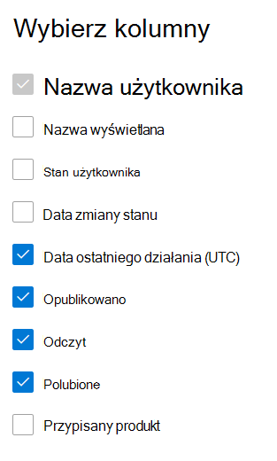

# Microsoft 365 raporty w centrum administracyjnym — raport Yammer aktywności

Jako Microsoft 365 pulpit nawigacyjny Raporty wyświetla dane dotyczące użycia produktów w organizacji. Zapoznaj się [z raportami aktywności w centrum administracyjnym](activity-reports.md). **Raport aktywności usługi Yammer** umożliwia zrozumienie poziomu zaangażowania organizacji w usłudze Yammer na podstawie liczby unikatowych użytkowników publikujących i odczytujących wiadomości w usłudze Yammer oraz oznaczających je jako lubiane, jak również liczby aktywności wygenerowanych w organizacji. 
 
## Jak uzyskać dostęp do Yammer aktywności?

1. W centrum administracyjnym przejdź do strony **Raporty** \> <a href="https://go.microsoft.com/fwlink/p/?linkid=2074756" target="_blank">Użycie</a>. 
2. Na stronie głównej pulpitu nawigacyjnego kliknij przycisk **Wyświetl więcej** na karcie Yammer głównej.

  
## Interpretowanie raportu dotyczącego aktywności usługi Yammer

Możesz wyświetlić działania w raporcie Yammer, wybierając **kartę** Działanie. 

Wybierz **pozycję Wybierz kolumny** , aby dodać lub usunąć kolumny z raportu.    

Dane raportu można również wyeksportować do pliku Excel .csv, wybierając link **Eksportuj**. Powoduje to wyeksportowanie danych wszystkich użytkowników oraz umożliwia wykonywanie prostego sortowania i filtrowania w celu dalszej analizy. Jeśli masz mniej niż 2000 użytkowników, możesz sortować i filtrować dane wewnątrz tabeli raportu. Jeśli masz więcej niż 2000 użytkowników, w celu filtrowania i sortowania należy wyeksportować dane. 

W **Yammer** aktywności możesz przeglądać trendy z ostatnich 7, 30, 90 lub 180 dni. Jeśli jednak wybierzesz określony dzień w raporcie, tabela będzie zawierała dane dla do 28 dni od bieżącej daty (nie daty wygenerowania raportu).
  
|Element|Opis|
|:-----|:-----|
|**Metryczny**|**Definicja**|
|Nazwa użytkownika    |Adres e-mail użytkownika. W tym polu może być wyświetlany rzeczywisty adres e-mail lub można ustawić je jako anonimowe. Ta siatka przedstawia użytkowników, którzy zalogowali się do Yammer przy użyciu konta Microsoft 365 lub zalogowali się do sieci przy użyciu logowania pojedynczego.   |
|Nazwa wyświetlana    |Pełna nazwa użytkownika. W tym polu może być wyświetlany rzeczywisty adres e-mail lub można ustawić je jako anonimowe.    |
|Stan użytkownika    |Jedna z trzech wartości: Aktywowany, Usunięty lub Zawieszony. Te raporty zawierają dane dotyczące aktywnych, zawieszonych i usuniętych użytkowników. Nie uwzględniają oczekujących użytkowników, ponieważ oczekujący użytkownicy nie mogą publikować ani odczytywać wiadomości lub oznaczać ich jako lubiane.    |
|Data zmiany stanu (UTC)    |Data zmiany stanu użytkownika w programie Yammer.    |
|Data ostatniego działania (UTC)    | Ostatnia data publikacji, przeczytania lub polubinia wiadomości przez użytkownika.    |
|Opublikowano    |Liczba wiadomości opublikowanych przez użytkownika w określonym przedziale czasu.  |
|Czytanie    |Liczba konwersacji przeczytanych przez użytkownika w określonym przedziale czasu.    |
|Polubione    |Liczba wiadomości, które polubił użytkownik w określonym przedziale czasu.   |
|Przypisany produkt    |Produkty przypisane do tego użytkownika.|
|||