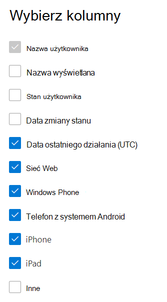

# Microsoft 365 raporty w centrum administracyjnym — raport Yammer użycia urządzeń

Pulpit Microsoft 365 pulpitu nawigacyjnego Raporty zawiera informacje o aktywności dotyczącej wszystkich produktów w organizacji. Przechodząc do poziomu raportów dotyczących poszczególnych produktów, możesz uzyskać bardziej szczegółowe informacje o aktywności w poszczególnych produktach. Zobacz [temat zawierający omówienie pulpitu nawigacyjnego Raporty](activity-reports.md).
  
W raportach użycia urządzeń z usługą Yammer znajdują się informacje o urządzeniach, na których Twoi użytkownicy korzystają z usługi Yammer. Dzienną liczbę użytkowników możesz przeglądać według typu urządzenia oraz liczby użytkowników korzystających z danego typu urządzenia. Obie te wartości możesz wyświetlić dla wybranego okresu. Możesz również zobaczyć szczegółowe informacje dotyczące poszczególnych użytkowników.
 
## Jak uzyskać raport użycia urządzeń z usługą Yammer?

1. W centrum administracyjnym przejdź do strony **Raporty** \> <a href="https://go.microsoft.com/fwlink/p/?linkid=2074756" target="_blank">Użycie</a>. 
2. Na stronie głównej pulpitu nawigacyjnego kliknij przycisk **Wyświetl więcej** na karcie Yammer głównej.
  
## Interpretowanie raportu Yammer użycia urządzeń

Użycie możesz wyświetlić w raporcie OneDrive, wybierając **kartę Użycie** urządzenia. 

Wybierz **pozycję Wybierz kolumny** , aby dodać lub usunąć kolumny z raportu.    

Dane raportu można również wyeksportować do pliku Excel .csv, wybierając link **Eksportuj**. Powoduje to wyeksportowanie danych wszystkich użytkowników oraz umożliwia wykonywanie prostego sortowania i filtrowania w celu dalszej analizy. Jeśli masz mniej niż 2000 użytkowników, możesz sortować i filtrować dane wewnątrz tabeli raportu. Jeśli masz więcej niż 2000 użytkowników, w celu filtrowania i sortowania należy wyeksportować dane. 

W **Yammer użycia** urządzeń można przeglądać trendy z ostatnich 7, 30, 90 lub 180 dni. Jeśli jednak wybierzesz określony dzień w raporcie, tabela będzie zawierała dane dla do 28 dni od bieżącej daty (nie daty wygenerowania raportu).
  
|Element|Opis|
|:-----|:-----|
|**Metryczny**|**Definicja**|
|Nazwa użytkownika    |Adres e-mail użytkownika. W tym polu może być wyświetlany rzeczywisty adres e-mail lub można ustawić je jako anonimowe. Ta siatka przedstawia użytkowników, którzy zalogowali się do Yammer przy użyciu konta Microsoft 365 lub zalogowali się do sieci przy użyciu logowania pojedynczego.   |
|Nazwa wyświetlana    |Pełna nazwa użytkownika. W tym polu może być wyświetlany rzeczywisty adres e-mail lub można ustawić je jako anonimowe.    |
|Stan użytkownika    |Jedna z trzech wartości: Aktywna, Usunięta lub Zawieszona. Te raporty zawierają dane dotyczące aktywnych, zawieszonych i usuniętych użytkowników. Nie uwzględniają oczekujących użytkowników, ponieważ oczekujący użytkownicy nie mogą publikować ani odczytywać wiadomości lub oznaczać ich jako lubiane.     |
|Data zmiany stanu (UTC)    |Data zmiany stanu użytkownika w programie Yammer.    |
|Data ostatniego działania (UTC)    |Ostatnia data (UTC), w przypadku których użytkownik uczestniczył w Yammer danych.    |
|Web    |Wskazuje, czy użytkownik użył już Yammer sieci Web.    |
|Windows telefonu    | Wskazuje, czy użytkownik używał Yammer telefonu Windows telefonu.    |
|Telefon z systemem Android    |Wskazuje, czy użytkownik używał aplikacji Yammer na telefonie z systemem Android.  |
|iphone   | Wskazuje, czy użytkownik użył już Yammer do iPhone.    |
|ipad    |Wskazuje, czy użytkownik użył już Yammer danych w iPad.  |
|inne    |Wskazuje, czy użytkownik użył wcześniej Yammer urządzenia, które nie zostało wymienione wcześniej.  |
|||