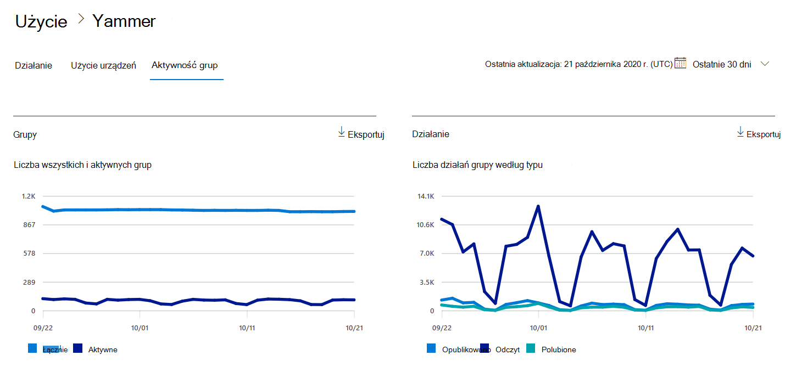
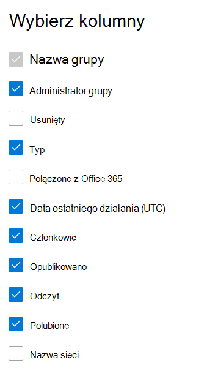

# raporty Microsoft 365 w centrum administracyjnym — raport aktywności grup Yammer

Na pulpicie nawigacyjnym raportów Microsoft 365 przedstawiono omówienie działań w produktach w organizacji. Przechodząc do poziomu raportów dotyczących poszczególnych produktów, możesz uzyskać bardziej szczegółowe informacje o aktywności w poszczególnych produktach. Zobacz [temat zawierający omówienie pulpitu nawigacyjnego Raporty](activity-reports.md). Raport aktywności grup usługi Yammer pozwala analizować aktywność grup usługi Yammer w organizacji oraz uzyskać informacje na temat liczby tworzonych i używanych grup.
 
## Jak mogę przejść do raportu aktywności grup Yammer?

1. W centrum administracyjnym przejdź do strony **Raporty** \> <a href="https://go.microsoft.com/fwlink/p/?linkid=2074756" target="_blank">Użycie</a>. 
2. Na stronie głównej pulpitu nawigacyjnego kliknij przycisk **Wyświetl więcej** na karcie Yammer.
  
## Interpretowanie raportu aktywności grup usługi Yammer

Możesz wyświetlić działania grup w raporcie Yammer, wybierając kartę **Działania grupy**. 

Wybierz pozycję **Wybierz kolumny** , aby dodać lub usunąć kolumny z raportu.    

Możesz również wyeksportować dane raportu do pliku Excel .csv, wybierając link **Eksportuj**. Powoduje to wyeksportowanie danych wszystkich użytkowników oraz umożliwia wykonywanie prostego sortowania i filtrowania w celu dalszej analizy. Jeśli masz mniej niż 2000 użytkowników, możesz sortować i filtrować dane wewnątrz tabeli raportu. Jeśli masz więcej niż 2000 użytkowników, aby filtrować i sortować, musisz wyeksportować dane. 

W raporcie **Aktywność grup w usłudze Yammer** można przeglądać trendy z ostatnich 7, 30, 90 lub 180 dni. Jeśli jednak wybierzesz konkretny dzień w raporcie, w tabeli będą wyświetlane dane przez maksymalnie 28 dni od bieżącej daty (a nie daty wygenerowania raportu).
  
|Element|Opis|
|:-----|:-----|
|**Metrycznych**|**Definicja**|
|Nazwa grupy    |Nazwa grupy.   |
|Administrator grupy    |Nazwa administratora grupy lub właściciela.    |
|Deleted    |Liczba usuniętych grup Yammer. Jeśli grupa została usunięta, ale w okresie raportowania nastąpiła w niej aktywność, grupa ta pojawi się na siatce z flagą ustawioną na wartość Prawda.    |
|Wpisać    |Typ grupy, publiczny lub prywatny.   |
|Połączone z Office 365    |Wskazuje, czy grupa Yammer jest również grupą Microsoft 365.   |
|Data ostatniego działania (UTC)    | Ostatnia data odczytu, opublikowania lub polubiania wiadomości przez grupę.    |
|Członków    | Liczba członków w grupie.    |
|Wysłany    |Liczba komunikatów opublikowanych w grupie Yammer w okresie raportowania.  |
|Odczytu    |Liczba konwersacji odczytanych w grupie Yammer w okresie raportowania.    |
|Lubi    |Liczba komunikatów lubianych w grupie Yammer w okresie raportowania.  |
|Nazwa sieci    |Pełna nazwa sieci, do której należy grupa. |
|||