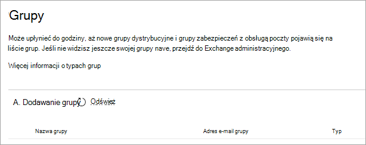

<!-- The following is just placeholder text from Madhura's mail. We need to add images/examples of each -->

# Jak uzyskać pomoc w centrum administracyjne platformy Microsoft 365

Jeśli jesteś administratorem, to Twoje miejsce, <a href="https://go.microsoft.com/fwlink/p/?linkid=2024339" target="_blank">https://admin.microsoft.com</a> w którym możesz zarządzać swoją subskrypcją usługi i w jak najbardziej Microsoft 365 firmową. Czasami możesz nie znaleźć odpowiedniego zadania, potrzebować więcej kontekstu przed przystąpieniem do pracy nad przepływem zadania lub po prostu nie mieć pewności co do zakresu i wpływu akcji jako administrator. Aby je omieć, zapewniamy nowoczesną pomoc i inteligentną pomoc na całym świecie <a href="https://go.microsoft.com/fwlink/p/?linkid=2166757" target="_blank">centrum administracyjne platformy Microsoft 365</a> w ten sposób:

* **Zintegrowana pomoc** — pomoc w centrum administracyjnym

* **Inteligentna pomoc** — samodzielna pomoc, która jest wspierane przez AI

* **Przewodniki i artykuły** — pełna zawartość w Internecie

## Zintegrowana pomoc

Pomoc jest zintegrowana z <a href="https://go.microsoft.com/fwlink/p/?linkid=2166757" target="_blank">całym centrum</a> administracyjnym, więc jest od razu pod dostrzegą potrzebną pomocą. W górnej części wielu stron znajdziesz tekst pomocy w tekście, który zawiera ogólne omówienie obecnie zadania, a także linki do artykułów, które umożliwiają szybkie znalezienie oficjalnej dokumentacji w celu bardziej szczegółowej nauki.

## Nowoczesna samodzielna pomoc, która jest wspierane przez AI

Aby otworzyć nowoczesne środowisko samodzielnej pomocy obsługiwane przez sztuczną inteligencję, wybierz przycisk Potrzebna pomoc  w <a href="https://go.microsoft.com/fwlink/p/?linkid=2166757" target="_blank">centrum administracyjne platformy Microsoft 365.</a> Jeśli na przykład wyszukajesz "zweryfikuj moją domenę", otrzymasz odpowiednie instrukcje i kilka artykułów, które według nas będą pomocne. Za pomocą uczenia maszynowego korzystamy z tego rozwiązania, które pomagało innym administratorom, którzy wprowadzali podobne zapytania.

Lub, w przypadku, gdy nie wiesz, jak wykonać jakąś pracę w określonej sytuacji, użyj Asystenta pomocy technicznej. Obecnie to środowisko jest dostępne tylko w języku angielskim. Aby włączyć Asystenta pomocy technicznej, wystarczy użyć przełącznika w górnej części **okienka Potrzebna** pomoc. Asystent pomocy technicznej udostępnia interfejs konwersacji, który może Ci pomóc. Po wprowadzeniu zapytania chatbot zada pytania w celu uzyskania właściwej odpowiedzi na konkretną sytuację. Pomyśl o tym, jak wirtualny pomocnik odnajduje rozwiązania i kończyj zadania.

Oczywiście czasami odpowiedzi na pytania są najlepsze dla osób, które je zadają. Jeśli nasza nowoczesna samodzielna pomoc nie ma odpowiedzi, zawsze masz możliwość skontaktowania się z naszymi agentami pomocy technicznej.

## Przewodniki i artykuły

Jeśli szukasz rozbudowanych przewodników wdrażania, szybkich procedur krok po kroku lub poleceń cmdlet programu PowerShell, poszukaj nas w sieci Web. Często aktualizujemy zawartość i staramy się dostarczać Ci najnowsze informacje. Zapoznaj się z naszymi artykułami i przewodnikami w [Microsoft 365 dokumentów](../../index.yml).