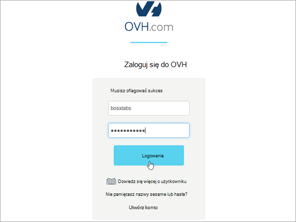
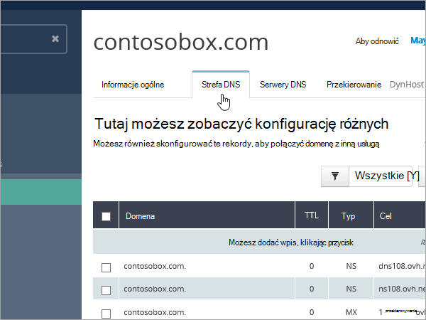
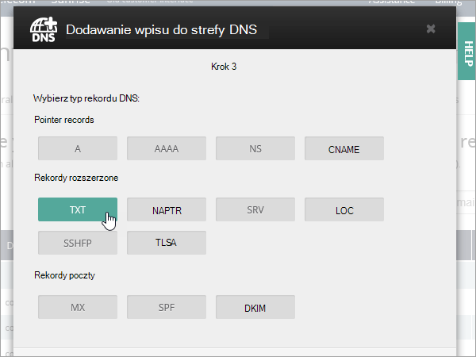
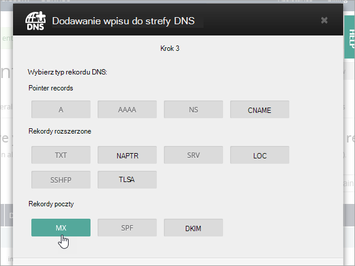
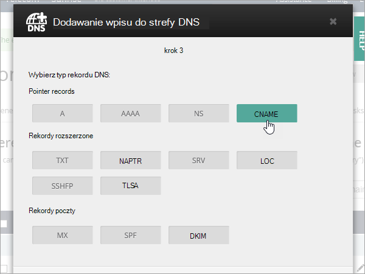

# Połączenie rekordy DNS w OVH do Microsoft 365

[Zajrzyj do często zadawanych pytań dotyczących domen](../setup/domains-faq.yml), jeśli nie możesz znaleźć szukanych informacji.

Jeśli OVH jest dostawcą hostingu DNS, wykonaj kroki opisane w tym artykule, aby zweryfikować domenę i skonfigurować rekordy DNS dla poczty e-mail, Skype dla firm Online itd.

Po dodaniu tych rekordów w OVH domena zostanie skonfigurowana do pracy z usługi firmy Microsoft.

> [!NOTE]
> Wprowadzenie zmian w systemie DNS trwa zwykle około 15 minut. Jednak czasem aktualizacja internetowego systemu DNS może potrwać dłużej. Jeśli po dodaniu rekordów DNS występują problemy z przepływem poczty e-mail lub inne, zobacz [Rozwiązywanie problemów po zmianie nazwy domeny lub rekordów DNS](../get-help-with-domains/find-and-fix-issues.md).

## Dodawanie rekordu TXT w celu weryfikacji

Przed użyciem domeny z firmą Microsoft musimy upewnić się, że jesteś jej właścicielem. Możliwość zalogowania się do konta u rejestratora domen i utworzenia rekordu DNS potwierdza firmie Microsoft, że jesteś właścicielem domeny.

> [!NOTE]
> Ten rekord jest używany tylko do weryfikowania, że jesteś właścicielem domeny, i nie wywiera wpływu na nic innego. Jeśli chcesz, możesz go później usunąć.

1. Aby rozpocząć, przejdź do strony domen w OVH, korzystając z [tego linku](https://www.ovh.com/manager/). Zostanie wyświetlony monit o zalogowanie się.

    

1. Na stronie docelowej pulpitu nawigacyjnego w obszarze **Wyświetl wszystkie moje działania** wybierz nazwę domeny, którą chcesz edytować.

1. Wybierz pozycję **Strefa DNS**.

    

1. Wybierz **pozycję Dodaj wpis**.

    

1. Wybierz pozycję **TXT**

    

1. W polach nowego rekordu wpisz lub skopiuj i wklej wartości z poniższej tabeli. Aby przypisać wartość czasu wygaśnięcia, wybierz pozycję **Niestandardowe** z listy rozwijanej, a następnie wpisz wartość w polu tekstowym.

   |Typ rekordu|Domena podrzędna|Czas wygaśnięcia|Wartość|
   |---|---|---|---|
   |TXT|(pozostaw puste)|3600 (sekundy)|MS=msxxxxxxxxxx    **Uwaga:** Jest to przykład. W tym miejscu użyj określonej wartości **Destination (Miejsce docelowe) lub Points to Address (Punkty do adresu** ) z tabeli .  [Jak to znaleźć?](../get-help-with-domains/information-for-dns-records.md)|

1. Wybierz pozycję **Dalej**.

1. Wybierz pozycję **Potwierdź**.

    

1. Przed kontynuowaniem poczekaj kilka minut na zaktualizowanie utworzonego właśnie rekordu w Internecie.

Po dodaniu rekordu w witrynie rejestratora domen wrócisz do firmy Microsoft i zażądasz rekordu. Gdy firma Microsoft znajdzie właściwy rekord TXT, domena zostanie zweryfikowana.

Aby zweryfikować rekord w Microsoft 365:

1. W centrum administracyjnym przejdź do **obszaru domeny Ustawienia** \> <a href="https://go.microsoft.com/fwlink/p/?linkid=834818" target="_blank">**.**</a>

1. Na stronie Domeny wybierz domenę, którą weryfikujesz, a następnie wybierz pozycję **Rozpocznij konfigurację**.

    :::image type="content" source="../../media/dns-IONOS/IONOS-DomainConnects-2.png" alt-text="Wybierz pozycję Rozpocznij konfigurację.":::

1. Wybierz pozycję **Kontynuuj**.

1. Na stronie **Weryfikowanie domeny** wybierz pozycję **Weryfikuj**.

> [!NOTE]
>  Wprowadzenie zmian w systemie DNS trwa zwykle około 15 minut. Jednak czasem aktualizacja internetowego systemu DNS może potrwać dłużej. Jeśli po dodaniu rekordów DNS występują problemy z przepływem poczty e-mail lub inne, zobacz [Rozwiązywanie problemów po zmianie nazwy domeny lub rekordów DNS](../get-help-with-domains/find-and-fix-issues.md).

## Dodaj rekord MX, aby wiadomość e-mail dla twojej domeny przyszła do firmy Microsoft

1. Aby rozpocząć, przejdź do strony domen w OVH, korzystając z [tego linku](https://www.ovh.com/manager/). Zostanie wyświetlony monit o zalogowanie się.

    

1. Na stronie docelowej pulpitu nawigacyjnego w obszarze **Wyświetl wszystkie moje działania** wybierz nazwę domeny, którą chcesz edytować.

1. Wybierz pozycję **Strefa DNS**.

    

1. Wybierz **pozycję Dodaj wpis**.

    

1. Wybierz pozycję **MX**.

    

1. W polach nowego rekordu wpisz lub skopiuj i wklej wartości z poniższej tabeli. Aby przypisać wartość czasu wygaśnięcia, wybierz pozycję **Niestandardowe** z listy rozwijanej, a następnie wpisz wartość w polu tekstowym.

    > [!NOTE]
    > Domyślnie OVH używa notacji względnej dla obiektu docelowego, co dodaje nazwę domeny na końcu rekordu docelowego. Aby zamiast tego użyć notacji bezwzględnej, dodaj kropkę do rekordu docelowego, jak pokazano w poniższej tabeli.

   |Domena podrzędna|Czas wygaśnięcia|Priority (Priorytet)|Target (Element docelowy)|
   |---|---|---|---|
   |(pozostaw puste)|3600 (sekundy)|0    Aby uzyskać więcej informacji o priorytetach, zobacz [Co to jest priorytet rekordu MX?](../setup/domains-faq.yml)|\<domain-key\>.mail.protection.outlook.com.    **Uwaga:** Pobierz dane *\<domain-key\>* z konta Microsoft. [Jak to znaleźć?](../get-help-with-domains/information-for-dns-records.md)|

    

1. Wybierz pozycję **Dalej**.

    

1. Wybierz pozycję **Potwierdź**.

    

1. Usuń wszystkie inne rekordy MX na liście na stronie **strefy DNS** . Wybierz każdy rekord i w kolumnie **Akcje** wybierz ikonę **kosza na śmieci Usuń** .

    

1. Wybierz pozycję **Potwierdź**.

## Dodawanie rekordu CNAME wymaganego dla firmy Microsoft

1. Aby rozpocząć, przejdź do strony domen w OVH, korzystając z [tego linku](https://www.ovh.com/manager/). Zostanie wyświetlony monit o zalogowanie się.

    

1. Na stronie docelowej pulpitu nawigacyjnego w obszarze **Wyświetl wszystkie moje działania** wybierz nazwę domeny, którą chcesz edytować.

1. Wybierz pozycję **Strefa DNS**.

    

1. Wybierz **pozycję Dodaj wpis**.

    

1. Wybierz pozycję **CNAME**.

    

1. W polach nowego rekordu wpisz lub skopiuj i wklej wartości z pierwszego wiersza poniższej tabeli. Aby przypisać wartość czasu wygaśnięcia, wybierz pozycję **Niestandardowe** z listy rozwijanej, a następnie wpisz wartość w polu tekstowym.

   |Domena podrzędna|Czas wygaśnięcia|Target (Element docelowy)|
   |---|---|---|
   |autodiscover|3600 (sekundy)|autodiscover.outlook.com.|

    

1. Wybierz pozycję **Dalej**.

    

1. Wybierz pozycję **Potwierdź**.

## Dodawanie rekordu TXT SPF w celu zapobiegania spamowi w wiadomościach e-mail

> [!IMPORTANT]
> Nie można mieć więcej niż jednego rekordu TXT na rekord SPF dla domeny. Jeśli domena ma więcej niż jeden rekord SPF, może to spowodować błędy poczty e-mail, a także problemy z dostarczaniem i klasyfikacją spamu. Jeśli masz już rekord SPF dla swojej domeny, nie twórz nowego rekordu dla firmy Microsoft. Zamiast tego dodaj wymagane wartości firmy Microsoft do bieżącego rekordu, aby mieć  *jeden*  rekord SPF zawierający oba zestawy wartości.

1. Aby rozpocząć, przejdź do strony domen w OVH, korzystając z [tego linku](https://www.ovh.com/manager/). Zostanie wyświetlony monit o zalogowanie się.

    

1. Na stronie docelowej pulpitu nawigacyjnego w obszarze **Wyświetl wszystkie moje działania** wybierz nazwę domeny, którą chcesz edytować.

1. Wybierz pozycję **Strefa DNS**.

    

1. Wybierz **pozycję Dodaj wpis**.

    

1. Wybierz pozycję **TXT**.

1. W polach nowego rekordu wpisz lub skopiuj i wklej następujące wartości. Aby przypisać wartość czasu wygaśnięcia, wybierz pozycję **Niestandardowe** z listy rozwijanej, a następnie wpisz wartość w polu tekstowym.

   |Domena podrzędna|Czas wygaśnięcia|Value|
   |---|---|---|
   |(pozostaw puste)|3600 (sekundy)|v=spf1 include:spf.protection.outlook.com -all <br/**Note:** Zalecamy skopiowanie i wklejenie tego wpisu, aby wszystkie odstępy pozostały poprawne.|

    

1. Wybierz pozycję **Dalej**.

    

1. Wybierz pozycję **Potwierdź**.

    

## Opcja zaawansowana: Skype dla firm

Tę opcję należy wybrać tylko wtedy, gdy organizacja używa Skype dla firm dla usług komunikacji online, takich jak czat, połączenia konferencyjne i połączenia wideo, oprócz Microsoft Teams. Skype wymaga 4 rekordów: 2 rekordy SRV do komunikacji między użytkownikami i 2 rekordy CNAME, aby zalogować się i połączyć użytkowników z usługą.

### Dodawanie dwóch wymaganych rekordów SRV

1. Aby rozpocząć, przejdź do strony domen w OVH, korzystając z [tego linku](https://www.ovh.com/manager/). Zostanie wyświetlony monit o zalogowanie się.

    

1. Na stronie docelowej pulpitu nawigacyjnego w obszarze **Wyświetl wszystkie moje działania** wybierz nazwę domeny, którą chcesz edytować.

1. Wybierz pozycję **Strefa DNS**.

    

1. Wybierz **pozycję Dodaj wpis**.

    

1. Wybierz pozycję **SRV**.

1. W polach nowego rekordu wpisz lub skopiuj i wklej następujące wartości. Aby przypisać wartość czasu wygaśnięcia, wybierz pozycję **Niestandardowe** z listy rozwijanej, a następnie wpisz wartość w polu tekstowym.

   |Domena podrzędna|TTL (Seconds) [Czas wygaśnięcia (w sekundach)]|Priority (Priorytet)|Waga|Port|Target (Element docelowy)|
   |---|---|---|---|---|---|
   |_sip._tls|3600 (s.)|100|1|443|sipdir.online.lync.com. **Ta wartość MUSI kończyć się kropką (.)**>  **Uwaga:** Zalecamy skopiowanie i wklejenie tego wpisu, aby wszystkie odstępy pozostały poprawne.|
   |_sipfederationtls._tcp|3600 (s.)|100|1|5061|sipfed.online.lync.com. **Wartość ta MUSI mieć na końcu kropkę (.)**  **Uwaga:** Zalecamy skopiowanie i wklejenie tego wpisu, aby wszystkie odstępy pozostały poprawne.|

1. Aby dodać inny rekord SRV, wybierz pozycję **Dodaj kolejny rekord**, utwórz rekord przy użyciu wartości z następnego wiersza w tabeli, a następnie wybierz pozycję **Utwórz rekordy**.

> [!NOTE]
> Wprowadzenie zmian w systemie DNS trwa zwykle około 15 minut. Jednak czasem aktualizacja internetowego systemu DNS może potrwać dłużej. Jeśli masz problemy z przepływem poczty lub inne problemy po dodaniu rekordów DNS, zobacz [Znajdowanie i rozwiązywanie problemów po dodaniu domeny lub rekordów DNS](../get-help-with-domains/find-and-fix-issues.md).

### Dodaj dwa wymagane rekordy CNAME dla Skype dla firm

1. Aby rozpocząć, przejdź do strony domen w OVH, korzystając z [tego linku](https://www.ovh.com/manager/). Zostanie wyświetlony monit o zalogowanie się.

    

1. Na stronie docelowej pulpitu nawigacyjnego w obszarze **Wyświetl wszystkie moje działania** wybierz nazwę domeny, którą chcesz edytować.

1. Wybierz pozycję **Strefa DNS**.

    

1. Wybierz **pozycję Dodaj wpis**.

    

1. Wybierz pozycję **CNAME**.

    

1. W polach nowego rekordu wpisz lub skopiuj i wklej wartości z pierwszego wiersza poniższej tabeli. Aby przypisać wartość czasu wygaśnięcia, wybierz pozycję **Niestandardowe** z listy rozwijanej, a następnie wpisz wartość w polu tekstowym.

   |Domena podrzędna|Czas wygaśnięcia|Target (Element docelowy)|
   |---|---|---|
   |sip|3600 (s.)|sipdir.online.lync.com.    **Wartość ta MUSI mieć na końcu kropkę (.)**|
   |lyncdiscover|3600 (s.)|webdir.online.lync.com.    **Wartość ta MUSI mieć na końcu kropkę (.)**|

1. Wybierz pozycję **Dalej**.

    

1. Wybierz pozycję **Potwierdź**.

1. Dodaj inny rekord CNAME.

> [!NOTE]
> Wprowadzenie zmian w systemie DNS trwa zwykle około 15 minut. Jednak czasem aktualizacja internetowego systemu DNS może potrwać dłużej. Jeśli po dodaniu rekordów DNS występują problemy z przepływem poczty e-mail lub inne, zobacz [Rozwiązywanie problemów po zmianie nazwy domeny lub rekordów DNS](../get-help-with-domains/find-and-fix-issues.md).

## Opcja zaawansowana: Intune i mobile Zarządzanie urządzeniami dla Microsoft 365

Ta usługa ułatwia zabezpieczanie i zdalne zarządzanie urządzeniami przenośnymi łączącymi się z domeną. Usługa Mobile Zarządzanie urządzeniami wymaga dwóch rekordów CNAME, aby użytkownicy mogli rejestrować urządzenia w usłudze.

### Dodaj dwa wymagane rekordy CNAME dla usługi Mobile Zarządzanie urządzeniami

1. Aby rozpocząć, przejdź do strony domen w OVH, korzystając z [tego linku](https://www.ovh.com/manager/). Zostanie wyświetlony monit o zalogowanie się.

    

1. Na stronie docelowej pulpitu nawigacyjnego w obszarze **Wyświetl wszystkie moje działania** wybierz nazwę domeny, którą chcesz edytować.

1. Wybierz pozycję **Strefa DNS**.

    

1. Wybierz **pozycję Dodaj wpis**.

    

1. Wybierz pozycję **CNAME**.

    

1. W polach nowego rekordu wpisz lub skopiuj i wklej wartości z pierwszego wiersza poniższej tabeli. Aby przypisać wartość czasu wygaśnięcia, wybierz pozycję **Niestandardowe** z listy rozwijanej, a następnie wpisz wartość w polu tekstowym.

   |Domena podrzędna|Czas wygaśnięcia|Target (Element docelowy)|
   |---|---|---|
   |enterpriseregistration   |3600 (s.)|enterpriseregistration.windows.net.    **Wartość ta MUSI mieć na końcu kropkę (.)**|
   |enterpriseenrollment|3600 (s.)|enterpriseenrollment-s.manage.microsoft.com.    **Wartość ta MUSI mieć na końcu kropkę (.)**|

1. Wybierz pozycję **Dalej**.

    

1. Wybierz pozycję **Potwierdź**.

1. Dodaj inny rekord CNAME.

> [!NOTE]
> Wprowadzenie zmian w systemie DNS trwa zwykle około 15 minut. Jednak czasem aktualizacja internetowego systemu DNS może potrwać dłużej. Jeśli po dodaniu rekordów DNS występują problemy z przepływem poczty e-mail lub inne, zobacz [Rozwiązywanie problemów po zmianie nazwy domeny lub rekordów DNS](../get-help-with-domains/find-and-fix-issues.md).