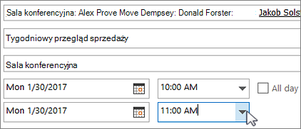
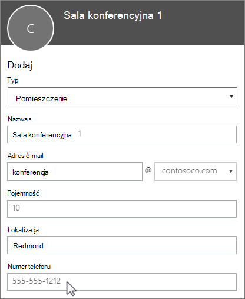

# Skrzynki pocztowe pokoju i sprzętu

Jeśli masz salę konferencyjną, samochód służbowy lub sprzęt, z którego korzystają wszyscy, potrzebny jest sposób udostępnienia tych zasobów wszystkim zainteresowanym. Najlepszym sposobem jest utworzenie skrzynki pocztowej pokoju lub sprzętu w Microsoft 365 poszczególnych zasobów. Możesz utworzyć taką skrzynkę pocztową dla sali konferencyjnej na pierwszym piętrze, dla sprzętu multimedialnego lub dla ciężarówki do przeprowadzek.
  
Po utworzeniu skrzynki pocztowej pokoju lub sprzętu każda osoba w firmie będzie mogła zarezerwować te zasoby na potrzeby spotkań lub wydarzeń, korzystając z programu Outlook. Zapoznaj się z kolejnymi dwiema kartami, aby dowiedzieć się, **jak korzystać z tej funkcji** i **jak ją skonfigurować**. Poniżej przedstawiono inne często zadawane pytania dotyczące skrzynek pocztowych pokojów i sprzętu.
  
## Korzystanie ze skrzynek pocztowych pokojów i sprzętu

Aby używać skrzynek pocztowych pokojów lub sprzętu, otwórz program Outlook na komputerze lub zaloguj się do aplikacji Outlook w sieci Web. Zaplanuj nowe spotkanie i dodaj do niego pokój lub sprzęt tak samo, jak w przypadku zapraszania innych pracowników lub klientów. Zasób jest teraz zarezerwowany.
  
1. Otwórz program **Outlook** na komputerze.

2. Na karcie **Narzędzia główne** wybierz pozycję **Nowe elementy** \> **Spotkanie**.

   

   Możesz też po prostu wybrać pozycję **Nowe spotkanie** z poziomu Kalendarza.
    
3. W polu Do wpisz nazwę sali konferencyjnej lub sprzętu do zarezerwowania oraz uczestników, których chcesz zaprosić.

   Możesz też wybrać pozycję **Do**, a następnie dwukrotnie kliknąć salę konferencyjną lub sprzęt na liście. Następnie wybierz przycisk **OK**.

   
  
4. W wierszu **Temat** wpisz cel rezerwacji lub spotkania. 
    
5. Zmień wartość w polu **Lokalizacja** lub pozostaw ją bez zmian. 
    
6. Dostosuj **Godzinę rozpoczęcia** i **Godzinę zakończenia**. Ewentualnie wybierz pozycję **Wydarzenie całodzienne**. Aby powtarzać spotkanie lub rezerwację cyklicznie, wybierz pozycję **Cykl** na górze.
 
   
  
7. Wpisz komunikat opisujący cel i w razie potrzeby dołącz pliki.
    
8. Aby zezwolić innym osobom na dołączanie do spotkania online lub telefonicznie, wybierz pozycję **Spotkanie na Skypie**.
    
9. Aby sprawdzić dostępność pokoju, sprzętu i zaproszonych osób, wybierz pozycję **Asystent planowania** na górze. Następnie wybierz dostępną godzinę w kalendarzu.

   

   > [!TIP]
   > W kalendarzu planowania niebieskie pole oznacza, że pokój lub sprzęt jest zarezerwowany, albo że osoba jest zajęta. Wybierz biały (wolny) obszar w kalendarzu. 
  
10. Po zakończeniu wybierz pozycję **Wyślij**.
    
## Konfigurowanie skrzynek pocztowych pokojów i sprzętu

Aby skonfigurować skrzynkę pocztową pokoju lub sprzętu, przejdź do <a href="https://go.microsoft.com/fwlink/p/?linkid=2024339" target="_blank">centrum administracyjne platformy Microsoft 365</a>. W tym celu wymagane są uprawnienia administratora. Utwórz skrzynkę pocztową i powiadom wszystkich, że można już rezerwować dany zasób na potrzeby spotkań i wydarzeń.
  
1. W Centrum administracyjnym przejdź do strony **Zasoby** \> [Pokoje i wyposażenie](https://go.microsoft.com/fwlink/p/?linkid=2067334).
  
2. Wybierz opcję **Dodaj**.
    
3. Wypełnij pola danych pokoju lub sprzętu:

   
  
   - **Pokój** lub **Sprzęt**: typ tworzonej skrzynki pocztowej.
    
   - **Nazwa**: zrozumiała nazwa lub krótki opis.
    
   - **E-mail**: alias poczty e-mail pokoju lub sprzętu. Będzie konieczny w celu wysłania wniosku o rezerwację pokoju lub sprzętu na potrzeby spotkania.
    
   - **Pojemność**: liczba osób, które mogą jednocześnie przebywać w pomieszczeniu lub korzystać ze sprzętu.
    
   - **Lokalizacja**: numer pokoju albo lokalizacja pokoju w budynku lub regionie.
    
   - **Numer telefonu**: numer telefonu dla pokoju. To inny numer niż numer telefonu spotkania generowany w przypadku korzystania z programu Skype dla firm.
    
4. Wybierz opcję **Dodaj**.
    
5. Wybierz utworzoną skrzynkę pocztową pokoju lub sprzętu w celu wyświetlenia lub edytowania szczegółów.
  
6. Jeśli zostały wprowadzone zmiany, wybierz pozycję **Zapisz**, a następnie pozycję **Zamknij**.

> [!Note]
> Aby zadbać o bezpieczeństwo skrzynek pocztowych pokojów lub sprzętu, zablokuj logowanie się do tych skrzynek pocztowych. Aby uzyskać więcej informacji, zobacz [Blokowanie logowania się na koncie udostępnionej skrzynki pocztowej](/office365/admin/email/create-a-shared-mailbox#block-sign-in-for-the-shared-mailbox-account).

## Często zadawane pytania dotyczące skrzynek pocztowych pokojów i sprzętu

### Skąd wiadomo, kiedy dany pokój lub sprzęt jest dostępny?

Otwórz program Outlook, a następnie utwórz nowe spotkanie. Dodaj pokój lub sprzęt do spotkania tak, jak dodajesz do niego osoby, a następnie wybierz pozycję **Asystent planowania**, aby wyświetlić dynamiczny kalendarz z podglądem dostępności pokoju lub sprzętu. Jeśli dany przedział godzinowy jest pusty, zasób jest dostępny, a jeśli zaznaczony na niebiesko — zasób jest zarezerwowany. 
  
### Jak anulować wniosek o rezerwację pokoju lub sprzętu?

Otwórz spotkanie zaplanowane w programie Outlook, a następnie usuń z niego pokój lub sprzęt tak samo, jak usuwasz uczestników. To spowoduje zwolnienie pokoju i umożliwi zarezerwowanie go innym osobom.
  
### Czy ktoś musi zaakceptować lub odrzucić każdy wniosek o rezerwację pokoju lub sprzętu?

Nie, akceptowanie lub odrzucanie wniosków nie jest konieczne. Możesz zdecydować, czy chcesz zezwolić na automatyczną rezerwację pokoju lub sprzętu, czy też rezerwacjami ma zarządzać wybrana osoba w firmie. 
  
### Czy skrzynka pocztowa pokoju lub skrzynka pocztowa sprzętu wymaga licencji produktu?

L.p. Mimo że większość osób w organizacji potrzebuje licencji, aby używać usługi Microsoft 365, nie trzeba przypisywać licencji do skrzynki pocztowej pokoju ani skrzynki pocztowej sprzętu, jeśli skrzynka pocztowa zasobu nie musi mieć rozmiaru większego niż 50 GB lub jeśli niektóre funkcje nie są potrzebne (Zasady przechowywania z witryny Zabezpieczenia i zgodność lub Wstrzymaj z Exchange Online ) lub na wypadek, gdy do skrzynki pocztowej zasobu nie jest potrzebne archiwum online.
  
### Czy potrzebna jest osoba zarządzająca rezerwowaniem pokojów i sprzętu?

 Nie, osoba zarządzająca skrzynką pocztową pokoju lub skrzynką pocztową sprzętu nie jest potrzebna.
