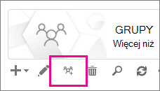

# <a name="upgrade-distribution-lists-to-microsoft-365-groups-in-outlook"></a>Uaktualnianie list dystrybucyjnych do Grupy Microsoft 365 w Outlook

Listy dystrybucyjne można uaktualnić do Grupy Microsoft 365 w Outlook. Jest to doskonały sposób, aby udostępnić listom dystrybucyjnym organizacji wszystkie funkcje Grupy Microsoft 365. [Dlaczego należy uaktualnić listy dystrybucyjne do grup w programie Outlook](https://support.microsoft.com/office/7fb3d880-593b-4909-aafa-950dd50ce188)

Można uaktualniać listy DLS pojedynczo lub kilka jednocześnie.

## <a name="upgrade-one-or-many-distribution-list-groups-to-microsoft-365-groups-in-outlook"></a>Uaktualnij jedną lub wiele grup listy dystrybucyjnej, aby Grupy Microsoft 365 w Outlook

Aby uaktualnić grupę listy dystrybucyjnej, musisz być administratorem globalnym lub administratorem Exchange. Aby uaktualnić do Grupy Microsoft 365, grupa listy dystrybucyjnej musi mieć właściciela ze skrzynką pocztową.

### <a name="use-the-new-eac-to-upgrade-one-or-many-distribution-list-groups-to-microsoft-365-groups-in-outlook"></a>Użyj nowej umowy EAC, aby uaktualnić jedną lub wiele grup listy dystrybucyjnej do Grupy Microsoft 365 w Outlook

1. Przejdź do nowego centrum administracyjnego Exchange > <a href="https://go.microsoft.com/fwlink/?linkid=2183233" target="_blank">grupy</a> **adresatów**\>.

2. Wybierz grupę listy dystrybucyjnej (nazywaną również **grupą dystrybucyjną**), którą chcesz uaktualnić do grupy Microsoft 365 na stronie **Grupy**.

3. Wybierz **grupę dystrybucji Uaktualnij** na pasku narzędzi.

4. W oknie dialogowym **Gotowe do uaktualnienia?**, kliknij przycisk **Uaktualnij**. Proces rozpoczyna się natychmiast. W zależności od rozmiaru i liczby uaktualnianych grup listy dystrybucyjnej proces może potrwać kilka minut lub godzin.

> [!NOTE]
> Baner u góry wskazuje uaktualnienie, na przykład *grupy dystrybucyjne zostały uaktualnione. Odzwierciedlienie zmian zajmie 5 minut. Filtruj według grup Microsoft 365, aby wyświetlić uaktualnione grupy dystrybucyjne*.

### <a name="use-the-classic-eac-to-upgrade-one-or-many-distribution-list-groups-to-microsoft-365-groups-in-outlook"></a>Użyj klasycznej umowy EAC, aby uaktualnić jedną lub wiele grup listy dystrybucyjnej do Grupy Microsoft 365 w Outlook

1. Przejdź do centrum administracyjnego Exchange > <a href="https://go.microsoft.com/fwlink/?linkid=2183233" target="_blank">**grupy**</a> **adresatów**\>.<br/>Zostanie wyświetlone powiadomienie wskazujące, że masz listy dystrybucyjne (nazywane również **grupami dystrybucji**), które kwalifikują się do uaktualnienia do Grupy Microsoft 365.<br/> 

1. Wybierz co najmniej jedną listę dystrybucyjną (nazywaną również **grupą dystrybucyjną**) na stronie **grup** .<br/>

1. Wybierz ikonę uaktualnienia.<br/>

1. W oknie dialogowym informacji wybierz pozycję **Tak** , aby potwierdzić uaktualnienie. Proces rozpoczyna się natychmiast. W zależności od rozmiaru i liczby uaktualnianych bibliotek DLS proces może potrwać kilka minut lub godzin.<br/>Jeśli nie można uaktualnić listy dystrybucyjnej, zostanie wyświetlone okno dialogowe. Zobacz [Które listy dystrybucyjne nie mogą być uaktualnione?](#which-distribution-lists-cant-be-upgraded).

1. Jeśli uaktualniasz wiele list dystrybucyjnych, użyj listy rozwijanej, aby filtrować listy dystrybucyjne, które zostały uaktualnione. Jeśli lista nie została ukończona, poczekaj chwilę dłużej, a następnie wybierz pozycję **Odśwież** , aby zobaczyć, co zostało pomyślnie uaktualnione.<br/>Nie ma żadnego powiadomienia informującego o zakończeniu procesu uaktualniania dla wszystkich wybranych bibliotek DLS. Możesz to ustalić, sprawdzając, co znajduje się na liście w obszarze **Dostępne do uaktualnienia** lub **Uaktualnione listy DLs**.

1. Jeśli wybrano bibliotekę DL do uaktualnienia, ale nadal jest ona widoczna na stronie jako Dostępna do uaktualnienia, uaktualnienie nie powiodło się. Zobacz [Co zrobić, jeśli uaktualnienie nie działa](#what-to-do-if-the-upgrade-doesnt-work).

> [!NOTE]
> Jeśli otrzymujesz wiadomości e-mail szyfrowane przez grupy, możesz zauważyć u dołu, że czasami będzie ona oferowana w celu umożliwienia uaktualnienia wszystkich kwalifikujących się list dystrybucyjnych, których jesteś właścicielem. Aby uzyskać więcej informacji na temat wiadomości e-mail szyfrowane, zobacz [Temat Prowadzenie konwersacji grupowej w Outlook](https://support.microsoft.com/office/a0482e24-a769-4e39-a5ba-a7c56e828b22).

## <a name="what-to-do-if-the-upgrade-doesnt-work"></a>Co zrobić, jeśli uaktualnienie nie działa

Listy dystrybucyjne, które nie mogą zostać uaktualnione, pozostają niezmienione.

Jeśli nie można uaktualnić co najmniej jednej **kwalifikującej się** listy dystrybucyjnej, 

1. Ten [skrypt](https://aka.ms/DLToM365Group) służy do skanowania pod kątem możliwych problemów, które mogą uniemożliwić uaktualnienie listy dystrybucyjnej do grupy Microsoft 365, rozwiązywania wszelkich problemów zgłoszonych przez skrypt i próby uaktualnienia listy dystrybucyjnej jeszcze raz. 

2. Jeśli powyższy skrypt nie pomoże lub jeśli problem będzie się powtarzać, otwórz [bilet pomocy technicznej](../../business-video/get-help-support.md). Aby rozwiązać problem, należy przekazać go zespołowi inżynierów ds. grup.

## <a name="how-to-use-powershell-to-upgrade-several-distribution-lists-at-the-same-time"></a>Jak używać programu PowerShell do uaktualniania kilku list dystrybucyjnych w tym samym czasie

Jeśli masz doświadczenie w korzystaniu z programu PowerShell, możesz wybrać tę trasę zamiast korzystać z interfejsu użytkownika. Mamy zestaw poleceń cmdlet, które pomogą Ci uaktualnić listy dystrybucyjne. Zobacz poniżej.

### <a name="upgrade-a-single-dl"></a>Uaktualnianie pojedynczego biblioteki DL

Aby uaktualnić pojedynczy plik DL, uruchom następujące polecenie:

```PowerShell
Upgrade-DistributionGroup -DlIdentities <Dl SMTP address>
```

Jeśli na przykład chcesz uaktualnić bibliotekę DL przy użyciu adresu SMTP dl1@contoso.com, uruchom następujące polecenie:

```PowerShell
Upgrade-DistributionGroup -DlIdentities dl1@contoso.com
```

> [!NOTE]
> Można również uaktualnić pojedynczą listę dystrybucyjną do grupy Microsoft 365 przy użyciu polecenia cmdlet programu PowerShell [New-UnifiedGroup](/powershell/module/exchange/new-unifiedgroup)

### <a name="upgrade-multiple-dls-in-a-batch"></a>Uaktualnianie wielu bibliotek DLs w partii

Możesz również przekazać wiele bibliotek DLs jako partię i uaktualnić je razem:

```PowerShell
Upgrade-DistributionGroup -DlIdentities <DL SMTP address1>, <DL SMTP address2>,
<DL SMTP address3>, <DL SMTP address4>
```

Jeśli na przykład chcesz uaktualnić pięć bibliotek DLs z adresem `dl1@contoso.com` SMTP i `dl2@contoso.com`, `dl3@contoso.com`, `dl4@contoso.com` i `dl5@contoso.com`, uruchom następujące polecenie:

```powershell
Upgrade-DistributionGroup -DlIdentities dl1@contoso.com, dl2@contoso.com, dl3@contoso.com, dl4@contoso.com, dl5@contoso.com
```

### <a name="upgrade-all-eligible-dls"></a>Uaktualnij wszystkie kwalifikujące się listy DL

Istnieją dwa sposoby uaktualniania wszystkich kwalifikujących się bibliotek DLs.

> [!NOTE]
> Polecenie cmdlet Upgrade-DistributionGroup nie odbiera danych z potoku, dlatego do pomyślnego uruchomienia jest wymagane użycie operatora "foreach-object{}".

1. Pobierz kwalifikujące się listy DLs w dzierżawie i uaktualnij je przy użyciu polecenia uaktualnienia:

   ```PowerShell
   Get-EligibleDistributionGroupForMigration | Foreach-Object{
       Upgrade-DistributionGroup -DlIdentities $_.PrimarySMTPAddress
   }
   ```

2. Pobierz listę wszystkich bibliotek DLs i uaktualnij tylko kwalifikujące się listy DLS:

   ```PowerShell
   Get-DistributionGroup| Foreach-Object{
       Upgrade-DistributionGroup -DlIdentities $_.PrimarySMTPAddress
   }
   ```

## <a name="faq-about-upgrading-distribution-lists-to-microsoft-365-groups-in-outlook"></a>Często zadawane pytania dotyczące uaktualniania list dystrybucyjnych do Grupy Microsoft 365 w Outlook

### <a name="which-distribution-lists-cant-be-upgraded"></a>Których list dystrybucyjnych nie można uaktualnić?

Można uaktualnić tylko zarządzane w chmurze, proste, niegnieżdżone listy dystrybucyjne. W poniższej tabeli wymieniono listy dystrybucyjne, których **nie można** uaktualnić.

|Właściwość|Kwalifikujących się?|
|---|---|
|Lokalna zarządzana lista dystrybucyjna.|Nie|
|Zagnieżdżone listy dystrybucyjne. Lista dystrybucyjna zawiera grupy podrzędne lub jest członkiem innej grupy.|Nie|
|Listy dystrybucyjne z elementem **członkowskim RecipientTypeDetails** innym niż **UserMailbox**, **SharedMailbox**, **TeamMailbox**, **MailUser**|Nie|
|Lista dystrybucyjna zawierająca ponad 100 właścicieli|Nie|
|Lista dystrybucyjna zawierająca tylko członków, ale bez właściciela|Nie|
|Lista dystrybucyjna zawierająca alias zawierający znaki specjalne|Nie|
|Jeśli lista dystrybucyjna jest skonfigurowana jako adres przesyłania dalej dla udostępnionej skrzynki pocztowej|Nie|
|Jeśli plik DL jest częścią **ograniczenia nadawcy** w innym DL.|Nie|
|Grupy zabezpieczeń|Nie|
|Listy dystrybucji dynamicznej|Nie|
|Listy dystrybucyjne, które zostały przekonwertowane na **listy pokojów**|Nie|

### <a name="check-which-dls-are-eligible-for-upgrade"></a>Sprawdzanie, które listy DLS kwalifikują się do uaktualnienia

Jeśli chcesz sprawdzić, czy usługa DL kwalifikuje się, możesz uruchomić poniższe polecenie:

```PowerShell
Get-DistributionGroup <DL SMTP address> | Get-EligibleDistributionGroupForMigration
```

Jeśli chcesz sprawdzić, które listy DLs kwalifikują się do uaktualnienia, uruchom następujące polecenie:

```PowerShell
Get-EligibleDistributionGroupForMigration
```

### <a name="who-can-run-the-upgrade-scripts"></a>KtoTo można uruchomić skrypty uaktualniania?

Osoby z uprawnieniami administratora globalnego lub administratora Exchange.

### <a name="why-is-the-contact-card-still-showing-a-distribution-list-what-should-i-do-to-prevent-an-upgraded-distribution-list-from-showing-up-in-my-auto-suggest-list"></a>Dlaczego karta kontaktu nadal wyświetla listę dystrybucyjną? Co należy zrobić, aby zapobiec wyświetlaniu uaktualnianej listy dystrybucyjnej na liście autosugerów?

- W przypadku Outlook: gdy ktoś spróbuje wysłać wiadomość e-mail w Outlook, wpisując nazwę grupy Microsoft 365 po migracji, adresat zostanie rozpoznany jako lista dystrybucyjna zamiast grupy. Wizytówką odbiorcy będzie karta kontaktowa listy dystrybucyjnej. Jest to spowodowane pamięcią podręczną adresata lub pamięcią podręczną nazw nick w Outlook. Wiadomość e-mail zostanie pomyślnie wysłana do grupy, ale może spowodować nieporozumienie nadawcy.<br/>Możesz wykonać kroki opisane w tym artykule [Informacje o liście Outlook autouzupełniania](/outlook/troubleshoot/contacts/information-about-the-outlook-autocomplete-list) w celu zresetowania pamięci podręcznej, co rozwiąże ten problem.

- W przypadku Outlook w sieci Web: w przypadku Outlook w sieci Web adresat listy dystrybucyjnej nadal pozostanie w pamięci podręcznej. Aby odświeżyć pamięć podręczną, aby wyświetlić wizytówkę grupy, możesz wykonać kroki opisane w temacie [Usuwanie sugerowanej nazwy lub adresu e-mail z listy autouzupełniania](https://support.microsoft.com/office/9E1419D9-E88F-445B-B07F-F558B8A37C58) .

### <a name="do-new-group-members-get-a-welcome-email-in-their-inbox"></a>Czy nowi członkowie grupy otrzymują powitalną wiadomość e-mail w skrzynce odbiorczej?

L.p. Ustawienie włączania komunikatów powitalnych jest domyślnie ustawione na wartość false. To ustawienie dotyczy zarówno istniejących, jak i nowych członków grupy, którzy mogą dołączyć po zakończeniu migracji. Jeśli właściciel grupy później zezwoli użytkownikom-gościom, użytkownicy-goście nie otrzymają powitalnej wiadomości e-mail w skrzynce odbiorczej. Członkowie-goście mogą kontynuować pracę z grupą.

### <a name="what-if-one-or-some-of-the-dls-are-not-upgraded"></a>Co zrobić, jeśli jeden lub niektóre listy DLS nie zostaną uaktualnione?

Istnieją pewne przypadki, w których usługa DL kwalifikuje się, ale nie może zostać uaktualniona. Biblioteka DL nie jest uaktualniona i pozostaje jako biblioteka DL.

- Jeśli administrator zastosował **zasady adresów e-mail grupy** dla grup w organizacji i próbuje uaktualnić listy DLs, które nie spełniają kryteriów, biblioteka DL nie zostanie uaktualniona

- Nie można uaktualnić bibliotek DLS z **ustawieniem MemberJoinRestriction** lub **MemberDepartRestriction** na **wartość Zamknięte**.

- Tworzenie grupy Microsoft 365 jest dozwolone tylko dla kilku użytkowników, wykonując kroki opisane w [tym artykule](/microsoft-365/solutions/manage-creation-of-groups). W tym scenariuszu, jeśli właściciel listy dystrybucyjnej nie może utworzyć grupy Microsoft 365, lista dystrybucyjna nie zostanie uaktualniona do grupy Microsoft 365.
Obejście: użyj jednego z następujących obejść w powyższym scenariuszu:

1. Upewnij się, że wszyscy użytkownicy wymienieni jako właściciele biblioteki DL mogą tworzyć grupę M365, tj. są członkami grupy zabezpieczeń dozwolonej dla grupy M365.

   LUB

2. Tymczasowo zastąp właściciela biblioteki DL, który nie może utworzyć grupy M365, użytkownikiem, który może utworzyć grupę M365.

### <a name="what-happens-to-the-dl-if-the-upgrade-from-eac-fails"></a>Co się stanie z biblioteką DL, jeśli uaktualnienie z eac zakończy się niepowodzeniem?

Uaktualnienie nastąpi tylko wtedy, gdy wywołanie zostanie przesłane do serwera. Jeśli uaktualnienie zakończy się niepowodzeniem, listy DLS będą nienaruszone. Będą działać tak, jak kiedyś.

### <a name="what-happens-to-message-approval-moderation-settings-on-distribution-groups-after-upgrading"></a>Co się stanie z ustawieniami zatwierdzania komunikatów (moderowania) w grupach dystrybucyjnych po uaktualnieniu?

Ustawienia zatwierdzania komunikatów (moderowania) są zachowywane i działają prawidłowo po uaktualnieniu grupy dystrybucyjnej do grupy Microsoft 365.

## <a name="related-content"></a>Zawartość pokrewna

[Porównanie grup](../create-groups/compare-groups.md) (artykuł)\
[Objaśnienie Grupy Microsoft 365 użytkownikom](../create-groups/explain-groups-knowledge-worker.md) (artykuł)\
[Dodawanie lub usuwanie członków z grup Microsoft 365 przy użyciu centrum administracyjnego](../create-groups/add-or-remove-members-from-groups.md)
