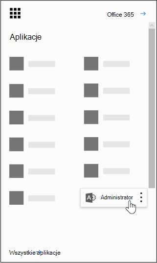

# Używanie danych Power BI w organizacji

Na tej stronie opisano, jak użytkownicy w organizacji mogą używać usługi Power BI oraz w jaki sposób organizacja uzyskuje dostęp do tej usługi.

## Co to jest Power BI?

Usługa Microsoft Power BI umożliwia użytkownikom wizualizowanie danych, udostępnianie przeanalizowanych materiałów oraz współpracę przy użyciu nowych, intuicyjnych metod. Aby dowiedzieć się więcej, zobacz [witryna internetowa usługi Power BI](https://powerbi.microsoft.com/en-us/).
  
## Czy Power BI spełniać krajowe, regionalne i branżowe wymagania dotyczące zgodności?

Aby dowiedzieć się więcej na temat zgodności Power BI, zobacz [Centrum zaufania firmy Microsoft](https://go.microsoft.com/fwlink/?LinkId=785324).
  
## Jak użytkownicy tworzą konta w usłudze Power BI?

Jako administrator możesz utworzyć konto w usłudze Power BI za pośrednictwem [witryny sieci Web usługi Power BI](https://powerbi.microsoft.com/en-us/). Możesz również zarejestrować się za pośrednictwem strony zakup usług w Centrum administracyjne platformy Microsoft 365. Gdy administrator utworzy konto w usłudze Power BI, może przypisywać licencje subskrypcyjne użytkownikom, którzy powinni mieć dostęp.
  
Ponadto poszczególni użytkownicy w organizacji mogą mieć możliwość utworzenia konta w usłudze Power BI za pośrednictwem [witryny sieci Web usługi Power BI](https://powerbi.microsoft.com/en-us/). Gdy użytkownik w Twojej organizacji utworzy konto w usłudze Power BI, licencja usługi Power BI zostanie mu przypisana automatycznie.
  
## Jak tworzą konta poszczególni użytkownicy w mojej organizacji?

Istnieją trzy scenariusze, które mogą być stosowane do użytkowników w organizacji:
  
### Scenariusz 1. Twoja organizacja ma już istniejące środowisko Microsoft 365, a użytkownik rejestruujący się w Power BI ma już konto Microsoft 365.

W tym scenariuszu, jeśli użytkownik ma już konto służbowe lub szkolne w dzierżawie (na przykład contoso.com), ale nie ma jeszcze usługi Power BI, firma Microsoft po prostu aktywuje plan dla tego konta i użytkownik zostanie automatycznie powiadomiony o sposobach korzystania z usługi Power BI.
  
### Scenariusz 2. Twoja organizacja ma istniejące środowisko Microsoft 365, a użytkownik rejestruujący się w Power BI nie ma konta Microsoft 365.

W tym scenariuszu użytkownik ma adres e-mail w domenie organizacji (na przykład contoso.com), ale nie ma jeszcze konta Microsoft 365. W takim przypadku użytkownik może zarejestrować się w usłudze Power BI i automatycznie otrzymać konto. Dzięki temu użytkownik będzie mieć dostęp do usługi Power BI. Jeśli na przykład pracownik o imieniu Nancy używa służbowego adresu e-mail (na przykład Nancy@contoso.com), firma Microsoft automatycznie doda Nancy jako użytkownika w środowisku Microsoft 365 firmy Contoso i aktywuje Power BI dla tego konta.
  
### Scenariusz 3. Twoja organizacja nie ma środowiska Microsoft 365 połączonego z domeną poczty e-mail.

Nie ma żadnych akcji administracyjnych, których organizacja potrzebuje, aby korzystać z Power BI.
  
> [!IMPORTANT]
> Jeśli Twoja organizacja ma wiele domen poczty e-mail i wolisz, aby wszystkie rozszerzenia adresów e-mail były w tej samej dzierżawie, przed utworzeniem dzierżawy podstawowej przez użytkowników dodaj wszystkie domeny adresów e-mail do tej dzierżawy przed utworzeniem dzierżawy podstawowej przez użytkowników. Nie ma zautomatyzowanego mechanizmu przenoszenia użytkowników między dzierżawami po ich utworzeniu. Aby uzyskać więcej informacji na temat tego procesu, zobacz [Jeśli mam wiele domen, czy mogę kontrolować dzierżawę, do którą są dodawani użytkownicy?](#if-i-have-multiple-domains-can-i-control-the-tenant-that-users-are-added-to) w dalszej części tego artykułu i [Dodaj domenę do Office 365](../setup/add-domain.md) online.
  
## Jak zmieni się obecny sposób zarządzania tożsamością użytkowników w mojej organizacji?

Jeśli Twoja organizacja ma już istniejące środowisko Microsoft 365, a wszyscy użytkownicy w organizacji mają konta Microsoft 365, zarządzanie tożsamościami nie ulegnie zmianie.
  
Jeśli Organizacja ma już istniejące środowisko Microsoft 365, ale nie wszyscy użytkownicy w organizacji mają konta Microsoft 365, utworzymy użytkownika w dzierżawie i przypiszemy licencje na podstawie służbowego adresu e-mail użytkownika. Oznacza to, że liczba użytkowników, którymi zarządzasz w danym momencie, będzie się zwiększać w miarę tworzenia kont usługi przez użytkowników w organizacji.
  
Jeśli zarządzasz katalogiem lokalnie, stosując usługi federacyjne Active Directory (AD FS), firma Microsoft nie będzie dodawać użytkowników do Twojej dzierżawy, a wszyscy użytkownicy przy próbie dołączenia do Twojej dzierżawy otrzymają komunikat z prośbą o kontakt z administratorem w ich organizacji.
  
Jeśli organizacja nie ma środowiska Microsoft 365 połączonego z domeną poczty e-mail, nie będzie żadnych zmian w sposobie zarządzania tożsamościami. Użytkownicy będą dodawani do nowego katalogu użytkowników działającego tylko w chmurze, a Ty będziesz mieć możliwość dobrowolnego przejęcia tych użytkowników jako administrator dzierżawy i zarządzania nimi.
  
## Jaka jest procedura przejęcia zarządzania dzierżawą utworzoną przez firmę Microsoft dla moich użytkowników?

Jeśli dzierżawa została utworzona przez firmę Microsoft, możesz przejąć dzierżawę i zarządzać nią w następujący sposób:
  
1. Dołącz do dzierżawy, [tworząc konto w usłudze Power BI](https://go.microsoft.com/fwlink/?LinkId=522448) za pomocą adresu e-mail w domenie odpowiadającej domenie dzierżawy, którą chcesz zarządzać. Na przykład jeśli firma Microsoft utworzyła dzierżawę contoso.com, należy dołączyć do dzierżawy za pomocą adresu e-mail kończącego się na @contoso.com.

1. Przejmij kontrolę administracyjną, weryfikując własność domeny: po dołączeniu do dzierżawy możesz nadać sobie rolę administratora, weryfikując własność domeny. Aby tak zrobić, wykonaj następujące kroki:

::: moniker range="o365-worldwide"

3. Przejdź pod adres <a href="https://admin.microsoft.com" target="_blank">https://admin.microsoft.com</a>.

::: moniker-end

::: moniker range="o365-21vianet"

3. Przejdź do witryny <a href="https://portal.partner.microsoftonline.cn" target="_blank">https://portal.partner.microsoftonline.cn</a>.

::: moniker-end

4. Wybierz ikonę Uruchamianie aplikacji w lewym górnym rogu i wybierz pozycję **Administrator**.

    
  
5. Przeczytaj instrukcje na stronie **Zostań administratorem** , a następnie wybierz pozycję **Tak, chcę być administratorem**.

    > [!NOTE]
    >  Jeśli ta opcja nie jest wyświetlana, istnieje już administrator.
  
## Jeśli mam wiele domen, czy mogę kontrolować dzierżawę dodawaną przez użytkowników?

Jeśli nic nie zrobisz, dzierżawy będą tworzone dla każdej domeny i poddomeny poczty e-mail dla użytkowników.
  
Jeśli chcesz, aby wszyscy użytkownicy należeli do tej samej dzierżawy niezależnie od rozszerzenia adresu e-mail:
  
- Dodaj wszystkie istniejące domeny i poddomeny, które chcesz połączyć, do utworzonej wcześniej dzierżawy docelowej lub jednej z istniejących dzierżaw. Wtedy wszyscy użytkownicy mający adresy e-mail w tych domenach i poddomenach automatycznie dołączą do dzierżawy docelowej po utworzeniu konta.

> [!IMPORTANT]
> Nie jest obsługiwany żaden automatyczny mechanizm przenoszenia już utworzonych użytkowników do innej dzierżawy. Aby dowiedzieć się więcej na temat dodawania domen do jednej dzierżawy Microsoft 365, zobacz [Dodawanie domeny do Office 365](../setup/add-domain.md).

> [!IMPORTANT]
> Aby uzyskać więcej informacji i wskazówek dotyczących zarządzania dzierżawami, zobacz [Co to jest administracja Power BI?](/power-bi/service-admin-administering-power-bi-in-your-organization).
  
## Jak uniemożliwić użytkownikom dołączanie do mojej istniejącej dzierżawy?

Istnieją kroki, które można wykonać jako administrator, aby uniemożliwić użytkownikom dołączanie do istniejącej dzierżawy. Jeśli zablokujesz użytkownikom możliwość dołączenia do dzierżawy, próby zalogowania użytkowników nie powiedzie się i zostaną przekierowane do kontaktu z administratorem ich organizacji. Nie musisz powtarzać tego procesu, jeśli wcześniej wyłączono automatyczną dystrybucję licencji (na przykład Office 365 Education dla studentów, wykładowców i pracowników).
  
Te kroki wymagają użycia programu Windows PowerShell. Aby rozpocząć pracę z programem Windows PowerShell, zobacz [przewodnik z wprowadzeniem do programu PowerShell](/powershell/scripting/overview).
  
Aby wykonać następujące kroki, należy zainstalować najnowszą 64-bitową wersję [modułu programu PowerShell Azure Active Directory V2](https://www.powershellgallery.com/packages/AzureADPreview/2.0.2.5).
  
Po wybraniu linku wybierz pozycję **Uruchom** , aby uruchomić pakiet instalatora.
  
**Wyłączanie automatycznego dołączania do dzierżawy**: użyj tego skryptu programu Windows PowerShell, aby uniemożliwić nowym użytkownikom dołączanie do dzierżawy, którą zarządzasz:
  
Aby wyłączyć automatyczne dołączanie nowych użytkowników do dzierżawy:  `Set-MsolCompanySettings -AllowEmailVerifiedUsers $false`
  
Aby włączyć automatyczne dołączanie nowych użytkowników do dzierżawy:  `Set-MsolCompanySettings -AllowEmailVerifiedUsers $true`
  
> [!NOTE]
> To blokowanie zapobiega tworzeniu kont w usłudze Power BI przez nowych użytkowników w organizacji. Użytkownicy, którzy utworzą konto w usłudze Power BI przed wyłączeniem tworzenia nowych kont w organizacji, zachowają swoje licencje. Zobacz [Jak mogę usuń Power BI dla użytkowników, którzy już się zarejestrowali?](#how-do-i-remove-power-bi-for-users-that-already-signed-up) aby uzyskać instrukcje dotyczące sposobu usuwania dostępu do Power BI dla użytkowników, którzy wcześniej zarejestrowali się w usłudze.
  
## Jak zezwolić użytkownikom na dołączanie do mojej istniejącej dzierżawy?

Aby zezwolić użytkownikom na dołączanie do dzierżawy, uruchom polecenie przeciwne do opisanego w pytaniu powyżej:  `Set-MsolCompanySettings -AllowEmailVerifiedUsers $true`
  
## Jak sprawdzić, czy w ramach mojej dzierżawy włączona jest blokada?

Skorzystaj z tego skryptu programu PowerShell:  `Get-MsolCompanyInformation | fl allow*`
  
## Jak zapobiec rozpoczęciu korzystania z usługi Power BI przez moich istniejących użytkowników?

**Wyłącz automatyczną dystrybucję licencji:** Użyj tego skryptu Windows PowerShell, aby wyłączyć automatyczne dystrybucje licencji dla istniejących użytkowników. Nie musisz powtarzać tego procesu, jeśli wcześniej wyłączono automatyczną dystrybucję licencji (na przykład Office 365 Education dla studentów, wykładowców i pracowników).
  
Aby wyłączyć automatyczny przydział licencji dla istniejących użytkowników:  `Set-MsolCompanySettings -AllowAdHocSubscriptions $false`
  
Aby włączyć automatyczny przydział licencji dla istniejących użytkowników:  `Set-MsolCompanySettings -AllowAdHocSubscriptions $true`
  
> [!NOTE]
> *Flaga AllowAdHocSubscriptions* służy do kontrolowania kilku możliwości użytkowników w organizacji, w tym możliwości rejestracji użytkowników w usłudze Azure Rights Management Service. Zmiana tej flagi wpłynie na wszystkie te możliwości.
  
## Jak można zezwolić istniejącym użytkownikom na utworzenie konta w usłudze Power BI?

Aby zezwolić istniejącym użytkownikom na utworzenie konta w usłudze Power BI, uruchom polecenie przeciwne do opisanego w pytaniu powyżej:  `Set-MsolCompanySettings -AllowAdHocSubscriptions $true`
  
## Jak usunąć usługę Power BI dla użytkowników, którzy już utworzyli konta?

Jeśli użytkownik zarejestrował się w Power BI, ale nie chcesz już mieć dostępu do Power BI, możesz usunąć licencję Power BI dla tego użytkownika.
  
::: moniker range="o365-worldwide"

1. W centrum administracyjnym przejdź do strony **Użytkownicy** \> <a href="https://go.microsoft.com/fwlink/p/?linkid=834822" target="_blank">Aktywni użytkownicy</a>.

::: moniker-end

::: moniker range="o365-21vianet"

 1. W centrum administracyjnym przejdź do strony **Użytkownicy** \> <a href="https://go.microsoft.com/fwlink/p/?linkid=850628" target="_blank">Aktywni użytkownicy</a>.

::: moniker-end

2. Znajdź użytkownika, dla którego chcesz usunąć licencję, a następnie wybierz jego nazwę.

3. Na **karcie Licencje i aplikacje wyczyść** pole wyboru **Microsoft Power BI**.

4. Wybierz pozycję **Zapisz zmiany**.

## Jak się dowiem, że do mojej dzierżawy dołączyli nowi użytkownicy?

Użytkownicy, którzy dołączyli do Twojej dzierżawy w ramach tego programu, otrzymują unikatową licencję, której można użyć jako kryterium filtrowania w okienku aktywnych użytkowników na pulpicie nawigacyjnym administratora.
  
Aby utworzyć ten nowy widok, w centrum administracyjnym wykonaj kroki opisane w [temacie Tworzenie niestandardowego widoku użytkownika](../add-users/create-edit-or-delete-a-custom-user-view.md#create-a-custom-user-view). W obszarze **Przypisana licencja produktu** wybierz pozycję **Microsoft Power BI**. Po utworzeniu nowego widoku będzie można zobaczyć wszystkich użytkowników w dzierżawie, którzy zarejestrowali się w tym programie.
  
## Czy należy przygotować się na coś jeszcze?

Może nastąpić wzrost liczby próśb o zresetowanie hasła. Aby znaleźć informacje dotyczące tego procesu, zobacz [Resetowanie hasła użytkownika](../add-users/reset-passwords.md).
  
Możesz usunąć użytkownika z dzierżawy za pośrednictwem standardowego procesu w centrum administracyjnym. Jednak jeśli ten użytkownik nadal ma aktywny adres e-mail w ramach Twojej organizacji, będzie mógł dołączyć ponownie, o ile nie zablokujesz możliwości dołączania wszystkim użytkownikom.
  
## Dlaczego w mojej dzierżawie zostało wyświetlonych 1 milion licencji dla firmy Microsoft Power BI?

Użytkownicy kwalifikującej się organizacji są uprawnieni do korzystania z usługi Microsoft Power BI i te licencje reprezentują dostępną pojemność dla nowych użytkowników usługi Power BI w dzierżawie. Za te licencje nie jest pobierana opłata. Jeśli chcesz zezwolić użytkownikom na samodzielne tworzenie konta w Power BI, po zakończeniu procesu tworzenia konta zostanie im przypisana jedna z tych bezpłatnych licencji. Możesz również samodzielnie przypisać te licencje użytkownikom za pośrednictwem centrum administracyjnego.
  
## Czy są one bezpłatne? Czy zostanie naliczona opłata za te licencje?

Te licencje są na bezpłatną wersję usługi Power BI. Jeśli interesujesz się dodatkowymi funkcjami, zapoznaj się z wersją Power BI Pro.
  
## Dlaczego jest to milion licencji?

Wybraliśmy liczbę, która była na tyle duża, że większość organizacji miałaby wiele licencji, aby zapewnić tę korzyść bezzwłocznie swoim użytkownikom.
  
## Co zrobić, jeśli potrzebuję więcej niż miliona licencji?

Jeśli potrzebujesz dodatkowych licencji, skontaktuj się z przedstawicielem obsługi klienta firmy Microsoft, aby uzyskać więcej informacji.