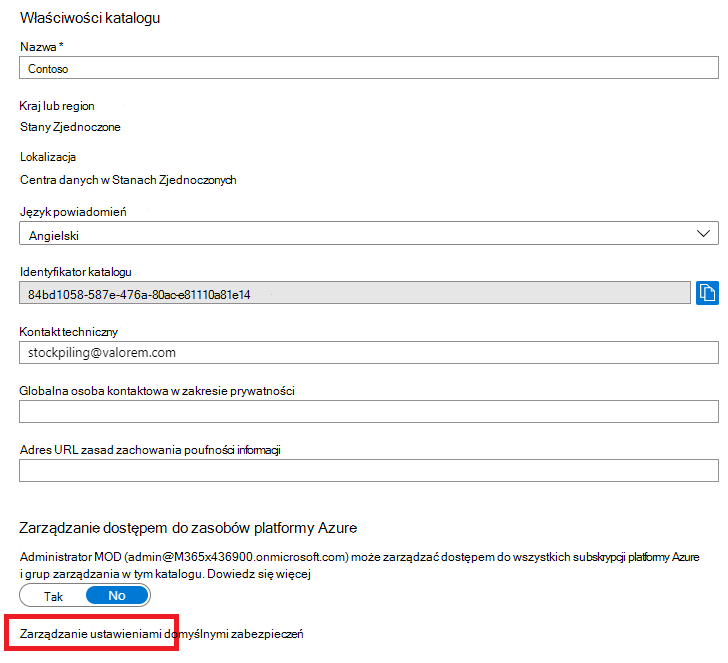
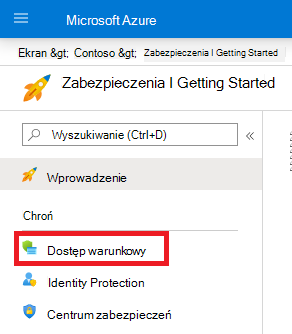
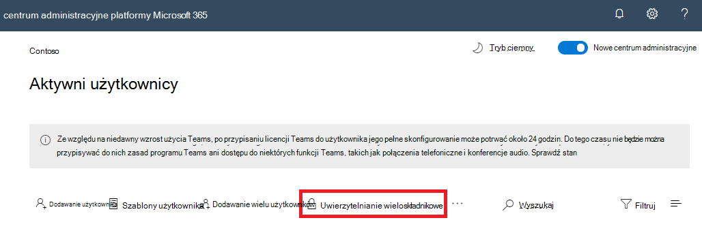

# Uwierzytelnianie wieloskładnikowe dla Microsoft 365

Hasła są najczęstszą metodą uwierzytelniania logowania się na komputerze lub w usłudze online, ale są również najbardziej narażone. Inne osoby mogą wybierać łatwe hasła i używać tych samych haseł dla wielu logowania się na różnych komputerach i w różnych usługach.

Aby zapewnić dodatkowy poziom zabezpieczeń dla logowania, musisz użyć uwierzytelniania wieloskładnikowego (MFA), w którym jest używane zarówno hasło, które powinno być silne, jak i dodatkowa metoda weryfikacji na podstawie:

- Są to dane, które nie są łatwo zduplikowane, na przykład smartfon.
- Coś, co w unikatowy sposób i w sposób unikatowy posiadasz, na przykład odciski palca, twarz lub inny atrybut biometryczny.

Dodatkowa metoda weryfikacji jest stosowana dopiero po zweryfikowaniu hasła użytkownika. W przypadku uwierzytelniania wieloskładnikowego nawet w przypadku naruszenia silnego hasła użytkownika atakujący nie ma twojego smartfonu ani odcisku palca w celu ukończenia logowania.

## Obsługa uwierzytelniania wieloskładnikowego w programie Microsoft 365

Domyślnie uwierzytelniania wieloskładnikowego Microsoft 365 i Office 365 dla kont użytkowników korzystających z:

- Wiadomość SMS wysyłana na telefon, która wymaga od użytkownika wpisania kodu weryfikacyjnego.
- Połączenie telefoniczne.
- Aplikacja Microsoft Authenticator inteligentnych telefonów.

W obu przypadkach logowanie uwierzytelniania wieloskładnikowego używa metody "czegoś, co masz ze sobie, czego nie można łatwo zduplikować" na celu dodatkowej weryfikacji. Uwierzytelniania wieloskładnikowego można włączyć na wiele sposobów dla Microsoft 365 i Office 365:

- Z domyślnymi ustawieniami zabezpieczeń
- Z zasadami dostępu warunkowego
- Dla każdego indywidualnego konta użytkownika (nie zalecane)

Te sposoby są oparte na Twoim Microsoft 365 sieci.

|Planowanie|Zalecenie|Typ klienta|
|---|---|---|
|Wszystkie Microsoft 365 planów|Użyj ustawień domyślnych zabezpieczeń, które wymagają uwierzytelniania MFA dla wszystkich kont użytkowników. 
 Uwierzytelniania MFA dla poszczególnych użytkowników można też skonfigurować dla poszczególnych kont użytkowników, ale nie jest to zalecane.|Małe firmy|
|Microsoft 365 Business Premium 
 Microsoft 365 E3 
 Azure Active Directory (Azure AD) Premium P1|Korzystanie z zasad dostępu warunkowego w celu wymagania uwierzytelniania MFA dla kont użytkowników na podstawie członkostwa w grupie, aplikacji lub innych kryteriów.|Od małych firm do przedsiębiorstw|
|Microsoft 365 E5 
 Azure AD — wersja Premium P2 licencji|Usługa Azure AD Identity Protection wymaga uwierzytelniania wieloskładnikowego na podstawie kryteriów ryzyka logowania.|Enterprise|
||||

### Domyślne ustawienia zabezpieczeń

Wartości domyślne zabezpieczeń to nowa funkcja dla subskrypcji Microsoft 365 i Office 365 wersji próbnej utworzonych po 21 października 2019 r. Dla tych subskrypcji są włączone domyślne ustawienia zabezpieczeń, które:

- Wymaga, aby wszyscy użytkownicy korzystali z uwierzytelniania MFA Microsoft Authenticator aplikacji.
- Blokuje starsze uwierzytelnianie.

Użytkownicy mają 14 dni na zarejestrowanie się w celu uwierzytelniania wieloskładnikowego za pomocą aplikacji Microsoft Authenticator na swoich telefonach inteligentnych, która rozpoczyna się od pierwszego logowania po włączeniu ustawień domyślnych zabezpieczeń. Po upływie 14 dni użytkownik nie będzie mógł się zalogować do czasu ukończenia rejestracji uwierzytelniania MFA.

Domyślne ustawienia zabezpieczeń zapewniają, że wszystkie organizacje mają podstawowy poziom zabezpieczeń dla domyślnie włączonego logowania użytkownika. Korzystając z zasad dostępu warunkowego, możesz wyłączyć ustawienia domyślne zabezpieczeń na rzecz uwierzytelniania wieloskładnikowego.

W okienku Właściwości usługi Azure AD w portalu  Azure Portal można włączać lub wyłączać ustawienia domyślne zabezpieczeń.

Z ustawieniami domyślnymi zabezpieczeń można korzystać w dowolnym Microsoft 365 sieci.

Aby uzyskać więcej informacji, zobacz omówienie [domyślnych ustawień zabezpieczeń](/azure/active-directory/fundamentals/concept-fundamentals-security-defaults).

### Zasady dostępu warunkowego

Zasady dostępu warunkowego to zestaw reguł określających warunki, na podstawie których będą sprawdzane i dozwolone logowania. Można na przykład utworzyć zasady dostępu warunkowego o treści:

- Jeśli nazwa konta użytkownika jest członkiem grupy użytkowników z przypisanymi rolami administratora Exchange, użytkownika, hasła, zabezpieczeń, programu SharePoint lub administratora globalnego, przed zezwoleniem na dostęp należy wymagać uwierzytelniania wieloskładnikowego.

Te zasady pozwalają na wymaganie uwierzytelniania MFA opartego na członkostwie w grupach zamiast próby skonfigurowania poszczególnych kont użytkowników do uwierzytelniania MFA, gdy są one przypisane do tych ról administratora lub nieprzypisane do nich.

Możesz również użyć zasad dostępu warunkowego, aby uzyskać bardziej zaawansowane możliwości, takie jak wymaganie uwierzytelniania MFA dla określonych aplikacji lub czy logowanie jest wykonywane ze zgodnego urządzenia, takiego jak komputer przenośny z systemem Windows 10.

Zasady dostępu warunkowego można skonfigurować w **okienku Zabezpieczenia** dla usługi Azure AD w portalu Azure Portal.

Zasady dostępu warunkowego mogą mieć zastosowanie do:

- Microsoft 365 Business Premium
- Microsoft 365 E3 i E5
- Azure AD — wersja Premium P1 i Azure AD — wersja Premium P2 licencji

W przypadku małych firm Microsoft 365 Business Premium z łatwością możesz użyć zasad dostępu warunkowego, wykonać następujące czynności:

1. Utwórz grupę, która będzie zawierać konta użytkowników wymagające uwierzytelniania MFA.
2. Włącz zasady **Wymagaj uwierzytelniania wieloskładnikowego dla administratorów globalnych** .
3. Utwórz zasady dostępu warunkowego oparte na grupie przy użyciu tych ustawień:
    - Zadania > użytkowników i grup: nazwa grupy z kroku 1 powyżej.
    - Zadania > lub akcje w chmurze: Wszystkie aplikacje w chmurze.
    - Kontrolki dostępu > u grant > udzielanie dostępu > wymaganie uwierzytelniania wieloskładnikowego.
4. Włącz zasady.
5. Dodaj konto użytkownika do grupy utworzonej w kroku 1 powyżej i przetestuj.
6. Aby wymagać uwierzytelniania MFA dla dodatkowych kont użytkowników, dodaj je do grupy utworzonej w kroku 1.

Te zasady dostępu warunkowego umożliwiają we własnym tempie użytkownikom korzystanie z wymagania uwierzytelniania wieloskładnikowego.

Przedsiębiorstwa powinny używać [wspólnych zasad dostępu warunkowego](/azure/active-directory/conditional-access/concept-conditional-access-policy-common) do konfigurowania następujących zasad:

- [Wymaganie uwierzytelniania wieloskładnikowego dla administratorów](/azure/active-directory/conditional-access/howto-conditional-access-policy-admin-mfa)
- [Wymaganie uwierzytelniania WIELOSKŁADNIKOWEGO dla wszystkich użytkowników](/azure/active-directory/conditional-access/howto-conditional-access-policy-all-users-mfa)
- [Blokowanie starszego uwierzytelniania](/azure/active-directory/conditional-access/howto-conditional-access-policy-block-legacy)

Aby uzyskać więcej informacji, zobacz omówienie [dostępu warunkowego](/azure/active-directory/conditional-access/overview).

### Azure AD Identity Protection

Za pomocą usługi Azure AD Identity Protection możesz utworzyć dodatkowe zasady dostępu warunkowego, aby wymagać uwierzytelniania WIELOSKŁADNIKOWEGO, gdy ryzyko logowania [jest średnie lub wysokie](../../security/office-365-security/identity-access-policies.md#require-mfa-based-on-sign-in-risk).

Za pomocą usługi Azure AD Identity Protection i zasad dostępu warunkowego opartych na czynnikach ryzyka można stosować:

- Microsoft 365 E5
- Azure AD — wersja Premium P2 licencji

Aby uzyskać więcej informacji, zobacz omówienie [usługi Azure AD Identity Protection](/azure/active-directory/identity-protection/overview-identity-protection).

### Starsze uwierzytelniania wieloskładnikowe na użytkownika (zalecane)

Aby wymagać uwierzytelniania MFA dla logowania konta użytkownika, należy używać ustawień domyślnych zabezpieczeń lub zasad dostępu warunkowego. Jeśli jednak nie można użyć żadnej z tych funkcji, firma Microsoft zdecydowanie zaleca uwierzytelniania WIELOSKŁADNIKowego dla kont użytkowników z rolami administratora, zwłaszcza administratora globalnego, dla dowolnej subskrypcji o dowolnym rozmiarze.

Uwierzytelniania MFA można włączyć dla pojedynczych kont użytkowników w <a href="https://go.microsoft.com/fwlink/p/?linkid=834822" target="_blank">**okienku**</a> Aktywni użytkownicy centrum administracyjne platformy Microsoft 365.

Po włączeniu tej funkcji, gdy użytkownik następnym razem się pojawi, zostanie wyświetlony monit o zarejestrowanie się w celu uwierzytelniania MFA oraz wybranie i przetestowanie dodatkowej metody weryfikacji.

### Wspólne korzystanie z tych metod

W poniższej tabeli przedstawiono wyniki włączania uwierzytelniania MFA z ustawieniami domyślnymi zabezpieczeń, zasad dostępu warunkowego i ustawień kont dla  użytkownika.

|*Element*|Włączone|Wyłączone|Metoda uwierzytelniania pomocniczego|
|---|---|---|---|
|**Domyślne ustawienia zabezpieczeń**|Nie można używać zasad dostępu warunkowego|Można używać zasad dostępu warunkowego|Microsoft Authenticator aplikacji|
|**Zasady dostępu warunkowego**|Jeśli są włączone, nie można włączyć domyślnych ustawień zabezpieczeń|Jeśli wszystkie są wyłączone, możesz włączyć ustawienia domyślne zabezpieczeń|Użytkownik określony podczas rejestracji uwierzytelniania MFA|
|**Starsze uwierzytelniania wieloskładnikowe na użytkownika (zalecane)**|Zastępuje ustawienia domyślne zabezpieczeń i zasady dostępu warunkowego wymagające uwierzytelniania MFA przy każdym logować.|Zastępowany przez domyślne ustawienia zabezpieczeń i zasady dostępu warunkowego|Użytkownik określony podczas rejestracji uwierzytelniania MFA|
||||

Jeśli są włączone domyślne ustawienia zabezpieczeń, wszystkim nowym użytkownikom jest wyświetlany monit o rejestrację uwierzytelniania wieloskładnikowego i użycie aplikacji Microsoft Authenticator podczas następnego logowania.

## Sposoby zarządzania ustawieniami uwierzytelniania wieloskładnikowego

Ustawienia uwierzytelniania wieloskładnikowego można zarządzać na dwa sposoby.

W portalu Azure Portal możesz:

- Włączanie i wyłączanie domyślnych ustawień zabezpieczeń
- Konfigurowanie zasad dostępu warunkowego

W centrum administracyjne platformy Microsoft 365 możesz skonfigurować ustawienia uwierzytelniania <a href="https://go.microsoft.com/fwlink/p/?linkid=2169174" target="_blank">MFA</a> dla per użytkownika i usługi.

## Następne kroki

[Konfigurowanie uwierzytelniania wieloskładnikowego dla Microsoft 365](set-up-multi-factor-authentication.md)

## Zawartość pokrewna

[Włączanie uwierzytelniania wieloskładnikowego](set-up-multi-factor-authentication.md) (wideo)\
[Włączanie uwierzytelniania wieloskładnikowego na telefonie](https://support.microsoft.com/office/ace1d096-61e5-449b-a875-58eb3d74de14) (wideo)