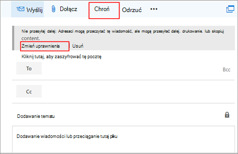

# 10 najlepszych sposobów zabezpieczania planów Microsoft 365 dla firm

Jeśli korzystasz z jednego z planów firmy Microsoft dla firm w małej lub średniej organizacji, możesz skorzystać z wskazówek w tym artykule, aby zwiększyć bezpieczeństwo organizacji. Te wskazówki pomagają organizacji w osiągnięciu celów opisanych w podręczniku kampanii na harvardzie School [2016](https://go.microsoft.com/fwlink/p/?linkid=2015598).

> [!TIP]
> Jeśli potrzebujesz pomocy dotyczącej czynności instrukcje opisanej w tym artykule, rozważ współpracę z specjalistą [ds. małej firmy Microsoft](https://go.microsoft.com/fwlink/?linkid=2186871). Dzięki Pomocy biznesowej Ty i Twoi pracownicy możecie uzyskać całodobowy dostęp do małych ekspertów biznesowych, gdy rozwijasz swoją firmę, od dołączania do codziennego użytku.

## Obejrzyj: Omówienie zabezpieczeń

> [!VIDEO https://www.microsoft.com/videoplayer/embed/RE4mzxI?autoplay=false]

Microsoft 365 Business Premium zapewnia funkcje ochrony przed zagrożeniami, ochrony danych i zarządzania urządzeniami, które pomagają chronić firmę przed zagrożeniami online i nieautoryzowanym dostępem, a także chronić dane firmowe na telefonach, tabletach i komputerach oraz zarządzać nimi.

## Zadania związane z zabezpieczeniami do wykonania

Firma Microsoft zaleca wykonywanie zadań wymienionych w poniższej tabeli dotyczącej Twojego planu usług.

|*Numer*|Zadanie|Microsoft 365 Business Standard|Microsoft 365 Business Premium|
|---|---|---|---|
| 1 | [Ochrona przed zgubionymi lub skradzionymi hasłami](#1-set-up-multi-factor-authentication) |  |  |
| 2 | [Szkolenie użytkowników](#2-train-your-users) |  |  |
| 3 | [Korzystanie z dedykowanych kont administratora](#3-use-dedicated-admin-accounts)| |  | 
| 4 | [Ochrona przed złośliwym oprogramowaniem](#4-protect-against-malware) |   (ochrona poczty e-mail) |   (zwiększona ochrona poczty e-mail i urządzeń) |
| 5 | [Ochrona przed oprogramowaniem wymuszającym okup](#5-protect-against-ransomware) |   (ochrona poczty e-mail i magazynu w chmurze) |   (zwiększona ochrona urządzeń, poczty e-mail i magazynu w chmurze) |
| 6 | [Zatrzymywanie automatycznego przesyłania dalej wiadomości e-mail](#6-stop-auto-forwarding-for-email) |  |  |
| 7 | [Korzystanie z szyfrowania](#7-use-office-message-encryption) |  |  |
| 8 | [Ochrona poczty e-mail przed atakami wyłudzających informacje](#8-protect-your-email-from-phishing-attacks) |   (ochrona przed antiphishing) |   (zaawansowana ochrona przed antiphishing) |
| 9 | [Ochrona przed złośliwymi załącznikami, plikami i adresami URL w wiadomościach e-mail Office plikach](#9-protect-against-malicious-attachments-files-and-urls) | |   (Sejf i załączniki Sejf) |
| 10 | [Zwiększanie ochrony urządzeń organizacji](#10-increase-protection-for-your-organizations-devices) | |   (ochrona urządzeń klasy korporacyjnej) |

Jeśli masz program Microsoft Business Premium, najszybszym sposobem na bezpieczne konfigurowanie zabezpieczeń i rozpoczęcie bezpiecznej współpracy jest postępuj zgodnie z wskazówkami w tej [bibliotece: Microsoft 365 Business Premium](../../business-premium/index.md). Te wskazówki opracowano we współpracy z zespołem Microsoft Do obrony przed cyberatakami.

Przed rozpoczęciem należy sprawdzić wynik [Microsoft 365 w portalu Microsoft 365 Defender](../../security/defender/microsoft-secure-score.md) <a href="https://go.microsoft.com/fwlink/p/?linkid=2077139" target="_blank">sieci.</a> Za pomocą scentralizowanego pulpitu nawigacyjnego możesz monitorować i ulepszać zabezpieczenia tożsamości, Microsoft 365, danych, aplikacji, urządzeń i infrastruktury. Masz punkty za skonfigurowanie zalecanych funkcji zabezpieczeń, wykonywanie zadań związanych z zabezpieczeniami (takich jak wyświetlanie raportów) lub adresowanie rekomendacji za pomocą aplikacji lub oprogramowania innej firmy. Dzięki większej analizie i większej wglądowi w szersze zestawy produktów i usług firmy Microsoft możesz mieć pewność, że będziesz mieć pewność, że będziesz mieć pewność, że twoja organizacja będzie zgłaszać stan zabezpieczeń.

## 1. Konfigurowanie uwierzytelniania wieloskładnikowego

Ochrona przed zgubionymi lub skradzionymi hasłami za pomocą uwierzytelniania wieloskładnikowego (MFA). Po skonfigurowaniu uwierzytelniania wieloskładnikowego wymagane jest, aby zalogować się do aplikacji za pomocą kodu na Microsoft 365. Ten dodatkowy krok może uniemożliwić hakerom przejęcie, jeśli zna Twoje hasło. 

Uwierzytelnianie wieloskładnikowe jest również nazywane weryfikacją dwuetapową. Poszczególne osoby mogą łatwo dodawać weryfikację dwuetapową do większości kont, na przykład do swoich kont Google lub Microsoft. Poniżej opisano, jak [dodać weryfikację dwuetapową do osobistego konta Microsoft](https://go.microsoft.com/fwlink/p/?linkid=2016403).

W przypadku firm korzystających Microsoft 365 dodaj ustawienie wymagające, aby użytkownicy logują się przy użyciu uwierzytelniania wieloskładnikowego. Gdy dokonasz tej zmiany, użytkownicy zostaną wyświetleniu monitu o skonfigurowanie na telefonie uwierzytelniania dwuskładnikowego przy następnym logować się.
Aby zobaczyć szkoleniowy klip wideo na temat konfigurowania uwierzytelniania MFA i konfigurowania przez użytkowników, zobacz Konfigurowanie uwierzytelniania [MFA](set-up-multi-factor-authentication.md) i [konfiguracji użytkownika](https://support.microsoft.com/office/ace1d096-61e5-449b-a875-58eb3d74de14).

### Aby skonfigurować uwierzytelnianie wieloskładnikowe, należy włączyć ustawienia domyślne zabezpieczeń.

W większości organizacji ustawienia domyślne zabezpieczeń oferują wysoki poziom dodatkowych zabezpieczeń logowania. Aby uzyskać więcej informacji, zobacz [Co to są wartości domyślne zabezpieczeń?](/azure/active-directory/fundamentals/concept-fundamentals-security-defaults)

Jeśli Twoja subskrypcja jest nowa, domyślne ustawienia zabezpieczeń mogą być już automatycznie włączone.

W okienku Właściwości usługi Azure AD można włączyć lub wyłączyć ustawienia domyślne zabezpieczeń w usłudze Azure Active Directory Azure Portal.

1. Zaloguj się [do centrum centrum administracyjne platformy Microsoft 365](https://admin.microsoft.com) pomocą poświadczeń administratora globalnego.

2. W lewym obszarzewersji wybierz **pozycję Pokaż wszystko** i w obszarze **Centra administracyjne** wybierz **pozycję Azure Active Directory**.

3. W centrum **Azure Active Directory administracyjnego** wybierz pozycję **Azure Active Directory** >  **Properties**.

4. W dolnej części strony wybierz pozycję **Zarządzanie wartościami domyślnymi zabezpieczeń**.

5. Wybierz **pozycję Tak** , aby włączyć ustawienia domyślne zabezpieczeń, lub pozycję **Nie** , aby wyłączyć ustawienia domyślne zabezpieczeń, a następnie wybierz pozycję **Zapisz**.

Po skonfigurowaniu uwierzytelniania wieloskładnikowego w organizacji użytkownicy będą musieli skonfigurować weryfikację dwuetapową na swoich urządzeniach. Aby uzyskać więcej informacji, [zobacz Konfigurowanie weryfikacji dwuetapowej dla Microsoft 365](https://support.microsoft.com/office/ace1d096-61e5-449b-a875-58eb3d74de14).

> [!TIP]
> Aby uzyskać więcej szczegółowych informacji i zaleceń, [zobacz Konfigurowanie uwierzytelniania wieloskładnikowego dla użytkowników](set-up-multi-factor-authentication.md).

## 2. Szkolenie użytkowników

Podręcznik kampanii kampanii na [harvardzie dla](https://go.microsoft.com/fwlink/p/?linkid=2015598) szkół podstawowych zapewnia doskonałe wskazówki na temat ustanawiania silnej kultury informacji na temat bezpieczeństwa w organizacji, w tym dla użytkowników szkoleniowych w zakresie identyfikowania ataków na wyłudzanie informacji.

Ponadto firma Microsoft zaleca użytkownikom korzystanie z działań opisanych w tym artykule: Ochrona konta i urządzeń przed [hakerami i złośliwym oprogramowaniem](https://support.microsoft.com/office/066d6216-a56b-4f90-9af3-b3a1e9a327d6). Są to między innymi:

- Używanie silnych haseł

- Ochrona urządzeń

- Włączanie funkcji zabezpieczeń na komputerach Windows 10 i Mac

Firma Microsoft zaleca również użytkownikom ochronę osobistych kont e-mail, korzystając z akcji zalecanych w następujących artykułach:

- [Ochrona konta e Outlook.com](https://support.microsoft.com/office/a4f20fc5-4307-4ece-8231-6d4d4bd8a9ba)

- [Ochrona konta Gmail za pomocą weryfikacji dwuetapowej](https://go.microsoft.com/fwlink/p/?linkid=2015688&)

## 3. Korzystanie z dedykowanych kont administratora

Konta administracyjne służące do administrowania środowiskiem Microsoft 365 mają podwyższony poziom uprawnień. Są to wartościowe cele dla hakerów i cyberprzestępczych. Konta administratora należy używać tylko do administrowania. Administratorzy powinni mieć oddzielne konto użytkownika do regularnego, nieadministracyjnym i używać swojego konta administracyjnego tylko wtedy, gdy jest to konieczne do wykonania zadania skojarzonego z ich funkcją. Dodatkowe zalecenia:

- Upewnij się, że konta administratora są również ustawione na przykład do uwierzytelniania wieloskładnikowego.

- Przed użyciem kont administratora zamknij wszystkie niepowiązane sesje przeglądarki i aplikacje, w tym osobiste konta e-mail.

- Po wykonaniu zadań administracyjnych wyloguj się z sesji przeglądarki.

## 4. Ochrona przed złośliwym oprogramowaniem

Twoje Microsoft 365 obejmuje ochronę przed złośliwym oprogramowaniem. Aby zwiększyć ochronę przed złośliwym oprogramowaniem, możesz:

- Blokowanie załączników z określonymi typami plików
- Korzystanie z ochrony antywirusowej/ochrony przed złośliwym oprogramowaniem na urządzeniach

### Blokowanie załączników z określonymi typami plików

Możesz zwiększyć ochronę przed złośliwym oprogramowaniem, blokując załączniki za pomocą typów plików, które są często używane w przypadku złośliwego oprogramowania. Aby wyboić ochronę przed złośliwym oprogramowaniem w wiadomościach e-mail, wyświetl [krótki film szkoleniowy](increase-threat-protection.md#raise-the-level-of-protection-against-malware-in-mail) lub wykonaj następujące czynności:

1. W portalu <a href="https://go.microsoft.com/fwlink/p/?linkid=2077139" target="_blank">Microsoft 365 Defender przejdź</a> \> do sekcji Zasady & **e-mail** **i & zasady** \>  \> zagrożeń chroniące przed złośliwym oprogramowaniem w **sekcji** Zasady.

2. Na stronie **ochrony przed złośliwym oprogramowaniem** kliknij dwukrotnie pozycję **Domyślne (domyślne**). Zostanie wyświetlone wysuw. 

3. Wybierz **pozycję Edytuj ustawienia ochrony** u dołu wysuwu. 

4. Na następnej stronie w obszarze **Ustawienia** ochrony zaznacz pole wyboru obok opcji **Włącz filtr typowych załączników**. Blokowane typy plików są wymienione bezpośrednio poniżej tej opcji. Aby dodać lub usunąć typy plików, wybierz pozycję Dostosuj **typy** plików na końcu listy. 

5. Wybierz **Zapisz**. 

Aby uzyskać więcej informacji, zobacz [Ochrona przed złośliwym oprogramowaniem w ucece EOP](../../security/office-365-security/anti-malware-protection.md).

### Korzystanie z ochrony przed złośliwym oprogramowaniem i oprogramowaniem antywirusowym

Program antywirusowy Microsoft Defender zapewnia silną ochronę przed złośliwym oprogramowaniem i jest wbudowany w Windows systemu operacyjnego.

Jeśli Twoja organizacja korzysta z Microsoft 365 Business Premium, otrzymasz dodatkową ochronę urządzeń, która obejmuje:

- Ochrona następnej generacji

- Ochrona zapory

- Filtrowanie zawartości sieci Web

Te funkcje są zawarte w programie Microsoft Defender for Business, który rozpocznie się dla klientów usługi Microsoft 365 Business Premium począwszy od 1 marca 2022 r. 

[Dowiedz się więcej o programie Microsoft Defender dla firm](../../security/defender-business/mdb-overview.md).

## 5. Ochrona przed oprogramowaniem wymuszającym okup

Oprogramowanie wymuszające okup ogranicza dostęp do danych przez szyfrowanie plików lub blokowanie ekranów komputera. Następnie próbuje wyłudzić pieniądze od stworów, prosząc o "ransom" zwykle w postaci banków, takich jak Waluty, w zamian za dostęp do danych.

Oprogramowanie wymuszające okup zapewnia ochronę przed oprogramowaniem wymuszającym okup dla wiadomości Microsoft 365 i plików, które są przechowywane w OneDrive. Jeśli masz Microsoft 365 Business Premium, otrzymasz dodatkową ochronę przed oprogramowaniem wymuszającym okup dla urządzeń organizacji.

Możesz chronić się przed oprogramowaniem wymuszającym okup, tworząc co najmniej jedną regułę przepływu poczty, aby blokować rozszerzenia plików, które są często używane dla oprogramowania wymuszającego okup, lub ostrzegać użytkowników, którzy otrzymują te załączniki w wiadomościach e-mail. Dobrym punktem wyjścia jest utworzenie dwóch reguł:

- Ostrzegaj użytkowników przed Office plikami załączników, które zawierają makra. Oprogramowanie wymuszające okup może być ukryte w makrach, więc ostrzegamy użytkowników, aby nie otwierali tych plików przed niechcący.

- Blokowanie typów plików, które mogą zawierać oprogramowanie wymuszające okup lub inny złośliwy kod. Zaczniemy od wspólnej listy plików wykonywalnych (wymienionej w poniższej tabeli). Jeśli Twoja organizacja korzysta z dowolnego z tych typów wykonywalnych i oczekujesz, że będą one wysyłane w wiadomości e-mail, dodaj je do poprzedniej reguły (ostrzegaj użytkowników).

Aby utworzyć regułę transportu poczty, wyświetl [krótki szkoleniowy klip wideo](increase-threat-protection.md#protect-against-ransomware) lub wykonaj następujące czynności:

1. Przejdź do <a href="https://go.microsoft.com/fwlink/p/?linkid=2059104" target="_blank">Centrum administracyjnego programu Exchange</a>.

2. W kategorii **przepływ poczty** e-mail wybierz **pozycję reguły**.

3. Wybierz **+** pozycję , **a następnie pozycję Utwórz nową regułę**.

4. Wybierz pozycję **** u dołu okna dialogowego, aby wyświetlić pełny zestaw opcji.

5. Zastosuj ustawienia w poniższej tabeli do każdej reguły. Pozostaw domyślne pozostałe ustawienia, chyba że chcesz je zmienić.

6. Wybierz **Zapisz**.
    
| Ustawienie | Ostrzegaj użytkowników przed otwieraniem załączników Office plików | Blokowanie typów plików, które mogą zawierać oprogramowanie wymuszające okup lub inny złośliwy kod |
|:-----|:-----|:-----|
|Name (Nazwa)    |Reguła ochrony przed oprogramowaniem wymuszającym okup: ostrzeganie użytkowników    |Reguła ochrony przed oprogramowaniem wymuszającym okup: blokowanie typów plików    |
|Zastosuj tę regułę, jeśli . . .    |Dowolny załącznik. . . rozszerzenie pliku jest do tego dopasowania. . .    |Dowolny załącznik. . . rozszerzenie pliku jest do tego dopasowania. . .    |
|Określanie wyrazów lub fraz    |Dodaj następujące typy plików:    dotm, docm, xlsm, sltm, xla, xlam, xll, pptm, potm, ppam, ppsm, sldm    |Dodaj następujące typy plików:    ade, adp, ani, bas, bat, chm, cmd, com, cpl, crt, hlp, ht, hta, inf, ins, isp, job, js, jse, lnk, mda, mdb, mde, mdz, msc, msi, msp, mst, pcd, reg, scr, sct, shs, url, vb, vbe, vbs, wsc, wsf, wsf, exe, pif    |
|Wykonaj następujące czynności. . .    |Przed zastrzeżeniem    |Zablokuj wiadomość. . . odrzucanie wiadomości i dołączanie objaśnienia    |
|Podaj tekst wiadomości    |Tych typów plików nie należy otwierać , chyba że oczekiwano, ponieważ mogą one zawierać złośliwy kod, a wiedza o tym, że nadawca nie jest gwarancją bezpieczeństwa.    ||
   
> [!TIP]
> Możesz również dodać pliki, które chcesz zablokować, do listy ochrony przed złośliwym oprogramowaniem w [Kroku 4: Ochrona przed złośliwym oprogramowaniem](#4-protect-against-malware).

Więcej informacji można znaleźć w następujących artykułach:

- [Oprogramowanie wymuszające okup: jak zmniejszyć ryzyko](https://www.microsoft.com/security/blog/2020/04/28/ransomware-groups-continue-to-target-healthcare-critical-services-heres-how-to-reduce-risk/)

- [Razem lepiej: Program antywirusowy Microsoft Defender i Office 365](../../security/defender-endpoint/office-365-microsoft-defender-antivirus.md)

- [Przywracanie OneDrive](https://support.microsoft.com/office/fa231298-759d-41cf-bcd0-25ac53eb8a15)

## 6. Zatrzymywanie automatycznego przesyłania dalej wiadomości e-mail

Hakerzy, którzy uzyskają dostęp do skrzynki pocztowej użytkownika, mogą eksfiltrować pocztę, konfigurując ją w celu automatycznego przesyłania dalej wiadomości e-mail. Ten problem może się zdarzyć nawet bez wiedzy użytkownika. Możesz temu zapobiec, konfigurując regułę przepływu poczty.

Aby utworzyć regułę transportu poczty:

1. Przejdź do <a href="https://go.microsoft.com/fwlink/p/?linkid=2059104" target="_blank">Centrum administracyjnego programu Exchange</a>.

2. W kategorii **przepływ poczty** e-mail wybierz **pozycję reguły**.

3. Wybierz **+** pozycję , **a następnie pozycję Utwórz nową regułę**.

4. Wybierz **pozycję Więcej** opcji u dołu okna dialogowego, aby wyświetlić pełny zestaw opcji.

5. Zastosuj ustawienia z poniższej tabeli. Pozostaw domyślną część ustawień, chyba że chcesz je zmienić.

6. Wybierz **Zapisz**.

|Ustawienie|Odrzucanie automatycznego przesyłania dalej wiadomości e-mail do domen zewnętrznych|
|---|---|
|Name (Nazwa)|Zapobieganie automatycznemu przesyłaniu poczty e-mail do domen zewnętrznych|
|Zastosuj tę regułę, jeśli...|Nadawca . . . jest zewnętrzna/wewnętrzna. . . Wewnątrz organizacji|
|Dodaj warunek|Adresat . . . jest zewnętrzna/wewnętrzna. . . Poza organizacją|
|Dodaj warunek|Właściwości wiadomości. . . uwzględnij typ wiadomości . . . Automatyczne przesyłanie dalej|
|Wykonaj następujące czynności...|Zablokuj wiadomość. . . odrzuć wiadomość i dołącz wyjaśnienie.|
|Podaj tekst wiadomości|Automatyczne przesyłanie dalej poczty e-mail poza tę organizację jest blokowane ze względów bezpieczeństwa.|

## 7. Korzystanie z szyfrowania Office wiadomości

Office szyfrowanie wiadomości jest zawarte w Microsoft 365. Ta konfiguracja jest już ustawiona. Dzięki Office wiadomościami Twoja organizacja może wysyłać i odbierać zaszyfrowane wiadomości e-mail między osobami w organizacji i poza nią. Szyfrowanie wiadomości usługi Office 365 z usługami Outlook.com, Yahoo!, Gmail i innymi usługami poczty e-mail. Szyfrowanie wiadomości e-mail pozwala zagwarantować, że tylko zamierzony adresaci mogą wyświetlać zawartość wiadomości.

Szyfrowanie Office wiadomości zapewnia dwie opcje ochrony podczas wysyłania poczty:

- Nie przesyłaj dalej

- Szyfrowanie

Być może w organizacji skonfigurowano inne opcje, które dotyczą etykiet, na przykład Poufne.

### Aby wysłać chronioną wiadomość e-mail

W Outlook dla komputerów PC wybierz **pozycję Opcje w wiadomości** e-mail, a następnie wybierz pozycję **Uprawnienia**.

W Outlook.com wybierz pozycję **Chroń w** wiadomości e-mail. Ochrona domyślna to **Nie przesyłaj dalej**. Aby zmienić to szyfrowanie, wybierz pozycję **Zmień szyfrowanie** \> **uprawnień**.

### Aby odebrać zaszyfrowaną wiadomość e-mail

Jeśli adresat ma program Outlook 2013 lub Outlook 2016 i konto e-mail Microsoft, w okienku odczytu zostanie wyświetlony alert o ograniczonych uprawnieniach elementu. Po otwarciu wiadomości adresat może wyświetlić wiadomość tak samo jak każdy inny.

Jeśli adresat korzysta z innego klienta poczty e-mail lub konta e-mail, takiego jak Gmail lub Yahoo, zobaczy link, który umożliwia mu zalogowanie się w celu odczytania wiadomości e-mail lub zażądanie kodu dostępu w celu wyświetlenia wiadomości w przeglądarce internetowej. Jeśli użytkownicy nie otrzymują wiadomości e-mail, należy sprawdzić folder Spam lub Wiadomości-śmieci.

> [!TIP]
> Aby uzyskać więcej informacji, zobacz Wysyłanie i wyświetlanie zaszyfrowanych wiadomości oraz odpowiadanie na nie [Outlook komputera PC](https://support.microsoft.com/office/eaa43495-9bbb-4fca-922a-df90dee51980).

## 8. Ochrona poczty e-mail przed atakami wyłudzających informacje

Jeśli skonfigurowano co najmniej jedną domenę niestandardową w środowisku Microsoft 365, możesz skonfigurować ukierunkowaną ochronę przed wyłudzaniem informacji. Ochrona przed wyłudzaniem informacji, która jest częścią usługi Microsoft Defender dla systemu Office 365, może pomóc chronić Twoją organizację przed atakami wyłudzania informacji opartymi na złośliwej personifikacji i przed innymi atakami wyłudzania informacji. Jeśli nie skonfigurowano domeny niestandardowej, nie trzeba tego robić.

Zalecamy wprowadzenie do tej ochrony przez utworzenie zasad chroniących najważniejszych użytkowników i domenę niestandardową.

Aby utworzyć zasady ochrony przed wyłudzaniem informacji w Office 365 Defender, wyświetl [krótki](increase-threat-protection.md#protect-your-email-from-phishing-attacks) film szkoleniowy lub wykonaj następujące czynności:

1. Przejdź do <a href="https://go.microsoft.com/fwlink/p/?linkid=2077139" target="_blank">Microsoft 365 Defender witryny</a>.

2. Przejdź do **sekcji & e-mail i zasad** \> **& zasad** \>  \> zagrożeń zapobiegających wyłudzaniu informacji w **sekcji** Zasady.

3. Na stronie ochrony przed wyłudzaniem informacji wybierz pozycję **+ Utwórz**. Kreator przeprowadzi Cię przez proces definiowania zasad ochrony przed wyłudzaniem informacji.

4. Określ nazwę, opis i ustawienia zasad zgodnie z zaleceniami na poniższym wykresie. Aby uzyskać więcej informacji, zobacz Informacje o zasadach ochrony przed wyłudzaniem informacji w [programie Microsoft Defender, aby Office 365 opcje.](../../security/office-365-security/set-up-anti-phishing-policies.md)

5. Po przejrzeniu ustawień wybierz pozycję **Utwórz te zasady** lub **Zapisz** odpowiednio do potrzeb.

|Ustawienie lub opcja|Zalecane ustawienie|
|---|---|
|Name (Nazwa)|Domena i najcenniejszy personel kampanii|
|Opis|Upewnij się, że nie podszywają się najważniejsze pracownicy i nasza domena.|
|Dodawanie użytkowników w celu ochrony|Wybierz **pozycję + Dodaj warunek, adresatem jest**. Wpisz nazwy użytkowników lub wprowadź adres e-mail kandydata, menedżera kampanii i innych ważnych członków personelu. Możesz dodać maksymalnie 20 wewnętrznych i zewnętrznych adresów, które chcesz chronić przed personifikacji.|
|Dodawanie domen w celu ochrony|Wybierz **pozycję + Dodaj warunek, domena adresata to**. Wprowadź domenę niestandardową skojarzoną Microsoft 365 subskrypcji usługi, jeśli została zdefiniowana. Możesz wprowadzić więcej niż jedną domenę.|
|Wybieranie akcji|Jeśli wiadomość e-mail zostanie wysłana przez spersonifikowanego użytkownika: wybierz pozycję Przekieruj wiadomość na inny adres e-mail **, a** następnie wpisz adres e-mail administratora zabezpieczeń. na przykład: securityadmin@contoso.com.   Jeśli wiadomość e-mail jest wysyłana za pomocą personifikacji domeny: wybierz pozycję **Poddaj wiadomość kwarantannie**.|
|Inteligencja skrzynek pocztowych|Domyślnie podczas tworzenia nowych zasad ochrony przed wyłudzaniem informacji jest zaznaczona inteligencja skrzynek pocztowych. Aby uzyskać najlepsze wyniki **, pozostaw** to ustawienie wł.|
|Dodawanie zaufanych nadawców i domen|W tym przykładzie nie definiuj żadnych zastępować.|
|Zastosowano do|Zaznacz **pozycję Domena adresata to**. W **obszarze Dowolny z nich** wybierz **pozycję Wybierz**. Wybierz **pozycję + Dodaj**. Zaznacz pole wyboru obok nazwy domeny, na przykład contoso.com, na liście, a następnie wybierz pozycję **Dodaj**. Wybierz pozycję **Gotowe**.|

> [!TIP]
> Aby uzyskać więcej informacji, zobacz [Konfigurowanie zasad ochrony przed wyłudzaniem informacji w programie Defender dla Office 365](../../security/office-365-security/configure-atp-anti-phishing-policies.md).

## 9. Ochrona przed złośliwymi załącznikami, plikami i adresami URL

Osoby regularnie wysyłają, odbierają i udostępniają załączniki, takie jak dokumenty, prezentacje, arkusze kalkulacyjne i inne. Samo patrząc na wiadomość e-mail, nie zawsze łatwo jest ustalić, czy załącznik jest bezpieczny, czy złośliwy. Program Microsoft Defender dla Office 365 zawiera Sejf ochronę załączników, ale ta ochrona nie jest domyślnie włączona. Zalecamy utworzenie nowej reguły w celu rozpoczęcia korzystania z tej ochrony. Ta ochrona obejmuje pliki w SharePoint, OneDrive i Microsoft Teams.

### Konfigurowanie załączników Sejf

Aby utworzyć zasady załączników Sejf, wyświetl [krótki szkoleniowy klip wideo](increase-threat-protection.md) lub wykonaj następujące czynności:

1. Przejdź do <a href="https://go.microsoft.com/fwlink/p/?linkid=2077139" target="_blank">Microsoft 365 Defender portalu</a> i zaloguj się przy użyciu konta administratora.

2. Przejdź do **artykułu & dotyczących** \> & dotyczących współpracy z pocztą **e-mail** **&** \> **zasady zagrożeń** \> chroniące przed złośliwym oprogramowaniem w **sekcji** Zasady.

3. Wybierz **pozycję + Utwórz** , aby utworzyć nowe zasady.

4. Zastosuj ustawienia z poniższej tabeli.

5. Po przejrzeniu ustawień wybierz pozycję **Utwórz te zasady** lub **Zapisz** odpowiednio do potrzeb.

|Ustawienie lub opcja|Zalecane ustawienie|
|---|---|
|Name (Nazwa)|Blokuj bieżące i przyszłe wiadomości e-mail za pomocą wykrytego złośliwego oprogramowania.|
|Opis|Blokuj bieżące i przyszłe wiadomości e-mail oraz załączniki za pomocą wykrytego złośliwego oprogramowania.|
|Zapisywanie załączników z nieznanym złośliwym oprogramowaniem|Wybierz **pozycję Blokuj — blokuj bieżące i przyszłe wiadomości e-mail oraz załączniki przy użyciu wykrytego złośliwego oprogramowania**.|
|Przekierowywanie załącznika przy wykrywaniu|Włącz przekierowywanie (zaznacz to pole)   Wprowadź konto administratora lub konfigurację skrzynki pocztowej do kwarantanny.   Zastosowanie powyższej opcji w przypadku przecowania czasu lub błędu podczas skanowania w poszukiwaniu załączników (zaznacz to pole).|
|Zastosowano do|Domeną adresata jest . . . wybierz domenę.|

> [!TIP]
> Aby uzyskać więcej informacji, zobacz [Konfigurowanie zasad ochrony przed wyłudzaniem informacji w programie Defender dla Office 365](../../security/office-365-security/configure-atp-anti-phishing-policies.md).

### Konfigurowanie linków Sejf internetowych

Hakerzy czasami ukrywają złośliwe witryny internetowe w linkach w wiadomościach e-mail lub innych plikach. Sejf Links, część usługi Microsoft Defender dla Office 365, może pomóc chronić Twoją organizację, udostępniając weryfikację adresów internetowych (adresów URL) za pomocą kliknięcia w wiadomościach e-mail i Office dokumentach. Ochrona jest definiowana za pomocą Sejf linków sieciowych.

Aby chronić się przed atakami, wykonaj następujące czynności:

- Zmodyfikuj zasady domyślne, aby zwiększyć ochronę.

- Dodaj nowe zasady kierowane do wszystkich adresatów w domenie.

Aby uzyskać dostęp Sejf, wyświetl [krótki szkoleniowy klip wideo](increase-threat-protection.md#protect-against-phishing-attacks-with-safe-links) lub wykonaj następujące czynności:

1. Przejdź do <a href="https://go.microsoft.com/fwlink/p/?linkid=2077139" target="_blank">Microsoft 365 Defender portalu</a> i zaloguj się przy użyciu konta administratora.

2. Przejdź do **artykułu & dotyczących** \> & dotyczących współpracy z pocztą **e-mail** **&** \> **zasady zagrożeń** \> chroniące przed złośliwym oprogramowaniem w **sekcji** Zasady.

3. Wybierz **pozycję + Utwórz** , aby utworzyć nowe zasady, lub zmodyfikuj zasady domyślne.

Aby zmodyfikować zasady domyślne:

1. Kliknij dwukrotnie zasady **Domyślne** . Zostanie wyświetlone wysuw. 

2. Wybierz **pozycję Edytuj ustawienia ochrony** u dołu wysuwu.

3. Po zmodyfikowaniu zasad domyślnych wybierz pozycję **Zapisz**.

|Ustawienie lub opcja|Zalecane ustawienie|
|---|---|
|Name (Nazwa)|Sejf linków dla wszystkich adresatów w domenie|
|Wybierz akcję dla nieznanych, potencjalnie złośliwych adresów URL w wiadomościach|Wybierz **pozycję W — po kliknięciu linku** adresy URL będą ponownie pisane i sprawdzane pod kątem listy znanych złośliwych linków.|
|Stosowanie skanowania w czasie rzeczywistym adresów URL w celu wykrycia podejrzanych linków i linków, które wskazują pliki|Zaznacz to pole.|
|Zastosowano do|Domeną adresata jest . . . wybierz domenę.|

> [!TIP]
> Aby uzyskać więcej informacji, zobacz [linki Sejf w programie Microsoft Defender dla Office 365](../../security/office-365-security/atp-safe-links.md).

## 10. Zwiększanie ochrony urządzeń w organizacji

Program antywirusowy Microsoft Defender jest wbudowany w system Windows i zapewnia dobrą ochronę przed wirusami i złośliwym oprogramowaniem. Możesz jednak zwiększyć ochronę urządzeń organizacji, dołączając je do usługi Microsoft Defender dla Firm — nowej oferty dla małych i średnich firm, np. Twojej. Dzięki programowi Defender dla firm urządzenia organizacji są lepiej chronione przed oprogramowaniem wymuszającym okup, złośliwym oprogramowaniem, wyłudzaniem informacji i innymi zagrożeniami.

**Od 1 marca 2022 r. funkcje programu [Microsoft Defender](../../security/defender-business/index.yml)** dla Firm zostaną dodane do Microsoft 365 Business Premium. 

Aby dowiedzieć się więcej, zobacz następujące zasoby:

- [Omówienie usługi Microsoft Defender dla firm](../../security/defender-business/mdb-overview.md)

- [Konfigurowanie i konfigurowanie programu Microsoft Defender dla firm](../../security/defender-business/mdb-setup-configuration.md)

- [Rozpoczynanie korzystania z portalu Microsoft 365 Defender-](../../security/defender-business/mdb-get-started.md)

## Zawartość pokrewna

[Uwierzytelnianie wieloskładnikowe Microsoft 365](multi-factor-authentication-microsoft-365.md) (artykuł)\
[Zarządzanie kontami priorytetów](../setup/priority-accounts.md) i monitorowanie ich (artykuł)\
[Microsoft 365 raporty w centrum administracyjnym](../activity-reports/activity-reports.md) (klip wideo)