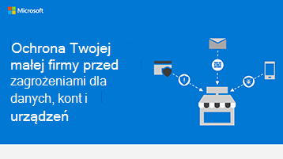

# Grafika przedstawiająca informacje zabezpieczające dla małych firm

**Podsumowanie:** Poznaj podstawowe terminy związane z zagrożeniami, jakie są dla Twojej firmy, oraz co możesz zrobić, aby chronić dane, konta i urządzenia. Jako administrator usługi Microsoft 365 dla firm, możesz podjąć działania, które mają na celu większe bezpieczeństwo firmy, i pomóc każdemu pracownikowi w większej ochronie danych biznesowych i urządzeń.

Linki do dokumentów PowerPoint PDF można pobrać i wydrukować w formacie tabloid (nazywanym również księgi głównej, 11 x 17 lub A3).

[PDF](downloads/smbthreatprotection-infographic.pdf) |  [PowerPoint](downloads/smbthreatprotection-infographic.pptx)
