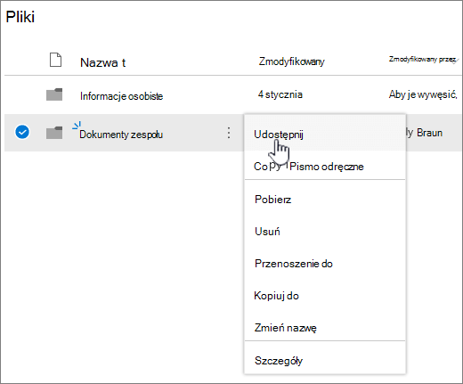
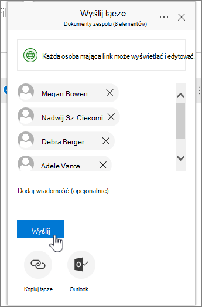

# Konfigurowanie magazynu plików i udostępniania ich w Microsoft 365

Jednym z najlepszych sposobów konfigurowania magazynu plików i udostępniania dla twojej firmy jest użycie razem OneDrive i witryny zespołu. To rozwiązanie jest idealne w przypadku małej firmy zatrudniającej kilku pracowników.

## Obejrzyj: Gdzie przechowywać pliki w Office 365

> [!VIDEO https://www.microsoft.com/videoplayer/embed/RE1FTHX] 

Jeśli ten klip wideo okazał się przydatny, poznaj [kompletną serię szkoleń dla małych firm i nowych użytkowników usługi Microsoft 365](../../business-video/index.yml).

## Microsoft 365 magazynu dokumentów i zarządzania nimi

- OneDrive jest przeznaczony do użytku indywidualnego, z okazjonalnym udostępnianiem plików.

- Witryna zespołu jest przeznaczona do regularnego udostępniania plików i współpracy nad nimi. Witryna zespołu doskonale nadaje się do przechowywania plików, które mają współdzieloną własność, gdzie kilka osób jest właścicielami plików i może nad nimi współpracować. Utwórz zespół firmy Microsoft, aby dodać witrynę zespołu. [Dowiedz się więcej na stronie Tworzenie zespołu w Teams](https://support.microsoft.com/office/174adf5f-846b-4780-b765-de1a0a737e2b).

Zarówno OneDrive, jak i witryny zespołu zapewniają dostęp w dowolnym miejscu dla Ciebie i Twoich pracowników.
  

  
Poniżej przedstawiono zalecenia dotyczące przechowywania w każdej lokalizacji podczas korzystania ze OneDrive i witryn zespołu: 

  
|Lokalizacja przechowywania|Dla czego to jest|Pliki, które należy przechowywać w tym miejscu|
|:-----|:-----|:-----|
|**OneDrive** |Przechowywanie zawartości w OneDrive jest jak przechowywanie plików na komputerze. Nikt inny nie może łatwo uzyskać do nich dostępu.  Aby uzyskać więcej informacji, zobacz [Co to jest OneDrive dla Firm?](https://support.microsoft.com/office/187f90af-056f-47c0-9656-cc0ddca7fdc2)   |Pliki firmowe, nad którymi pozostali członkowie zespołu nie muszą współpracować lub do których nie muszą mieć regularnie dostępu.  |
|**witryny zespołu SharePoint**   |Współpracy. Podczas tworzenia grupy Microsoft 365 (na przykład w Centrum administracyjne platformy Microsoft 365, w Outlook lub przez utworzenie zespołu w Microsoft Teams) zostanie utworzona witryna zespołu SharePoint dla tej grupy. Podobnie podczas tworzenia nowej witryny zespołu SharePoint na stronie głównej SharePoint lub w nowym centrum administracyjnym SharePoint tworzy również grupę Microsoft 365. Aby uzyskać więcej informacji, zobacz [Co to jest witryna zespołu SharePoint?](https://support.microsoft.com/office/75545757-36c3-46a7-beed-0aaa74f0401e) i [Tworzenie witryny zespołu w usłudze SharePoint Online](https://support.microsoft.com/office/ef10c1e7-15f3-42a3-98aa-b5972711777d).    |Pliki, które mają współwłasność. Zalecamy oddzielne witryny zespołu dla każdej jednostki pracy w organizacji. Aby na przykład zachować prywatną obsługę personelu i dokumentów finansowych dla małego zespołu, utwórz oddzielną witrynę zespołu.    |

> [!NOTE]
> SharePoint ma również inne typy witryn, których możesz użyć dla swojej firmy. Witryny [komunikacji](https://support.microsoft.com/office/7fb44b20-a72f-4d2c-9173-fc8f59ba50eb) w intranecie umożliwiają publikowanie informacji dla szerokiego grona odbiorców. Lokacje [piasty](https://support.microsoft.com/office/fe26ae84-14b7-45b6-a6d1-948b3966427f) umożliwiają łączenie lokacji w intranecie.
  
## Rozpoczynanie korzystania z OneDrive i witryny zespołu

### Członkowie zespołu mogą przechowywać własne pliki w OneDrive

Każda osoba w Twojej firmie, która ma przypisaną licencję Microsoft 365 (i wybrano SharePoint Online), otrzymuje OneDrive magazynu w chmurze. W tym miejscu mogą przechowywać pliki związane z działalnością biznesową w celu uzyskania dostępu z dowolnego urządzenia i są dostępne tylko dla tego użytkownika. Na przykład mogą przechowywać w nim wersje robocze ofert, notatki ze spotkań lub skrypty pokazów, które zamierzają przeprowadzić.
  
Pracownicy mogą również udostępniać pliki i foldery OneDrive. Jeśli pracownik nie działa lub opuszcza firmę, inni mogą uzyskiwać dostęp do udostępnionych plików przechowywanych w OneDrive (OneDrive udostępniania folderów zespołu).
  
Oto jak każda osoba w twoim zespole może skonfigurować OneDrive i udostępniać pliki.

1. Przejdź do <a href="https://admin.microsoft.com/ " target="_blank">Centrum administracyjne platformy Microsoft 365</a> i zaloguj się przy użyciu nazwy użytkownika i hasła.

2. W programie uruchamiania aplikacji wybierz pozycję **OneDrive**.

3. W OneDrive członkowie zespołu mogą przechowywać własne pliki związane z działalnością biznesową. Możesz udostępnić pojedyncze pliki lub cały folder. Wybierz plik lub folder, kliknij prawym przyciskiem myszy, a następnie wybierz pozycję **Udostępnij**.

    
  
4. Na stronie **Wyślij link** pozostaw domyślny wybór **Każdy, kto ma link, może wyświetlać i edytować**.

    Wpisz nazwy lub adresy e-mail członków zespołu, którzy mają mieć dostęp do folderu, i dodaj opcjonalną wiadomość.

    Jeśli chcesz mieć własną kopię wiadomości e-mail, która zostanie wysłana, dodaj swój adres e-mail do listy.

    
  
5. Po zakończeniu wprowadzania osób, którym chcesz udostępnić, wybierz pozycję **Wyślij**. Wiadomość e-mail zostanie natychmiast wysyłana do zaproszonych osób.

    
  
6. Oto jak wygląda wiadomość e-mail. 

    
  
### Przekazywanie plików do witryny zespołu na potrzeby współpracy online

Witryny zespołu mają miejsce do przechowywania plików, nazywane biblioteką dokumentów.  
  
Poniżej przedstawiono kroki dodawania plików:
  
1. Na stronie głównej witryny zespołu wybierz pozycję **Dokumenty** z menu nawigacji po lewej stronie. Spowoduje to przejście do **biblioteki Dokumenty**.
  
2. Po zalogowaniu się do Microsoft 365 otwórz Windows **Eksplorator plików** z paska zadań lub innej lokalizacji. Przejdź do plików, które chcesz przekazać do witryny zespołu.

3. Wybierz pliki, które chcesz przekazać do witryny zespołu, a następnie przeciągnij je do **biblioteki dokumentów**.
  
4. Po wykonaniu tej czynności pliki będą przechowywane zarówno w witrynie zespołu, jak i na Twoim komputerze.
  
5. Możesz usunąć pliki z komputera. W następnym kroku [, Synchronizuj pliki online z komputerem PC lub Mac](#sync-online-files-with-your-pc-or-mac), utworzysz nową lokalizację dla tych plików na komputerze.

    Jeśli masz wiele plików lub dużych plików do przekazania do witryny zespołu, przeczytaj te wskazówki dotyczące [przekazywania dużych lub wielu plików do biblioteki](https://support.microsoft.com/office/da549fb1-1fcb-4167-87d0-4693e93cb7a0#__toc384119242).

    Jeśli potrzebujesz więcej miejsca do magazynowania, zobacz [Zmienianie ilości miejsca do magazynowania dla subskrypcji](../../commerce/add-storage-space.md).

### Synchronizowanie plików online z komputerem PC lub Mac

Teraz, gdy masz już pliki w witrynie zespołu, możesz skonfigurować je tak, aby były synchronizowane z komputerem PC lub Mac. Dzięki temu możesz pracować nad plikami z komputera PC lub Mac zamiast pracować w Microsoft Edge, Chrome lub innej przeglądarce. Pliki zsynchronizowane na komputerze przydają się także w sytuacji, gdy musisz skorzystać z pliku, a nie masz dostępu do Internetu.
  
Po skonfigurowaniu plików do synchronizacji z komputerem po nawiązaniu połączenia z Internetem zostaną one automatycznie zsynchronizowane.
  
Poniżej przedstawiono sposób synchronizowania plików w witrynie zespołu z komputerem:
  
1. Na stronie głównej witryny zespołu wybierz pozycję **Dokumenty** z menu nawigacji po lewej stronie. Spowoduje to przejście do biblioteki dokumentów.

    > [!TIP]
    > Podczas synchronizowania plików w witrynie zespołu synchronizujesz każdą bibliotekę plików w witrynie, a nie całą witrynę.
  
2. Wybierz pozycję **Synchronizuj** , aby zsynchronizować wszystkie pliki. Możesz też przejść do określonego folderu, który chcesz zsynchronizować.

3. Jeśli zostanie wyświetlony monit o przełączenie aplikacji, wybierz pozycję **Tak**. OneDrive jest procesem synchronizacji.
  
4. Jeśli otrzymasz monit **o skonfigurowanie OneDrive**, zaloguj się przy użyciu konta służbowego.

    
  
5. Jeśli nie zsynchronizowano jeszcze OneDrive, może zostać wyświetlony ekran **Folder OneDrive**. Sprawdź ścieżkę w obszarze **Folder OneDrive znajduje się tutaj**. Wybierz pozycję **Zmień lokalizację** , jeśli chcesz użyć innej ścieżki, a następnie wybierz pozycję **Dalej**.

    
  
6. Pliki w witrynach zespołu zostaną wyświetlone w lewym okienku Eksplorator plików pod nazwą organizacji. Pliki w OneDrive zostaną wyświetlone w obszarze "OneDrive - \<Name of Organization\>"

    
  
7. Przetestuj synchronizację, otwierając plik w folderze zespołu na komputerze. Wprowadź zmianę, a następnie wybierz polecenie **Zapisz**.

## Najważniejsze wskazówki dotyczące przechowywania i udostępniania plików

Poniżej przedstawiono kilka wskazówek dotyczących jak najlepszego uzyskania możliwości z OneDrive lub witryny zespołu SharePoint.
  
### Zalecenia dotyczące przechowywania plików i współpracy nad nimi w przypadku innych rodzajów małych firm

- **Jednoosobowe firmy**: używaj OneDrive do przechowywania własnych plików i udostępniania ich klientom indywidualnie.

- **Współwłasności**: Obaj właściciele używają OneDrive i udostępniają pliki tam iz powrotem.

- **Firmy z klientami zewnętrznymi lub partnerami, którzy potrzebują dostępu do plików**: utwórz nową witrynę zespołu do przechowywania i udostępniania dokumentów przeznaczonych dla określonego klienta. Skonfiguruj witrynę, aby zezwolić na dostęp tylko do tego klienta. Nie musisz więc martwić się, że jeden klient przypadkowo uzyska dostęp do informacji przeznaczonych dla innego klienta.

### Zachowywanie prywatności plików osobistych

Podczas przechowywania pliku w OneDrive jest on dostępny tylko dla Ciebie, chyba że udostępnisz go innym osobom. Podczas udostępniania plików można utworzyć link, który można przekazać dalej, lub udostępnić tylko określonym osobom. Można również tworzyć oddzielne foldery w OneDrive do różnych celów, takich jak publiczne, osobiste lub dla poszczególnych projektów. Każdy folder może być udostępniany innej osobie lub grupie albo nikomu innemu.
  
Aby uzyskać więcej informacji na temat udostępniania, zobacz [również Udostępnianie plików i folderów za pomocą Microsoft 365](https://support.microsoft.com/office/72f26d6c-bf9e-432c-8b96-e3c2437f5b65).
  
### Śledzenie pozostałej ilości miejsca

Aby zobaczyć, ile miejsca do magazynowania pozostało w OneDrive, zobacz [Zarządzanie magazynem OneDrive dla Firm](https://support.microsoft.com/office/31519161-059C-4764-B6F8-F5CD29F7FE68).
  
### Jakie pliki mogą być przechowywane w OneDrive i w witrynie zespołu?

Chociaż można przekazać prawie wszystkie typy plików, niektóre nazwy plików i znaki w nazwach plików nie są dozwolone. Aby uzyskać więcej informacji, zobacz [Nieprawidłowe znaki plików i typy plików w OneDrive dla Firm](https://support.microsoft.com/office/64883A5D-228E-48F5-B3D2-EB39E07630FA).
  
### Włączanie lub wyłączanie usług magazynu innych firm

Możesz włączyć magazyn innych firm dla użytkowników w Microsoft 365, aby mogli oni przechowywać i udostępniać dokumenty przy użyciu usług takich jak Dropbox oprócz OneDrive i witryn zespołowych. Może to być doskonałym sposobem na udostępnienie użytkownikom już używanych lub preferowanych usług do projektów biznesowych. Jeśli nie chcesz, aby osoby w organizacji używające Office otwierały pliki w usłudze innej firmy, wykonaj te kroki, aby je wyłączyć.
  
> [!IMPORTANT]
> Magazyn innych firm jest domyślnie włączony, dlatego należy wykonać te kroki od razu, jeśli nie chcesz, aby był on dostępny dla użytkowników.
  
1. Zaloguj się do <a href="https://go.microsoft.com/fwlink/p/?linkid=2024339" target="_blank">centrum administracyjnego</a>.

2. Przejdź do strony **ustawień organizacji** \> Ustawienia.

3. Na karcie **Usługi** wybierz pozycję **Office w sieci Web**.

4. Zaznacz lub usuń zaznaczenie pola wyboru, aby włączyć lub wyłączyć magazyn innej firmy, a następnie wybierz pozycję **Zapisz zmiany**.

## Następne kroki

- [Dostosuj witrynę zespołu do przechowywania i udostępniania plików](customize-team-site.md). W tym samouczku krok po kroku pokazano, jak korzystać z dodatkowych funkcji przechowywania i współpracy.

- **Skonfiguruj aplikacje pakietu Office na tabletach i telefonach**. Należy to zrobić, aby można **było edytować** pliki przechowywane w OneDrive i w witrynach zespołu z poziomu tabletu lub telefonu. Jeśli nie zainstalujesz aplikacji Office dla tabletu lub telefonu, będziesz mieć możliwość wyświetlania plików, ale nie będziesz ich edytować.

  - [Instalowanie i konfigurowanie Office na Android przy użyciu Microsoft 365](https://support.microsoft.com/office/cafe9d6f-8b0c-4b03-b20a-12438a82a22d)

  - [Instalowanie i konfigurowanie Office na iPhone lub iPad przy użyciu Microsoft 365](https://support.microsoft.com/office/9df6d10c-7281-4671-8666-6ca8e339b628)

  - [Konfigurowanie Office na Windows Phone przy użyciu Microsoft 365](https://support.microsoft.com/office/2b7c1b51-a717-45d6-90c9-ee1c1c5ee0b7)

## Zawartość pokrewna

[Dodawanie miejsca do magazynowania dla subskrypcji](../../commerce/add-storage-space.md) (artykuł)\
[Udostępnianie plików i folderów Microsoft 365 Business](https://support.microsoft.com/office/share-files-and-folders-with-microsoft-365-business-72f26d6c-bf9e-432c-8b96-e3c2437f5b65) (wideo)\
[Dostosowywanie witryny zespołu do przechowywania i udostępniania plików](customize-team-site.md) (artykuł)
