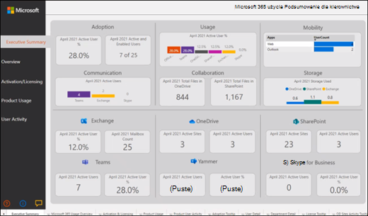

# Połączenie dane Microsoft 365 Government Community Cloud (GCC) za pomocą analizy użycia

Skorzystaj z poniższych procedur, aby połączyć się z danymi za pomocą raportu analizy Microsoft 365 użycia w dzierżawie usługi Microsoft 365 Government Community Cloud (GCC). 

> [!NOTE]
> Te instrukcje są przeznaczone specjalnie Microsoft 365 GCC dzierżaw. 

## Przed rozpoczęciem

Aby wstępnie skonfigurować analizę Microsoft 365 użycia: 

- Aby włączyć zbieranie danych, Microsoft 365 administrator globalny. 
- Do [używania pliku Power BI Desktop](https://powerbi.microsoft.com/en-us/desktop/) potrzebujesz aplikacji szablonu. 
- Do publikowania [i Power BI Pro wyświetlania raportu](https://go.microsoft.com/fwlink/p/?linkid=845347) Premium potrzebujesz licencji lub licencji. 

## Krok 1. Udostępnij dane organizacji do raportu analizy Microsoft 365 użycia

1. W centrum administracyjne platformy Microsoft 365 nawigacji rozwiń menu nawigacji, wybierz pozycję **Raporty**, a następnie wybierz pozycję **Użycie**. 
2. Na stronie **Raporty** użycia w sekcji Analiza Microsoft 365 użycia **wybierz pozycję Wprowadzenie**. 
3. W **obszarze Power BI analizy** użycia zaznacz pole wyboru Udostępnij dane użycia organizacji do analizy użycia firmy Microsoft dla Power BI, **a** następnie wybierz pozycję **Zapisz**.

     

    Spowoduje to rozpoczęcie procesu tworzenia danych organizacji z ułatwieniami dostępu do tego raportu i pojawi się komunikat o przygotowaniu danych do analizy użycia Microsoft 365 **użycia**. Pamiętaj, że ten proces może potrwać 24 godziny. 

4. Gdy dane organizacji będą gotowe, odświeżenie strony spowoduje pokazanie komunikatu informjącego, że dane są teraz dostępne, oraz numeru **identyfikacyjnego** dzierżawy. Identyfikator dzierżawy trzeba będzie użyć w kolejnym kroku podczas próby nawiązania połączenia z danymi dzierżawy. 
 
     
 
    > [!IMPORTANT]
    > Gdy twoje dane będą dostępne, nie wybieraj opcji **Przejdź do witryny Power BI**, co spowoduje Power BI Marketplace.  Aplikacja szablonów dla tego raportu wymagana przez GCC nie jest dostępna w witrynie Power BI Marketplace.  

## Krok 2. Pobieranie szablonu Power BI, łączenie się z danymi i publikowanie raportu

Microsoft 365 GCC użytkownicy mogą pobrać plik szablonu raportu analizy Microsoft 365 i używać go do łączenia się ze swoimi danymi. Plik szablonu Power BI Desktop otworzyć i użyć go. 

 > [!NOTE]
 > Obecnie aplikacja szablonów dla raportu analizy Microsoft 365 użycia nie jest dostępna dla GCC dzierżaw w witrynie Power BI Marketplace.  

1. Po pobraniu [szablonu Power BI](https://download.microsoft.com/download/7/8/2/782ba8a7-8d89-4958-a315-dab04c3b620c/Microsoft%20365%20Usage%20Analytics.pbit) otwórz go przy użyciu Power BI Desktop. 
2. Gdy zostanie wyświetlony monit o podanie identyfikatora **dzierżawy**, wprowadź identyfikator dzierżawy otrzymany podczas przygotowania danych organizacji do tego raportu w kroku 1. Następnie wybierz pozycję **Załaduj**. Załadowanie danych zajmie kilka minut. 

     

3. Po zakończeniu ładowania zostanie wyświetlony raport z podsumowaniem danych dla kierownictwa. 

     
 

4. Zapisz zmiany w raporcie. 
5. Wybierz **pozycję** Publikuj w menu Power BI Desktop, aby opublikować raport w Power BI online usługi, w której można go wyświetlać. Wymaga to licencji Power BI Pro lub Power BI Premium wydajności. W ramach procesu [publikowania](/power-bi/create-reports/desktop-upload-desktop-files#to-publish-a-power-bi-desktop-dataset-and-reports) należy wybrać miejsce docelowe do publikowania w dostępnym obszarze roboczym w usłudze Power BI Online.

## Zawartość pokrewna

[Analiza użycia informacje](usage-analytics.md)  
[Uzyskiwanie najnowszej wersji analizy użycia](get-the-latest-version-of-usage-analytics.md)  
[Nawigowanie po raportach i korzystanie z nich Microsoft 365 analizy użycia](navigate-and-utilize-reports.md)  