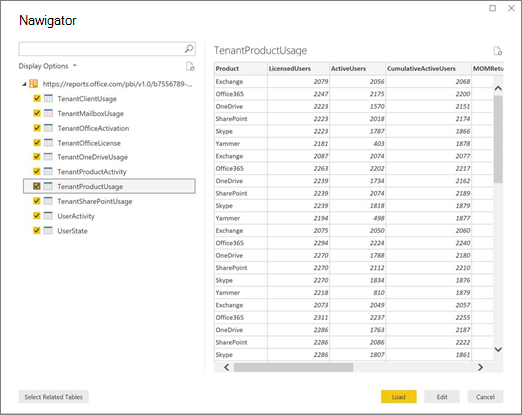

# Dostosowywanie raportów w pakiecie analizy użycia platformy Microsoft 365

Microsoft 365 analizy użycia udostępnia pulpit nawigacyjny w aplikacji Power BI który zawiera szczegółowe informacje o tym, w jaki sposób użytkownicy korzystają z Microsoft 365. Pulpit nawigacyjny stanowi punkt wyjścia do interakcji z danymi dotyczącymi użycia. Raporty można dostosować w celu uzyskiwania bardziej spersonalizowanych analiz.

Program Power BI Desktop pozwala na dalsze dostosowanie raportów przez łączenie ich z innymi źródłami danych w celu uzyskania bardziej szczegółowych informacji o firmie.

## Dostosowywanie raportów w przeglądarce

Dwa poniższe przykłady pokazują sposób modyfikowania istniejących wizualizacji oraz tworzenia nowych wizualizacji.

### Modyfikowanie istniejącej wizualizacji

W tym przykładzie pokazano, jak zmodyfikować **kartę Aktywacja** w raporcie **Aktywacja/licencjonowanie** .

1. W **raporcie Aktywacja/licencjonowanie** wybierz **kartę Aktywacja** .

2. W tryb edycji wybierz przycisk Edytuj znajdujący  się w górnej  przycisk.

    

3. W prawym górnym rogu wybierz pozycję **Duplikuj tę stronę**.

    

4. W prawym dolnym rogu wybierz dowolny z wykresów słupkowych przedstawiający liczbę użytkowników aktywujących się na podstawie systemu operacyjnego, takiego jak Android, iOS, Mac itp.

5. W obszarze **Wizualizacje** po prawej stronie wybierz znak **X** obok wizualizacji, aby usunąć z wizualizacji pozycję **Liczba komputerów Mac**.

    

### Tworzenie nowej wizualizacji

W poniższym przykładzie pokazano, jak utworzyć nową wizualizację do comiesięcznego śledzenia nowych użytkowników usługi Yammer.

1. Przejdź do raportu **Użycie produktu przy** użyciu lewej funkcji naw i wybierz **kartę** Yammer produktu.

2. Przełącz się do trybu edycji, wybierając  i **edytuj**.

3. U dołu strony wybierz przycisk  w celu utworzenia nowej strony.

4. W obszarze **Wizualizacje** po prawej stronie wybierz pozycję **Skumulowany wykres słupkowy** (górny wiersz, pierwszy od lewej).

    

5. Zaznacz prawy dolny obszar wizualizacji i przeciągnij, aby ją powiększyć.

6. W obszarze **Pola** po prawej stronie rozwiń **tabelę Kalendarz** .

7. Przeciągnij pozycję **Nazwa miesiąca** do obszaru pól bezpośrednio poniżej nagłówka **Oś** w obszarze **Wizualizacje**.

    

8. W obszarze **Pola** po prawej stronie rozwiń tabelę **Użycie produktu w dzierżawie**.

9. Przeciągnij pozycję **Użytkownicy korzystający 1. raz** do obszaru pól bezpośrednio poniżej nagłówka **Wartość**.

10. Przeciągnij pozycję **Produkt** do obszaru **Filtry** bezpośrednio poniżej nagłówka **Filtry na poziomie elementu wizualnego**.

11. W wyświetlonym obszarze **Typ filtru** zaznacz pole wyboru **Yammer**.

    

12. Tuż poniżej listy wizualizacji wybierz ikonę **Formatuj** .

13. Rozwiń tytuł i zmień wartość w pozycji **Tekst tytułu** na **Nowi użytkownicy usługi Yammer według miesięcy**.

14. Zmień wartość w pozycji **Rozmiar tekstu** na **12**.

15. Zmień tytuł nowej strony, edytując jej nazwę w prawym dolnym rogu.

16. Aby zaoszczędzić raport, kliknij pozycję **Widok do** czytania u góry, a następnie pozycję **Zapisz**.

## Dostosowywanie raportów w programie Power BI Desktop

Dla większości klientów możliwość modyfikowania raportów i wizualizacji wykresów w usłudze Power BI Web będzie wystarczająca. Niektórzy klienci mogą mieć jednak potrzebę połączenia tych danych z innymi źródłami danych w celu uzyskania bardziej rozbudowanych informacji kontekstowych o firmie. W takim przypadku mogą oni dostosowywać oraz tworzyć dodatkowe raporty przy użyciu programu Power BI Desktop. Program [Power BI Desktop](https://go.microsoft.com/fwlink/p/?linkid=849797) można pobrać bezpłatnie.

### Używanie interfejsów API raportowania

Możesz rozpocząć od bezpośredniego połączenia z interfejsami API raportowania ODATA z Microsoft 365 tych raportów.

1. Przejdź do pozycji **Pobierz dane** \> **Inne** \> **Źródło strumieniowe ODATA** \> **Połącz**.

2. W oknie adresu URL wpisz "https://<i></i> reports.office.com/pbi/v1.0/\<tenantid\>"

    **UWAGA:** Interfejsy API raportowania są w wersji Preview i mogą ulec zmianie do czasu, aż zostaną do produkcji.

    

3. Wprowadź poświadczenia administratora Microsoft 365 organizacji (organizacji lub szkoły), aby uwierzytelnić się Microsoft 365 po wyświetleniu monitu.

    Zobacz Często [zadawane pytania](usage-analytics.md#faq), aby uzyskać więcej informacji na temat użytkowników, którzy mają dostęp do raportów Microsoft 365 szablonu przyjęcia.

4. Po dokonaniu autoryzacji połączenia zostanie wyświetlone okno Nawigator zawierające zestawy danych dostępne pod kątem nawiązania połączenia.

    Zaznacz wszystko i wybierz pozycję **Załaduj**.

    Spowoduje to pobranie danych do programu Power BI Desktop. Zapisz ten plik, a następnie możesz rozpocząć tworzenie wymaganych raportów.

    

### Korzystanie z szablonu analizy użycia platformy Microsoft 365

Możesz także użyć szablonu usługi Power BI, odpowiadającego raportom analizy użycia platformy Microsoft 365, jako punktu wyjścia do nawiązania połączenia z danymi. Zaletą korzystania z pliku pbit jest to, że zawiera on już parametry połączenia. Oprócz danych zwracanych przez schemat podstawowy skorzystać można dodatkowo ze wszystkich niestandardowych miar, które są tworzone, i użyć ich do dalszej rozbudowy.

Możesz pobrać plik Power BI z [Centrum pobierania Microsoft](https://download.microsoft.com/download/7/8/2/782ba8a7-8d89-4958-a315-dab04c3b620c/Microsoft%20365%20Usage%20Analytics.pbit). Po pobraniu pliku Power BI, wykonaj następujące czynności, aby rozpocząć:

1. Otwórz plik pbit.

2. W oknie dialogowym wprowadź wartość swojego identyfikatora dzierżawy.

    

3. Wprowadź poświadczenia administratora, aby uwierzytelnić się Microsoft 365 po wyświetleniu monitu.

     , aby uzyskać więcej informacji o tym, kto ma dostęp do raportów analizy Microsoft 365 użycia.

    Po dokonaniu autoryzacji dane w pliku usługi Power BI zostaną odświeżone.

    Załadowanie danych może zająć trochę czasu, po jego zakończeniu możesz zapisać plik jako plik pbix i kontynuować dostosowywanie raportów lub dodać dodatkowe źródło danych do raportu.

4. Zapoznaj się z dokumentacją [Wprowadzenie do usługi Power BI](/power-bi/fundamentals/desktop-getting-started), aby dowiedzieć się, jak tworzyć raporty, publikować je w usłudze Power BI i udostępniać w ramach organizacji. Wykonanie niniejszej procedury dostosowywania i udostępniania może wymagać dodatkowych licencji usługi Power BI. Aby uzyskać szczegółowe informacje, zobacz [wskazówki dotyczące licencjonowania](https://go.microsoft.com/fwlink/p/?linkid=849803) usługi Power BI.
