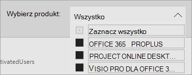

# Nawigowanie po raportach i korzystanie z nich w pakiecie analizy użycia platformy Microsoft 365

Pulpit nawigacyjny zawiera krótki przegląd głównych metryk użycia i wdrażania. Wybierając metryki najwyższego poziomu, możesz uzyskać dostęp do raportów, które zawierają więcej szczegółowych informacji i szczegółowych informacji. Każda karta raportów zawiera wizualizacje danych specyficzne dla danego aspektu używania i wdrażania usługi w organizacji. Zebrane dane wyjaśniono w tytule każdego raportu, a na karcie wyświetlanego raportu jest wyświetlany kafelek zawierający dodatkowe informacje o wizualizacjach.

Oto kilka porad ułatwiających rozpoczęcie pracy z raportami:

- Użyj kart nawigacji po lewej stronie lub powiązanej metryki na stronie Podsumowanie dla kierownictwa **, aby** przejść do każdego raportu najwyższego poziomu.

    

- Użyj kart nawigacji u góry każdego raportu najwyższego poziomu, aby przechodzić do różnych raportów na tym poziomie.

    

- Wiele raportów zawiera fragmentator pozwalający na filtrowanie według produktu AAD atrybutu lub działania, które chcesz wyświetlić. Można wybrać jeden lub wiele opcji.

    

    

- Umieść wskaźnik myszy na punkcie danych, aby wyświetlić objaśnienie ze szczegółowymi informacjami.

    

Użytkownik, który utworzyć wystąpienia aplikacji szablonu, będzie miał możliwość dostosowania raportu do swoich potrzeb. Aby dostosować aplikację szablonu:

- Wybierz **pozycję Edytuj** raport u góry raportu.

    

- Utwórz własne elementy wizualne za pomocą źródłowych [zestawów danych](usage-analytics-data-model.md).

- Użyj Power BI Desktop, aby mieć własne źródła danych.

Aby udostępnić raporty, po prostu wybierz przycisk udostępniania  w górnej części strony.

Aby dowiedzieć się, jak dostosowywać raporty, zobacz [Dostosowywanie raportów w pakiecie analizy użycia platformy Microsoft 365](customize-reports.md).

Szereg dodatkowych informacji można znaleźć w dokumentacji pomocy usługi Power BI:

- [Power BI podstawowe pojęcia](/power-bi/service-basic-concepts)

    Poznaj pulpit nawigacyjny, zestawy danych, raporty i Power BI podstawowe pojęcia.

- [Wprowadzenie do usługi Power BI](/power-bi/service-get-started?wt.mc_id=O365_Reports_PBI_contentpack)

    Zapoznaj się z podstawowymi funkcjami w usłudze Power BI. Znajdź linki do informacji o tym, jak używać programu Power BI Desktop.

- [Udostępnianie pulpitów nawigacyjnych i raportów](/power-bi/service-share-dashboards)

    Dowiedz się, jak udostępniać raporty współpracownikom lub osobom spoza organizacji. Można także udostępnić raport lub filtrowaną wersję raportu.