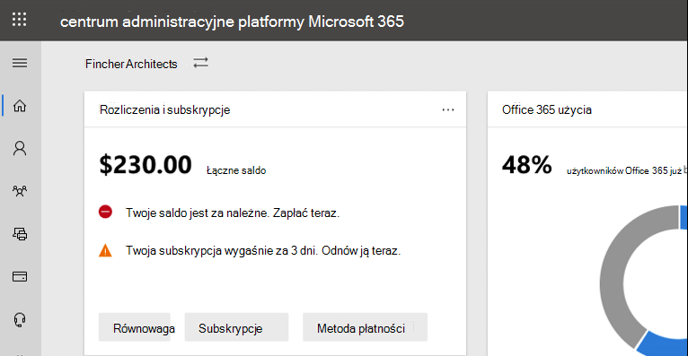

# Co nowego w centrum administracyjne platformy Microsoft 365

::: moniker range="o365-21vianet"

> [!NOTE]
> Niektóre informacje w tym artykule mogą nie mieć zastosowania do Office 365 obsługiwanej przez firmę 21Vianet.

::: moniker-end

Nieustannie dodajemy nowe funkcje do interfejsu użytkownika [centrum administracyjne platformy Microsoft 365](Omówienie centrum administracyjne platformy Microsoft 365](admin-overview/admin-center-overview.md), naprawiamy informacje o problemach i wprowadzamy zmiany na podstawie opinii użytkowników. Zapoznaj się z poniższymi instrukcjami, aby zobaczyć, co jest dostępne już dzisiaj. Niektóre funkcje są dostępne dla klientów z różną szybkością. Jeśli jeszcze nie widzisz funkcji, spróbuj dodać siebie do [wersji docelowej](manage/release-options-in-office-365.md).

Jeśli chcesz dowiedzieć się, co nowego w innych usługach firmy Microsoft w chmurze:

- [Co nowego w programie Azure Active Directory](/azure/active-directory/fundamentals/whats-new)
- [Co nowego w centrum Exchange administracyjnego](/Exchange/whats-new)
- [Co nowego w programie Microsoft Intune](/mem/intune/fundamentals/whats-new)
- [Co nowego w Centrum zgodności platformy Microsoft 365](/Office365/SecurityCompliance/whats-new)
- [Co nowego w programie Microsoft 365 Defender](../security/mtp/whats-new.md)
- [Co nowego w centrum administracyjnym SharePoint administracyjnego](/sharepoint/what-s-new-in-admin-center)
- [Office aktualizacji](/OfficeUpdates/)
- [Jak sprawdzić kondycję Windows wersji](/windows/deployment/update/check-release-health)

## Luty 2022 r.

### Szczegółowe informacje o wynikach ankiety Net Promoter Score (NPS)

Teraz możesz wyświetlać dane z ankiet np. i szczegółowe informacje od użytkowników w centrum administracyjne platformy Microsoft 365. Za pomocą tej nowej funkcji możesz uzyskiwać szczegółowe informacje z ankiet NPS od użytkowników końcowych, aby uzyskać szczegółowe informacje z możliwością działania, i zadowolenie użytkowników końcowych dzięki rozwiązaniu problemów i problemów.

W centrum administracyjnym przejdź do strony **Informacje o ankietach** z ankiety **HealthProductNPS** >  > .

:::image type="content" source="../media/feedback-whatsnew.png" alt-text="Zrzut ekranu: wyświetlanie strony opinii w centrum administracyjne platformy Microsoft 365":::

Zidentyfikowaliśmy typowe motywy na stronie opinii użytkowników. Następnie używaliśmy technik modeli uczenia maszynowego w celu szkolenie zestawów danych i automatyczne organizowanie opinii w tematy na początku.

Dostępnych jest dziewięć tematów. Zobacz więcej tematów w przyszłych aktualizacjach.

:::image type="content" source="../media/feedback-nine-topics.png" alt-text="Zrzut ekranu: pokazywanie 9 nowych tematów opinii":::

Pulpit nawigacyjny szczegółowych informacji o programie nps zawiera również trzy nowe raporty i tabele przestawne:

- Miesięczny trend NPS z ostatnich 12 miesięcy
- Możliwość identyfikowania pasywnych, wywłaszczeń i detrtratorów
- Liczba woluminów nps na platformę i aplikację

Aby zapewnić ci lepsze środowisko korzystania z pulpitu nawigacyjnego szczegółowych informacji z ankiety NPS:

- Zachęcaj użytkowników końcowych do przesyłania opinii
- Potwierdzanie, że zasady dotyczące ankiet w produktach są włączone
- Popraw diagnostykę, włączając Raportowanie błędów systemu Windows

Dowiedz się więcej na stronie [Informacje zwrotne dotyczące nps produktów firmy Microsoft i szczegółowe informacje dla Twojej organizacji](manage/manage-feedback-product-insights.md).  

> [!NOTE]
> Jeśli chcesz dołączyć do sesji projektowania, wyślij nam wiadomość e-mail na adres: prosight@microsoft.com

### centrum administracyjne platformy Microsoft 365 wideo

Zaktualizowaliśmy nasze centrum administracyjne platformy Microsoft 365 wideo. Przejdź do strony [szkoleniowej biblioteki wideo](admin-video-library.yml) dla administratorów, aby dowiedzieć się, jak skonfigurować bibliotekę wideo dla swojej firmy i Microsoft 365 zarządzać nimi.

:::image type="content" source="../media/admin-library-vid-training.png" alt-text="Zrzut ekranu: wyświetlanie biblioteki szkoleń wideo centrum administracyjnego":::

## Lipiec 2021

### centrum administracyjne platformy Microsoft 365 wyszukiwania

Teraz możesz wyszukiwać identyfikatory zdarzeń <a href="https://go.microsoft.com/fwlink/p/?linkid=2091030" target="_blank">w centrum administracyjne platformy Microsoft 365.</a> Informacje o bieżących zdarzeniach można uzyskać za pośrednictwem mediów społecznościowych, publikacji branżowych lub innych administratorów. Teraz możesz przejść do centrum administracyjnego, aby uzyskać więcej szczegółowych informacji na temat zdarzenia i zrozumieć skutki dla Twojej organizacji. Wystarczy wyszukać identyfikator zdarzenia w centrum administracyjnym.

:::image type="content" source="../media/incident-id.png" alt-text="Zrzut ekranu: wyszukiwanie identyfikatora zdarzenia w centrum administracyjnym":::

### Szczegółowe informacje o biletach pomocy technicznej dla organizacji Premier

Dodaliśmy 2 wykresy nazywane **trendem** obrotu i **trendem** obrotu według produktu, aby zapewnić Ci wizualną analizę wielkości pomocy technicznej.

Wykres liniowy na karcie Trend obrotu wyróżnia **ten** trend, jeśli liczba przypadków pomocy technicznej jest rosnąca lub malejąca w organizacji z miesiąca na miesiąc. Możesz zatrzymać wskaźnik myszy na wykresie, aby sprawdzić liczbę spraw pomocy technicznej utworzonych w każdym miesiącu.

:::image type="content" source="../media/SuppInsight-voltrnd.PNG" alt-text="Zrzut ekranu: Graph, który wyróżnia trend, jeśli liczba spraw pomocy technicznej wzrasta lub maleje w organizacji z miesiąca na miesiąc":::

Wykres **Trend obrotu według produktu** przedstawia 3 pierwsze produkty każdego miesiąca z najwyższymi liczbami pomocy technicznej. Włączono filtrowanie w tabeli i teraz możesz filtrować wyniki według **produktu**, **ważności i** **daty**.

:::image type="content" source="../media/SuppInsight-voltrndproduct.PNG" alt-text="Zrzut ekranu: Graph pokazuje 3 pierwsze produkty każdego miesiąca z najwyższymi sprawami pomocy technicznej":::

Dodaliśmy również 2 nowe **pola, Data** ważności i Data zamknięcia w  tabeli Wyświetl żądanie usługi, aby uzyskać więcej informacji o biletach.

:::image type="content" source="../media/SuppInsight-date-sev.PNG" alt-text="Zrzut ekranu: tabela, w która przedstawiono sortowanie biletu pomocy technicznej według ważności i daty.":::

Aby sprawdzić te aktualizacje w <a href="https://go.microsoft.com/fwlink/p/?linkid=2166757" target="_blank">programie centrum administracyjne platformy Microsoft 365</a>, przejdź do strony **Żądania usługi SupportView** >  **Service w** okienku nawigacji po lewej stronie.

## Czerwiec 2021

### centrum administracyjne platformy Microsoft 365 wyszukiwania

Dodaliśmy kilka nowych kategorii do funkcji wyszukiwania.

- Teraz możesz wyszukiwać role Microsoft 365 w wyszukiwaniu globalnym oraz szybko wyświetlać przypisania ról i zarządzać nimi z dowolnej strony. Na przykład wyszukaj administrator **usługi Intune**.

- Teraz możesz znaleźć uproszczone środowisko konfiguracji za pomocą wyszukiwania globalnego. Dzięki temu Ty i Twój zespół możecie szybko rozpocząć korzystanie z nowych funkcji. Na przykład wyszukaj hasło tak, **aby nigdy nie wygasło**.

Aby dowiedzieć się więcej o wyszukiwaniu w centrum administracyjnym, zobacz [Wyszukiwanie w centrum administracyjne platformy Microsoft 365](manage/search-in-the-mac.md).

## Maj 2021

### Aplikacja mobilna Administrator

### Śledź aktualizacje biletów do pomocy technicznej za pomocą aplikacji mobilnej Administrator

W przypadku wszystkich żądań usługi utworzonych w dzierżawie możesz teraz śledzić stan biletu, wyświetlać szczegóły biletu i dostarczać /żądać dodatkowych informacji, dodając uwagi & załączników.

:::image type="content" source="../media/Keep-track-support-ticket-updates2.PNG" alt-text="Zrzut ekranu: śledzenie aktualizacji biletu pomocy technicznej":::

### Zachowaj dostęp do wszystkich najważniejszych aktualizacji aplikacji i subskrypcji usługi Microsoft 365 subskrypcji

- Zachowaj dostęp do wszystkich najważniejszych aktualizacji subskrypcji usługi Microsoft 365 wiadomości za pośrednictwem powiadomień wypychanych w Centrum wiadomości (teraz domyślnie włączone).

- Śledź najnowsze funkcje dostępne w aplikacji za pomocą sekcji **Co nowego.** Przejdź do **Ustawienia** >  **Co nowego?**

:::image type="content" source="../media/Stay-on-top-of-updates.PNG" alt-text="Zrzut ekranu: śledzenie głównych aktualizacji i funkcji":::

## Kwiecień 2021

### Aplikacja mobilna Administrator

### Zarządzanie licencjami i rozliczeniami z aplikacji mobilnej Administrator

- Teraz możesz wyświetlić wszystkie dostępne i przypisane licencje dla swoich subskrypcji. Możesz również przypisywać lub usuwać licencje użytkownikom oraz dodawać lub usuwać licencje.
- Teraz możesz wyświetlać szczegółowe faktury w aplikacji.
- Te aktualizacje są dostępne zarówno na urządzeniach [z systemem Android](https://go.microsoft.com/fwlink/p/?linkid=2159786) , [jak i iOS](https://go.microsoft.com/fwlink/p/?linkid=2159787) .

:::image type="content" source="../media/assign-license-mobile-app2.png" alt-text="Zrzut ekranu: strona przypisywania licencji aplikacji mobilnej Administrator":::
:::image type="content" source="../media/license-screen-mobile-app2.png" alt-text="Zrzut ekranu: Ekran aplikacji mobilnej Administrator z użytkownikami i ich licencjami":::
:::image type="content" source="../media/invoice-summary-mobile-app.png" alt-text="Zrzut ekranu: strona podsumowania faktury dla aplikacji mobilnej Administrator":::

### Zaktualizowany kanał informacyjny Centrum wiadomości w aplikacji mobilnej Administrator

- Teraz masz bardziej elastyczne środowisko czytania kanału informacyjnego Centrum wiadomości. Teraz możesz filtrować wiadomości według usługi lub tagów i oznaczać wiadomości jako ulubione. Dodano również akcje zbiorcze oznaczania wiadomości jako przeczytanych, nieprzeczytanych lub zarchiwizowane.
- Te aktualizacje są dostępne zarówno na urządzeniach [z systemem Android](https://go.microsoft.com/fwlink/p/?linkid=2159786) , [jak i iOS](https://go.microsoft.com/fwlink/p/?linkid=2159787) .

:::image type="content" source="../media/mc-feed-mobile-app.png" alt-text="Zrzut ekranu: strona kanału informacyjnego Centrum wiadomości w aplikacji mobilnej Administrator":::

## Ignite 2021 (Marzec)

Witamy w konferencji Microsoft Ignite. Mamy nadzieję, że uczestniczysz w jednej z naszych sesji: [Microsoft Ignite 2021](https://myignite.microsoft.com/sessions). Oto kilka rzeczy, o których rozmawialiśmy na konferencji Ignite.
> [!NOTE]
> Nie wszystkie funkcje będą od razu dostępne dla wszystkich użytkowników. Jeśli nie widzisz nowych funkcji, dołącz do programu [wydań kierowanego](manage/release-options-in-office-365.md).

### Centrum wiadomości

Przenówiliśmy Centrum wiadomości, aby ułatwić odnajdowanie odpowiednich wiadomości i dodano bardziej elastyczne środowisko czytania. Dodaliśmy nową kolumnę **Usługa, aby** ułatwić skanowanie usługi, której dotyczy wiadomość, oraz filtrowanie wiadomości według usługi i innych metadanych. Możesz oznaczyć wiadomość jako do ulubionych w celu oznaczenia jej do działania w związku z wiadomością, wybrać kolumny, które mają być wyświetlane na liście wiadomości, a także przechodzić między wiadomościami za pomocą przycisków Wstecz i Dalej. Ulepszyliśmy również ten proces, aby ułatwić nam przesłanie opinii na temat wpisów w Centrum wiadomości.

:::image type="content" source="../media/message-center.png" alt-text="Zrzut ekranu: strona główna Centrum wiadomości z wyświetloną skrzynką odbiorczą i wiadomościami":::

Aby dowiedzieć się więcej o nowych funkcjach, zapoznaj się z [Centrum wiadomości](manage/message-center.md).

### Co nowego w funkcjach

Wprowadzono ulepszenia w  sposobu wyświetlania funkcji "Co nowego" dla użytkowników w aplikacjach pakietu Office aplikacji. Zawartość sformatowaną możesz teraz wyświetlić w okienku Co nowego, które mogą zobaczyć użytkownicy. Możesz również dowiedzieć się więcej o tej funkcji, zanim zdecydujesz się o tym powiesz użytkownikom o tej funkcji. Aby uzyskać więcej informacji, zobacz Zarządzanie [tym, Office funkcje są wyświetlane w grafce Co nowego](manage/show-hide-new-features.md).

:::image type="content" source="../media/power-bi-whats-new2.png" alt-text="Zrzut ekranu: Office nowych aplikacji strona z ulepszeniami do Power BI":::

## Ignite 2020 (sierpień & września)

Witamy w konferencji Microsoft Ignite — naszym pierwszym dostępnym tylko w trybie online konferencji Ignite. Mamy nadzieję, że zobaczymy Cię na jednej z naszych sesji: [Wykaz sesji Konferencji Microsoft Ignite 2020](https://myignite.microsoft.com/sessions). Oto kilka z nich, o których będziemy rozmawiać na konferencji Ignite.
> [!NOTE]
> Nie wszystkie funkcje będą od razu dostępne dla wszystkich użytkowników. Jeśli nie widzisz nowych funkcji, dołącz do programu [wydań kierowanego](manage/release-options-in-office-365.md).

### Zarządzanie wielodostępną dzierżawą

Opracowaliśmy zestaw funkcji dla administratorów wielodostępnych, takich jak Ty, aby wykonać swoje zadania szybciej i wydajniej. Aby uzyskać więcej informacji, zobacz [Zarządzanie wieloma dzierżawami](multi-tenant/manage.md).

- **Dzierżawcy:** szybko przełączaj się między dzierżawami, które zarządzasz.
- **Wszystkie dzierżawy**: nowa strona, na której możesz szybko sprawdzić kondycję wszystkich usług dzierżawcy, dowolne otwarte żądania usług, produkty i rozliczenia, zalecane zadania konfiguracyjne oraz liczbę użytkowników w tej dzierżawie.
- **Konfiguracja**: Strona Konfiguracja dla wielu dzierżaw udostępnia widok listy strony Konfiguracja, ale jest zorganizowana dla wielu dzierżaw. Możesz zobaczyć, które funkcje nie są włączone, które zadania są wykonywane dla wszystkich dzierżaw, czyli zadania, które dzierżawcy nadal muszą wykonać. Ten widok pomoże Ci śledzić wdrożenie funkcji i zapewnić, że zalecane zadania związane z konfiguracją zabezpieczeń są zawsze wykonywane.
- **Kondycja** usługi: Widok kondycji usługi pokazuje, czy jakiekolwiek zdarzenia lub doradcy wpływają na dzierżawy. Będzie nawet zawierała informacje o tym, ilu twoich dzierżaw zarządzanych dotyczy problem. Po prostu wybierz zdarzenie, aby uzyskać więcej informacji na karcie omówienie, a następnie przejdź do karty Dzierżawy, których dotyczy problem, aby przejść do szczegółów i obsługiwać tę dzierżawę.
- **Migracje skrzynek** pocztowych między dzierżawami to nowa usługa, obecnie w wersji Preview publicznej, która pozwala przenosić skrzynki pocztowe między dzierżawami bez konieczności wypuszczania, a następnie wypuszczania skrzynek pocztowych. 
- **Udostępnianie domen między dzierżawami**: Wkrótce możesz dołączyć do prywatnej wersji Preview, aby uzyskać funkcje umożliwiające udostępnianie domeny między wieloma dzierżawami. Jeśli na przykład firma Contoso nabyła firmę Wingtip Toys, może udostępnić domenę firmie Wingtip Toys, dzięki czemu osoby w obu dzierżawach będą używać nazwy "contoso.com" jako adresów e-mail.

### Monitorowanie najważniejszych kont

Możesz monitorować i śledzić nieudane lub opóźnione wiadomości e-mail wysyłane do użytkowników, którzy mają duży wpływ na działalność biznesową, takich jak dyrektor generalny. Konta o priorytecie można śledzić, dodając użytkowników do listy kont <a href="https://go.microsoft.com/fwlink/p/?linkid=2024339" target="_blank">priorytetów w centrum administracyjne platformy Microsoft 365</a>. Dodaj kierowników, kierowników, kierowników lub innych użytkowników, którzy mają dostęp do informacji poufnych lub o wysokim priorytecie.

Konta z priorytetami są dostępne tylko dla organizacji, które spełniają oba poniższe wymagania:

- Office 365 E3, Microsoft 365 E3, Office 365 E5 lub Microsoft 365 E5.
- Co najmniej 10 000 licencji i co najmniej 50 aktywnych użytkowników Exchange Online miesięcznie.

Istnieją dwa sposoby rozpoczynania pracy:

- Przejdź do **pozycji Użytkownicy**, a następnie z menu z trzema kropkami (więcej  akcji) wybierz pozycję Zarządzaj kontami priorytetów, aby dodać użytkowników do listy.
- Przejdź do **instalatora**, znajdź zadanie konfiguracji **Monitoruj najważniejsze konta**, a następnie wybierz pozycję **Wprowadzenie**.

Aby uzyskać więcej informacji na temat kont priorytetowych, zobacz [Monitorowanie kont priorytetowych](./setup/priority-accounts.md).

### Szybsze wyszukiwanie i uzyskiwanie lepszych wyników z dowolnej strony

Zaczęliśmy wprowadzać nowe środowisko wyszukiwania w centrum administracyjnym i nie możemy doczekać się, aż ją wypróbujesz. 

- Pole Wyszukaj przeniesiono do obszaru nagłówka z nagłówkiem o treści "centrum administracyjne platformy Microsoft 365", więc teraz możesz wyszukiwać z dowolnej strony, a nie tylko ze strony głównej. Mamy nawet skrót: **Alt+S**.
- Wyszukiwanie jest lepsze i pozwala jeszcze szybciej dawać lepsze wyniki. Aby rozpocząć, spróbuj wpisać "2fa".
- Wyniki wyszukiwania są uporządkowane według typu elementu lub akcji, które możesz podjąć.
  - **Użytkownicy**: wybierz nazwę użytkownika i możesz go edytować bezpośrednio w tym miejscu. Jeśli wybierzesz menu z trzema kropkami (więcej akcji) obok ich imienia i nazwiska, możesz zresetować hasło. Możesz wyszukiwać według nazwy wyświetlanej, nazwiska, imienia, nazwy użytkownika lub podstawowego adresu e-mail oraz aliasów e-mail. Jednak aby uzyskać dokładne dopasowanie, wyszukaj według podstawowego adresu e-mail lub nazwy użytkownika.
  - **Grupy**: Edytuj grupę z dowolnej strony, dodaj członków, przypisz właścicieli.
  - **Akcje**: Podobnie jak można wyszukać użytkownika, a następnie zresetować jego hasło, można również wyszukać hasło "zresetować hasło" z dowolnej strony, a następnie zresetować jedno lub więcej haseł użytkowników.
  - **Nawigacja**: Wyniki w obszarze Nawigacja mogą szybko pomóc Ci szybko przejść do strony w centrum administracyjnym. Na przykład wyszukiwanie "ról" spowoduje przysłanie strony Role dla ról w usłudze Azure AD.
  - **Ustawienia**: Wyszukaj dowolne ustawienia dotyczące organizacji, subskrybowanych usług oraz ustawień zabezpieczeń i prywatności. 
  - **Domeny**: Możesz znaleźć szybkie linki do swoich domen, a następnie link przekieruje Cię do strony Przegląd i kondycja tej domeny.
  - **Dokumentacja**: Jeśli nie będziemy w stanie znaleźć wyniku dla Ciebie, spróbujemy znaleźć dokumentację, która może Ci pomóc. Znalezienie dopasowania na liście artykułów, do których je dopasowaliśmy, trwa nieco dłużej, więc poczekaj chwilę, aż wyszukiwanie znajdzie wyniki. 
  - **Opinie**: Nie możesz znaleźć szukanych informacji? Wyślij nam opinię z funkcji wyszukiwania. Dodamy funkcję wyszukiwania dla większej liczby stron i większej liczby funkcji w centrum administracyjnym.

### Microsoft 365 dla urządzeń przenośnych Administrator

Aplikacja [mobilna Microsoft 365 Admin](https://www.microsoft.com/microsoft-365/business/manage-office-365-admin-app), która jest zawarta w Twojej subskrypcji, umożliwia zarządzanie usługą Microsoft 365 z urządzenia przenośnego, dzięki czemu możesz odejść od biurka, aby wykonywać codziennie zadania. Aplikacja zawiera ponad 90 funkcji. Dodaliśmy jeszcze kilka funkcji:

- Obsługa **zasad zarządzania** aplikacją mobilną i dostępu warunkowego firmy Microsoft Intune: Teraz możesz zarządzać usługą Microsoft 365 za pomocą urządzenia osobistego, nawet jeśli w organizacji włączona była zasady Zarządzanie aplikacją mobilną i dostęp warunkowy usługi Intune.
- **Powiadomienia centrum wiadomości**: Włącz powiadomienia centrum wiadomości na stronie **Ustawienia** >  **Notifications**, jeśli chcesz otrzymywać alerty o nowych wpisach w Centrum wiadomości. Dzięki powiadomień chcemy mieć pewność, że będziesz na bieżąco z ważnymi informacjami i zdarzeniami w całej dzierżawie.
- **Alerty** rozliczeniowe:  >  Możesz również włączyć powiadomienia o rozliczeniach w Ustawienia **Notifications**, jeśli chcesz otrzymywać powiadomienia o rozliczeniach na urządzeniu, jeśli subskrypcja ma nie upłynąć.
- **Tryb ciemny**: Witamy w ciemnej stronie aplikacji mobilnej. Była to jedna z naszych funkcji, o które najczęściej proszono. Przejdź do **Ustawienia** >  **Mieści,** aby je włączyć.
- **Zgłoś problem**: Teraz możesz zgłosić problem w aplikacji lub wyświetlić problemy zgłoszone przez innych administratorów. Aby **to sprawdzić,** odwiedź stronę Kondycja usługi.

### Zalecenia dotyczące użycia dla małych i średnich firm

Małe i średnie firmy mogą otrzymać zalecenie na stronie głównej, jeśli niektóre osoby w organizacji nie aktywnie Teams, OneDrive lub Office aplikacji. Gdy wyświetlasz to zalecenie, możesz szybko wysłać do firmy Microsoft pocztą e-mail szkolenie dotyczące nieaktywnych użytkowników, aby pomóc im w rozpoczynania pracy z aplikacją i upewniać się, że są one w pełni korzystać z subskrypcji.

### Kolekcja pracy zdalnej

W październiku dodamy kolekcję pracy zdalnej, aby ułatwić właścicielom małych firm i ich pracownikom dostęp do Internetu i pracę zdalną.  **Konfiguracja podstawowych funkcji pracy** zdalnej to zarządzana lista wszystkich funkcji zalecanych przez firmę Microsoft do bezpiecznego umożliwienia pracy zdalnej i efektywnej współpracy. W ciągu kilku tygodni możesz wypróbować to w **SetupRemote** >  **work essentials**.

Aby uzyskać więcej informacji na temat bezpiecznego zezwalania na pracę zdalną i wygodnego adresu internetowego, który można łatwo zapamiętać i udostępnić, przejdź do [aka.ms/remote-business.](https://aka.ms/remote-business)

### Potrzebujesz pomocy? przechodzenie do większej liczby centrów aadministracyjnym

Nieustannie analizujemy i aktualizujemy zawartość i narzędzia, aby na bieżąco śledzić zmiany w produkcie. Teraz mamy o wiele więcej samoobsługowych narzędzi diagnostycznych, które ułatwiają szybkie i wydajne rozwiązywanie problemów. Oto kilka ostatnio dodanych:

- Zmienianie zasad Exchange sieci Web
- Sprawdzanie stanu inicjowania Teams sprawdzanie poprawności obsługi administracyjnej dla określonych użytkowników
- Rozwiązywanie problemów z konfiguracją DKIM
- Diagnozowanie błędów rejestracji użytkowników usługi Intune

Obecnie wprowadzamy nowe i udoskonalone środowisko pomocy technicznej, które jest już <a href="https://go.microsoft.com/fwlink/p/?linkid=2166757" target="_blank">dostępne</a> w centrum administracyjne platformy Microsoft 365 w niektórych innych centrach aadministracyjnym. Teams centrum administracyjne oraz centra administracyjne zabezpieczeń i zgodności mają już to nowe środowisko. Wkrótce zostanie **Exchange centrum administracyjne**, centrum **administracyjne usługi SharePoint** oraz **Office.com**, a także zostanie zaktualizowane to nowe środowisko pomocy dla administratorów.

### Zarządzanie zmianami za pomocą usługi Microsoft Planner

W maju ogłosiliśmy, że wkrótce będzie możliwe synchronizowanie wpisów z Centrum wiadomości z usługą Microsoft Planner, a teraz będzie ona dostępna dla wszystkich użytkowników.  Teraz możesz tworzyć zadania na pomocą wiadomości, przypisywać je i śledzić do wykonania. Za pierwszym razem wybierzesz pozycję **Synchronizowanie usługi Planner** , musisz połączyć się z odpowiednim planem.

Aby dowiedzieć się więcej na ten temat, zapoznaj się z tym artykułem i klipem wideo, aby dowiedzieć się, jak to działa: Śledzenie wpisów [w Centrum wiadomości w programie Planner](/Office365/Planner/track-message-center-tasks-planner)

### Dokumentacja, szkolenia i klipy wideo

- Brand new and just in time for Microsoft Ignite - [The Virtual Hub](https://adoption.microsoft.com/virtual-hub/). Zanurz się w szkoleniach technicznych dla informatyków i deweloperów. W tym roku można szybko znaleźć około 20 nowych klipów wideo #SIDETRACKED, nazwy administratora Ignite.
- Co nowego w serii klipów wideo w aplikacji [Microsoft 365](https://www.youtube.com/watch?v=OVjb2lGJ4GU&t=2s): W tym miesiącu opisano nowe funkcje dostępne w aplikacji Whiteboard dla systemu Teams i w sieci Web, jak zautomatyzować inicjowanie obsługi użytkowników w usłudze Azure AD, nowe wyzwalacze aplikacji Power Automate i akcje w aplikacji Teams i nie tylko. Bądź na bieżąco z wydarzeniami w przyszłym miesiącu, w którym na konferencji Ignite zostanie podsumowana wszystkich wspaniałych rzeczy!
- Przeprojektowano stronę dokumentacji Microsoft 365[,](/microsoft-365) która najpierw skupia się na rozwiązaniach. Gdy staną się one dostępne na tej stronie, będziemy wyróżniać nowe rozwiązania, więc zwracaj uwagę na te informacje.

## Lipiec 2020

### Przygotowanie na konferencji Ignite 2020

W trakcie trwania sezonu Ignite w firmie Microsoft nie wydamy tylu funkcji, o których możemy porozmawiać podczas sesji.

Następna aktualizacja tego artykułu będzie w dniu otwarcia pierwszego internetowego konferencji Ignite. W tym roku można uczestniczyć bezpłatnie! Sprawdź, jak się wypisać: [Microsoft Ignite 2020](https://www.microsoft.com/ignite).

### Twoje produkty

W zarządzaniu subskrypcjami zostało wiele pracy, aby przyspieszyć ładowanie strony, szybciej znaleźć to, czego szukasz, oraz aby spełnić standardy ułatwień dostępu sieci Web (wskazówki [WCAG 2.1](http://www.w3.org/TR/WCAG21/)).

- **Przeprojektowana** tabela: tabela została przeprojektowana, aby można było grupować podobne subskrypcje. Przejdź do **billinguUżywaj** >  produkty.
- **Szczegóły produktu**: Uzyskaj więcej szczegółowych informacji na temat swoich subskrypcji, wybierając produkt na liście.
- **Zrób to wszystko w tym miejscu**: Nie musisz przechodzić do kilku stron, aby zarządzać jednym produktem. Jeśli na przykład chcesz anulować subskrypcję, zostanie otwarty panel, aby wykonać akcję bezpośrednio w tym miejscu.

### Domeny

Zarządzanie domenami może być skomplikowane i udostępniliśmy nową funkcję, która ułatwi to pracę. Przejdź do Ustawienia > Domeny, a następnie wybierz domenę, aby uzyskać więcej informacji na temat swojej domeny i jej kondycji.

:::image type="content" source="../media/MAC-WN-DomainDNS.PNG" alt-text="Strona szczegółów domen dla contoso.com.":::

### Dokumenty, szkolenia i klipy wideo (lipiec 2020 r.)

Co nowego w serii klipów wideo w aplikacji [Microsoft 365](https://youtu.be/m1Nu8WJgCDY): W tym miesiącu opisano nowe środowisko obsługi aplikacji Yammer dla sieci Web i urządzeń przenośnych, sposób integracji aplikacji Społeczności Yammer dla programu Microsoft Teams, nowe pakiety zasad do obsługi pracowników pierwszej linii i menedżerów oraz nie tylko.

## Czerwiec 2020

### Śledzenie na bieżąco Office zarządzanie nowościami

Kilka miesięcy temu dodaliśmy ustawienie, które umożliwia zarządzanie wiadomościami Co nowego, które są wyświetlane w aplikacjach Office użytkowników. W tym miesiącu opublikowano nową kartę strona główna, która pomoże Ci działać szybko i śledzić wiadomości  Co nowego, które mają być wyświetlane użytkownikom w organizacji.

### Dokumenty, szkolenia i klipy wideo (czerwiec)

- [Wprowadzenie do Teams](https://support.microsoft.com/office/6723dc43-dbc0-46e6-af49-8a2d1c5cb937)

## Maj 2020

### Nowy kanał aktualizacji dla Office

12 maja ogłosiliśmy dostępność nowego kanału aktualizacji dla Office: Miesięczny Enterprise Kanał. Ten kanał aktualizacji udostępnia użytkownikom nowe funkcje Office funkcje raz w miesiącu, w drugi wtorek miesiąca.

Jeśli zezwolisz użytkownikom na samodzielne instalowanie Office z portalu, możesz wybrać dla nich pozycję Miesięczny Enterprise kanał. W tym celu zaloguj się do strony centrum administracyjne platformy Microsoft 365 i  > przejdź do strony Pokaż wszystkie **Ustawienia** >  Uprawnianie ustawieńOrgServices  >  >  **Office ustawienia pobierania oprogramowania**. Jeśli wybierzesz opcję **Raz w miesiącu (** Miesięczny kanał Enterprise), wszystkie nowe samoobsługowe instalacje pakietu Office zostaną skonfigurowane do korzystania z miesięcznego Enterprise Channel.

W połączeniu z wydaniem miesięcznego kanału Enterprise, poprawiamy także nazwy istniejących kanałów aktualizacji. Na przykład nazwa kanału miesięcznego zostanie zmieniona na Bieżący kanał. Nowe nazwy zajmą się 9 czerwca 2020 r.

Aby uzyskać więcej informacji, zobacz [Zmiany w celu zaktualizowania kanałów Aplikacje Microsoft 365](/DeployOffice/update-channels-changes).

### Nowe role administratora

Dodaliśmy kilka nowych ról Azure Active Directory administratorów <a href="https://go.microsoft.com/fwlink/p/?linkid=2024339" target="_blank">do centrum administracyjne platformy Microsoft 365.</a>

- Rola administratora tożsamości hybrydowej nadaje użytkownikom uprawnienia do zarządzania usługami inicjowania obsługi administracyjnej i uwierzytelniania w chmurze.
- Rola administratora sieci umożliwia użytkownikom zarządzanie lokalizacjami sieci i przeglądanie szczegółowych informacji o sieci Microsoft 365 aplikacji Oprogramowanie jako usługa.
- Rola administratora drukarki udziela uprawnień do zarządzania wszystkimi aspektami drukarek i połączeń drukarki.
- Technik drukarki to podzbiór roli Administratora drukarek, w którym użytkownicy mogą rejestrować i wyrejestrować drukarki oraz aktualizować stan drukarki.
Aby dowiedzieć się więcej o tych rolach, zobacz [Informacje o rolach administratorów](./add-users/about-admin-roles.md).

### Eksportowanie listy grup

Wielu administratorów wie, że muszą udostępniać informacje o grupach i ich używaniu osobom, które nie mają dostępu do centrów aadministracyjnym. Listę grup można teraz wyeksportować do pliku CSV na potrzeby inspekcji, co oznacza, że można z tego zdać stary skrypt programu PowerShell. Aby wypróbować tę opcję, przejdź do **grupy Grupy** > **, a** następnie wybierz pozycję **Eksportuj grupy** na pasku poleceń.

### Microsoft 365 rozwiązania i architektury

W tym miesiącu opublikowano nową witrynę w programie [docs.microsoft.com](../solutions/index.yml) nazywaną centrum rozwiązań i architektury Microsoft 365, które łączy wskazówki techniczne potrzebne do zrozumienia, zaplanowania i wdrożenia zintegrowanych rozwiązań Microsoft 365 w celu zapewnienia bezpiecznej i zgodnej współpracy. W tym centrum znajdziesz:

- Wskazówki dotyczące rozwiązania foundational
- Rozwiązania dotyczące obciążeń pracą i wskazówki scenariuszy
- Ilustracje rozwiązania i architektury (plakaty!!!)
- Wskazówki dotyczące branży
- Enterprise projektu architektury

### Dokumenty, szkolenia i klipy wideo (maj)

- Co nowego w serii klipów wideo w programie **Microsoft 365**: W tym miesiącu o nowościach w centrum administracyjnym i zgodności usługi Teams, integracji usługi Planner z Centrum wiadomości oraz nowym układzie wideo 3x3 w aplikacji Microsoft Teams. 
- [Zaktualizowano centrum administracyjne platformy Microsoft 365](./index.yml) centrum pomocy, aby szybciej znaleźć to, czego potrzebujesz. Gdy teraz przyjrzysz się tej stronie, dodaliśmy kartę z informacji o ważnych aktualizacjach i zmianach.

## Kwiecień 2020

### Zarządzanie rolami w usłudze Intune

[Kwiecień 2020](#april-2020)

Zrobiliśmy to teraz! Zrobiliśmy drugi krok w kierunku ujednoliconego korzystania z ról i teraz możesz zarządzać rolami usługi Intune w <a href="https://go.microsoft.com/fwlink/p/?linkid=2024339" target="_blank">centrum administracyjne platformy Microsoft 365.</a> Możesz również korzystać z funkcji, takich jak możliwość wyszukiwania ról i wyświetlania uprawnień ról. Oznacza to, że nie potrzebujesz dwóch osobnych narzędzi do zarządzania rolami w usłudze Microsoft 365 Intune. Po zalogowaniu się do <a href="https://go.microsoft.com/fwlink/p/?linkid=2024339" target="_blank">centrum administracyjne platformy Microsoft 365</a> na stronie Role zobaczysz, że na stronie Role znajdują się dwie tabele przestawne: jeden dla usługi Azure AD i jeden dla usługi Intune.

### Synchronizowanie wpisów z Centrum wiadomości w u programie Planner

Począwszy od maja administratorzy, którzy są w wersji docelowej, zobaczą przycisk "Synchronizacja usługi Planner" w centrum wiadomości. Teraz możesz śledzić wiadomości, które wymagają wykonania akcji, wybierać typ wiadomości, które chcesz śledzić, przypisywać wiadomości do śledzenia jako zadania oraz oznaczać wiadomości, aby poświęcić im większą uwagę.

[Dołącz do programu wydań kierowanego](manage/release-options-in-office-365.md) , aby rozpocząć pracę!

### "Potrzebujesz pomocy?" w centrum administracyjnym Teams w & zabezpieczeń i zgodności

Centrum Teams, centrum zabezpieczeń i zgodności korzysta teraz z tego samego ustawienia "Potrzebujesz pomocy?". funkcja używana <a href="https://go.microsoft.com/fwlink/p/?linkid=2166757" target="_blank">przez centrum administracyjne platformy Microsoft 365</a> do znajdowania pomocy i kontaktowania się z pomocą techniczną. Otrzymaliśmy wiele opinii od administratorów, że potrzebujesz tego samego poziomu pomocy i obsługi technicznej. Chętnie Ci to pomożemy. Wypróbuj je i przysyłaj nam swoją opinię!

#### Potrzebujesz czatu?

Nasi agenci pomocy technicznej nadal pracują w domu, jednocześnie biorąc pod uwagę sprawy klientów i ograniczenia przepustowości internetowej, podczas gdy praca w domu może mieć wpływ na jakość rozmów z klientami. Aby nadal Cię wspierać, wystartliśmy z opcją obsługi czatu na żywo dla klientów komercyjnych w <a href="https://go.microsoft.com/fwlink/p/?linkid=2166757" target="_blank">centrum administracyjne platformy Microsoft 365</a>.

Podczas tworzenia żądania usługi jako opcji będzie teraz dostępny nie tylko telefon i wiadomość e-mail, ale również czat. Wybierz czat jako preferowany kanał komunikacji i utwórz żądanie. Po utworzeniu żądania możesz rozpocząć czat, gdy wszystko będzie gotowe do rozpoczęcia rozmowy z agentami firmy Microsoft.

### Teams aktualizacji

Wraz ze zwiększonym użyciem Teams dodaliśmy kilka funkcji, które ułatwiają zarządzanie nimi.

- Nowa karta zalecenia na stronie głównej centrum administracyjnego pokazuje, którzy użytkownicy nie Teams aktywnie przez 30 dni. Możesz wysłać tym użytkownikom szkoleniową wiadomość e-mail, aby rozpocząć korzystanie z Teams.
- **Zachęć** osoby do współpracy z  zespołami. Przejdź do instalatora, aby wyświetlić nową stronę, która pomoże Ci włączyć usługę Teams dla licencjonowanych użytkowników i zezwolić na dostęp gości, dzięki czemu będzie można współpracować z klientami zewnętrznymi w Teams.
- Karta Microsoft Teams jest teraz domyślnie przypięta do strony głównej. Pokazuje, czy Teams jest włączona i czy dostęp gościa jest dozwolony. Pozwala również sprawdzić stan konfiguracji dla nowo licencjonowanych użytkowników Teams użytkowników oraz sprawdzić, czy problemy z siecią nie Teams użytkowników.
- Na koniec Teams krok w przepływie początkowym skonfigurować, jeśli zakupiono licencję, która zawiera Teams.

### Wynik produktywności

Wynik produktywności zawiera szczegółowe informacje o tym, jak ludzie korzystają z usług firmy Microsoft w chmurze i jakie są ich doświadczenia technologiczne. Ten wynik odzwierciedla wydajność Twojej organizacji w porównaniu z miarami doświadczenia pracowników i technologii oraz porównuje Twój wynik z organizacjami, np. Twoimi. W tym miesiącu wprowadzono następujące nowe pojęcia dotyczące obsługi wersji Preview:

- Widok trendu z podstawowymi informacjami na stronie głównej i stronach szczegółów kategorii — Analiza punktu końcowego i łączności sieciowej dodanymi do technologii
- Analiza odpowiedniego doświadczenia technologicznego wyświetlana w kategoriach doświadczenia pracowników
- Kategoria Nowa komunikacja w ramach doświadczenia pracownika
- Szczegóły użytkownika z metadanymi organizacyjnymi w kategoriach środowisko pracownika

Jeśli chcesz dowiedzieć się więcej, zapoznaj się z blogiem: Mierzenie i ulepszanie wydajności Microsoft 365 [pracy z programem Microsoft Productivity Score](https://techcommunity.microsoft.com/t5/microsoft-365-blog/measure-and-improve-the-microsoft-365-experience-with-microsoft/ba-p/1348618). Wydajność jest obecnie w podglądzie prywatnym. [Dołącz do prywatnego podglądu wyników produktywności,](https://aka.ms/productivityscorepreview) aby rozpocząć.

### Aktualizacje grup

W tym miesiącu dostępne są dwie aktualizacje dla grup:

- Teraz możesz edytować adresy e-mail grup Office 365 (nazywanych również grupami w programie Outlook, ale wkrótce mogą być nazywane Microsoft 365 grupami).
- Wysłuchaliśmy opinii użytkowników i dodaliśmy bardziej przejrzyste komunikaty o błędach, z powodu których nie można przekonwertować grupy na zespół Microsoft.

### Dokumenty, klipy wideo i szkolenia (kwiecień)

Co nowego w serii klipów wideo w programie **Microsoft 365**: W tym miesiącu opisano porady i zasoby, które mają ułatwić małym firmom przejście do pracy zdalnej, w tym sposób rozplanowania usługi Microsoft Teams, zasobów szkoleniowych w pracy zdalnej w celu pozostawania w kontakcie z klientami i partnerami oraz nowego planu Microsoft 365 Business Voice. [Co nowego w programie Microsoft 365](https://go.microsoft.com/fwlink/p/?linkid=2118096)

#### Dla użytkowników

- [Planowanie spotkania](https://support.microsoft.com/office/943507a9-8583-4c58-b5d2-8ec8265e04e5)
- [Dołączanie do spotkania Teams programu](https://support.microsoft.com/office/078e9868-f1aa-4414-8bb9-ee88e9236ee4)
- [Tworzenie zespołu dla całej organizacji](/microsoftteams/create-an-org-wide-team)
- [Tworzenie zespołu z gośćmi](https://support.microsoft.com/office/fccb4fa6-f864-4508-bdde-256e7384a14f)
- [Dołączanie do zespołu jako gość](/microsoftteams/guest-experience)
- [Tworzenie grupowego adresu e-mail](https://support.microsoft.com/office/3f73d218-52d6-4f88-a733-9ff37073ee4c)

#### Dla administratorów i właścicieli firm

- [Zwiększ możliwości swojej małej firmy dzięki pracy zdalnej](https://support.microsoft.com/office/9b91a85a-39b4-40a6-a590-0f9bea0ba8e6)
- [Prowadzenie zdalnej małej firmy](admin-overview/sign-up-for-office-365.md)
- [Rejestracja w programie Microsoft Business Basic]()
- [Konfigurowanie logowania dwuskładnikowego](admin-overview/sign-up-for-office-365.md)

## Marzec 2020

### Poprawka polecanych opinii: poprawa niezawodności licencjonowania "dodaj użytkownika"

Otrzymaliśmy wiele opinii od administratorów na temat tego, jak trudno jest przypisywać licencje podczas dodawania użytkowników. Po włoceniu tej poprawki po raz pierwszy przeprowadzamy migrację do bardziej niezawodnej usługi w tle w celu przetwarzania tych żądań. A jeśli wystąpią błędy, zostanie wyświetlony komunikat o błędzie, który pozwala spróbować ponownie.

### Microsoft Teams karty strony głównej

Wraz z tym, co wyróżnia Teams, niektóre organizacji otrzymają przypiętą kartę pulpitu nawigacyjnego, dzięki czemu będzie Teams bardziej wykrywalna. Karta zawiera również linki do szkoleń i dokumentów, które ułatwiają organizacji przejście do pracy zdalnej. Wystarczy przejść na stronę **główną** , aby wyświetlić nową kartę.

### Dostosowywanie motywu aplikacji mobilnej SharePoint organizacji

Za pomocą <a href="https://go.microsoft.com/fwlink/p/?linkid=2024339" target="_blank">centrum administracyjne platformy Microsoft 365</a> możesz teraz dostosowywać motyw organizacji w aplikacji mobilnej SharePoint dla systemów iOS i SharePoint dla systemu Android. Ta funkcja zapewnia wygodne środowisko intranetowe dla urządzeń przenośnych, które można dopasować do SharePoint Online dla pracowników, gdy są w podróży. Dostosowywanie motywu obejmuje obraz logo, kolor paska nawigacyjnego, tekst i kolory ikon oraz kolory wiodące, co ułatwia ich rozpoznawanie.

### Ulepszenia kreatora "Dodawanie grupy"

Gdy administratorzy tworzyli nową grupę i jednocześnie tworzyli zespół, mogą przypisywać właścicieli, którzy nie mają licencji, która obejmuje Teams. W ten sposób dosyć przytłaczyło to kilka niesłyszące osób. Zaktualizowaliśmy przepływ kreatora, aby upewnić się, że właściciele mają licencję zespołu Teams, a jeśli nie mogą przekształcić grupy w zespół, jest wyłączona.

### Microsoft 365 dla małych i średnich firm

Wiemy, że jest to ogłoszenie na następny miesiąc, ale chcemy się upewnić, że się przygotujemy.

Począwszy od 21 kwietnia wprowadzamy zmiany dotyczące subskrypcji Office 365 dla małych i średnich firm — oraz dla klientów Office 365 ProPlus. W tych produktach będzie teraz Microsoft 365 marki Microsoft.

Nowe nazwy produktów zapadną 21 kwietnia 2020 r. Jest to zmiana tylko nazwy produktu i w tej chwili nie ma żadnych cen ani zmian funkcji.

|Bieżąca nazwa |Nowa nazwa  |
|---------|---------|
|Office 365 Business Essentials     |   Microsoft 365 Business Basic      |
|Office 365 Business Premium     |    Microsoft 365 Business Standard     |
|Microsoft 365 Business     |    Microsoft 365 Business Premium     |
|Office 365 Business     |    Aplikacje usługi Microsoft 365 dla firm       |
|Office 365 ProPlus    |   Microsoft 365 dla przedsiębiorstw      |

### Klipy wideo, szkolenia i dokumenty

Co nowego w serii sieci Web programu [Microsoft 365](https://go.microsoft.com/fwlink/p/?linkid=2118096): W odcince tego miesiąca wyróżnimy 3-letnią rocznicę programu Microsoft Teams i ominiemy nowe funkcje, w tym lepszą jakość dźwięku podczas spotkań online, kierowanie komunikacji dla menedżerów pierwszej linii w aplikacji Shifts, współdziałanie klientów usługi Teams i Skype dla klientów biznesowych i nie tylko.

## Luty 2020

### Polecane poprawki opinii: przełącznik dla wielu organizacji

Otrzymaliśmy wiele opinii od partnerów i administratorów na temat wyzwań związanych z zarządzaniem wieloma organizacjami w chmurze firmy Microsoft. Jedną z pierwszych funkcji zarządzania wieloma organizacjami jest przełącznik **organizacji, który** umożliwia przełączanie między organizacjami, którymi zarządzasz, za pomocą zaledwie dwóch kliknięć.
> [!TIP]
> Nie musisz nic robić, aby przełącznik organizacji był wyświetlany, o ile jesteś zarejestrowanym partnerem w co najmniej jednej organizacji.

1. W <a href="https://go.microsoft.com/fwlink/p/?linkid=2024339" target="_blank">centrum administracyjne platformy Microsoft 365</a> wybierz nazwę organizacji.

2. W przełączniku organizacji wybierz organizację, którą chcesz zarządzać.

Dosłownie !!!

### Grupy

W tym miesiącu w obszarze grup jest kilka zmian:

- **Sortuj według nazwy grupy**: Listę grup można sortować alfabetycznie, wybierając **kolumnę Nazwa** grupy.
- **Przywracanie usuniętych Microsoft 365 grupy**: Nie musisz już przejść do centrum administracyjnego usługi Exchange, aby przywrócić usunięte Microsoft 365 grupy. Przejdź do **centrum administracyjne platformy Microsoft 365** \> **Grupy Usunięte** \> \> **grupy (** wybierz grupę z listy) **Grupa**\> Przywracania. Przywróci grupę na listę grupy i przywróci jej pocztę e-mail, konwersacje, notes, pliki i kalendarz grupy.

### Klipy wideo, szkolenia i dokumenty (luty)

- Co nowego w serii klipów wideo w aplikacji **Microsoft 365**: W tym miesiącu skupimy się na niestandardowych funkcjach wyszukiwania dla usługi SharePoint Online, funkcji zarządzania "Co nowego" Office, która umożliwia pokazywanie lub ukrywanie określonych funkcji przed użytkownikami końcowych za pomocą okienka pomocy w aplikacji, najnowszych aktualizacji zabezpieczeń i zgodności w programie Yammer i nie tylko. Oto najnowszy odcinek: [Co nowego w programie Microsoft 365](https://go.microsoft.com/fwlink/p/?linkid=2118096)

- **Dokumenty się poruszają**: Łączyliśmy artykuły Office 365 sieci Web dla administratorów z zawartością Microsoft 365 i możesz zauważyć nowy adres URL. Na przykład ten artykuł był hostowany pod adresem: **docs.microsoft.com/Office365/Admin/whats-new-in-preview**, ale adres URL jest teraz: **docs.microsoft.com/microsoft-365/admin/whats-new-in-preview**. Jeśli strony zostały oznaczone zakładkami, należy zaktualizować linki. jednak linki zawartości będą przekierowywany do nowego ponownego zapozyskania zawartości.
