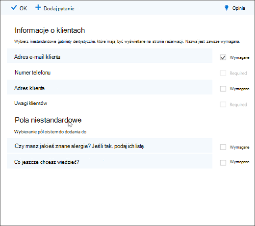

# Dodawanie niestandardowych i wymaganych pytań do strony rezerwacji

Aplikacja Bookings pozwala tworzyć pytania, zadawać klientom pytania podczas rezerwacji terminów. Pozwala także wybrać, które pytania są wymagane.

Skojarzysz pytania z usługą, aby każda usługa mieć inny zestaw pytań. Na przykład stylista może zapytać klientów rezerwjących termin kolorowania, czy mają jakieś znane alergie na spady lub odcienie. Dzięki temu Ty i Twoi klienci możecie zaoszczędzić czas, gdy przychodzicie na spotkanie.

Klienci zobaczą niestandardowe pytania podczas tworzenia terminu na stronie rezerwacji. Pracownicy zobaczą niestandardowe pytania podczas tworzenia nowej rezerwacji w kalendarzu aplikacji Bookings lub podczas wyświetlania istniejącego terminu. Usługa Bookings zapisuje wszystkie Twoje pytania na liście głównej, dzięki czemu nie trzeba ponownie tworzyć tych samych pytań dla każdej usługi. Możesz także określić, czy pytania są wymagane, czy opcjonalne.

> [!NOTE]
> Odpowiedzi klientów na pytania są widoczne po spojrzeniu na jego termin w kalendarzu rezerwacji.

Aby uzyskać więcej informacji na temat personalizowania i dostosowywania strony rezerwacji, zobacz [Dostosowywanie strony rezerwacji](customize-booking-page.md).

## Dodawanie niestandardowych pytań do usług

1. Zaloguj się do Microsoft 365 i przejdź do konta **Bookings**.

1. Przejdź do **usługi i** edytuj istniejącą usługę lub **pozycję Dodaj usługę**.

1. Przewiń w dół do **sekcji Pola** niestandardowe, a następnie wybierz pozycję **Modyfikuj**.

   Dodaliśmy już kilka podstawowych pytań dotyczących informacji o klientach: adres e-mail, numer telefonu, adres i uwagi klientów. Przy pierwszym przypadku pytania dotyczące informacji o klientach są wyróżniane na szaro. Oznacza to, że użytkownik zobaczy to pytanie. Jeśli wybierzesz pytanie, pole wyróżnienia wokół niego zniknie i klient nie zostanie zadany.

   W tym przykładzie wyłączono numer telefonu i notatki klienta i utworzono dwa nowe pytania niestandardowe do zadawania.

   

1. Aby pytanie było wymagane, zaznacz pole **wyboru** Wymagane. Klient nie będzie mógł dokończyć rezerwacji, dopóki nie odpowie na wymagane pytania.

1. Aby utworzyć pytanie niestandardowe, wybierz pozycję **Dodaj pytanie** u góry panelu. Wpisz pytanie, a następnie wybierz pozycję **Zapisz**.

1. Kliknij pytanie, aby je włączyć. Wokół niego pojawi się wyróżnione pole z włączonym pytaniem.

1. Kliknij **przycisk OK** w górnej części strony, a następnie kliknij **pozycję Zapisz usługę**.

Usługa Bookings zapisze wszystkie niestandardowe pytania na liście głównej, dzięki czemu możesz łatwo dodawać pytania do każdej usługi bez konieczności wielokrotnego wpisywania tych samych pytań. Jeśli na przykład otworzysz inną usługę, pytanie utworzone dla pierwszej usługi będzie wyświetlane w sekcji Pola niestandardowe, ale zostanie wyłączone. Kliknij pytanie, aby było wyświetlane wyróżniony prostokąt i aby je włączyć.

W tym przykładzie widać, że pytania dodane dla pierwszej usługi są dostępne dla tej usługi. Wszelkie pytania dotyczące tej usługi będą dostępne dla wszystkich usług.

   

Jeśli Twoja strona rezerwacji jest już opublikowana, nie musisz nic więcej robić. Klienci zobaczą pytania po następnym zarezerwowaniu u Ciebie rezerwacji. Jeśli twoja strona rezerwacji nie została jeszcze opublikowana, przejdź do  strony rezerwacji w aplikacji Outlook w sieci Web, a następnie wybierz pozycję **Zapisz i opublikuj**.

> [!WARNING]
> Możesz również usuwać pytania z listy głównej. Jednak usunięcie pytania spowoduje jego usunięcie z każdej usługi. Zalecamy wyłączenie pytania, zaznaczając je w celu zagwarantowania, że żadne inne usługi nie będą miały wpływu na inne usługi. Jeśli pytanie nie jest otoczone wyróżniony prostokątem, pytanie jest wyłączone.

## Obsługa klienta

Gdy klienci zarezerwują u Ciebie termin, podstawowe pytania dotyczące informacji o klientach będą wyświetlane w **sekcji Dodaj** szczegóły. Wszelkie dostosowane pytania, które dodasz, będą dostępne w **sekcji Podaj dodatkowe** informacje.

## Środowisko personelu

Gdy klienci zarezerwują u Ciebie termin, pracownicy zobaczą pytania i odpowiedzi klientów w kalendarzu rezerwacji. Aby go wyświetlić, przejdź do **aplikacji Kalendarz aplikacji Bookings** \> **, a** następnie otwórz termin.

