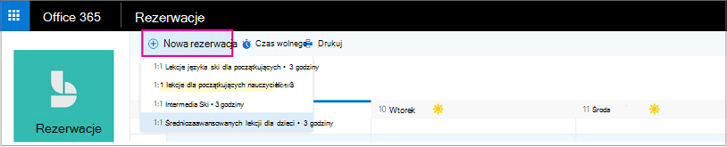

# Tworzenie rezerwacji ręcznej

Rezerwacje można planuje i  personelu na dwa różne sposoby. Na początku klient używa strony rezerwacji autonomicznej lub osadzonej strony rezerwacji, która jest dodawania do witryny sieci Web. Inny sposób to ręczne wprowadzenie rezerwacji przez Ciebie lub jednego z Twoich pracowników, na przykład gdy klient dzwoni na spotkanie. W tym artykule o scenariuszu ręcznym.

1. W Microsoft 365 kliknij przycisk Uruchamianie aplikacji, a następnie wybierz pozycję **Bookings**.

   

1. W okienku nawigacji wybierz pozycję **Nowa rezerwacja kalendarza**\>.

   

1. Wybierz usługę do świadczenia. Zobacz [Definiowanie ofert usług w usłudze Microsoft Bookings,](define-service-offerings.md) aby uzyskać instrukcje dotyczące konfiguracji usługi.

1. Wprowadź informacje o kliencie, w tym imię i nazwisko, adres e-mail, numer telefonu i inne istotne szczegóły.

1. Wybierz członka personelu, który ma świadczyć usługę. Wyświetlana lista członków personelu jest oparta na tym, co ustawiono na stronie usług.

   

1. Wprowadź szczegóły usługi, takie jak data, godzina, lokalizacja i inne istotne informacje. Po wprowadzeniu prawidłowego adresu e-mail klienta przycisk Zapisz  zmieni się w przycisk **Wyślij, a** zobaczysz notatkę z informacją, że do klienta zostanie wysłane potwierdzenie. Potwierdzenie klienta zawiera załącznik do dodania do kalendarza. Wybrani członkowie personelu otrzymają również zaproszenia na spotkania z informacjami o terminach, aby można było dodać je do swoich kalendarzy osobistych.

1. Wybierz **pozycję Dodaj przypomnienie e-mail**.

1. Określ, kiedy przypomnienie ma zostać wysłane i gdzie ma zostać **wysłane (Klient****, Personel****, Wszyscy** uczestnicy) oraz jak ma być wiadomość z przypomnieniem.

1. Wybierz **pozycję Zapisz** \> **wyślij**.

   Oto przykładowa wiadomość e-mail z przypomnieniem, które otrzyma klient:

:::image type="content" source="../media/bookings-confirmed-email.png" alt-text="Zrzut ekranu: Przykład wiadomości e-mail z potwierdzeniem rezerwacji ręcznej":::