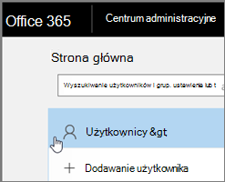
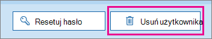

# <a name="delete-a-booking-calendar-in-bookings"></a>Usuwanie kalendarza rezerwacji w aplikacji Bookings

W tym artykule wyjaśniono, jak usunąć niechciany kalendarz rezerwacji. Możesz usunąć kalendarz rezerwacji z centrum administracyjne platformy Microsoft 365 lub użyć programu PowerShell. Kalendarz aplikacji Bookings to skrzynka pocztowa Exchange Online dlatego w celu usunięcia kalendarza rezerwacji możesz usunąć odpowiednie konto użytkownika.

> [!IMPORTANT]
> Wszystkie kalendarze rezerwacji utworzone w 2017 roku lub wcześniej należy usunąć przy użyciu instrukcji programu PowerShell dotyczących tego tematu. Wszystkie kalendarze rezerwacji utworzone w 2018 roku lub później można usunąć w centrum administracyjne platformy Microsoft 365.

W kalendarzu rezerwacji są przechowywane wszystkie istotne informacje dotyczące tego kalendarza rezerwacji oraz dane, w tym:

- Informacje służbowe, logo i godziny pracy dodawane podczas tworzenia kalendarza rezerwacji
- Odpowiedni personel i usługi dodane podczas tworzenia kalendarza rezerwacji
- Wszystkie rezerwacje i terminy czasu wolnego dodane do kalendarza rezerwacji po jego utworzeniu.

> [!WARNING]
> Po usunięciu kalendarza rezerwacji te dodatkowe informacje są również trwale usuwane i nie można ich odzyskać.

## <a name="delete-a-booking-calendar-in-the-microsoft-365-admin-center"></a>Usuwanie kalendarza rezerwacji z centrum administracyjne platformy Microsoft 365

1. Przejdź do Centrum administracyjnego platformy Microsoft 365.

1. W centrum administracyjnym wybierz pozycję **Użytkownicy**.

   

1. Na stronie **Aktywni użytkownicy** wybierz nazwy użytkowników, których chcesz usunąć, a następnie wybierz pozycję **Usuń użytkownika**.

   

## <a name="delete-a-booking-calendar-using-exchange-online-powershell"></a>Usuwanie kalendarza rezerwacji przy użyciu programu Exchange Online PowerShell

Zobacz [Połączenie do Exchange Online PowerShell,](/powershell/exchange/exchange-online-powershell-v2) aby uzyskać wymagania wstępne i wskazówki dotyczące nawiązywania połączenia z programem Exchange Online PowerShell.

Aby wykonać te czynności, musisz używać aktywnego okna poleceń programu Microsoft PowerShell, które uruchomiono przez wybranie opcji "Uruchom jako administrator".

1. W oknie programu PowerShell załaduj moduł EXO V2, uruchamiając następujące polecenie:

   ```powershell
   Import-Module ExchangeOnlineManagement
   ```

   > [!NOTE]
   > Jeśli moduł [V2 exo](/powershell/exchange/exchange-online-powershell-v2#install-and-maintain-the-exo-v2-module) został już zainstalowany, poprzednie polecenie będzie działać w sposób zapisany.
   
2. Polecenie, które należy uruchomić, ma następującą składnię:

   ```powershell
   Connect-ExchangeOnline -UserPrincipalName <UPN> 
   ```

   - _\<UPN\>_ to konto w formacie nazwy głównej użytkownika (na przykład `john@contoso.com`).

3. Gdy zostanie wyświetlony monit, zaloguj się przy użyciu poświadczeń administratora dzierżawy do dzierżawy Microsoft 365 hostowania kalendarza rezerwacji, który chcesz trwale usunąć.

4. Po zakończeniu przetwarzania tego polecenia wprowadź następujące polecenie, aby uzyskać listę skrzynek pocztowych rezerwacji w dzierżawie:

   ```powershell
   Get-EXOMailbox -RecipientTypeDetails SchedulingMailbox
   ```

5. Wpisz następujące polecenie:

   ```powershell
   remove-mailbox [BookingCalendarToDelete]
   ```

   > [!IMPORTANT]
   > Uważaj, aby wpisać dokładną nazwę aliasu skrzynki pocztowej rezerwacji, który chcesz trwale usunąć.

6. Aby sprawdzić, czy kalendarz został usunięty, wprowadź następujące polecenie:

   ```powershell
    Get-EXOMailbox -RecipientTypeDetails SchedulingMailbox
   ```

   Usunięty kalendarz nie pojawi się w danych wyjściowych.
