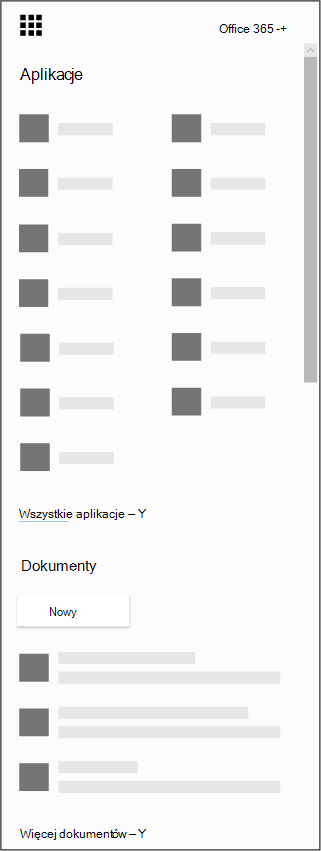

# Uzyskiwanie aplikacji Microsoft Bookings dla systemów iOS i Android

Usługa Microsoft Bookings jest dostępna jako aplikacja mobilna dla systemów iOS i Android. Aplikacja Bookings dla systemu iOS jest dostępna we wszystkich regionach i krajach, w których firma Apple obsługuje tę usługę. Aplikację można pobrać ze [sklepu iTunes App Store](https://apps.apple.com/app/microsoft-bookings/id1065657468). Aplikacja Bookings dla systemu Android jest dostępna do pobrania ze [sklepu Google Play](https://play.google.com/store/apps/details?id=com.microsoft.exchange.bookings) w Stanach Zjednoczonych i Kanadzie.

## Przed rozpoczęciem

Przed rozpoczęciem musisz skonfigurować usługę Bookings w sieci Web.

1. W ikony Uruchamianie aplikacji wybierz pozycję Wszystkie aplikacje, aby wyświetlić alfabetyczną listę dostępnych Microsoft 365 aplikacji. W tym miejscu możesz wyszukać konkretną aplikację

   

2. W tym [celu Office stronie głównej](https://office.com) aplikacji i w ikony **Uruchamianie aplikacji wybierz pozycję Bookings**.

3. Wybierz **pozycję Pobierz teraz**.

4. Podaj nazwę i typ firmy lub organizacji, których właścicielem lub użytkownikiem jest firma.

5. Teraz możesz skonfigurować konto aplikacji Bookings dla swojej organizacji. Postępuj zgodnie z instrukcjami [w temacie aplikacji Microsoft Bookings](bookings-overview.md) , aby zakończyć konfigurowanie aplikacji Bookings.

## Pobieranie aplikacji Bookings

Po skonfigurowaniu aplikacji internetowej Bookings przejdź do sklepu online swojego urządzenia, pobierz aplikację Bookings i zaloguj się przy użyciu konta administratora.

## Tryb tylko do wyświetlania

Każdy użytkownik, który nie udzielił dostępu do odczytu i zapisu w aplikacji Bookings, nadal może korzystać z aplikacji mobilnej w trybie tylko do odczytu. Każda osoba mająca licencję na usługę Bookings, która zostanie dodana do kalendarza rezerwacji, może wyświetlić harmonogramy swoich współpracowników, szczegóły terminów i informacje biznesowe. Użytkownik z dostępem tylko do odczytu nie może wprowadzać zmian ani edytować ani nie może uzyskać dostępu do listy klientów.
