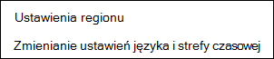
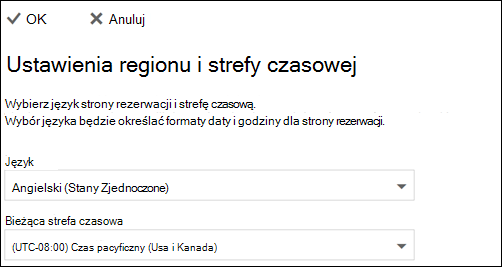

# Ustawianie języka i stref czasowych w Microsoft Bookings

> [!NOTE]
> Ten artykuł ułatwia interakcję z najnowszą wersją Microsoft Bookings. Poprzednie wersje zostaną wycofane w najbliższych miesiącach.

Jeśli używasz Microsoft Bookings, a rezerwacje są tworzone w niewłaściwym czasie, może być konieczna zmiana ustawień strefy czasowej. Podobnie, jeśli niektóre rezerwacje są w niewłaściwym języku, może być konieczna zmiana ustawień języka.

Istnieją dwa oddzielne ustawienia języka i strefy czasowej dla Bookings. Pierwsze ustawienie kontroluje język i strefę czasową kalendarza rezerwacji i jest ustawiane przy użyciu ustawień Outlook w sieci Web kalendarza osobistego zalogowanego użytkownika. Drugie ustawienie ma wpływ na stronę samoobsługowej rezerwacji używaną przez klientów i jest ustawiana przy użyciu strony "ustawienia regionalne", która kontroluje tylko język i strefę czasową dla tej strony.

## Ustawianie języka i strefy czasowej dla kalendarza rezerwacji

Kalendarz rezerwacji korzysta z ustawień języka i strefy czasowej zalogowanego użytkownika. Jeśli na przykład strefa czasowa zalogowanego użytkownika jest ustawiona na wschodni czas standardowy (EST), w kalendarzu rezerwacji będą wyświetlane istniejące godziny rozpoczęcia i zakończenia terminu w usłudze EST. Ta strefa czasowa została pierwotnie ustawiona podczas tworzenia kont Microsoft 365 i Outlook w sieci Web użytkownika.

Aby ustawić język i strefę czasowa dla kalendarza rezerwacji:

1. Zaloguj się do Microsoft 365 i wybierz kafelek Outlook na stronie docelowej (jak pokazano na poniższym zrzucie ekranu) lub w programie Microsoft 365 App Launcher.

   

1. Po otwarciu Outlook wybierz **ikonę koła zębatego** w prawym górnym rogu ekranu, aby otworzyć ustawienia osobiste i konta, a następnie wyszukaj "strefę czasową" w polu wyszukiwania panelu **Ustawienia**. Panel zostanie zaktualizowany w celu wyświetlenia bieżącego języka osobistego i ustawień strefy czasowej dla tego konta. Jak wspomniano powyżej, to ustawienie kontroluje również język i strefę czasowa kalendarza rezerwacji.

1. Zmień język lub strefę czasową, wybierając strzałkę listy rozwijanej w polu **Język lub Bieżąca strefa czasowa** i wybierając odpowiednie ustawienie.

1. Kliknij **Zapisz**. Panel Ustawienia zostanie zamknięty, Outlook w sieci Web zostanie ponownie uruchomiony i zostaną zastosowane nowe ustawienia języka i strefy czasowej.

## Ustawianie języka i strefy czasowej dla strony rezerwacji

1. W Microsoft 365 wybierz program uruchamiania aplikacji, a następnie wybierz **pozycję Bookings**.

1. W okienku nawigacji wybierz pozycję **Strona rezerwacji** i wybierz pozycję **Zmień ustawienia języka i strefy czasowej**.

   

1. Wybierz swój język i bieżącą strefę czasowa, a następnie wybierz przycisk OK.

   
