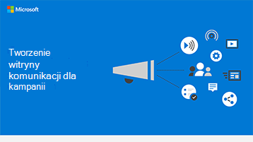

# Tworzenie witryny komunikacji w programie SharePoint

Doskonałym sposobem na komunikowanie priorytetów, udostępnianie dokumentów strategii i wyróżnianie nadchodzących zdarzeń jest korzystanie z witryny do komunikacji w programie SharePoint. Witryny komunikacji są do szerokiego udostępniania informacji w całej firmie lub kampanii; to wewnętrzna witryna strategii.

## Najważniejsze wskazówki

W witrynie do komunikacji uwzględnij następujące elementy:

1. Dodaj logo i kolory jako obraz nagłówka i motyw.

2. Prowadź ze swoją strategią, wiadomością, ważnymi dokumentami, katalogiem i często zadawanymi pytaniami w **swoim składników Web Part Element główny**.

3. Dołącz do zespołu oświadczenie dyrektora generalnego lub kandydata w składników **Web Part tekstu**.

4. Dodaj zdarzenia do składników **Web Part** Zdarzenia, aby wszyscy widzili nadchodzące wydarzenia.

5. Dodawanie zdjęć, których mogą używać inne osoby lub które mogą je udostępniać, do składników **Web Part Galeria obrazów**.

## Infografika: tworzenie infografiki na temat witryny komunikacji

Poniższe linki do plików PowerPoint PDF można pobrać i wydrukować w formacie tabloid (nazywanym również księgi głównej, 11 x 17 lub A3).

[PDF](https://download.microsoft.com/download/3/f/f/3ff49b41-e5a4-4993-a00c-7f791a80b627/M365CampaignsCreateCommunicationSite.pdf) |  [PowerPoint](https://download.microsoft.com/download/3/f/f/3ff49b41-e5a4-4993-a00c-7f791a80b627/M365CampaignsCreateCommunicationSite.pptx)

## Konfigurowanie

1. Zaloguj się do https://Office.com.

2. W lewym górnym rogu strony wybierz ikonę Uruchamianie aplikacji, a następnie wybierz **SharePoint aplikacji.** Jeśli nie widzisz kafelka **SharePoint, kliknij** kafelek Witryny lub pozycję SharePoint, jeśli nie  jest widoczny.

3. U góry strony SharePoint głównej kliknij pozycję **+ Utwórz** witrynę i wybierz opcję **Witryna do** komunikacji.

Dowiedz się [wszystkiego na temat witryn komunikacji](https://support.office.com/article/What-is-a-SharePoint-communication-site-94A33429-E580-45C3-A090-5512A8070732) i sposobu [tworzenia witryny do komunikacji w u SharePoint Online](https://support.microsoft.com/en-us/office/create-a-communication-site-in-sharepoint-online-7fb44b20-a72f-4d2c-9173-fc8f59ba50eb).

## Ustawienia administratora

Jeśli nie widzisz linku **+** Utwórz witrynę, samoobsługowe tworzenie witryn może nie być dostępne w Microsoft 365. Aby utworzyć witrynę zespołu, skontaktuj się z osobą administruną Microsoft 365 organizacji. Jeśli jesteś administratorem usługi Microsoft 365, zobacz Zarządzanie tworzeniem witryn w usłudze [SharePoint Online](/sharepoint/manage-site-creation), aby włączyć samoobsługowe tworzenie witryn dla organizacji, lub Zarządzanie witrynami w nowym centrum administracyjnym programu [SharePoint](/sharepoint/manage-sites-in-new-admin-center), aby utworzyć witrynę z centrum administracyjnego usługi <a href="https://go.microsoft.com/fwlink/?linkid=2185219" target="_blank">SharePoint</a>.