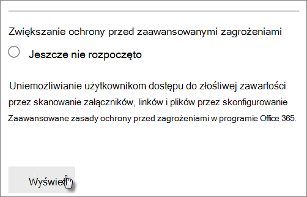
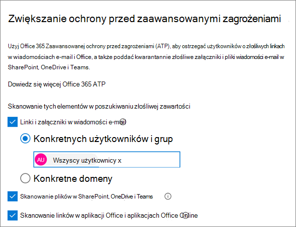

# Zwiększanie ochrony przed zagrożeniami dla Microsoft 365 Business Premium

Ten artykuł ułatwia zwiększenie ochrony subskrypcji usługi Microsoft 365 w celu ochrony przed wyłudzaniem informacji, złośliwym oprogramowaniem i innymi zagrożeniami. Te zalecenia są odpowiednie dla organizacji, w których jest coraz większa potrzeba zabezpieczeń, takich jak kampanie prawne, biura prawne i gabinety opieki zdrowotnej.

Przed rozpoczęciem sprawdź swój wynik bezpieczeństwa w firmie Microsoft. Witryna Microsoft Secure Score analizuje zabezpieczenia organizacji na podstawie zwykłych działań i ustawień zabezpieczeń, a następnie przypisuje wynik. Zacznij od notacji bieżącego wyniku. Użycie akcji zalecanych w tym artykule powoduje zwiększenie wyniku. Celem nie jest osiągnięcie maksymalnej liczby wyników, ale świadomość możliwości ochrony środowiska, które nie mają negatywnego wpływu na wydajność pracy użytkowników.

Aby uzyskać więcej informacji, zobacz [Microsoft Secure Score](../security/defender/microsoft-secure-score.md).

## Podnoszenie poziomu ochrony przed złośliwym oprogramowaniem w wiadomościach e-mail

Twoje Office 365 lub Microsoft 365 zawiera ochronę przed złośliwym oprogramowaniem, ale możesz zwiększyć tę ochronę, blokując załączniki za pomocą typów plików, które są często używane w celu ochrony przed złośliwym oprogramowaniem. Aby wyboić ochronę przed złośliwym oprogramowaniem w wiadomościach e-mail:

1. Przejdź do centrum <a href="https://go.microsoft.com/fwlink/p/?linkid=2077143" target="_blank">Office 365 zabezpieczeń & zgodności</a> i zaloguj się przy użyciu poświadczeń konta administratora.

2. W lewym okienku nawigacji w obszarze **Zarządzanie zagrożeniami** wybierz **pozycję Ochrona przed** \> **złośliwym oprogramowaniem zasad**.

3. Kliknij dwukrotnie zasady domyślne, aby edytować te zasady dla całej firmy.

4. Kliknij **Ustawienia**.

5. W **obszarze Typowe filtry typów załączników** wybierz **pozycję Wł**. Blokowane typy plików są wyświetlane w oknie bezpośrednio poniżej tej kontrolki. Upewnij się, że dodano następujące typy plików:

   `ade, adp, ani, bas, bat, chm, cmd, com, cpl, crt, hlp, ht, hta, inf, ins, isp, job, js, jse, lnk, mda, mdb, mde, mdz, msc, msi, msp, mst, pcd, reg, scr, sct, shs, url, vb, vbe, vbs, wsc, wsf, wsh, exe, pif`

   W razie potrzeby możesz później dodać lub usunąć typy plików.

6. Kliknij **przycisk Zapisz.**

Aby uzyskać więcej informacji, zobacz [Ochrona przed złośliwym oprogramowaniem w uchcie EOP](../security/office-365-security/anti-malware-protection.md).

## Ochrona przed oprogramowaniem wymuszającym okup

Oprogramowanie wymuszające okup ogranicza dostęp do danych przez szyfrowanie plików lub blokowanie ekranów komputera. Następnie próbuje wyłudzić pieniądze od osób, które szły na kartce, prosząc o "ransom" zwykle w formie banków, takich jak Waluty, w zamian za dostęp do danych.

Możesz chronić się przed oprogramowaniem wymuszającym okup, tworząc co najmniej jedną regułę przepływu poczty w celu zablokowania rozszerzeń plików, które są często używane dla oprogramowania wymuszającego okup (zostały one dodane w kroku podnieść poziom ochrony przed złośliwym oprogramowaniem) lub ostrzegać użytkowników, którzy otrzymują te załączniki w wiadomościach [e-mail](#raise-the-level-of-protection-against-malware-in-mail) .

Oprócz plików zablokowanych w poprzednim kroku warto również utworzyć regułę ostrzegawczą użytkowników przed otwieraniem załączników do plików programu Office z makrami. Oprogramowanie wymuszające okup może być ukryte w makrach, więc ostrzegaj użytkowników, aby nie otwierali tych plików osobom, których nie znają.

Aby utworzyć regułę transportu poczty:

1. Przejdź do centrum administracyjnego i wybierz <https://admin.microsoft.com> pozycję **Centra administracyjne Exchange**\>.

2. W kategorii **przepływ poczty** e-mail kliknij pozycję **reguły**.

3. Kliknij **+** pozycję , **a następnie kliknij pozycję Utwórz nową regułę**.

4. Kliknij **przycisk Więcej** opcji u dołu okna dialogowego, aby wyświetlić pełny zestaw opcji.

5. Zastosuj do reguły ustawienia z poniższej tabeli. Pozostaw domyślne pozostałe ustawienia, chyba że chcesz je zmienić.

6. Kliknij **Zapisz**.

|Ustawienie|Ostrzegaj użytkowników przed otwieraniem załączników Office plików|
|---|---|
|Name (Nazwa)|Reguła ochrony przed oprogramowaniem wymuszającym okup: ostrzeganie użytkowników|
|Zastosuj tę regułę, jeśli . . .|Dowolny załącznik. . . rozszerzenie pliku jest do tego dopasowania. . .|
|Określanie wyrazów lub fraz|Dodaj następujące typy plików:   `dotm, docm, xlsm, sltm, xla, xlam, xll, pptm, potm, ppam, ppsm, sldm`|
|Wykonaj następujące czynności. . .|Powiadamianie adresata za pomocą wiadomości|
|Podaj tekst wiadomości|Tego typu pliki nie należy otwierać u osób, których nie znasz, ponieważ mogą zawierać makra ze złośliwym kodem.|

Więcej informacji można znaleźć w następujących artykułach:

- [Oprogramowanie wymuszające okup: jak zmniejszyć ryzyko](https://www.microsoft.com/security/blog/2020/04/28/ransomware-groups-continue-to-target-healthcare-critical-services-heres-how-to-reduce-risk/)

- [Przywracanie OneDrive](https://support.microsoft.com//office/fa231298-759d-41cf-bcd0-25ac53eb8a15)

## Zatrzymywanie automatycznego przesyłania dalej wiadomości e-mail

Hakerzy, którzy uzyskają dostęp do skrzynki pocztowej użytkownika, mogą ukraść Twoją pocztę, ustawiając ją w celu automatycznego przesyłania dalej wiadomości e-mail. Może się to zdarzyć nawet bez wiedzy użytkownika. Możesz temu zapobiec, konfigurując regułę przepływu poczty.

Aby utworzyć regułę transportu poczty, obejrzyj [ten krótki klip wideo](https://support.office.com/article/f9d693ba-5c78-47c0-b156-8e461e062aa7) lub wykonaj następujące czynności:

1. W centrum <a href="https://go.microsoft.com/fwlink/p/?linkid=2024339" target="_blank">centrum administracyjne platformy Microsoft 365</a> kliknij pozycję **Centra administracyjne Exchange**\>.

2. W kategorii **przepływ poczty** e-mail kliknij pozycję **reguły**.

3. Kliknij **+** pozycję , **a następnie kliknij pozycję Utwórz nową regułę**.

4. Kliknij **przycisk Więcej** opcji u dołu okna dialogowego, aby wyświetlić pełny zestaw opcji.

5. Zastosuj ustawienia z poniższej tabeli. Pozostaw domyślne pozostałe ustawienia, chyba że chcesz je zmienić.

6. Kliknij **Zapisz**.

|Ustawienie|Ostrzegaj użytkowników przed otwieraniem załączników Office plików|
|---|---|
|Name (Nazwa)|Uniemożliwianie automatycznego przesyłania poczty e-mail do domen zewnętrznych|
|Zastosuj tę regułę, jeśli...|Nadawca . . . jest zewnętrzna/wewnętrzna. . . Wewnątrz organizacji|
|Dodaj warunek|Właściwości wiadomości. . . uwzględnij typ wiadomości . . . Automatyczne przesyłanie dalej|
|Wykonaj następujące czynności...|Zablokuj wiadomość. . . odrzuć wiadomość i dołącz wyjaśnienie.|
|Podaj tekst wiadomości|Automatyczne przesyłanie dalej poczty e-mail poza tę organizację jest blokowane ze względów bezpieczeństwa.|

## Ochrona poczty e-mail przed atakami wyłudzających informacje

Jeśli skonfigurowano co najmniej jedną domenę niestandardową dla środowiska Office 365 lub Microsoft 365, możesz skonfigurować ukierunkowaną ochronę przed wyłudzaniem informacji. Ochrona przed wyłudzaniem informacji, która jest częścią usługi Microsoft Defender dla systemu Office 365, może pomóc chronić Twoją organizację przed atakami opartymi na złośliwym podszydzaniu się i innych atakach wyłudzających informacje. Jeśli nie skonfigurowano domeny niestandardowej, nie musisz tego robić.

Zalecamy wprowadzenie do tej ochrony przez utworzenie zasad chroniących najważniejszych użytkowników i domenę niestandardową.

Aby utworzyć zasady ochrony przed wyłudzaniem informacji w programie Defender Office 365, obejrzyj ten krótki szkoleniowy klip wideo lub wykonaj następujące czynności:

1. Przejdź do <a href="https://go.microsoft.com/fwlink/p/?linkid=2077143" target="_blank">Office 365 zabezpieczeń & zgodności</a>.

2. W lewym okienku nawigacji w obszarze **Zarządzanie zagrożeniami** wybierz pozycję **Zasady**.

3. Na stronie **Zasady** wybierz pozycję **Ochrona przed wyłudzaniem informacji**.

4. Na stronie **ochrony przed wyłudzaniem** informacji wybierz pozycję **+ Utwórz**. Kreator przeprowadzi Cię przez proces definiowania zasad ochrony przed wyłudzaniem informacji.

5. Określ nazwę, opis i ustawienia zasad zgodnie z zaleceniami na poniższym wykresie. Aby uzyskać więcej informacji, zobacz Informacje o zasadach ochrony przed wyłudzaniem informacji w [programie Microsoft Defender, aby Office 365 opcje.](../security/office-365-security/set-up-anti-phishing-policies.md)

6. Po przejrzeniu ustawień wybierz pozycję Utwórz **te zasady** lub **Zapisz** odpowiednio do potrzeb.

|Ustawienie lub opcja|Zalecane ustawienie|
|---|---|
|Name (Nazwa)|Domena i najcenniejszy personel|
|Opis|Upewnij się, że nie podszywają się najważniejsze pracownicy i nasza domena.|
|Dodawanie użytkowników w celu ochrony|Wybierz **pozycję + Dodaj warunek, adresatem jest**. Wpisz nazwy użytkowników lub wprowadź adresy e-mail właścicieli firm, partnerów lub kandydatów, menedżerów i innych ważnych członków personelu. Możesz dodać maksymalnie 20 wewnętrznych i zewnętrznych adresów, które chcesz chronić przed personifikacji.|
|Dodawanie domen w celu ochrony|Wybierz **pozycję + Dodaj warunek, domena adresata to**. Wprowadź domenę niestandardową skojarzoną Microsoft 365 subskrypcji usługi, jeśli została zdefiniowana. Możesz wprowadzić więcej niż jedną domenę.|
|Wybieranie akcji|Jeśli wiadomość e-mail zostanie wysłana przez spersonifikowanego użytkownika: Wybierz pozycję Przekieruj wiadomość na inny adres e-mail **, a** następnie wpisz adres e-mail administratora zabezpieczeń. na przykład *alice@contoso.com*.   Jeśli wiadomość e-mail jest wysyłana za pomocą personifikacji domeny: Wybierz **pozycję Kwarantanna wiadomości**.|
|Inteligencja skrzynek pocztowych|Domyślnie podczas tworzenia nowych zasad ochrony przed wyłudzaniem informacji jest zaznaczona inteligencja skrzynek pocztowych. Aby uzyskać najlepsze wyniki **, pozostaw** to ustawienie wł.|
|Dodawanie zaufanych nadawców i domen|Tutaj możesz dodać własną domenę lub dowolne inne zaufane domeny.|
|Zastosowano do|Zaznacz **pozycję Domena adresata to**. W **obszarze Dowolny z nich** wybierz **pozycję Wybierz**. Wybierz **pozycję + Dodaj**. Zaznacz pole wyboru obok nazwy domeny, na przykład *contoso. com*, na liście, a następnie wybierz pozycję **Dodaj**. Wybierz pozycję **Gotowe**.|

Aby uzyskać więcej informacji, zobacz [Konfigurowanie zasad ochrony przed wyłudzaniem informacji w programie Defender dla Office 365](../security/office-365-security/set-up-anti-phishing-policies.md).

## Chroń przed złośliwymi załącznikami, plikami i linkami za pomocą programu Defender dla Office 365

Najpierw upewnij się, że w centrum administracyjnym <https://admin.microsoft.com> jest włączona nowa wersja Preview centrum administracyjnego. Włącz przełącznik obok tekstu Nowe **centrum administracyjne**.

   

Jeśli nie widzisz jeszcze strony Konfiguracja z  kartami w dzierżawie, zobacz, jak wykonać te czynności w Centrum zabezpieczeń & zgodności. Zobacz [Konfigurowanie załączników Sejf w](#set-up-safe-attachments-in-the-security--compliance-center) Centrum zabezpieczeń & zgodności i Konfigurowanie linków Sejf w Centrum zabezpieczeń [& zgodności](#set-up-safe-links-in-the-security--compliance-center).

1. W lewym okienku narracji wybierz pozycję **Konfiguracja**.
2. Na stronie **Konfiguracja** wybierz pozycję **Wyświetl na** karcie **Zwiększ ochronę przed zaawansowanymi zagrożeniami** .

   

3. Na stronie **Zwiększanie ochrony przed zaawansowanymi zagrożeniami** wybierz pozycję **Wprowadzenie**.
4. W okienku, które zostanie otwarte, zaznacz pola wyboru obok pozycji Linki i załączniki w wiadomościach e-mail **,** Skanuj pliki w aplikacjach **SharePoint, OneDrive i Teams** oraz Skanuj linki w aplikacji klasycznej Office i aplikacji **Office Online** w obszarze Skanuj elementy w poszukiwaniu **złośliwej** zawartości.

   W **obszarze Linki i załączniki w wiadomości e-mail** wpisz tekst Wszyscy użytkownicy lub konkretnych użytkowników, których wiadomości e-mail chcesz zeskanować.

   

5. Wybierz **pozycję Utwórz zasady**, aby włączyć Sejf załączniki i Sejf linków.

### Konfigurowanie załączników Sejf w Centrum & zabezpieczeń

Osoby regularnie wysyłają, odbierają i udostępniają załączniki, takie jak dokumenty, prezentacje, arkusze kalkulacyjne i inne. Samo patrząc na wiadomość e-mail, nie zawsze łatwo jest ustalić, czy załącznik jest bezpieczny, czy złośliwy. Program Microsoft Defender dla Office 365 zawiera Sejf ochronę załączników, ale ta ochrona nie jest domyślnie włączona. Zalecamy utworzenie nowej reguły w celu rozpoczęcia korzystania z tej ochrony. Ta ochrona obejmuje pliki w SharePoint, OneDrive i Microsoft Teams.

Aby utworzyć zasady Sejf załączników, obejrzyj [ten krótki](https://support.office.com/article/e7e68934-23dc-4b9c-b714-e82e27a8f8a5) klip wideo lub wykonaj następujące czynności:

1. Przejdź do <a href="https://go.microsoft.com/fwlink/p/?linkid=2077143" target="_blank">Office 365 zabezpieczeń & zgodności</a> i zaloguj się przy użyciu konta administratora.

2. W lewym okienku nawigacji w obszarze **Zarządzanie zagrożeniami** wybierz pozycję **Zasady**.

3. Na stronie Zasady wybierz pozycję Sejf **załączników**.

4. Na stronie Sejf załączników zastosuj tę ochronę, zaznaczając pole wyboru Włącz **atP dla programu SharePoint,** OneDrive i Microsoft Teams atp.

5. Wybierz **+** pozycję , aby utworzyć nowe zasady.

6. Zastosuj ustawienia z poniższej tabeli.

7. Po przejrzeniu ustawień wybierz pozycję **Utwórz te zasady** lub **Zapisz** odpowiednio do potrzeb.

|Ustawienie lub opcja|Zalecane ustawienie|
|---|---|
|Name (Nazwa)|Blokuj bieżące i przyszłe wiadomości e-mail za pomocą wykrytego złośliwego oprogramowania.|
|Opis|Blokuj bieżące i przyszłe wiadomości e-mail oraz załączniki za pomocą wykrytego złośliwego oprogramowania.|
|Zapisywanie załączników z nieznanym złośliwym oprogramowaniem|Wybierz **pozycję Blokuj — blokuj bieżące i przyszłe wiadomości e-mail oraz załączniki przy użyciu wykrytego złośliwego oprogramowania**.|
|Przekierowywanie załącznika przy wykrywaniu|Włącz przekierowywanie (zaznacz to pole)   Wprowadź konto administratora lub konfigurację skrzynki pocztowej do kwarantanny.   Zastosowanie powyższej opcji w przypadku przecowania czasu lub błędu podczas skanowania w poszukiwaniu załączników (zaznacz to pole).|
|Zastosowano do|Domeną adresata jest . . . wybierz domenę.|

Aby uzyskać więcej informacji, zobacz [Konfigurowanie zasad ochrony przed wyłudzaniem informacji w programie Defender dla Office 365](../security/office-365-security/set-up-anti-phishing-policies.md).

### Konfigurowanie linków Sejf w Centrum zgodności & zabezpieczeń

Hakerzy czasami ukrywają złośliwe witryny internetowe w linkach w wiadomościach e-mail lub innych plikach. Sejf Links, część usługi Microsoft Defender dla Office 365, może pomóc chronić Twoją organizację, udostępniając weryfikację adresów internetowych (adresów URL) za pomocą kliknięcia w wiadomościach e-mail i Office dokumentach. Ochrona jest definiowana za pomocą Sejf linków sieciowych.

Zalecamy:

- Zmodyfikuj zasady domyślne, aby zwiększyć ochronę.

- Dodaj nowe zasady kierowane do wszystkich adresatów w domenie.

Aby skonfigurować linki Sejf, obejrzyj [ten krótki szkoleniowy](https://support.office.com/article/61492713-53c2-47da-a6e7-fa97479e97fa) klip wideo lub wykonaj następujące czynności:

1. Przejdź do <a href="https://go.microsoft.com/fwlink/p/?linkid=2077143" target="_blank">Office 365 zabezpieczeń & zgodności</a> i zaloguj się przy użyciu konta administratora.

2. W lewym okienku nawigacji w obszarze **Zarządzanie zagrożeniami** wybierz pozycję **Zasady**.

3. Na stronie Zasady wybierz pozycję Sejf **linków**.

Aby zmodyfikować zasady domyślne:

1. Na stronie Sejf w **obszarze Zasady** stosowane do całej organizacji wybierz pozycję **Zasady** domyślne.

2. W **Ustawienia, które dotyczą zawartości** z wyjątkiem wiadomości e-mail, wybierz pozycję Aplikacje Microsoft 365 dla przedsiębiorstw **, Office dla systemów iOS i Android**.

3. Kliknij **Zapisz**.

Aby utworzyć nowe zasady kierowane do wszystkich adresatów w domenie:

1. Na stronie Sejf w obszarze **Zasady** stosowane do całej organizacji kliknij pozycję , **+** aby utworzyć nowe zasady.

2. Zastosuj ustawienia wymienione w poniższej tabeli.

3. Kliknij **Zapisz**.

|Ustawienie lub opcja|Zalecane ustawienie|
|---|---|
|Name (Nazwa)|Sejf linków dla wszystkich adresatów w domenie|
|Wybierz akcję dla nieznanych, potencjalnie złośliwych adresów URL w wiadomościach|Wybierz **pozycję W — po kliknięciu linku** adresy URL będą ponownie pisane i sprawdzane pod kątem listy znanych złośliwych linków.|
|Używanie załączników Sejf do skanowania zawartości do pobrania|Zaznacz to pole.|
|Zastosowano do|Domeną adresata jest . . . wybierz domenę.|

Aby uzyskać więcej informacji, [zobacz Sejf w programie Defender dla Office 365](../security/office-365-security/safe-links.md).

## Włączanie ujednoliconego dziennika inspekcji

Po włączeniu przeszukiwania dziennika inspekcji w Centrum & zgodności możesz zachować administratora i inne działania użytkowników w dzienniku i przeszukać je.

Aby włączyć lub wyłączyć przeszukiwanie dziennika inspekcji w Exchange Online subskrypcji usługi, musisz mieć przypisaną rolę Dzienniki inspekcji w Microsoft 365 inspekcji. Domyślnie ta rola jest przypisana do grup ról Zarządzanie zgodnością i Zarządzanie organizacją na stronie Uprawnienia w centrum Exchange <a href="https://go.microsoft.com/fwlink/p/?linkid=2059104" target="_blank">administracyjnego</a>. Administratorzy globalni w Microsoft 365 są domyślnie członkami tej grupy.

1. Aby włączyć przeszukiwanie dziennika inspekcji, przejdź do centrum administracyjnego w miejscu, <https://admin.microsoft.com> a  następnie wybierz pozycję Zabezpieczenia w obszarze **Centra administracyjne w** lewym obszarze kontrolnym.
2. Na stronie **Microsoft 365 zabezpieczeń** **wybierz pozycję Więcej** zasobów, a następnie pozycję Otwórz na karcie  Centrum Office 365 zabezpieczeń & **zgodności**.

    
3. Na stronie zabezpieczenia i zgodność wybierz **pozycję Wyszukiwanie,** a następnie **Pozycję Przeszukiwanie dziennika inspekcji**.
4. U góry strony Przeszukiwanie **dziennika inspekcji** wybierz pozycję **Włącz inspekcję**.

Po włączeniu tej funkcji możesz wyszukiwać pliki, foldery i wiele działań. Aby uzyskać więcej informacji, zobacz [Przeszukiwanie dziennika inspekcji](../compliance/search-the-audit-log-in-security-and-compliance.md).

## Dostosowywanie ustawień udostępniania anonimowego dla SharePoint i OneDrive i folderów

(zmień domyślne wygasanie linku anonimowego na 14 dni, zmień domyślny typ udostępniania na "Konkretne osoby") Aby zmienić ustawienia udostępniania w OneDrive i SharePoint:

1. Przejdź do centrum administracyjnego w miejscu, <https://admin.microsoft.com> a następnie wybierz pozycję centrum **SharePoint** w obszarze **Centra** administracyjne w lewym obszarze narracji.
2. W centrum SharePoint przejdź do **pozycji Udostępnianie** \> **zasad**.
3. Na stronie  Udostępnianie w obszarze Linki do plików i folderów wybierz pozycję Określone **osoby, a** następnie w obszarze Ustawienia zaawansowane linków **"Każdy"** zaznacz pole wyboru Te linki muszą wygasać w ciągu tej liczby dni i wpisać 14 (lub inną liczbę dni, do których chcesz ograniczyć okres istnienia linku).

   

## Alerty dotyczące aktywności

Alerty aktywności mogą być wykorzystywane do śledzenia działań administratorów i użytkowników oraz wykrywania zdarzeń dotyczących złośliwego oprogramowania i ochrony przed utratą danych w organizacji. Subskrypcja zawiera zestaw domyślnych zasad, ale można też tworzyć zasady niestandardowe. Aby uzyskać więcej informacji, zobacz [Zasady alertów](../compliance/alert-policies.md). Jeśli na przykład przechowujesz ważny plik w programie SharePoint, którego nie chcesz, aby ktokolwiek udostępniał go zewnętrznie, możesz utworzyć powiadomienie o tym, czy ktoś udostępnia go.

Na poniższej ilustracji przedstawiono domyślne zasady zawarte w Microsoft 365.

## Wyłączanie udostępniania kalendarza i zarządzanie nimi

Możesz uniemożliwić osobom w organizacji udostępnianie swoich kalendarzy lub zarządzać tym, co mogą udostępniać. Można na przykład ograniczyć czas udostępniania tylko do godzin wolnych/zajętych.

1. Przejdź do centrum administracyjnego i wybierz <https://admin.microsoft.com> **pozycję Ustawienia** \> **Org Ustawienia** >  <a href="https://go.microsoft.com/fwlink/p/?linkid=2053743" target="_blank">**Services**</a>.

1. Wybierz **pozycję** Kalendarz i określ, czy osoby w organizacji mogą udostępniać swoje kalendarze osobom spoza organizacji, które mają Office 365 lub Exchange, czy komukolwiek.

   Jeśli wybierzesz opcję Udostępnij innym osobom, możesz również zdecydować, aby udostępniać tylko informacje o wolnym/zajętym.

3. Wybierz **pozycję Zapisz** zmiany u dołu strony.

   Na poniższej ilustracji przedstawiono niedozwolone udostępnianie kalendarza.

   

   Na poniższej ilustracji przedstawiono ustawienia, w przypadku których jest dozwolone udostępnianie kalendarza za pomocą linku e-mail z tylko informacjami o czasie wolnym/zajętym.

   

Jeśli użytkownicy mogą udostępniać swoje kalendarze, zobacz [te](https://support.office.com/article/7ecef8ae-139c-40d9-bae2-a23977ee58d5) instrukcje dotyczące udostępniania z usługi Outlook w sieci Web.
