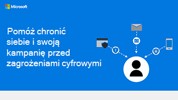

# Chroń się przed wyłudzaniem informacji i innymi atakami

Microsoft 365 Business Premium zawiera wiele zabezpieczeń przed atakami, ale możesz wykonać pewne czynności samodzielnie, aby ograniczyć i zminimalizować ryzyko ataków online.

- **Spam lub wiadomości-śmieci** Istnieje wiele powodów, dla których wiadomości-śmieci mogą być odbierane, a nie wszystkie wiadomości-śmieci są takie same. Możesz jednak ograniczyć to, co trafia do Ciebie, co zmniejszy ryzyko ataków, odfiltrując wiadomości-śmieci.

- **Wyłudzanie informacji** Wiadomość wyłudzająca informacje wygląda na legalną, ale w przypadku próby wyłudzenia danych osobowych lub kradzieży pieniędzy.

- **Fałszowanie** Oszuści mogą również użyć techniki o nazwie spoofing, która wygląda jak wiadomość e-mail otrzymana od Ciebie. 

- **Złośliwe** oprogramowanie to złośliwe oprogramowanie, które można zainstalować na komputerze, zazwyczaj instalowane po kliknięciu linku lub otwarciu dokumentu z wiadomości e-mail. Istnieją różne typy złośliwego oprogramowania (na przykład oprogramowanie wymuszające okup, gdy komputer jest przejmuje), ale nie chcesz ich mieć. 

## Najważniejsze wskazówki

### Zmniejszanie liczby wiadomości-śmieci

Postępuj zgodnie z [tymi 10 poradami dotyczącymi pomagania w ograniczaniu spamu](https://support.microsoft.com/office/10-tips-on-how-to-help-reduce-spam-55f756e8-688b-41c3-a086-8f68ccc592f6).

### Zgłoś to!

Zgłoś wszelkie próby wyłudzenia informacji lub inne wiadomości e-mail wyłudzają informacje. Zaznacz wiadomość, a następnie wybierz **pozycję Zgłoś wiadomość** na wstążce.
Poniżej znajdziesz więcej informacji na temat zgłaszania [wiadomości-śmieci i wiadomości wyłudzających informacje](https://support.office.com/article/Use-the-Report-Message-add-in-b5caa9f1-cdf3-4443-af8c-ff724ea719d2).

### Unikanie wyłudzania informacji

- Nigdy nie odpowiadaj na wiadomość e-mail z prośbą o wysłanie informacji osobistych lub informacji o koncie.
- Jeśli otrzymasz wiadomość e-mail, która wygląda podejrzanie lub zawiera prośbę o podane informacje tego typu, nigdy nie klikaj linków, które rzekomo prowadzi do firmowej witryny internetowej.
- Nigdy nie otwieraj plików dołączonych do podejrzanych wiadomości e-mail.
- Jeśli wiadomość e-mail wydaje się pochodzić z firmy, skontaktuj się z działem obsługi klienta tej firmy za pośrednictwem telefonu lub przeglądarki internetowej, aby sprawdzić, czy ta wiadomość e-mail jest legalna.
- Wyszukaj w Internecie wiersz tematu wiadomości e-mail, a po nim wyraz "hoax" (hoax), aby sprawdzić, czy ktoś inny zgłosił to oszustwo.

Zapoznaj się z informacjami na temat pięciu typowych typów prób wyłudzania informacji w [przypadku nadużyć, wyłudzania informacji i spoofingu](https://support.office.com/article/Deal-with-abuse-phishing-or-spoofing-in-Outlook-com-0d882ea5-eedc-4bed-aebc-079ffa1105a3).

### Upewniaj się, że wiadomości e-mail wyglądają na wiarygodne dla innych osób

Pomóż klientom w zaufaniu komunikacji, dodając podpis cyfrowy, aby udowodnić, że pochodzi ona od Ciebie. Zobacz [Zabezpieczanie wiadomości przy użyciu podpisu cyfrowego](https://support.office.com/article/secure-messages-by-using-a-digital-signature-549ca2f1-a68f-4366-85fa-b3f4b5856fc6).

## Pomóż chronić kampanię przed zagrożeniami online

Pobierz tę infografikę z poradami dla Ciebie i członków zespołu kampanii:

[PDF](https://download.microsoft.com/download/f/c/5/fc58bc0c-773a-4ac8-a232-6f986f61ef58/M365CampaignsWhatCanUsersDoToSecure.pdf) |  [PowerPoint](https://download.microsoft.com/download/f/c/5/fc58bc0c-773a-4ac8-a232-6f986f61ef58/M365CampaignsWhatCanUsersDoToSecure.pptx)

## Konfigurowanie

Dowiedz się więcej o tym, jak to zrobić:

- [Zadbaj o bezpieczeństwo swoich plików i informacji dzięki Office](https://support.microsoft.com/en-us/office/keep-your-files-and-communications-safe-with-office-c4ddc381-7395-42da-887c-8836a3bb975f).

- [Zachowaj bezpieczeństwo i prywatną pracę](https://support.office.com/article/stay-secure-and-private-at-work-104c7d91-b25a-453d-beee-ba64b6c6fc2d).
  
