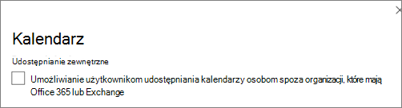

# Zwiększanie ochrony przed zagrożeniami dla Microsoft 365 Business Premium

W tym celu zwiększysz ochronę przed zagrożeniami za pomocą Microsoft 365 Business Premium. Ochrona firmy przed wyłudzaniem informacji, złośliwym oprogramowaniem i innymi zagrożeniami ma kluczowe znaczenie. Ten cel obejmuje następujące informacje:

- [Wstępnie skonfigurowane zasady zabezpieczeń](#review-and-apply-preset-security-policies) , które mogą zaoszczędzić dużo czasu podczas konfigurowania i konfigurowania
- [Niestandardowe zasady zabezpieczeń](#create-custom-security-policies) , które można zdefiniować zgodnie z potrzebami biznesowymi
- [Jak dostosować ustawienia udostępniania dla plików i folderów SharePoint i OneDrive](#set-sharing-settings-for-sharepoint-and-onedrive-files-and-folders)
- [Zasady alertów](#review-your-alert-policies) , które monitorują określone pliki i sposób ich użycia. 

## Przeglądanie i stosowanie wstępnie ustawionych zasad zabezpieczeń

Twoja subskrypcja obejmuje [wstępnie ustawione zasady zabezpieczeń](../security/office-365-security/preset-security-policies.md) , które używają zalecanych ustawień ochrony przed spamem, ochroną przed złośliwym oprogramowaniem i ochroną przed wyłudzaniem informacji. Domyślnie włączona jest wbudowana ochrona; Należy jednak rozważyć zastosowanie standardowej lub ścisłej ochrony w celu zwiększenia bezpieczeństwa. 

:::image type="content" source="media/m365bp-presetsecuritypolicies.png" alt-text="Zrzut ekranu przedstawiający wstępnie ustawione zasady zabezpieczeń.":::

> [!NOTE]
> Wstępnie ustawione zasady zabezpieczeń to nie to samo, co [ustawienia domyślne zabezpieczeń](m365bp-conditional-access.md#security-defaults). Zazwyczaj najpierw będziesz *używać* domyślnych zabezpieczeń *lub* [dostępu warunkowego](m365bp-conditional-access.md#conditional-access) , a następnie dodasz zasady zabezpieczeń. [Wstępnie ustawione zasady zabezpieczeń](#what-are-preset-security-policies) upraszczają proces dodawania zasad zabezpieczeń. Możesz również [dodać własne zasady niestandardowe](#create-custom-security-policies). 

### Co to są wstępnie ustawione zasady zabezpieczeń?

Wstępnie ustawione zasady zabezpieczeń zapewniają ochronę poczty e-mail i zawartości współpracy. Te zasady składają się z następujących elementów:

- *Profile*, które określają poziom ochrony
- *Zasady* (takie jak ochrona przed spamem, ochrona przed złośliwym oprogramowaniem, ochrona przed wyłudzaniem informacji, ustawienia fałszowania, personifikacja, Sejf załączniki i linki Sejf)
- *Ustawienia zasad* (takie jak grupy, użytkownicy lub domeny w celu otrzymywania zasad i wszelkich wyjątków)

Poniższa tabela zawiera podsumowanie poziomów ochrony i wstępnie ustawionych typów zasad.

| Poziom ochrony | Opis |
|:---|:---|
| **Standardowa ochrona**  (*zalecane dla większości firm*) | Standardowa ochrona używa profilu punktu odniesienia, który jest odpowiedni dla większości użytkowników. Standardowa ochrona obejmuje ochronę przed spamem, ochroną przed złośliwym oprogramowaniem, ochronę przed wyłudzaniem informacji, ustawienia fałszowania, ustawienia personifikacji, linki Sejf i zasady załączników Sejf.  |
| **Ścisła ochrona**  | Ścisła ochrona obejmuje te same rodzaje zasad co standardowa ochrona, ale z bardziej rygorystycznymi ustawieniami. Jeśli Twoja firma musi spełniać dodatkowe wymagania lub przepisy dotyczące zabezpieczeń, rozważ zastosowanie ścisłej ochrony co najmniej do użytkowników o priorytecie lub do celów o wysokiej wartości. |
| **Wbudowana ochrona** | Chroni przed złośliwymi linkami i załącznikami w wiadomości e-mail. Wbudowana ochrona jest domyślnie włączona i stosowana do wszystkich użytkowników.  |

> [!TIP]
> Można określić użytkowników, grupy i domeny do odbierania wstępnie ustawionych zasad i można zdefiniować pewne wyjątki, ale nie można zmienić wstępnie ustawionych zasad. Jeśli chcesz używać różnych ustawień zasad zabezpieczeń, możesz utworzyć własne zasady niestandardowe zgodnie z potrzebami firmy.

### Kolejność priorytetów zasad

Jeśli użytkownikom przypisano wiele zasad, do zastosowania zasad jest używana kolejność priorytetów. Kolejność priorytetów działa w następujący sposób:

1. **Ścisła ochrona** otrzymuje najwyższy priorytet i zastępuje wszystkie inne zasady.

2. **Standardowa ochrona** 

3. **Niestandardowe zasady zabezpieczeń**

4. **Wbudowana ochrona** otrzymuje najniższy priorytet i jest zastępowana przez ścisłą ochronę, standardową ochronę i zasady niestandardowe.

Ścisła ochrona zastępuje wszystkie inne zasady, a wbudowana ochrona jest zastępowana przez inne zasady. 

Aby dowiedzieć się więcej na temat wstępnie ustawionych zasad zabezpieczeń, zobacz [Jakie wstępnie ustawione zasady zabezpieczeń są tworzone](../security/office-365-security/preset-security-policies.md#what-preset-security-policies-are-made-of).

### Jak mogę przypisać wstępnie ustawione zasady zabezpieczeń do użytkowników?

> [!IMPORTANT]
> Przed rozpoczęciem upewnij się, że masz jedną z następujących ról przypisanych w Exchange Online (która jest uwzględniona w twojej subskrypcji):
> 
> - Administrator globalny
> - Zarządzanie organizacją
> - Administrator zabezpieczeń
> 
> Aby dowiedzieć się więcej, zobacz [Uprawnienia w Exchange Online](/exchange/permissions-exo/permissions-exo) i [Informacje o rolach administratora](../admin/add-users/about-admin-roles.md).

Aby przypisać wstępnie ustawione zasady zabezpieczeń, wykonaj następujące kroki:

1. Przejdź do portalu Microsoft 365 Defender ([https://security.microsoft.com](https://security.microsoft.com)) i zaloguj się.

2. Przejdź do **obszaru Zasady współpracy** \> & poczty e-mail **& Reguły** \> **zasad** \> zagrożeń **Wstępnie ustawione zasady zabezpieczeń** w sekcji **Szablony zasad** . (Aby przejść bezpośrednio do strony **Wstępnie ustawione zasady zabezpieczeń** , użyj polecenia <https://security.microsoft.com/presetSecurityPolicies>.)

2. Na stronie **Ustawienia wstępne zasad zabezpieczeń** w sekcji **Ochrona** standardowa lub **Ścisła ochrona** zmień przełącznik z **Wyłączone** na **Włączone**, a następnie wybierz pozycję **Zarządzaj**.

3. Kreator **zastosuj ochronę w warstwie Standardowa** lub **Zastosuj ścisłą ochronę** rozpoczyna się w wysuwnym oknie. Na stronie **Ochrona EOP zidentyfikuj** wewnętrznych adresatów, do których mają zastosowanie zasady (warunki adresatów):
   - **Użytkownicy**
   - **Grupy**
   - **Domeny**

   Kliknij odpowiednie pole, zacznij wpisywać wartość, a następnie wybierz żądaną wartość z wyników. Powtórz ten proces tyle razy, ile jest to konieczne. Aby usunąć istniejącą wartość, wybierz ikonę **Usuń** obok wartości.

   W przypadku użytkowników lub grup można użyć większości identyfikatorów (nazwa, nazwa wyświetlana, alias, adres e-mail, nazwa konta itp.), ale w wynikach jest wyświetlana odpowiednia nazwa wyświetlana. W przypadku użytkowników wpisz gwiazdkę (\*), aby wyświetlić wszystkie dostępne wartości.

   Aby określić wykluczenie, zaznacz pole wyboru **Wyklucz tych użytkowników, grupy i domeny** , a następnie określ użytkowników, grupy lub domeny do wykluczenia.

   Po zakończeniu wybierz pozycję **Dalej**.

4. Na **Ochrona usługi Office 365 w usłudze Defender ochrony mają zastosowanie do** strony w celu zidentyfikowania wewnętrznych adresatów, do których mają zastosowanie zasady (warunki adresatów). Określ użytkowników, grupy i domeny, tak jak w poprzednim kroku.

   Po zakończeniu kliknij przycisk **Dalej**.

5. Na stronie **Przejrzyj i potwierdź zmiany** zweryfikuj wybrane opcje, a następnie wybierz pozycję **Potwierdź**.

> [!TIP]
> Aby dowiedzieć się więcej na temat przypisywania wstępnie ustawionych zasad zabezpieczeń, zobacz następujące artykuły:
> - [Przypisywanie wstępnie ustawionych zasad zabezpieczeń do użytkowników](../security/office-365-security/preset-security-policies.md#assign-preset-security-policies-to-users)
> - [Zalecane ustawienia zawartości poczty e-mail i współpracy](../security/office-365-security/recommended-settings-for-eop-and-office365.md) (Microsoft 365 Business Premium obejmują Exchange Online Protection i Ochrona usługi Office 365 w usłudze Microsoft Defender plan 1)

## Tworzenie niestandardowych zasad zabezpieczeń

[Wstępnie ustawione zasady zabezpieczeń](#what-are-preset-security-policies) opisane wcześniej w tym artykule zapewniają silną ochronę większości firm. Nie ograniczasz się jednak tylko do używania wstępnie ustawionych zasad zabezpieczeń. Możesz zdefiniować własne niestandardowe zasady zabezpieczeń zgodnie z potrzebami firmy. 

Skorzystaj z naszego przewodnika szybkiego startu [Ochrona przed zagrożeniami](../security/office-365-security/protect-against-threats.md), aby rozpocząć tworzenie własnych zasad niestandardowych. Wskazówki nie tylko przeprowadzą Cię przez proces konfigurowania własnych zasad zabezpieczeń, ale także zawierają zalecane ustawienia do użycia jako punkt wyjścia dla:

- [Ochrona przed złośliwym kodem](../security/office-365-security/protect-against-threats.md#part-1---anti-malware-protection-in-eop)
- [Zaawansowana ochrona przed złośliwym kodem](../security/office-365-security/protect-against-threats.md#part-2---anti-phishing-protection-in-eop-and-defender-for-office-365)
- [Ochrona przed atakami przeciwspamowych](../security/office-365-security/protect-against-threats.md#part-3---anti-spam-protection-in-eop)
- [Sejf łącza i załączniki Sejf](../security/office-365-security/protect-against-threats.md#part-4---protection-from-malicious-urls-and-files-safe-links-and-safe-attachments-in-defender-for-office-365)

## Ustawianie ustawień udostępniania plików i folderów SharePoint i OneDrive

Domyślnie poziomy udostępniania są ustawione na najbardziej permisywny poziom dla SharePoint i OneDrive. Zalecamy zmianę ustawień domyślnych, aby lepiej chronić firmę.

1. Przejdź do <a href="https://go.microsoft.com/fwlink/?linkid=2185222" target="_blank">obszaru **Udostępnianie** w centrum administracyjnym SharePoint</a> i zaloguj się przy użyciu konta z [uprawnieniami administratora dla organizacji](/sharepoint/sharepoint-admin-role).
 
2. W obszarze **Udostępnianie zewnętrzne** określ poziom udostępniania. (Zalecamy użycie **metody Najmniej permisywnej** , aby zapobiec udostępnianiu zewnętrznemu).

3. W obszarze **Łącza do plików i folderów** wybierz opcję (na przykład **Określone osoby**). Następnie zdecyduj, czy domyślnie przyznać uprawnienia Widok, czy Edytuj dla łączy udostępnionych (takich jak **Widok**).

4. W obszarze **Inne ustawienia** wybierz opcje, których chcesz użyć.

5. Następnie wybierz pozycję **Zapisz**.

> [!TIP]
> Aby dowiedzieć się więcej na temat tych ustawień, zobacz [Zarządzanie ustawieniami udostępniania](/sharepoint/turn-external-sharing-on-or-off).

## Przeglądanie zasad alertów

Zasady alertów są przydatne do śledzenia działań użytkowników i administratorów, potencjalnych zagrożeń związanych ze złośliwym oprogramowaniem i zdarzeń utraty danych w firmie. Subskrypcja zawiera zestaw zasad domyślnych, ale można również tworzyć niestandardowe. Jeśli na przykład przechowujesz ważny plik w SharePoint nie chcesz, aby ktokolwiek udostępniał go zewnętrznie, możesz utworzyć powiadomienie, które powiadomi Cię, jeśli ktoś go udostępni.

Na poniższej ilustracji przedstawiono niektóre z domyślnych zasad dołączonych do Microsoft 365 Business Premium.

### Wyświetlanie zasad alertów

1. Przejdź do centrum zgodności Microsoft 365 pod adresem [https://compliance.microsoft.com](https://compliance.microsoft.com) i zaloguj się.

2. W okienku nawigacji wybierz pozycję **Zasady**, a następnie wybierz pozycję **Zasady alertów**.

3. Wybierz poszczególne zasady, aby wyświetlić więcej szczegółów lub edytować zasady. Na poniższej ilustracji przedstawiono listę zasad alertów z wybraną jedną zasadą:

   :::image type="content" source="media/selected-alert-policy.png" lightbox="media/selected-alert-policy.png" alt-text="Zrzut ekranu przedstawiający wybrane zasady alertów.":::

> [!TIP]
> Aby uzyskać więcej informacji, zobacz [zasady alertów](../compliance/alert-policies.md).

### Jak wyświetlać alerty

W zależności od określonego alertu alerty można wyświetlić w portalu Microsoft 365 Defender lub w centrum zgodności Microsoft 365.

| Typ alertu  | Co robić  |
|---------|---------|
| Alert zabezpieczeń, na przykład gdy użytkownik kliknie złośliwy link, wiadomość e-mail zostanie zgłoszona jako złośliwe oprogramowanie lub phish lub urządzenie zostanie wykryte jako zawierające złośliwe oprogramowanie     | Przejdź do <a href="https://go.microsoft.com/fwlink/p/?linkid=2077139" target="_blank">portalu Microsoft 365 Defender</a> i w obszarze **Współpraca & poczty e-mail** wybierz pozycję **Zasady & regułyZasady** > **.** Alternatywnie możesz przejść bezpośrednio do <https://security.microsoft.com/alertpolicies>. |
| Alert zgodności, na przykład gdy użytkownik udostępnia poufne lub poufne informacje (alert zapobiegania utracie danych) lub występuje nietypowa ilość zewnętrznego udostępniania plików (alert dotyczący ładu informacji)    | Przejdź do <a href="https://go.microsoft.com/fwlink/p/?linkid=2077149" target="_blank">Centrum zgodności platformy Microsoft 365</a>, a następnie wybierz pozycję **ZasadyZasadyAlertuj** >  > .  |

Aby uzyskać więcej informacji, zobacz [Wyświetlanie alertów](../compliance/alert-policies.md#view-alerts).

## Wyłączanie udostępniania kalendarza lub zarządzanie nimi

Możesz uniemożliwić użytkownikom w organizacji udostępnianie ich kalendarzy. Możesz również zarządzać poziomem szczegółowości, który mogą udostępniać. Na przykład można ograniczyć udostępnianie tylko do wolnych/zajętych czasów.

1. Przejdź [do ustawień organizacji w Centrum administracyjne platformy Microsoft 365](https://go.microsoft.com/fwlink/p/?linkid=2053743) i zaloguj się.

2. Wybierz pozycję **Kalendarz** i wybierz, czy osoby w organizacji mogą udostępniać swoje kalendarze osobom spoza firmy, które mają Office 365, Exchange, czy innym osobom.

   Zalecamy wyczyszczenie opcji **Udostępnianie zewnętrzne** .

   Jeśli wybierzesz opcję udostępnij dowolnej osobie, możesz zdecydować się na udostępnienie tylko informacji wolnych/zajętych.

3. Wybierz pozycję **Zapisz zmiany** w dolnej części strony.

   Na poniższej ilustracji pokazano, że udostępnianie kalendarza jest niedozwolone.

   

   Na poniższej ilustracji przedstawiono ustawienia, gdy udostępnianie kalendarza jest dozwolone za pomocą linku wiadomości e-mail z tylko informacjami bezpłatnymi/zajętymi.

   

Jeśli użytkownicy mogą udostępniać swoje kalendarze, zapoznaj się z [tymi instrukcjami dotyczącymi](https://support.office.com/article/7ecef8ae-139c-40d9-bae2-a23977ee58d5) udostępniania z Outlook w sieci Web.

## Następne kroki

Teraz rozpocznijmy misję [**konfigurowania urządzeń BYOD**](m365bp-devices-overview.md).
