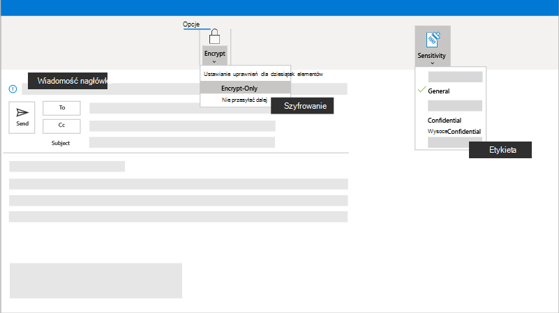

# Szyfrowanie lub etykietowanie poufnych wiadomości e-mail na platformie Microsoft 365

Dane i informacje są ważne i często poufne. W tym miejscu celem jest pomoc w ochronie tych poufnych informacji poprzez zapewnienie, że wszyscy używają etykiet poufności, aby adresaci wiadomości e-mail traktowali te informacje z najwyższą poufnością.

## Najważniejsze wskazówki

Przed wysłaniem wiadomości e-mail z poufnymi lub poufnymi informacjami należy rozważyć włączenie:

- **Szyfrowania:** Możesz zaszyfrować wiadomość e-mail, aby chronić prywatność informacji w wiadomości e-mail. Podczas szyfrowania wiadomości e-mail jest ona konwertowana z czytelnego zwykłego tekstu na kodowany tekst cypher. Tylko adresat, który ma klucz prywatny zgodny z kluczem publicznym używanym do szyfrowania wiadomości, może rozszyfrować komunikat do odczytu. Każdy adresat bez odpowiedniego klucza prywatnego widzi jednak nieczytelny tekst. Administrator może zdefiniować reguły do automatycznego szyfrowania komunikatów spełniających określone kryteria. Na przykład administrator może utworzyć regułę, która szyfruje wszystkie komunikaty wysyłane poza organizację lub wszystkie komunikaty, które wymieniają określone słowa lub frazy. Wszystkie reguły szyfrowania zostaną zastosowane automatycznie.

- **Etykiety poufności:** Jeśli organizacja tego wymaga, możesz skonfigurować etykiety poufności stosowane do plików i wiadomości e-mail, aby zachować ich zgodność z zasadami ochrony informacji organizacji. Po ustawieniu etykiety etykieta będzie się powtarzać przy użyciu wiadomości e-mail, nawet jeśli zostanie wysłana &mdash; na przykład przez wyświetlenie jako nagłówek wiadomości.

## Konfigurowanie

Jeśli chcesz zaszyfrować komunikat, który nie spełnia wstępnie zdefiniowanej reguły lub administrator nie skonfigurował żadnych reguł, możesz zastosować różne reguły szyfrowania przed wysłaniem komunikatu. Aby wysłać zaszyfrowaną wiadomość z programu Outlook 2013 lub 2016 lub Outlook 2016 dla komputerów Mac, wybierz pozycję **Opcje > Uprawnienia**, a następnie wybierz odpowiednią opcję ochrony. Możesz również wysłać zaszyfrowaną wiadomość, wybierając przycisk **Chroń** w Outlook w sieci Web. Aby uzyskać więcej informacji, zobacz [Wysyłanie, wyświetlanie i odpowiadanie na zaszyfrowane wiadomości w programie Outlook dla komputerów PC](https://support.microsoft.com/en-us/office/send-view-and-reply-to-encrypted-messages-in-outlook-for-pc-eaa43495-9bbb-4fca-922a-df90dee51980).

## ustawienia Administracja

Możesz dowiedzieć się wszystkiego na temat konfigurowania szyfrowania poczty [e-mail na stronie Szyfrowanie poczty e-mail na platformie Microsoft 365](../compliance/email-encryption.md).

### Automatyczne szyfrowanie wiadomości e-mail

Administratorzy mogą tworzyć reguły przepływu poczty, aby automatycznie chronić wiadomości e-mail wysyłane i odbierane z kampanii lub firmy. Skonfiguruj reguły szyfrowania wszelkich wychodzących wiadomości e-mail i usuwania szyfrowania z zaszyfrowanych wiadomości pochodzących z organizacji lub odpowiedzi na zaszyfrowane wiadomości wysyłane z organizacji.

Tworzysz reguły przepływu poczty w celu szyfrowania wiadomości e-mail przy użyciu Szyfrowanie wiadomości w Microsoft Purview. Zdefiniuj reguły przepływu poczty na potrzeby wyzwalania szyfrowania wiadomości przy użyciu <a href="https://go.microsoft.com/fwlink/p/?linkid=2059104" target="_blank">centrum administracyjnego programu Exchange (EAC).</a>

1. W przeglądarce internetowej zaloguj się przy użyciu konta służbowego, któremu udzielono uprawnień administratora globalnego.
2. Wybierz kafelek Administracja.
3. W centrum Administracja wybierz **pozycję centra Administracja > Exchange**.

Aby uzyskać więcej informacji, zobacz [Definiowanie reguł przepływu poczty w celu szyfrowania wiadomości e-mail](../compliance/define-mail-flow-rules-to-encrypt-email.md).

### Oznaczanie wiadomości szyfrowania

Możesz również zastosować znakowanie, aby dostosować wygląd i tekst w wiadomościach e-mail. Aby uzyskać więcej informacji, zobacz [Dodawanie marki organizacji do zaszyfrowanych komunikatów](../compliance/email-encryption.md).

## Następna misja

Jeśli dotarłeś tak daleko, pomyślnie ukończyłeś kolejną misję, więc gratulacje! Nie ma czasu, aby odpocząć od naszych sukcesów, więc przejdźmy do tworzenia bezpiecznego i bezpiecznego środowiska, w którym zespół może [bezpiecznie współpracować](m365bp-collaborate-share-securely.md).