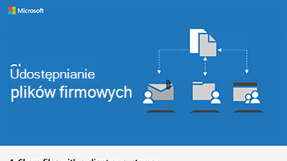

# Udostępnianie plików i filmów wideo w bezpiecznym środowisku

Kolejną rzeczą, na którą należy zwrócić uwagę, jest zapewnienie wszystkim członkom organizacji kontroli, kto może wyświetlać i edytować pliki, oraz że są one przechowywane w bezpiecznej lokalizacji z odpowiednimi uprawnieniami. Microsoft 365 Business Premium użytkownicy mogą używać usługi Microsoft Teams do przechowywania plików, a następnie udostępniać pliki wewnątrz lub na zewnątrz firmy, ćwiczyć lub prowadzić kampanię. Możesz również wysłać link programu SharePoint. Wysłanie linku zamiast załącznika wiadomości e-mail oznacza, że wiesz, kto wyświetla i modyfikuje pliki, i nie można ich wyświetlać ani modyfikować bez uprawnień.

Dzięki plikom w aplikacjach Microsoft Teams i SharePoint można również pracować nad plikami i przeglądać je razem, nawet śledząc zmiany w razie potrzeby. W usłudze Teams pliki są udostępniane wewnątrz firmy, praktyki lub kampanii. Jeśli musisz udostępnić je zewnętrznie osobom spoza organizacji, możesz dodać ich jako gości do zespołu lub wysłać im bezpieczny link programu SharePoint.

Możesz również użyć Microsoft Stream, aby przechowywać i udostępniać filmy wideo wewnętrznie. Te filmy wideo nie są widoczne publicznie, dlatego są idealne do obsługi wewnętrznych wiadomości firmowych lub kampanii.

## Najważniejsze wskazówki

Upewnij się, że użytkownicy używają tych metod do bezpiecznego udostępniania plików i filmów wideo:

1. Przechowuj pliki w usłudze Microsoft Teams lub SharePoint i upewnij się, że mają je tylko osoby, które potrzebują dostępu do tych plików.
2. Jeśli chcesz udostępnić, nie dołączaj plików do wiadomości e-mail. Zamiast tego wybierz pozycję **Pobierz link** z usługi Microsoft Teams lub SharePoint i wyślij link w wiadomości e-mail.
3. Aby udostępnić plik zewnętrznie, dodaj użytkownika jako gościa do swojego zespołu lub użyj programu SharePoint, aby uzyskać bezpieczny link do udostępniania tylko tego pliku.
4. Użyj Microsoft Stream, aby hostować filmy wideo, które chcesz zobaczyć w kampanii.
5. Usługa Microsoft Teams lub SharePoint umożliwia przechowywanie plików wideo potrzebnych zespołowi do współpracy lub udostępniania.

## Konfiguruj

Członkowie organizacji mogą utworzyć zespół i dodać do niego gości, takich jak reklamodawcy lub partnerzy finansowi, wykonując następujące kroki.

> [!VIDEO https://www.microsoft.com/videoplayer/embed/RE1FQMp]

Aby udostępnić bezpieczny link gościowi bez korzystania z usługi Microsoft Teams, wykonaj następujące kroki.

> [!VIDEO https://www.microsoft.com/videoplayer/embed/RE22Yf0]

Aby tworzyć i udostępniać filmy wideo, wykonaj następujące kroki.

> [!VIDEO https://www.microsoft.com/videoplayer/embed/RWrv0F]

Pobierz infografikę w [formacie PDF](https://go.microsoft.com/fwlink/?linkid=2079435) lub [PowerPoint](https://go.microsoft.com/fwlink/?linkid=2079438) , aby uzyskać szybki przegląd sposobów udostępniania plików.

## Następny cel

Po ukończeniu tego celu [utwórz witrynę komunikacji](create-communications-site.md) dla swojego zespołu.

