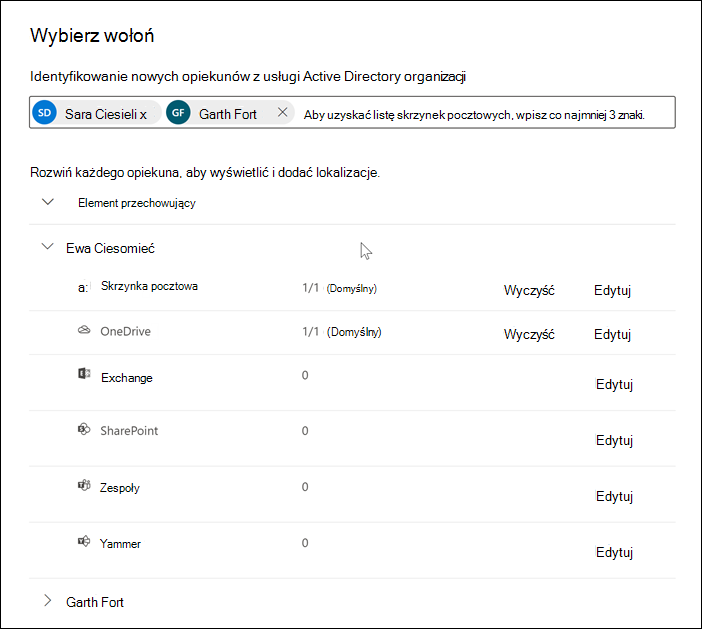

# Dodawanie opiekunów do sprawy Advanced eDiscovery

Użyj wbudowanego narzędzia do zarządzania opiekunami w Advanced eDiscovery, aby koordynować przepływy pracy związane z zarządzaniem opiekunami i identyfikowaniem odpowiednich źródeł danych opieki skojarzonych ze sprawą. Po dodaniu opiekuna system może automatycznie identyfikować i umieszczać blokady w skrzynce pocztowej Exchange i koncie OneDrive dla Firm. Podczas procesu odnajdywania badania możesz również zidentyfikować inne źródła danych (takie jak skrzynki pocztowe, witryny lub Teams), do których administrator uzyskiwał dostęp lub do których się przyczynił. W takiej sytuacji możesz użyć narzędzia do zarządzania opiekunem, aby skojarzyć te źródła danych, który będzie określonym opiekunem. Po dodaniu opiekunów do sprawy i skojarzeniu z nimi innego źródła danych można szybko zachować dane i przeszukać dane powiernicze.

Możesz dodawać opiekunów i zarządzać nimi w Advanced eDiscovery przypadkach w czterech krokach:

1. Zidentyfikuj opiekunów.

2. Wybierz lokalizacje danych opiekuna.

3. Konfigurowanie ustawień blokady.

4. Przejrzyj opiekunów i ukończ proces.

## Upewnij się, że masz niezbędne uprawnienia

Aby dodać opiekunów do sprawy, musisz być członkiem grupy ról menedżera zbierania elektronicznych materiałów dowodowych. Zapewnia to niezbędne uprawnienia do dodawania opiekunów do sprawy i wstrzymania źródeł danych nadzoru. Aby uzyskać więcej informacji, zobacz [Przypisywanie uprawnień zbierania elektronicznych materiałów dowodowych](get-started-with-advanced-ediscovery.md#step-2-assign-ediscovery-permissions).

## Krok 1. Identyfikowanie opiekunów

1. Przejdź do strony [https://compliance.microsoft.com](https://compliance.microsoft.com) i zaloguj się przy użyciu konta użytkownika, do których przypisano odpowiednie uprawnienia zbierania elektronicznych materiałów dowodowych.

2. W okienku nawigacji po lewej stronie Centrum zgodności platformy Microsoft 365 wybierz pozycję **eDiscovery** >  **Advanced eDiscovery** i wybierz kartę [**Sprawy**](https://go.microsoft.com/fwlink/p/?linkid=2173764).

3. Wybierz przypadek, do których chcesz dodać opiekunów.

4. Wybierz kartę **Źródła danych**, a następnie wybierz pozycję **Dodaj źródło** >  **danychDodaj nowych opiekunów**.

5. Dodaj co najmniej jednego użytkownika w organizacji jako opiekunów do sprawy, wpisując pierwszą część nazwiska lub aliasu osoby. Po znalezieniu właściwej osoby wybierz jej imię i nazwisko, aby dodać ją do listy.

## Krok 2. Wybieranie lokalizacji danych opiekuna

Po wybraniu opiekunów system automatycznie próbuje zidentyfikować i zweryfikować tych użytkowników i ich źródła danych. Po dodaniu opiekunów do listy narzędzie automatycznie zawiera podstawową skrzynkę pocztową i konto OneDrive dla każdego opiekuna. Możesz wybrać, aby nie uwzględniać tych źródeł danych podczas dodawania opiekunów do sprawy.

Oprócz skrzynki pocztowej i konta OneDrive opiekuna można również skojarzyć inne lokalizacje danych z opiekunem, takie jak witryna SharePoint lub zespół firmy Microsoft, do których należy opiekun. Dzięki temu można zachowywać, zbierać, analizować i przeglądać zawartość w innych źródłach danych skojarzonych z opiekunami sprawy.

Aby usunąć zaznaczenie podstawowej skrzynki pocztowej i konta OneDrive dla opiekuna:

1. Rozwiń opiekuna, aby wyświetlić podstawowe lokalizacje danych, które zostały automatycznie skojarzone z każdym opiekunem.

2. Wybierz pozycję **Wyczyść** obok **pozycji Skrzynka pocztowa** lub **OneDrive**, aby usunąć skrzynkę pocztową lub konto OneDrive opiekuna z skojarzenia jako lokalizacji danych dla tego opiekuna.

   

Aby skojarzyć inne skrzynki pocztowe, witryny, Teams lub grupy Yammer z określonym opiekunem:

1. Rozwiń opiekuna, aby wyświetlić następujące usługi, aby skojarzyć lokalizacje danych z opiekunem. Kliknij pozycję **Edytuj** obok usługi, aby dodać lokalizację danych.

   - **Exchange**: użyj polecenia , aby skojarzyć inne skrzynki pocztowe z opiekunem. Wpisz w polu wyszukiwania nazwę lub alias (co najmniej trzy znaki) skrzynek pocztowych użytkownika lub grup dystrybucyjnych. Wybierz skrzynki pocztowe, które mają zostać przypisane do opiekuna, a następnie kliknij przycisk **Dodaj**.

   - **SharePoint**: Służy do kojarzenia witryn SharePoint z opiekunem. Wybierz witrynę na liście lub wyszukaj witrynę, wpisując adres URL w polu wyszukiwania. Wybierz witryny, które mają zostać przypisane do opiekuna, a następnie kliknij przycisk **Dodaj**.

   - **Teams**: służy do przypisywania Microsoft Teams opiekun jest obecnie członkiem. Wybierz zespoły, które mają zostać przypisane do opiekuna, a następnie kliknij przycisk **Dodaj**. Po dodaniu zespołu system automatycznie identyfikuje i lokalizuje skrzynkę pocztową SharePoint lokacji i grupy skojarzoną z tym zespołem i przypisuje je do opiekuna.

   - **Yammer**: użyj polecenia , aby przypisać grupy Yammer, do których obecnie należy opiekun. Wybierz grupy, które mają zostać przypisane do opiekuna, a następnie kliknij przycisk **Dodaj**. Po dodaniu zespołu system automatycznie identyfikuje i lokalizuje skrzynkę pocztową SharePoint lokacji i grupy skojarzonej z tą grupą i przypisuje je do opiekuna.

   > [!NOTE]
   > Możesz użyć **selektorów lokalizacji Exchange** i **SharePoint**, aby skojarzyć dowolną skrzynkę pocztową lub witrynę w organizacji z opiekunem. , Obejmuje to skojarzenie skrzynki pocztowej i witryny dla zespołu firmy Microsoft lub grupy Yammer, do których opiekun nie jest członkiem. W tym celu należy dodać zarówno skrzynkę pocztową, jak i witrynę skojarzoną z każdym zespołem lub grupą Yammer.

2. Możesz wyświetlić całkowitą liczbę skrzynek pocztowych, witryn, Teams i grup Yammer przypisanych do każdego opiekuna, rozszerzając każdego opiekuna w tabeli. Po sfinalizowaniu przypisanych lokalizacji danych dla każdego opiekuna te skojarzenia będą utrzymywane i używane podczas etapów zbierania, przetwarzania i przeglądania w przepływie pracy Advanced eDiscovery.

3. Po dodaniu opiekunów i skonfigurowaniu ich lokalizacji danych kliknij przycisk **Dalej** , aby przejść do strony **Ustawienia blokady** .  

## Krok 3. Konfigurowanie ustawień blokady

 Po sfinalizowaniu opiekunów i ich lokalizacji danych możesz zawiesić niektórych lub wszystkich opiekunów. Po zatrzymaniu opiekuna cała zawartość we wszystkich lokalizacjach zawartości skojarzonych z opiekunem jest zachowywana do momentu usunięcia blokady lub zwolnienia opiekuna z blokady. W niektórych przypadkach możesz chcieć dodać opiekunów do sprawy bez umieszczania ich w zawieszeniu.

Aby wstrzymać opiekunów i źródła danych:

1. Na stronie **Ustawienia blokady** możesz zastosować blokadę do poszczególnych opiekunów, zaznaczając pole wyboru w kolumnie **Blokada** .

   Możesz też wstrzymać wszystkich opiekunów, wybierając pole wyboru **Wstrzymaj** w górnej części kolumny.

2. Sprawdź wybór blokady opiekuna, a następnie kliknij przycisk **Dalej**.

   > [!NOTE]
   > Jeśli nie wstrzymasz opiekuna, opiekun i skojarzone z nim źródła danych zostaną dodane do sprawy, ale zawartość tych źródeł danych nie zostanie zachowana przez blokadę skojarzoną ze sprawą.

## Krok 4. Przejrzyj opiekunów i ukończ proces

Przed faktycznym dodaniem opiekunów do sprawy możesz przejrzeć listę opiekunów, przypisane do nich lokalizacje danych i ustawienia blokady.

1. Sprawdź i przejrzyj wszystkie liczby źródeł danych oraz ustawienie blokady skojarzone z każdym opiekunem w tabeli. W razie potrzeby wróć do stron **Zidentyfikuj opiekuna** lub **Przytrzymaj ustawienia** , aby wprowadzić jakiekolwiek zmiany.

2. Kliknij **pozycję Prześlij** , aby dodać opiekunów i ich lokalizacje danych do sprawy i zastosować wszystkie ustawienia blokady.

   Nowi opiekunowie są dodawani do sprawy i wyświetlani na karcie **Źródła danych** .

   
