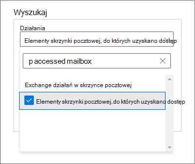
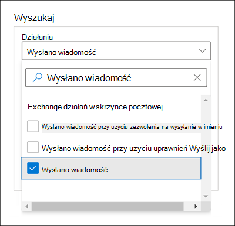
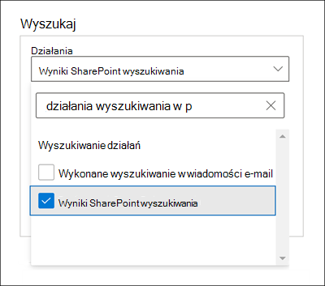

# Microsoft Purview Audit (Premium)

> [!TIP]
> *Czy wiesz, że możesz bezpłatnie wypróbować wersje premium wszystkich dziewięciu rozwiązań Usługi Microsoft Purview?* Skorzystaj z 90-dniowej wersji próbnej rozwiązań Purview, aby dowiedzieć się, jak niezawodne możliwości usługi Purview mogą pomóc organizacji spełnić jej potrzeby w zakresie zgodności. Microsoft 365 E3 i Office 365 E3 klienci mogą rozpocząć pracę w [centrum wersji próbnych portalu zgodności usługi Microsoft Purview](https://compliance.microsoft.com/trialHorizontalHub?sku=ComplianceE5&ref=DocsRef). Dowiedz się więcej o [tym, kto może zarejestrować się i zapoznać się z postanowieniami dotyczącymi wersji próbnej](compliance-easy-trials.md).

[!include[Purview banner](../includes/purview-rebrand-banner.md)]

[Funkcja Inspekcja](search-the-audit-log-in-security-and-compliance.md) w usłudze Microsoft Purview zapewnia organizacjom wgląd w wiele typów inspekcji działań w wielu różnych usługach w Microsoft 365. Inspekcja usługi Microsoft Purview (Premium) pomaga organizacjom w prowadzeniu badań kryminalistycznych i zgodności poprzez zwiększenie przechowywania dzienników inspekcji wymaganych do przeprowadzenia badania, zapewnienie dostępu do kluczowych zdarzeń (przy użyciu wyszukiwania dzienników inspekcji w portalu zgodności usługi Microsoft Purview i interfejsie API działania zarządzania Office 365), które pomagają określić zakres naruszenia zabezpieczeń i szybszy dostęp do interfejs API działań zarządzania Office 365.

> [!NOTE]
> Inspekcja (Premium) jest dostępna dla organizacji z subskrypcją Office 365 E5/A5/G5 lub Microsoft 365 Enterprise E5/A5/G5. Licencja dodatku Microsoft 365 E5/A5/G5 Compliance lub E5/A5/G5 eDiscovery and Audit powinna być przypisana do użytkowników funkcji inspekcji (Premium), takich jak długoterminowe przechowywanie dzienników inspekcji i generowanie zdarzeń inspekcji (Premium) na potrzeby badań. Aby uzyskać więcej informacji na temat licencjonowania, zobacz: - [Wymagania dotyczące licencjonowania inspekcji (Premium)](auditing-solutions-overview.md#licensing-requirements) - [Microsoft 365 wskazówki dotyczące licencjonowania dotyczące zgodności & zabezpieczeń](/office365/servicedescriptions/microsoft-365-service-descriptions/microsoft-365-tenantlevel-services-licensing-guidance/microsoft-365-security-compliance-licensing-guidance#advanced-audit).

W tym artykule przedstawiono omówienie funkcji inspekcji (Premium) i pokazano, jak skonfigurować użytkowników na potrzeby inspekcji (Premium).

## Długoterminowe przechowywanie dzienników inspekcji

Inspekcja (Premium) zachowuje wszystkie rekordy inspekcji Exchange, SharePoint i Azure Active Directory przez jeden rok. Jest to realizowane przez domyślne zasady przechowywania dziennika inspekcji, które zachowują dowolny rekord inspekcji zawierający wartość **Exchange**, **SharePoint** lub **AzureActiveDirectory** dla właściwości **Obciążenie** (co wskazuje usługę, w której wystąpiło działanie) przez jeden rok. Przechowywanie rekordów inspekcji przez dłuższy czas może pomóc w prowadzenia dalszych dochodzeń kryminalistycznych lub dotyczących zgodności. Aby uzyskać więcej informacji, zobacz sekcję "Domyślne zasady przechowywania dziennika inspekcji" w [temacie Zarządzanie zasadami przechowywania dzienników inspekcji](audit-log-retention-policies.md#default-audit-log-retention-policy).

Oprócz możliwości rocznego przechowywania funkcji Inspekcja (Premium) opublikowaliśmy również możliwość przechowywania dzienników inspekcji przez 10 lat. 10-letnie przechowywanie dzienników inspekcji pomaga wspierać długotrwałe dochodzenia i reagować na zobowiązania regulacyjne, prawne i wewnętrzne.

> [!NOTE]
> Przechowywanie dzienników inspekcji przez 10 lat będzie wymagało dodatkowej licencji dodatku dla poszczególnych użytkowników. Po przypisaniu tej licencji do użytkownika i ustawieniu odpowiednich 10-letnich zasad przechowywania dzienników inspekcji dla tego użytkownika dzienniki inspekcji objęte tymi zasadami zaczną być przechowywane przez okres 10 lat. Te zasady nie są wsteczne i nie mogą zachowywać dzienników inspekcji, które zostały wygenerowane przed utworzeniem 10-letnich zasad przechowywania dzienników inspekcji. Aby uzyskać więcej informacji, zobacz sekcję [Często zadawane pytania dotyczące inspekcji (Premium)](#faqs-for-audit-premium) w tym artykule.

### Zasady przechowywania dzienników inspekcji

Wszystkie rekordy inspekcji wygenerowane w innych usługach, które nie są objęte domyślnymi zasadami przechowywania dzienników inspekcji (opisanymi w poprzedniej sekcji) są przechowywane przez 90 dni. Można jednak utworzyć niestandardowe zasady przechowywania dzienników inspekcji, aby zachować inne rekordy inspekcji przez dłuższy czas do 10 lat. Można utworzyć zasady do przechowywania rekordów inspekcji na podstawie co najmniej jednego z następujących kryteriów:

- Usługa Microsoft 365, w której są wykonywane inspekcje działań.

- Konkretne działania poddane inspekcji.

- Użytkownik, który wykonuje inspekcję działania.

Można również określić, jak długo mają być przechowywane rekordy inspekcji zgodne z zasadami i poziomem priorytetu, dzięki czemu określone zasady będą mieć pierwszeństwo przed innymi zasadami. Należy również pamiętać, że wszelkie niestandardowe zasady przechowywania dzienników inspekcji będą mieć pierwszeństwo przed domyślnymi zasadami przechowywania inspekcji w przypadku konieczności zachowania Exchange, SharePoint lub Azure Active Directory rekordów inspekcji przez mniej niż rok (lub przez 10 lat) dla niektórych lub wszystkich użytkowników w organizacji. Aby uzyskać więcej informacji, zobacz [Zarządzanie zasadami przechowywania dzienników inspekcji](audit-log-retention-policies.md).

## Inspekcja (Premium) zdarzeń

Inspekcja (Premium) pomaga organizacjom w prowadzeniu badań kryminalistycznych i zgodności, zapewniając dostęp do ważnych zdarzeń, takich jak czas uzyskiwania dostępu do elementów poczty, kiedy elementy poczty zostały przekazane i przekazane, oraz kiedy i co użytkownik szukał w Exchange Online i SharePoint Online. Te zdarzenia mogą pomóc w zbadaniu możliwych naruszeń i określeniu zakresu naruszenia zabezpieczeń. Oprócz tych zdarzeń w Exchange i SharePoint istnieją zdarzenia w innych usługach Microsoft 365, które są uważane za ważne zdarzenia i wymagają, aby użytkownikom przypisano [odpowiednią licencję inspekcji (Premium](auditing-solutions-overview.md#licensing-requirements)). Użytkownicy muszą mieć przypisaną licencję Inspekcja (Premium), aby dzienniki inspekcji były generowane podczas wykonywania tych zdarzeń przez użytkowników.

Inspekcja (Premium) zawiera następujące zdarzenia:

- [MailItemsAccessed](#mailitemsaccessed)

- [Wyślij](#send)

- [SearchQueryInitiatedExchange](#searchqueryinitiatedexchange)

- [SearchQueryInitiatedSharePoint](#searchqueryinitiatedsharepoint)

- [Inne zdarzenia inspekcji (Premium) w Microsoft 365](#other-audit-premium-events-in-microsoft-365)

### MailItemsAccessed

Zdarzenie MailItemsAccessed jest akcją inspekcji skrzynki pocztowej i jest wyzwalane, gdy dostęp do danych poczty jest uzyskiwany przez protokoły poczty i klientów poczty. To zdarzenie może pomóc śledczym zidentyfikować naruszenia danych i określić zakres komunikatów, które mogły zostać naruszone. Jeśli osoba atakująca uzyska dostęp do wiadomości e-mail, akcja MailItemsAccessed zostanie wyzwolona, nawet jeśli nie będzie jawnego sygnału, że komunikaty zostały faktycznie odczytane (innymi słowy, typ dostępu, taki jak powiązanie lub synchronizacja, jest rejestrowany w rekordzie inspekcji).

Zdarzenie MailItemsAccessed zastępuje element MessageBind w logowaniu inspekcji skrzynki pocztowej w Exchange Online i zapewnia następujące ulepszenia:

- Element MessageBind można było skonfigurować tylko dla typu logowania użytkownika AuditAdmin; nie dotyczy akcji pełnomocnika ani właściciela. Funkcja MailItemsAccessed ma zastosowanie do wszystkich typów logowania.

- Element MessageBind obejmował dostęp tylko przez klienta poczty. Nie dotyczy działań synchronizacji. Zdarzenia MailItemsAccessed są wyzwalane zarówno przez typy dostępu powiązania, jak i synchronizacji.

- Akcje MessageBind wyzwalałyby tworzenie wielu rekordów inspekcji po uzyskaniu dostępu do tej samej wiadomości e-mail, co spowodowało inspekcję "szumu". Natomiast zdarzenia MailItemsAccessed są agregowane w mniejszej liczbie rekordów inspekcji.

Aby uzyskać informacje o rekordach inspekcji dla działań MailItemsAccessed, zobacz [Używanie inspekcji (Premium) do badania kont, których zabezpieczenia zostały naruszone](mailitemsaccessed-forensics-investigations.md).

Aby wyszukać rekordy inspekcji MailItemsAccessed, możesz wyszukać działanie **Elementy dostępu do skrzynki pocztowej** na liście rozwijanej **działań Exchange skrzynki pocztowej** w [narzędziu do wyszukiwania dzienników inspekcji](search-the-audit-log-in-security-and-compliance.md) w portalu zgodności.

Możesz również uruchomić polecenia [Search-UnifiedAuditLog -Operations MailItemsAccessed](/powershell/module/exchange/search-unifiedauditlog) lub [Search-MailboxAuditLog -Operations MailItemsAccessed](/powershell/module/exchange/search-mailboxauditlog) w programie Exchange Online programu PowerShell.

### Wyślij

Zdarzenie Wyślij jest również akcją inspekcji skrzynki pocztowej i jest wyzwalane, gdy użytkownik wykonuje jedną z następujących akcji:

- Wysyła wiadomość e-mail

- Odpowiedzi na wiadomość e-mail

- Przekazuje wiadomość e-mail

Śledczy mogą użyć zdarzenia Wyślij, aby zidentyfikować wiadomość e-mail wysłaną z konta, którego zabezpieczenia zostały naruszone. Rekord inspekcji dla zdarzenia Wyślij zawiera informacje o wiadomości, na przykład o tym, kiedy wiadomość została wysłana, identyfikator InternetMessage, wiersz tematu i czy wiadomość zawierała załączniki. Te informacje inspekcji mogą pomóc śledczym zidentyfikować informacje o wiadomościach e-mail wysyłanych z konta z naruszeniem zabezpieczeń lub wysyłanych przez osobę atakującą. Ponadto badacze mogą użyć narzędzia do zbierania elektronicznych materiałów dowodowych Microsoft 365 w celu wyszukania wiadomości (przy użyciu wiersza tematu lub identyfikatora wiadomości) w celu zidentyfikowania adresatów, do których wysłano wiadomość, oraz rzeczywistej zawartości wysłanej wiadomości.

Aby wyszukać pozycję Wyślij rekordy inspekcji, możesz wyszukać działanie **Wysłane wiadomości** na liście rozwijanej **działań skrzynki pocztowej Exchange** w [narzędziu do wyszukiwania dzienników inspekcji](search-the-audit-log-in-security-and-compliance.md) w portalu zgodności.

Możesz również uruchomić polecenia [Search-UnifiedAuditLog -Operations Send](/powershell/module/exchange/search-unifiedauditlog) lub [Search-MailboxAuditLog -Operations Send](/powershell/module/exchange/search-mailboxauditlog) w programie Exchange Online programu PowerShell.

### SearchQueryInitiatedExchange

Zdarzenie SearchQueryInitiatedExchange jest wyzwalane, gdy dana osoba używa Outlook do wyszukiwania elementów w skrzynce pocztowej. Zdarzenia są wyzwalane, gdy wyszukiwania są wykonywane w następujących środowiskach Outlook:

- Outlook (klient klasyczny)

- Outlook w sieci Web (OWA)

- Outlook dla systemu iOS

- Outlook dla systemu Android

- Aplikacja poczty dla Windows 10

Śledczy mogą użyć zdarzenia SearchQueryInitiatedExchange, aby ustalić, czy osoba atakująca, która mogła naruszyć bezpieczeństwo konta, szukała lub próbowała uzyskać dostęp do poufnych informacji w skrzynce pocztowej. Rekord inspekcji zdarzenia SearchQueryInitiatedExchange zawiera informacje, takie jak rzeczywisty tekst zapytania wyszukiwania. Rekord inspekcji wskazuje również środowisko Outlook, w których przeprowadzono wyszukiwanie. Analizując zapytania wyszukiwania, które mogła wykonać osoba atakująca, badacz może lepiej zrozumieć intencję wyszukiwanych danych poczty e-mail.

Aby wyszukać rekordy inspekcji SearchQueryInitiatedExchange, możesz wyszukać działanie **Wykonywane wyszukiwanie poczty e-mail** na liście rozwijanej **Działania wyszukiwania** w [narzędziu do wyszukiwania dzienników inspekcji](search-the-audit-log-in-security-and-compliance.md) w centrum zgodności.

Możesz również uruchomić polecenie [Search-UnifiedAuditLog -Operations SearchQueryInitiatedExchange](/powershell/module/exchange/search-unifiedauditlog) w programie Exchange Online programu PowerShell.

> [!NOTE]
> Aby można było wyszukać to zdarzenie w dzienniku inspekcji, należy włączyć funkcję SearchQueryInitiatedExchange. Aby uzyskać instrukcje, zobacz [Konfigurowanie inspekcji (Premium)](set-up-advanced-audit.md#step-2-enable-audit-premium-events).

### SearchQueryInitiatedSharePoint

Podobnie jak w przypadku wyszukiwania elementów skrzynki pocztowej, zdarzenie SearchQueryInitiatedSharePoint jest wyzwalane, gdy osoba wyszukuje elementy w SharePoint. Zdarzenia są wyzwalane, gdy wyszukiwania są wykonywane na stronie głównej lub domyślnej następujących typów witryn SharePoint:

- Strony główne

- Witryny komunikacyjne

- Lokacje piasty

- Witryny skojarzone z Microsoft Teams

Śledczy mogą użyć zdarzenia SearchQueryInitiatedSharePoint, aby ustalić, czy osoba atakująca próbowała znaleźć (i ewentualnie uzyskać dostęp) do poufnych informacji w SharePoint. Rekord inspekcji dla zdarzenia SearchQueryInitiatedSharePoint zawiera również rzeczywisty tekst zapytania wyszukiwania. Rekord inspekcji wskazuje również typ przeszukiwanej witryny SharePoint. Analizując zapytania wyszukiwania, które mogła wykonać osoba atakująca, badacz może lepiej zrozumieć intencję i zakres wyszukiwanych danych pliku.

Aby wyszukać rekordy inspekcji SearchQueryInitiatedSharePoint, możesz wyszukać działanie **wykonywane SharePoint wyszukiwania** na liście rozwijanej **Działania wyszukiwania** w [narzędziu do wyszukiwania dzienników inspekcji](search-the-audit-log-in-security-and-compliance.md) w centrum zgodności.

Możesz również uruchomić program [Search-UnifiedAuditLog -Operations SearchQueryInitiatedSharePoint](/powershell/module/exchange/search-unifiedauditlog) w programie Exchange Online programu PowerShell.

> [!NOTE]
> Aby można było wyszukać to zdarzenie w dzienniku inspekcji, należy włączyć rejestrowanie programu SearchQueryInitiatedSharePoint. Aby uzyskać instrukcje, zobacz [Konfigurowanie inspekcji (Premium)](set-up-advanced-audit.md#step-2-enable-audit-premium-events).

### Inne zdarzenia inspekcji (Premium) w Microsoft 365

Oprócz zdarzeń w Exchange Online i SharePoint Online istnieją zdarzenia w innych usługach Microsoft 365, które są rejestrowane, gdy użytkownikom przypisano odpowiednie licencjonowanie inspekcji (Premium). Następujące usługi Microsoft 365 zapewniają zdarzenia inspekcji (Premium). Wybierz odpowiedni link, aby przejść do artykułu, który identyfikuje i opisuje te zdarzenia.

- [Microsoft Forms](search-the-audit-log-in-security-and-compliance.md#microsoft-forms-activities)

- [Microsoft Stream](/stream/audit-logs#actions-logged-in-stream)

- [Microsoft Teams](/microsoftteams/audit-log-events#teams-activities)

- [Yammer](search-the-audit-log-in-security-and-compliance.md#yammer-activities)

## Dostęp o wysokiej przepustowości do interfejsu API działania zarządzania Office 365

Organizacje uzyskujące dostęp do dzienników inspekcji za pośrednictwem interfejsu API działania zarządzania Office 365 zostały ograniczone przez ograniczenia przepustowości na poziomie wydawcy. Oznacza to, że w przypadku wydawcy ściągającego dane w imieniu wielu klientów limit został udostępniony przez wszystkich tych klientów.

Wraz z wydaniem funkcji Inspekcja (Premium) przechodzimy z limitu na poziomie wydawcy do limitu na poziomie dzierżawy. W rezultacie każda organizacja uzyska własny w pełni przydzielony limit przydziału przepustowości w celu uzyskania dostępu do danych inspekcji. Przepustowość nie jest statycznym, wstępnie zdefiniowanym limitem, ale jest modelowana na podstawie kombinacji czynników, w tym liczby miejsc w organizacji i że organizacje E5/A5/G5 uzyskają większą przepustowość niż organizacje spoza E5/A5/G5.

Wszystkie organizacje są początkowo przydzielane punkt odniesienia 2000 żądań na minutę. Ten limit będzie dynamicznie zwiększany w zależności od liczby miejsc w organizacji i subskrypcji licencjonowania. Organizacje E5/A5/G5 otrzymają około dwa razy większą przepustowość niż organizacje spoza E5/A5/G5. Zostanie również określony limit maksymalnej przepustowości w celu ochrony kondycji usługi.

Aby uzyskać więcej informacji, zobacz sekcję "Ograniczanie przepustowości interfejsu API" w [dokumentacji interfejsu API działania zarządzania Office 365](/office/office-365-management-api/office-365-management-activity-api-reference#api-throttling).

## Często zadawane pytania dotyczące inspekcji (Premium)

**Czy każdy użytkownik potrzebuje licencji E5/A5/G5, aby skorzystać z inspekcji (Premium)?**

Aby korzystać z możliwości inspekcji na poziomie użytkownika (Premium), użytkownik musi mieć przypisaną licencję E5/A5/G5. Istnieją pewne możliwości, które będą sprawdzać, czy odpowiednia licencja ma uwidoczniać funkcję dla użytkownika. Jeśli na przykład próbujesz zachować rekordy inspekcji dla użytkownika, któremu nie przypisano odpowiedniej licencji dłużej niż 90 dni, system zwróci komunikat o błędzie.

**Moja organizacja ma subskrypcję E5/A5/G5, czy muszę zrobić wszystko, aby uzyskać dostęp do rekordów inspekcji zdarzeń inspekcji (Premium)?**

W przypadku uprawnionych klientów i użytkowników, do których przypisano odpowiednią licencję E5/A5/G5, nie trzeba wykonywać żadnych działań w celu uzyskania dostępu do zdarzeń inspekcji (Premium), z wyjątkiem włączenia zdarzeń SearchQueryInitiatedExchange i SearchQueryInitiatedSharePoint (zgodnie z wcześniejszym opisem w tym artykule). Zdarzenia inspekcji (Premium) będą generowane tylko dla użytkowników z licencjami E5/A5/G5 po przypisaniu tych licencji.

**Czy nowe zdarzenia w obszarze Inspekcja (Premium) są dostępne w interfejsie API działania zarządzania Office 365?**

Tak. Dopóki rekordy inspekcji są generowane dla użytkowników z odpowiednią licencją, będziesz mieć dostęp do tych rekordów za pośrednictwem interfejsu API działania zarządzania Office 365.

**Co się stanie z danymi dziennika inspekcji mojej organizacji, jeśli utworzę 10-letnie zasady przechowywania dzienników inspekcji, gdy funkcja została wydana do ogólnej dostępności, ale przed udostępnieniem wymaganej licencji dodatku?**

Wszystkie dane dziennika inspekcji objęte 10-letnimi zasadami przechowywania dzienników inspekcji utworzonymi po udostępnieniu funkcji do ogólnej dostępności w ostatnim kwartale 2020 r. zostaną zachowane przez 10 lat. Obejmuje to 10-letnie zasady przechowywania dzienników inspekcji, które zostały utworzone przed wydaniem wymaganej licencji dodatku do zakupu w marcu 2021 r. Jednak ponieważ 10-letnia licencja dodatku Przechowywania dzienników inspekcji jest teraz dostępna, należy zakupić i przypisać te licencje dodatków dla wszystkich użytkowników, których dane inspekcji są objęte 10-letnimi zasadami przechowywania inspekcji.
