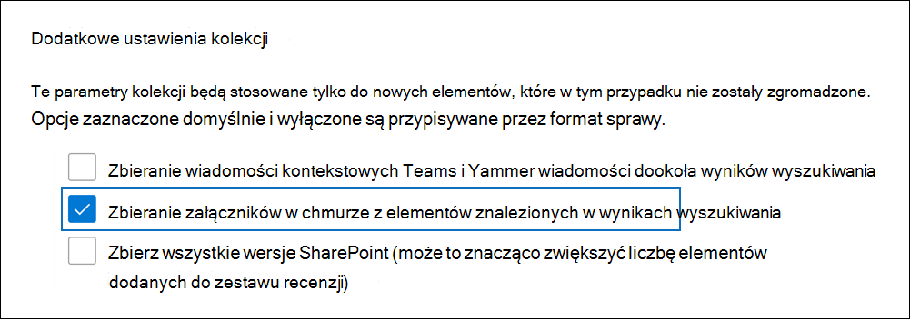
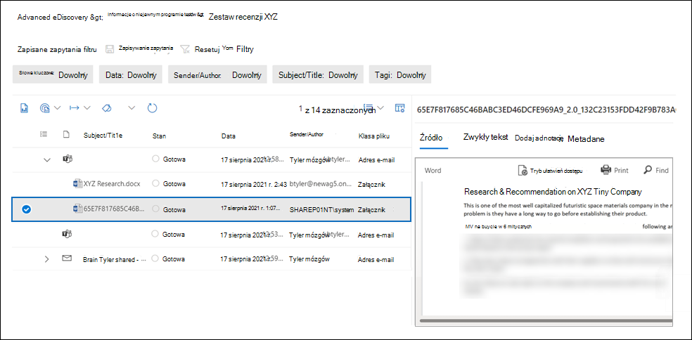

# Zbieranie załączników w chmurze Advanced eDiscovery (wersja zapoznawcza)

Załączniki w chmurze to linki do dokumentów zwykle przechowywanych w SharePoint sieci OneDrive. Zamiast dołączać rzeczywistą kopię dokumentu do wiadomości e-mail lub konwersacji na czacie Teams, możesz udostępnić link do pliku. Załączniki w chmurze to skuteczny sposób udostępniania dokumentów i współpracy z innymi osobami w organizacji. Jednak załączniki w chmurze mają duże wyzwania podczas przepływu pracy zbierania elektronicznych materiałów dowodowych, ponieważ podczas wyszukiwania zbierania elektronicznych materiałów dowodowych zwracany jest tylko link załącznika w chmurze, a nie rzeczywista zawartość w dokumencie udostępnionym. Aby rozwiązać ten problem, Advanced eDiscovery dwa rozwiązania do zbierania załączników w chmurze:  

- Zbieranie informacji o wersji dokumentu połączonej z załącznikiem w chmurze.

- Zbieranie wersji dokumentu w czasie jego współużytkowania w załączniku w chmurze.

## Zbieranie załączników w chmurze

Gdy tworzysz kolekcję roboczą, a wyniki wyszukiwania zawierają elementy zawierające załączniki w chmurze, masz możliwość zbierania obiektu docelowego załącznika w chmurze po zatwierdzeniu wersji roboczej kolekcji do zestawu recenzji. Po wybraniu tej opcji program Advanced eDiscovery dokumenty połączone z załącznikiem w chmurze do zestawu recenzji. Umożliwia to przejrzenie dokumentów docelowych i ustalenie, czy dokument jest istotny dla prowadzonej sprawy lub śledztwa.

Poniższy zrzut ekranu przedstawia opcję dołączania celów załączników w chmurze po zatwierdzeniu kolekcji do zestawu recenzji.

> [!NOTE]
>- Jeśli używasz nowego formatu  liter w programie Advanced eDiscovery, opcja dołączania załączników w chmurze w zestawie recenzji jest domyślnie zaznaczona i nie można jej wyczyszczynić. 
>- Możesz także uwzględnić w zestawie recenzji wszystkie wersje załączników w chmurze (oprócz udostępnionej wersji).  
Aby uzyskać instrukcje dotyczące zatwierdzania kolekcji do zestawu recenzji, zobacz [Zatwierdzanie wersji roboczej kolekcji do zestawu recenzji](commit-draft-collection.md).

## Zbieranie wersji udostępnionej w załączniku w chmurze

Przepływ Advanced eDiscovery do zbierania załączników w chmurze obejmuje tylko dodanie najnowszej wersji załącznika w chmurze do zestawu recenzji. Oznacza to, że wersja zbierana i dodana do zestawu recenzji może być inna niż wersja pierwotnie udostępniona w załączniku w chmurze. Istnieje zatem możliwość, że zawartość, która była obecna w załączniku w chmurze w czasie jej udostępniania, mogła zostać usunięta i nie istnieje w bieżącej wersji dodanej do zestawu recenzji.

Organizacje mogą teraz używać etykiet przechowywania Microsoft 365 przechowywania, aby zachować wersję dokumentu w momencie jego udostępnić jako załącznik w chmurze. W tym celu twoja organizacja może utworzyć etykietę przechowywania, wybrać opcję zastosuj etykietę do załączników w chmurze, a następnie automatycznie zastosować tę etykietę do dokumentów przechowywanych w usłudze SharePoint i OneDrive. Po skonfigurowaniu tej konfiguracji kopia dokumentu jest tworzona w momencie jego udostępniania. Ponadto jeśli dokument zostanie zmodyfikowany i ponownie udostępniony jako załącznik w chmurze, zmodyfikowana wersja również zostanie zachowana. Jeśli plik zostanie zmodyfikowany i ponownie udostępniony, nowa kopia pliku w nowej wersji zostanie zachowana.

Zachowanie udostępnionych wersji załączników w chmurze może pomóc organizacji w zakresie zachowywania i zbierania potencjalnie istotnej zawartości do określonej wersji udostępnionego dokumentu, a nie do bieżącej wersji na żywo. Po zaimplementowaniu tego rozwiązania przechowywania zarówno bieżąca wersja załącznika w chmurze, jak i wersja, która została udostępniona w załączniku w chmurze, są zbierane i dodawane do zestawu recenzji.

Aby uzyskać instrukcje dotyczące konfigurowania etykiety przechowywania i automatycznego stosowania jej do załączników w chmurze, zobacz Automatyczne stosowanie etykiet [do załączników w chmurze](apply-retention-labels-automatically.md#auto-apply-labels-to-cloud-attachments).

Poniższy zrzut ekranu przedstawia dokument załącznika w chmurze o nazwie *XYZ Research.docx*, który został dodany do zestawu recenzji. Dokument został udostępniony jako załącznik w chmurze w Teams konwersacji na czacie. Zestaw recenzji zawiera również wersję, która została pierwotnie udostępniona w załączniku w chmurze. Zwróć uwagę, że system generuje nazwę tej wersji załącznika w chmurze, a autor jest identyfikowany jako **SharePoint**.

Ponadto bieżąca wersja na żywo i udostępniona wersja mają tę samą wartość właściwości **FamilyId**, która jest taka sama jak wartość **FamilyId** obiektu nadrzędnego (na przykład wiadomość e-mail lub konwersacja na czacie Teams wiadomości). Umożliwia to grupowanie załączników w chmurze przy użyciu elementu, w którym zostały udostępnione.

Po zaimplementowaniu etykiety przechowywania i automatycznym zastosowaniu tej etykiety do dokumentów programu SharePoint nadal wybierasz opcję zbierania załączników w chmurze po zatwierdzeniu wersji roboczej kolekcji do zestawu recenzji. Podczas zbierania załączników w chmurze do zestawu recenzji są dodawane zarówno bieżąca wersja na żywo, jak i wersja, która została pierwotnie udostępniona.
