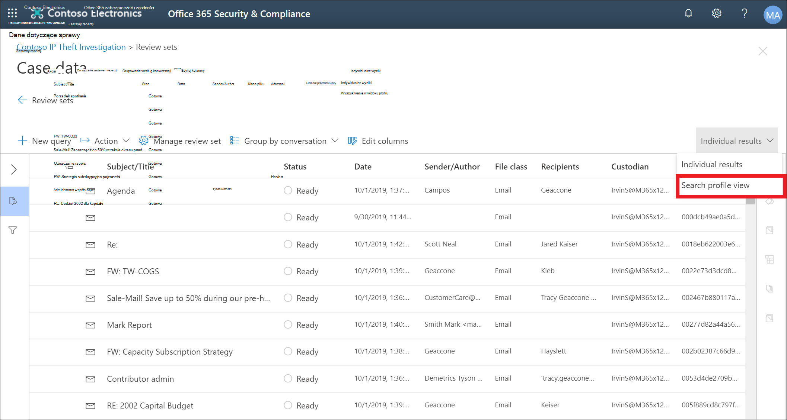

# Pulpit nawigacyjny zbierania elektronicznych materiałów dowodowych (Premium) na potrzeby zestawów przeglądów

[!include[Purview banner](../includes/purview-rebrand-banner.md)]

W niektórych przypadkach w usłudze Microsoft Purview eDiscovery (Premium) może istnieć duża liczba dokumentów i wiadomości e-mail, które należy przejrzeć. Przed rozpoczęciem procesu przeglądu możesz szybko przeanalizować swoje ciało, aby zidentyfikować trendy lub kluczowe statystyki, które pomogą Ci opracować strategię przeglądu. W tym celu możesz użyć pulpitu nawigacyjnego zbierania elektronicznych elektronicznych materiałów dowodowych (Premium) na potrzeby zestawów przeglądów, aby szybko przeanalizować swoje ciało.

## Krok 1. Tworzenie widżetu na pulpicie nawigacyjnym zestawu przeglądów

1. W portalu zgodności usługi Microsoft Purview przejdź do obszaru **eDiscovery > eDiscovery (Premium),** aby wyświetlić listę przypadków w organizacji.
  
2. Wybierz istniejący przypadek.
  
3. Kliknij kartę **Przejrzyj zestaw** , a następnie wybierz zestaw przeglądów.
  
4. Na liście rozwijanej **Indywidualne wyniki** kliknij pozycję **Widok profilu wyszukiwania**. 

   

   Zostanie wyświetlona strona **Widok profilu wyszukiwania** . podczas pierwszego wyświetlania tej strony zostaną wyświetlone trzy domyślne widżety.

   
  
5. Kliknij **widżet Nowy,** a następnie wybierz jeden z następujących elementów:

   

   - **Wybierz z biblioteki:** Wyświetla domyślną bibliotekę widżetów. Kliknij widżet, a następnie kliknij przycisk **Dodaj** , aby dodać go do widżetów na stronie **Widok profilu wyszukiwania** .
  
   - **Utwórz niestandardowy widżet:** Wyświetla stronę wysuwaną, za pomocą którego można skonfigurować niestandardowy widżet. 

6. Aby utworzyć niestandardowy widżet, wykonaj następujące czynności na stronie wysuwanej **dodawanie widżetu** :

   

    a. Wpisz nazwę widżetu, która jest wyświetlana na pasku tytułu widżetu. Nazwa widżetu jest wymagana, ale warto zidentyfikować dane widżetu.

    b. Wybierz właściwość z listy rozwijanej **Wybieranie tabeli przestawnej** , która będzie używana dla danych widżetu. Elementy na tej liście są właściwościami, które można przeszukiwać dla elementów w zestawie przeglądów. Opis tych właściwości można znaleźć [w temacie Document metadata fields in eDiscovery (Premium) (Pola metadanych dokumentu w Premium).](document-metadata-fields-in-Advanced-eDiscovery.md) Opcje tabeli przestawnej dla widżetu są wyświetlane w kolumnie **Nazwa pola z możliwością wyszukiwania** w tym temacie.

    c. Wybierz typ wykresu, aby wyświetlić dane z wybranej właściwości tabeli przestawnej.

  6. Kliknij **przycisk Dodaj** , aby utworzyć niestandardowy widżet i wyświetlić go na stronie **Widok profilu wyszukiwania** .

## Krok 2. Tworzenie zapytania wyszukiwania zestawu przeglądów

1. Kliknij **przycisk ...** na pasku tytułu widżetu, a następnie kliknij przycisk **Zastosuj warunek**.

   

2. Na stronie wysuwanej kliknij element na kluczu widżetu lub wykresie widżetu, aby utworzyć filtr.

   

3. Powtórz kroki 1–2 dla innych widżetów z wieloma widżetami. 

4. Po zakończeniu kliknij pozycję **Zapisz jako zapytanie** , aby zapisać warunki jako nowe zapytanie wyszukiwania dla zestawu przeglądów.

   

5. Zamknij **widok Profilu wyszukiwania** , aby powrócić do widoku wyników wyszukiwania.

   Jeśli utworzono jakiekolwiek filtry wizualne, wynikowe zapytanie zostanie zastosowane do wyświetlanych wyników wyszukiwania, a zapytanie wyszukiwania zapisane w kroku 4 zostanie **wyświetlone w obszarze Zapisane zapytania**. Aby uzyskać więcej informacji na temat zapytań zestawu przeglądów, zobacz [Wykonywanie zapytań dotyczących danych w zestawie przeglądów](review-set-search.md).
