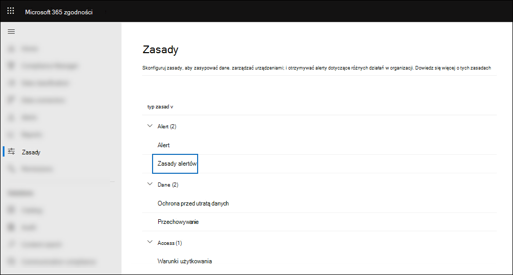
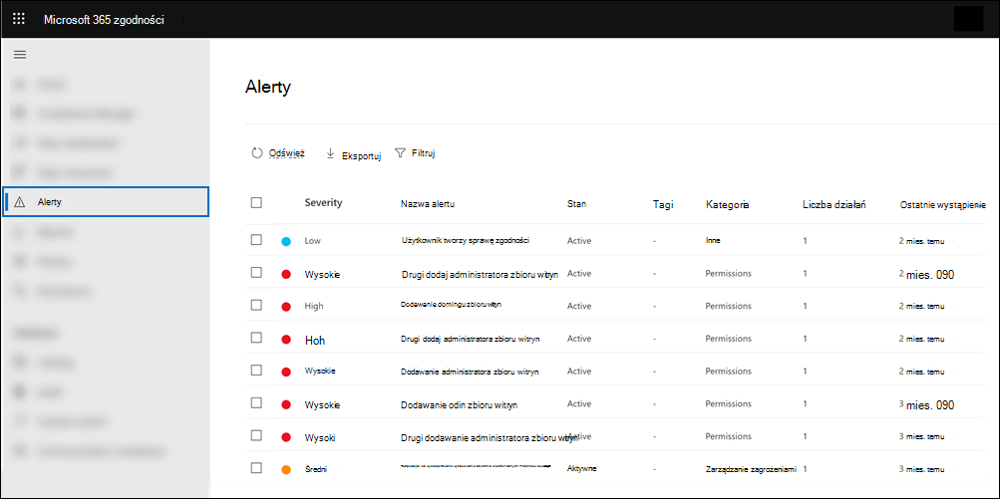
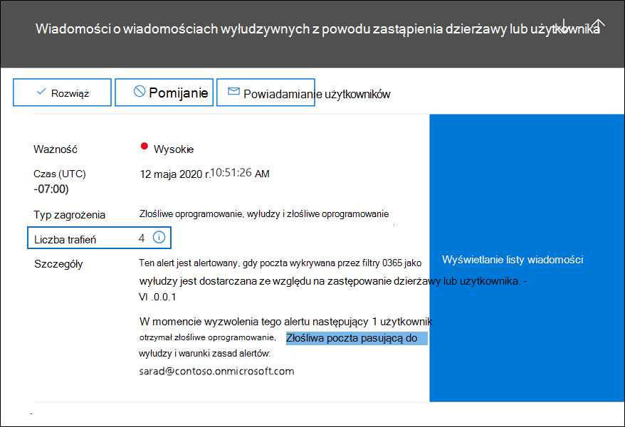
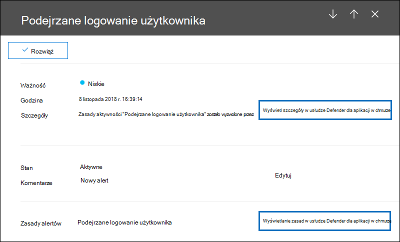

# <a name="alert-policies-in-microsoft-365"></a>Zasady alertów w Microsoft 365

[!include[Purview banner](../includes/purview-rebrand-banner.md)]

Zasady alertów i pulpit nawigacyjny alertów można użyć w portalu zgodności usługi Microsoft Purview lub portalu Microsoft 365 Defender, aby utworzyć zasady alertów, a następnie wyświetlić alerty wygenerowane, gdy użytkownicy wykonują działania zgodne z warunkami zasad alertów. Istnieje kilka domyślnych zasad alertów, które ułatwiają monitorowanie działań, takich jak przypisywanie uprawnień administratora w Exchange Online, ataki złośliwego oprogramowania, kampanie wyłudzania informacji oraz nietypowe poziomy usuwania plików i udostępniania zewnętrznego.

> [!TIP]
> Przejdź do sekcji [Domyślne zasady alertów](#default-alert-policies) w tym artykule, aby uzyskać listę i opis dostępnych zasad alertów.

Zasady alertów umożliwiają kategoryzowanie alertów wyzwalanych przez zasady, stosowanie zasad do wszystkich użytkowników w organizacji, ustawianie poziomu progu po wyzwoleniu alertu i podejmowanie decyzji, czy otrzymywać powiadomienia e-mail po wyzwoleniu alertów. Istnieje również strona **Alerty** , na której można wyświetlać i filtrować alerty, ustawiać stan alertu, aby ułatwić zarządzanie alertami, a następnie odrzucać alerty po rozwiązaniu lub rozwiązaniu podstawowego zdarzenia.

> [!NOTE]
> Zasady alertów są dostępne dla organizacji z subskrypcją Microsoft 365 Enterprise, Office 365 Enterprise lub Office 365 US Government E1/F1/G1, E3/F3/G3 lub E5/G5. Zaawansowane funkcje są dostępne tylko dla organizacji z subskrypcją E5/G5 lub dla organizacji, które mają subskrypcję E1/F1/G1 lub E3/F3/G3 i Ochrona usługi Office 365 w usłudze Microsoft Defender P2 lub Zgodność platformy Microsoft 365 E5 lub dodatek zbierania elektronicznych materiałów dowodowych i inspekcji E5 Subskrypcji. Funkcja wymagająca subskrypcji E5/G5 lub dodatku została wyróżniona w tym temacie. Należy również pamiętać, że zasady alertów są dostępne w środowiskach Office 365 GCC, GCC High i DoD US Government.

## <a name="how-alert-policies-work"></a>Jak działają zasady alertów

Oto krótkie omówienie sposobu działania zasad alertów i alertów wyzwalanych, gdy działanie użytkownika lub administratora odpowiada warunkom zasad alertów.


1. Administrator w organizacji tworzy, konfiguruje i włącza zasady alertów przy użyciu strony **Zasady alertów** w portalu zgodności lub portalu Microsoft 365 Defender. Zasady alertów można również utworzyć przy użyciu polecenia cmdlet [New-ProtectionAlert](/powershell/module/exchange/new-protectionalert) w programie PowerShell Centrum zgodności usługi Security &.

   Aby utworzyć zasady alertów, musisz mieć przypisaną rolę Zarządzaj alertami, rolę Konfiguracja organizacji w portalu zgodności lub portalu usługi Defender.

   > [!NOTE]
   > Tworzenie lub aktualizowanie zasad alertów trwa do 24 godzin, zanim zasady będą mogły wyzwalać alerty. Dzieje się tak, ponieważ zasady muszą zostać zsynchronizowane z aparatem wykrywania alertów.

2. Użytkownik wykonuje działanie zgodne z warunkami zasad alertu. W przypadku ataków złośliwego oprogramowania zainfekowane wiadomości e-mail wysyłane do użytkowników w organizacji wyzwalają alert.

3. Microsoft 365 generuje alert wyświetlany na stronie **Alerty** w portalu zgodności lub portalu usługi Defender. Ponadto jeśli powiadomienia e-mail są włączone dla zasad alertów, firma Microsoft wysyła powiadomienie do listy adresatów. Alerty wyświetlane przez administratora lub innych użytkowników na stronie Alerty są określane przez role przypisane do użytkownika. Aby uzyskać więcej informacji, zobacz [Uprawnienia RBAC wymagane do wyświetlania alertów](#rbac-permissions-required-to-view-alerts).

4. Administrator zarządza alertami w centrum zgodności. Zarządzanie alertami polega na przypisaniu stanu alertu w celu ułatwienia śledzenia wszelkich badań i zarządzania nimi.

## <a name="alert-policy-settings"></a>Ustawienia zasad alertów

Zasady alertów składają się z zestawu reguł i warunków definiujących działanie użytkownika lub administratora, które generuje alert, listę użytkowników, którzy wyzwalają alert, jeśli wykonują działanie, oraz próg określający, ile razy działanie ma wystąpić przed wyzwoleniem alertu. Należy również skategoryzować zasady i przypisać mu poziom ważności. Te dwa ustawienia ułatwiają zarządzanie zasadami alertów (i alertami, które są wyzwalane po dopasowaniu warunków zasad), ponieważ można filtrować te ustawienia podczas zarządzania zasadami i wyświetlania alertów w Centrum zgodności. Można na przykład wyświetlać alerty zgodne z warunkami z tej samej kategorii lub wyświetlać alerty o tym samym poziomie ważności.

Aby wyświetlić i utworzyć zasady alertów:

### <a name="microsoft-purview-compliance-portal"></a>Portal zgodności usługi Microsoft Purview

Przejdź do <a href="https://go.microsoft.com/fwlink/p/?linkid=2077149" target="_blank">portalu zgodności</a>, a następnie wybierz pozycję **ZasadyZasady** >  **firmyAlert** > .



### <a name="microsoft-365-defender-portal"></a>portal Microsoft 365 Defender

Przejdź do <a href="https://go.microsoft.com/fwlink/p/?linkid=2077139" target="_blank">portalu Microsoft 365 Defender</a> i w obszarze **Współpraca & poczty e-mail** wybierz pozycję **Zasady & regułyZasady** > **.** Alternatywnie możesz przejść bezpośrednio do <https://security.microsoft.com/alertpolicies>.


> [!NOTE]
> Musisz mieć przypisaną rolę View-Only Zarządzanie alertami, aby wyświetlić zasady alertów w centrum zgodności lub portalu usługi Defender. Musisz mieć przypisaną rolę Zarządzaj alertami, aby tworzyć i edytować zasady alertów. Aby uzyskać więcej informacji, zobacz [Uprawnienia w centrum zabezpieczeń i zgodności](../security/office-365-security/permissions-in-the-security-and-compliance-center.md).

Zasady alertów składają się z następujących ustawień i warunków.

- **Działanie, które śledzi alert**. Tworzysz zasady do śledzenia działania lub w niektórych przypadkach kilka powiązanych działań, takich jak udostępnianie pliku użytkownikowi zewnętrznemu przez udostępnienie go, przypisanie uprawnień dostępu lub utworzenie linku anonimowego. Gdy użytkownik wykonuje działanie zdefiniowane przez zasady, alert jest wyzwalany na podstawie ustawień progu alertu.

    > [!NOTE]
    > Działania, które można śledzić, zależą od planu organizacji Office 365 Enterprise lub Office 365 us government. Ogólnie rzecz biorąc, działania związane z kampaniami złośliwego oprogramowania i atakami wyłudzania informacji wymagają subskrypcji E5/G5 lub subskrypcji E1/F1/G1 lub E3/F3/G3 z subskrypcją dodatku [Ochrona usługi Office 365 w usłudze Defender](../security/office-365-security/defender-for-office-365.md) Plan 2.

- **Warunki działania**. W przypadku większości działań można zdefiniować dodatkowe warunki, które muszą zostać spełnione, aby wyzwolić alert. Typowe warunki obejmują adresy IP (dzięki czemu alert jest wyzwalany, gdy użytkownik wykonuje działanie na komputerze z określonym adresem IP lub w zakresie adresów IP), czy alert jest wyzwalany, jeśli określony użytkownik lub użytkownicy wykonują to działanie, oraz czy działanie jest wykonywane na określonej nazwie pliku lub adresie URL. Można również skonfigurować warunek, który wyzwala alert, gdy działanie jest wykonywane przez dowolnego użytkownika w organizacji. Dostępne warunki zależą od wybranego działania.

Tagi użytkowników można również zdefiniować jako warunek zasad alertu. Spowoduje to wyzwolenie alertów przez zasady w celu uwzględnienia kontekstu użytkownika, na który ma to wpływ. Możesz użyć systemowych tagów użytkowników lub niestandardowych tagów użytkowników. Aby uzyskać więcej informacji, zobacz [Tagi użytkowników w Ochrona usługi Office 365 w usłudze Microsoft Defender](/microsoft-365/security/office-365-security/user-tags).

- **Po wyzwoleniu alertu**. Można skonfigurować ustawienie określające, jak często działanie może wystąpić przed wyzwoleniem alertu. Dzięki temu można skonfigurować zasady w celu wygenerowania alertu za każdym razem, gdy działanie spełnia warunki zasad, gdy określony próg zostanie przekroczony lub gdy wystąpienie działania, które śledzi alert, staje się nietypowe dla Twojej organizacji.

    

    Jeśli wybierzesz ustawienie na podstawie nietypowego działania, firma Microsoft ustanowi wartość punktu odniesienia, która definiuje normalną częstotliwość dla wybranego działania. Ustalenie tego punktu odniesienia trwa do siedmiu dni, podczas którego alerty nie będą generowane. Po ustanowieniu punktu odniesienia alert jest wyzwalany, gdy częstotliwość działania śledzonego przez zasady alertów znacznie przekracza wartość punktu odniesienia. W przypadku działań związanych z inspekcją (takich jak działania dotyczące plików i folderów) można ustanowić punkt odniesienia na podstawie jednego użytkownika lub wszystkich użytkowników w organizacji; W przypadku działań związanych ze złośliwym oprogramowaniem można ustanowić punkt odniesienia w oparciu o pojedynczą rodzinę złośliwego oprogramowania, jednego adresata lub wszystkie komunikaty w organizacji.

    > [!NOTE]
    > Możliwość konfigurowania zasad alertów na podstawie progu lub na podstawie nietypowej aktywności wymaga subskrypcji E5/G5 lub subskrypcji E1/F1/G1 lub E3/F3/G3 z subskrypcją Ochrona usługi Office 365 w usłudze Microsoft Defender P2, Zgodność platformy Microsoft 365 E5 lub Microsoft 365 subskrypcji dodatku zbierania elektronicznych materiałów dowodowych i inspekcji. Organizacje z subskrypcją E1/F1/G1 i E3/F3/G3 mogą tworzyć zasady alertów tylko wtedy, gdy alert jest wyzwalany za każdym razem, gdy występuje działanie.

- **Kategoria alertu**. Aby ułatwić śledzenie alertów generowanych przez zasady i zarządzanie nimi, można przypisać jedną z następujących kategorii do zasad.

  - Zapobieganie utracie danych

  - Zarządzanie informacjami

  - Przepływ poczty

  - Uprawnienia

  - Zarządzanie zagrożeniami

  - Innych

  W przypadku wystąpienia działania zgodnego z warunkami zasad alertu wygenerowany alert jest oznaczany kategorią zdefiniowaną w tym ustawieniu. Dzięki temu można śledzić alerty, które mają to samo ustawienie kategorii, i zarządzać nimi na stronie **Alerty** w Centrum zgodności, ponieważ można sortować i filtrować alerty na podstawie kategorii.

- **Ważność alertu**. Podobnie jak w przypadku kategorii alertów należy przypisać atrybut ważności (**Niski**, **Średni**, **Wysoki** lub **Informacyjny**) do zasad alertów. Podobnie jak w przypadku kategorii alertów, gdy wystąpi działanie zgodne z warunkami zasad alertu, wygenerowany alert zostanie oznaczony tym samym poziomem ważności ustawionym dla zasad alertów. Ponownie umożliwia to śledzenie alertów o tej samej ważności i zarządzanie nimi na stronie **Alerty** . Można na przykład filtrować listę alertów, aby były wyświetlane tylko alerty o **wysokiej** ważności.

    > [!TIP]
    > Podczas konfigurowania zasad alertów rozważ przypisanie większej ważności do działań, które mogą powodować poważne negatywne konsekwencje, takie jak wykrywanie złośliwego oprogramowania po dostarczeniu do użytkowników, wyświetlanie poufnych lub niejawnych danych, udostępnianie danych użytkownikom zewnętrznym lub inne działania, które mogą powodować utratę danych lub zagrożenia bezpieczeństwa. Może to pomóc w ustalaniu priorytetów alertów i akcji wykonywanych w celu zbadania i rozwiązania podstawowych przyczyn.

- **Zautomatyzowane badania**. Niektóre alerty wywołują zautomatyzowane badania w celu zidentyfikowania potencjalnych zagrożeń i zagrożeń, które wymagają korygowania lub ograniczenia ryzyka.  W większości przypadków te alerty są wyzwalane przez wykrywanie złośliwych wiadomości e-mail lub działań, ale w niektórych przypadkach alerty są wyzwalane przez akcje administratora w portalu zabezpieczeń.  Aby uzyskać więcej informacji na temat zautomatyzowanych badań, zobacz [Zautomatyzowane badanie i reagowanie (AIR) w Ochrona usługi Office 365 w usłudze Microsoft Defender](../security/office-365-security/office-365-air.md).

- **Powiadomienia e-mail**. Zasady można skonfigurować tak, aby powiadomienia e-mail były wysyłane (lub nie wysyłane) do listy użytkowników po wyzwoleniu alertu. Możesz również ustawić dzienny limit powiadomień, aby po osiągnięciu maksymalnej liczby powiadomień nie wysyłano więcej powiadomień dotyczących alertu w tym dniu. Oprócz powiadomień e-mail ty lub inni administratorzy mogą wyświetlać alerty wyzwalane przez zasady na stronie **Alerty** . Rozważ włączenie powiadomień e-mail dla zasad alertów określonej kategorii lub o wyższym ustawieniu ważności.

## <a name="default-alert-policies"></a>Domyślne zasady alertów

Firma Microsoft udostępnia wbudowane zasady alertów, które ułatwiają identyfikowanie nadużyć uprawnień administratora Exchange, działania złośliwego oprogramowania, potencjalnych zagrożeń zewnętrznych i wewnętrznych oraz zagrożeń związanych z ładem informacji. Na stronie **Zasady alertów** nazwy tych wbudowanych zasad są pogrubione, a typ zasad jest definiowany jako **System**. Te zasady są domyślnie włączone. Możesz wyłączyć te zasady (lub ponownie włączyć), skonfigurować listę adresatów do wysyłania powiadomień e-mail i ustawić dzienny limit powiadomień. Nie można edytować innych ustawień tych zasad.

W poniższej tabeli wymieniono i opisano dostępne domyślne zasady alertów oraz kategorię, do których są przypisane poszczególne zasady. Kategoria służy do określania alertów, które użytkownik może wyświetlić na stronie Alerty. Aby uzyskać więcej informacji, zobacz [Uprawnienia RBAC wymagane do wyświetlania alertów](#rbac-permissions-required-to-view-alerts).

Tabela wskazuje również plan Office 365 Enterprise i Office 365 us government wymagany dla każdego z nich. Niektóre domyślne zasady alertów są dostępne, jeśli organizacja ma odpowiednią subskrypcję dodatku oprócz subskrypcji E1/F1/G1 lub E3/F3/G3.
 
| Domyślne zasady alertów | Opis | Kategoria | Zautomatyzowane badanie | subskrypcja Enterprise |
|:-----|:-----|:-----|:-----|:-----|
|**Wykryto potencjalnie złośliwe kliknięcie adresu URL**|Generuje alert, gdy użytkownik chroniony przez [Sejf Links](../security/office-365-security/safe-links.md) w organizacji kliknie złośliwy link. To zdarzenie jest wyzwalane, gdy zmiany werdyktu adresu URL są identyfikowane przez Ochrona usługi Office 365 w usłudze Microsoft Defender lub gdy użytkownicy zastępują strony linków Sejf (na podstawie zasad Microsoft 365 Microsoft 365 dla firm Sejf Łącza). Te zasady alertów mają ustawienie **o wysokiej** ważności. W przypadku klientów Ochrona usługi Office 365 w usłudze Defender P2, E5 i G5 ten alert automatycznie wyzwala [automatyczne badanie i reagowanie w Office 365](../security/office-365-security/office-365-air.md). Aby uzyskać więcej informacji na temat zdarzeń wyzwalających ten alert, zobacz [Konfigurowanie zasad linków Sejf](../security/office-365-security/set-up-safe-links-policies.md).|Zarządzanie zagrożeniami|Tak|Subskrypcja dodatku E5/G5 lub Ochrona usługi Office 365 w usłudze Defender P2|
|**Ukończono przesyłanie przez administratora**|Generuje alert po zakończeniu ponownego skanowania przesłanej jednostki przez [administratora](../security/office-365-security/admin-submission.md) . Alert będzie wyzwalany za każdym razem, gdy wynik ponownego skanowania jest renderowany z przesłania przez administratora. Te alerty mają przypominać o [przeglądaniu wyników poprzednich przesłanych danych, przesyłaniu komunikatów zgłoszonych przez użytkowników](https://compliance.microsoft.com/reportsubmission) w celu uzyskania najnowszych testów zasad i ponownego skanowania werdyktów oraz określeniu, czy zasady filtrowania w organizacji mają zamierzony wpływ. Te zasady mają ustawienie Ważność **informacyjna** .|Zarządzanie zagrożeniami|Nie|E1/F1, E3/F3 lub E5|
|**Ręczne badanie wiadomości e-mail wyzwalane przez administratora**|Generuje alert, gdy administrator wyzwala ręczne badanie wiadomości e-mail z Eksploratora zagrożeń. Aby uzyskać więcej informacji, zobacz [Przykład: Administrator zabezpieczeń wyzwala badanie z Eksploratora zagrożeń](../security/office-365-security/automated-investigation-response-office.md#example-a-security-administrator-triggers-an-investigation-from-threat-explorer). Ten alert powiadamia organizację o rozpoczęciu badania. Alert zawiera informacje o tym, kto go wyzwolił, i zawiera link do badania. Te zasady mają ustawienie Ważność **informacyjna** .|Zarządzanie zagrożeniami|Tak|Subskrypcja dodatku E5/G5 lub Ochrona usługi Office 365 w usłudze Microsoft Defender P2|
|**Badanie naruszenia zabezpieczeń użytkownika wyzwolone przez administratora**|Generuje alert, gdy administrator wyzwala ręczne badanie naruszenia zabezpieczeń użytkownika nadawcy lub odbiorcy wiadomości e-mail z Eksploratora zagrożeń. Aby uzyskać więcej informacji, zobacz [Przykład: Administrator zabezpieczeń wyzwala badanie z Eksploratora zagrożeń](../security/office-365-security/automated-investigation-response-office.md#example-a-security-administrator-triggers-an-investigation-from-threat-explorer), które pokazuje powiązane ręczne wyzwalanie badania w wiadomości e-mail. Ten alert powiadamia organizację o rozpoczęciu badania naruszenia zabezpieczeń użytkownika. Alert zawiera informacje o tym, kto go wyzwolił, i zawiera link do badania. Te zasady mają ustawienie **o średniej** ważności.|Zarządzanie zagrożeniami|Tak|Subskrypcja dodatku E5/G5 lub Ochrona usługi Office 365 w usłudze Microsoft Defender P2|
|**Tworzenie reguły przekazywania/przekierowania**|Generuje alert, gdy ktoś w organizacji utworzy regułę skrzynki odbiorczej dla swojej skrzynki pocztowej, która przekazuje lub przekierowuje wiadomości na inne konto e-mail. Te zasady śledzą tylko reguły skrzynki odbiorczej tworzone przy użyciu programu Outlook w sieci Web (wcześniej znanego jako Outlook Web App) lub Exchange Online programu PowerShell. Te zasady mają ustawienie Ważność **informacyjna** . Aby uzyskać więcej informacji na temat korzystania z reguł skrzynki odbiorczej do przesyłania dalej i przekierowywania wiadomości e-mail w Outlook w sieci Web, zobacz [Używanie reguł w Outlook w sieci Web do automatycznego przekazywania wiadomości do innego konta](https://support.office.com/article/1433e3a0-7fb0-4999-b536-50e05cb67fed).|Zarządzanie zagrożeniami|Nie|E1/F1/G1, E3/F3/G3 lub E5/G5|
|**Rozpoczęto lub wyeksportowano wyszukiwanie zbierania elektronicznych materiałów dowodowych**|Generuje alert, gdy ktoś używa narzędzia do wyszukiwania zawartości w Centrum zabezpieczeń i zgodności. Alert jest wyzwalany po wykonaniu następujących działań wyszukiwania zawartości: <br><br> <li> Rozpoczęto wyszukiwanie zawartości <li> Wyniki wyszukiwania zawartości są eksportowane <li> Eksportowany jest raport wyszukiwania zawartości <br><br> Alerty są również wyzwalane, gdy poprzednie działania wyszukiwania zawartości są wykonywane w skojarzeniu ze sprawą zbierania elektronicznych materiałów dowodowych. Te zasady mają ustawienie Ważność **informacyjna** . Aby uzyskać więcej informacji na temat działań wyszukiwania zawartości, zobacz [Wyszukiwanie działań zbierania elektronicznych materiałów dowodowych w dzienniku inspekcji](search-for-ediscovery-activities-in-the-audit-log.md#ediscovery-activities).|Zarządzanie zagrożeniami|Nie|E1/F1/G1, E3/F3/G3 lub E5/G5|
|**Podniesienie uprawnień administratora Exchange**|Generuje alert, gdy ktoś ma przypisane uprawnienia administracyjne w organizacji Exchange Online. Na przykład po dodaniu użytkownika do grupy ról Zarządzanie organizacją w Exchange Online. Te zasady mają ustawienie **o niskiej** ważności.|Uprawnienia|Nie|E1/F1/G1, E3/F3/G3 lub E5/G5|
|**Wiadomości e-mail zawierające złośliwy plik usunięte po dostarczeniu**|Generuje alert, gdy wszystkie komunikaty zawierające złośliwy plik są dostarczane do skrzynek pocztowych w organizacji. Jeśli to zdarzenie wystąpi, firma Microsoft usunie zainfekowane wiadomości z Exchange Online skrzynek pocztowych przy użyciu [automatycznego przeczyszczania zerogodzinnego](../security/office-365-security/zero-hour-auto-purge.md). Te zasady mają ustawienie Ważność **informacyjna** i automatycznie [wyzwalają automatyczne badanie i reagowanie w Office 365](../security/office-365-security/office-365-air.md). Aby uzyskać więcej informacji na temat tych nowych zasad, zobacz [New alert policies in Ochrona usługi Office 365 w usłudze Microsoft Defender (Nowe zasady alertów w Ochrona usługi Office 365 w usłudze Microsoft Defender](new-defender-alert-policies.md)).|Zarządzanie zagrożeniami|Tak|Subskrypcja dodatku E5/G5 lub Ochrona usługi Office 365 w usłudze Microsoft Defender P2|
|**Wiadomości e-mail zawierające złośliwy adres URL usunięte po dostarczeniu**|Generuje alert, gdy wszystkie wiadomości zawierające złośliwy adres URL są dostarczane do skrzynek pocztowych w organizacji. Jeśli to zdarzenie wystąpi, firma Microsoft usunie zainfekowane wiadomości z Exchange Online skrzynek pocztowych przy użyciu [automatycznego przeczyszczania zerogodzinnego](../security/office-365-security/zero-hour-auto-purge.md). Te zasady mają ustawienie Ważność **informacyjna** i automatycznie [wyzwalają automatyczne badanie i reagowanie w Office 365](../security/office-365-security/office-365-air.md). Aby uzyskać więcej informacji na temat tych nowych zasad, zobacz [New alert policies in Ochrona usługi Office 365 w usłudze Microsoft Defender (Nowe zasady alertów w Ochrona usługi Office 365 w usłudze Microsoft Defender](new-defender-alert-policies.md)).|Zarządzanie zagrożeniami|Tak|Subskrypcja dodatku E5/G5 lub Ochrona usługi Office 365 w usłudze Defender P2|
|**Wiadomości e-mail z kampanii usunięte po dostarczeniu**|Generuje alert, gdy wszystkie wiadomości skojarzone z [kampanią](../security/office-365-security/campaigns.md) są dostarczane do skrzynek pocztowych w organizacji. Jeśli to zdarzenie wystąpi, firma Microsoft usunie zainfekowane wiadomości z Exchange Online skrzynek pocztowych przy użyciu [automatycznego przeczyszczania zerogodzinnego](../security/office-365-security/zero-hour-auto-purge.md). Te zasady mają ustawienie Ważność **informacyjna** i automatycznie [wyzwalają automatyczne badanie i reagowanie w Office 365](../security/office-365-security/office-365-air.md). Aby uzyskać więcej informacji na temat tych nowych zasad, zobacz [New alert policies in Ochrona usługi Office 365 w usłudze Microsoft Defender (Nowe zasady alertów w Ochrona usługi Office 365 w usłudze Microsoft Defender](new-defender-alert-policies.md)).|Zarządzanie zagrożeniami|Tak|Subskrypcja dodatku E5/G5 lub Ochrona usługi Office 365 w usłudze Defender P2|
|**Wiadomości e-mail usunięte po dostarczeniu**|Generuje alert, gdy wszystkie złośliwe wiadomości, które nie zawierają złośliwej jednostki (adresu URL lub pliku) lub skojarzone z kampanią, są dostarczane do skrzynek pocztowych w organizacji. Jeśli to zdarzenie wystąpi, firma Microsoft usunie zainfekowane wiadomości z Exchange Online skrzynek pocztowych przy użyciu [automatycznego przeczyszczania zerogodzinnego](../security/office-365-security/zero-hour-auto-purge.md). Te zasady mają ustawienie Ważność **informacyjna** i automatycznie [wyzwalają automatyczne badanie i reagowanie w Office 365](../security/office-365-security/office-365-air.md). Aby uzyskać więcej informacji na temat tych nowych zasad, zobacz [New alert policies in Ochrona usługi Office 365 w usłudze Microsoft Defender (Nowe zasady alertów w Ochrona usługi Office 365 w usłudze Microsoft Defender](new-defender-alert-policies.md)).|Zarządzanie zagrożeniami|Tak|Subskrypcja dodatku E5/G5 lub Ochrona usługi Office 365 w usłudze Defender P2|
|**Wiadomość e-mail zgłoszona przez użytkownika jako złośliwe oprogramowanie lub phish**|Generuje alert, gdy użytkownicy w organizacji zgłaszają komunikaty jako wiadomość e-mail wyłudzającą informacje przy użyciu dodatku Komunikat raportu. Te zasady mają ustawienie **Niska** ważność. Aby uzyskać więcej informacji na temat tego [dodatku, zobacz Korzystanie z dodatku Komunikat raportu](https://support.office.com/article/b5caa9f1-cdf3-4443-af8c-ff724ea719d2). W przypadku klientów Ochrona usługi Office 365 w usłudze Defender P2, E5 i G5 ten alert automatycznie wyzwala [automatyczne badanie i reagowanie w Office 365](../security/office-365-security/office-365-air.md).|Zarządzanie zagrożeniami|Tak|E1/F1/G1, E3/F3/G3 lub E5/G5|
|**Przekroczono limit wysyłania wiadomości e-mail**|Generuje alert, gdy ktoś w organizacji wysłał więcej wiadomości e-mail niż jest to dozwolone przez zasady dotyczące spamu wychodzącego. Zazwyczaj oznacza to, że użytkownik wysyła za dużo wiadomości e-mail lub że konto może zostać naruszone. Te zasady mają ustawienie **o średniej** ważności. Jeśli otrzymasz alert wygenerowany przez te zasady alertów, warto [sprawdzić, czy konto użytkownika zostało naruszone](../security/office-365-security/responding-to-a-compromised-email-account.md).|Zarządzanie zagrożeniami|Nie|E1/F1/G1, E3/F3/G3 lub E5/G5|
|**Formularz zablokowany z powodu potencjalnej próby wyłudzania informacji**|Generuje alert, gdy ktoś w organizacji ma ograniczone możliwości udostępniania formularzy i zbierania odpowiedzi przy użyciu Microsoft Forms z powodu wykrytego powtarzającego się zachowania prób wyłudzania informacji. Te zasady mają ustawienie **o wysokiej ważności** .|Zarządzanie zagrożeniami|Nie|E1, E3/F3 lub E5|
|**Formularz oflagowany i potwierdzony jako wyłudzanie informacji**|Generuje alert, gdy formularz utworzony w Microsoft Forms z twojej organizacji został zidentyfikowany jako potencjalny wyłudzanie informacji za pośrednictwem usługi Report Abuse i potwierdzony jako wyłudzanie informacji przez firmę Microsoft. Te zasady mają ustawienie **o wysokiej** ważności.|Zarządzanie zagrożeniami|Nie|E1, E3/F3 lub E5|
|**Komunikaty zostały opóźnione**|Generuje alert, gdy firma Microsoft nie może dostarczać wiadomości e-mail do organizacji lokalnej lub serwera partnerskiego przy użyciu łącznika. W takim przypadku komunikat jest umieszczany w kolejce w Office 365. Ten alert jest wyzwalany, gdy w kolejce znajduje się co najmniej 2000 komunikatów, które znajdują się w kolejce przez ponad godzinę. Te zasady mają ustawienie **o wysokiej** ważności.|Przepływ poczty|Nie|E1/F1/G1, E3/F3/G3 lub E5/G5|
|**Wykryto kampanię złośliwego oprogramowania po dostarczeniu**|Generuje alert, gdy niezwykle duża liczba komunikatów zawierających złośliwe oprogramowanie jest dostarczana do skrzynek pocztowych w organizacji. W przypadku wystąpienia tego zdarzenia firma Microsoft usuwa zainfekowane wiadomości z Exchange Online skrzynek pocztowych. Te zasady mają ustawienie **o wysokiej** ważności.|Zarządzanie zagrożeniami|Nie|Subskrypcja dodatku E5/G5 lub Ochrona usługi Office 365 w usłudze Microsoft Defender P2|
|**Wykryto i zablokowano kampanię złośliwego oprogramowania**|Generuje alert, gdy ktoś próbował wysłać użytkownikom w organizacji niezwykle dużą liczbę wiadomości e-mail zawierających określony typ złośliwego oprogramowania. W przypadku wystąpienia tego zdarzenia zainfekowane wiadomości są blokowane przez firmę Microsoft i nie są dostarczane do skrzynek pocztowych. Te zasady mają ustawienie **o niskiej** ważności.|Zarządzanie zagrożeniami|Nie|Subskrypcja dodatku E5/G5 lub Ochrona usługi Office 365 w usłudze Defender P2|
|**Wykryto kampanię złośliwego oprogramowania w SharePoint i OneDrive**|Generuje alert, gdy w plikach znajdujących się w SharePoint witrynach lub kontach OneDrive w organizacji wykryto niezwykle dużą liczbę złośliwego oprogramowania lub wirusów. Te zasady mają ustawienie **o wysokiej** ważności.|Zarządzanie zagrożeniami|Nie|Subskrypcja dodatku E5/G5 lub Ochrona usługi Office 365 w usłudze Defender P2|
|**Złośliwe oprogramowanie nie jest zamapowane, ponieważ zap jest wyłączony**| Generuje alert, gdy firma Microsoft wykryje dostarczenie wiadomości o złośliwym oprogramowaniu do skrzynki pocztowej, ponieważ Zero-Hour automatyczne przeczyszczanie wiadomości Phish jest wyłączone. Te zasady mają ustawienie Ważność **informacyjna** . |Zarządzanie zagrożeniami|Nie|Subskrypcja dodatku E5/G5 lub Ochrona usługi Office 365 w usłudze Defender P2|
|**Phish dostarczone, ponieważ folder wiadomości-śmieci użytkownika jest wyłączony**|Generuje alert, gdy firma Microsoft wykryje, że folder wiadomości-śmieci użytkownika jest wyłączony, co pozwala na dostarczenie wiadomości wyłudzającej informacje o wysokim poziomie zaufania do skrzynki pocztowej. Te zasady mają ustawienie Ważność **informacyjna** .|Zarządzanie zagrożeniami|Nie|E1/F1/G1, E3/F3/G3 lub E5/G5|
|**Phish dostarczane z powodu zastąpienia ETR**|Generuje alert, gdy firma Microsoft wykryje regułę transportu Exchange (ETR), która umożliwia dostarczanie wiadomości wyłudzającej informacje o wysokim poziomie zaufania do skrzynki pocztowej. Te zasady mają ustawienie Ważność **informacyjna** . Aby uzyskać więcej informacji na temat reguł transportu Exchange (reguł przepływu poczty), zobacz [Reguły przepływu poczty (reguły transportu) w Exchange Online](/exchange/security-and-compliance/mail-flow-rules/mail-flow-rules).|Zarządzanie zagrożeniami|Nie|E1/F1/G1, E3/F3/G3 lub E5/G5|
|**Phish dostarczane z powodu zasad zezwalania na adres IP**|Generuje alert, gdy firma Microsoft wykryje zasady zezwalania na adres IP, które umożliwiają dostarczanie wiadomości wyłudzającej informacje o wysokim poziomie zaufania do skrzynki pocztowej. Te zasady mają ustawienie Ważność **informacyjna** . Aby uzyskać więcej informacji na temat zasad zezwalania na adres IP (filtrowanie połączeń), zobacz [Konfigurowanie domyślnych zasad filtrowania połączeń — Office 365](../security/office-365-security/configure-the-connection-filter-policy.md).|Zarządzanie zagrożeniami|Nie|E1/F1/G1, E3/F3/G3 lub E5/G5|
|**Phish nie zapped, ponieważ ZAP jest wyłączony**| Generuje alert, gdy firma Microsoft wykryje dostarczenie wiadomości wyłudzającej informacje o wysokim poziomie zaufania do skrzynki pocztowej, ponieważ Zero-Hour automatyczne przeczyszczanie wiadomości Phish jest wyłączone. Te zasady mają ustawienie Ważność **informacyjna** .|Zarządzanie zagrożeniami|Nie|Subskrypcja dodatku E5/G5 lub Ochrona usługi Office 365 w usłudze Defender P2|
|**Phish dostarczone z powodu zastąpienia dzierżawy lub użytkownika1**<sup></sup>|Generuje alert, gdy firma Microsoft wykryje, że przesłonięcia administratora lub użytkownika zezwalają na dostarczanie wiadomości wyłudzającej informacje do skrzynki pocztowej. Przykłady przesłoń obejmują regułę skrzynki odbiorczej lub przepływu poczty, która zezwala na wiadomości od określonego nadawcy lub domeny, lub zasady ochrony przed spamem, które zezwalają na wiadomości od określonych nadawców lub domen. Te zasady mają ustawienie **o wysokiej** ważności.|Zarządzanie zagrożeniami|Nie|Subskrypcja dodatku E5/G5 lub Ochrona usługi Office 365 w usłudze Defender P2|
|**Podejrzane działania w zakresie przesyłania dalej wiadomości e-mail**|Generuje alert, gdy ktoś w organizacji automatycznie wysyła wiadomość e-mail na podejrzane konto zewnętrzne. Jest to wczesne ostrzeżenie dotyczące zachowania, które może wskazywać, że konto zostało naruszone, ale nie jest wystarczająco poważne, aby ograniczyć użytkownika. Te zasady mają ustawienie **o wysokiej** ważności. Chociaż jest to rzadkie, alert wygenerowany przez te zasady może być anomalią. Dobrym pomysłem jest [sprawdzenie, czy konto użytkownika zostało naruszone](../security/office-365-security/responding-to-a-compromised-email-account.md).|Zarządzanie zagrożeniami|Nie|E1/F1/G1, E3/F3/G3 lub E5/G5|
|**Wykryto podejrzane wzorce wysyłania wiadomości e-mail**|Generuje alert, gdy ktoś w organizacji wysłał podejrzaną wiadomość e-mail i jest zagrożony ograniczeniem wysyłania wiadomości e-mail. Jest to wczesne ostrzeżenie dotyczące zachowania, które może wskazywać, że konto zostało naruszone, ale nie jest wystarczająco poważne, aby ograniczyć użytkownika. Te zasady mają ustawienie **o średniej** ważności. Chociaż jest to rzadkie, alert wygenerowany przez te zasady może być anomalią. Warto jednak [sprawdzić, czy konto użytkownika zostało naruszone](../security/office-365-security/responding-to-a-compromised-email-account.md).|Zarządzanie zagrożeniami|Tak|E1/F1/G1, E3/F3/G3 lub E5/G5  |
|**Pozycja Zezwalaj na dzierżawę/Lista zablokowanych wkrótce wygaśnie**|Generuje alert, gdy wpis Listy dozwolonych/zablokowanych dzierżawy ma zostać usunięty. To zdarzenie jest wyzwalane trzy dni przed datą wygaśnięcia, która jest oparta na tym, kiedy wpis został utworzony lub ostatnio zaktualizowany. Te zasady alertów mają ustawienie Ważność **informacyjna** . Ma to na celu poinformowanie administratorów o nadchodzących zmianach w filtrach, ponieważ zezwalanie lub blokowanie może zniknąć. W przypadku bloków można przedłużyć datę wygaśnięcia, aby utrzymać blok w miejscu. Aby umożliwić, należy ponownie przesłać element, aby nasi analitycy mogli przyjrzeć się innemu wyglądowi. Jeśli jednak zezwalanie zostało już sklasyfikowane jako fałszywie dodatnie, wpis wygaśnie tylko wtedy, gdy filtry systemowe zostaną zaktualizowane, aby naturalnie zezwolić na wpis. Aby uzyskać więcej informacji na temat zdarzeń wyzwalających ten alert, zobacz [Zarządzanie listą Zezwalanie/blokowanie dzierżawy](../security/office-365-security/tenant-allow-block-list.md).|Zarządzanie zagrożeniami|Nie|Subskrypcja dodatku E5/G5 lub Ochrona usługi Office 365 w usłudze Defender P2|
|**Dzierżawa ograniczona do wysyłania wiadomości e-mail**|Generuje alert, gdy większość ruchu poczty e-mail z organizacji została wykryta jako podejrzana, a firma Microsoft ograniczyła Organizacji możliwość wysyłania wiadomości e-mail. Zbadaj wszelkie potencjalnie naruszone konta użytkowników i administratorów, nowe łączniki lub otwarte przekaźniki, a następnie skontaktuj się z pomoc techniczna firmy Microsoft, aby odblokować organizację. Te zasady mają ustawienie **o wysokiej** ważności. Aby uzyskać więcej informacji o tym, dlaczego organizacje są blokowane, zobacz [Rozwiązywanie problemów z dostarczaniem wiadomości e-mail dla kodu błędu 5.7.7xx w Exchange Online](/Exchange/mail-flow-best-practices/non-delivery-reports-in-exchange-online/fix-error-code-5-7-700-through-5-7-750).|Zarządzanie zagrożeniami|Nie|E1/F1/G1, E3/F3/G3 lub E5/G5|
|**Dzierżawa nie może wysyłać nieobsadzone wiadomości e-mail**|Generuje alert w przypadku wysyłania zbyt dużej ilości wiadomości e-mail z niezarejestrowanych domen (nazywanych również domenami *bez aprowizacji* ). Office 365 zezwala na rozsądną ilość wiadomości e-mail z niezarejestrowanych domen, ale należy skonfigurować każdą domenę używaną do wysyłania wiadomości e-mail jako akceptowaną domenę. Ten alert wskazuje, że wszyscy użytkownicy w organizacji nie mogą już wysyłać wiadomości e-mail. Te zasady mają ustawienie **o wysokiej** ważności. Aby uzyskać więcej informacji o tym, dlaczego organizacje są blokowane, zobacz [Rozwiązywanie problemów z dostarczaniem wiadomości e-mail dla kodu błędu 5.7.7xx w Exchange Online](/Exchange/mail-flow-best-practices/non-delivery-reports-in-exchange-online/fix-error-code-5-7-700-through-5-7-750).|Zarządzanie zagrożeniami|Nie|E1/F1/G1, E3/F3/G3 lub E5/G5|
|**Nietypowe działanie pliku użytkownika zewnętrznego**|Generuje alert, gdy niezwykle duża liczba działań wykonywanych na plikach w SharePoint lub OneDrive przez użytkowników spoza organizacji. Obejmuje to działania, takie jak uzyskiwanie dostępu do plików, pobieranie plików i usuwanie plików. Te zasady mają ustawienie **o wysokiej** ważności.|Zarządzanie informacjami|Nie|Subskrypcja dodatku E5/G5, Ochrona usługi Office 365 w usłudze Microsoft Defender P2 lub Microsoft 365 E5|
|**Nietypowa ilość zewnętrznego udostępniania plików**|Generuje alert, gdy niezwykle duża liczba plików w SharePoint lub OneDrive jest udostępniana użytkownikom spoza organizacji. Te zasady mają ustawienie **o średniej** ważności.|Zarządzanie informacjami|Nie|Subskrypcja dodatku E5/G5, Ochrona usługi Office 365 w usłudze Defender P2 lub Microsoft 365 E5|
|**Nietypowa ilość usuwania pliku**|Generuje alert, gdy niezwykle duża liczba plików zostanie usunięta w SharePoint lub OneDrive w krótkim czasie. Te zasady mają ustawienie **o średniej** ważności.|Zarządzanie informacjami|Nie|Subskrypcja dodatku E5/G5, Ochrona usługi Office 365 w usłudze Defender P2 lub Microsoft 365 E5|
|**Nietypowy wzrost liczby wiadomości e-mail zgłoszonych jako phish**|Generuje alert w przypadku znacznego wzrostu liczby osób w organizacji przy użyciu dodatku Komunikat raportu Outlook do zgłaszania wiadomości jako wiadomości wyłudzających informacje. Te zasady mają ustawienie **o średniej** ważności. Aby uzyskać więcej informacji na temat tego [dodatku, zobacz Korzystanie z dodatku Komunikat raportu](https://support.office.com/article/b5caa9f1-cdf3-4443-af8c-ff724ea719d2).|Zarządzanie zagrożeniami|Nie|Subskrypcja dodatku E5/G5 lub Ochrona usługi Office 365 w usłudze Defender P2|
|**Phish personifikacji użytkownika dostarczane do skrzynki odbiorczej/**<sup>folder1,2</sup><sup></sup>|Generuje alert, gdy firma Microsoft wykryje, że zastąpienie przez administratora lub użytkownika pozwoliło na dostarczenie wiadomości wyłudzającej informacje o personifikacji użytkownika do skrzynki odbiorczej (lub innego folderu dostępnego dla użytkownika) skrzynki pocztowej. Przykłady przesłoń obejmują regułę skrzynki odbiorczej lub przepływu poczty, która zezwala na wiadomości od określonego nadawcy lub domeny, lub zasady ochrony przed spamem, które zezwalają na wiadomości od określonych nadawców lub domen. Te zasady mają ustawienie **o średniej** ważności.|Zarządzanie zagrożeniami|Nie|Subskrypcja dodatku E5/G5 lub Ochrona usługi Office 365 w usłudze Defender P2|
|**Użytkownik zażądał wydania komunikatu poddanej kwarantannie**|Generuje alert, gdy użytkownik żąda wydania komunikatu poddanego kwarantannie. Aby zażądać wydania komunikatów poddanych kwarantannie, uprawnienie **Zezwalaj adresatom na żądanie zwolnienia komunikatu z kwarantanny** (_PermissionToRequestRelease_) jest wymagane w zasadach kwarantanny (na przykład z grupy uprawnień wstępnie ustawionych ograniczony **dostęp** ). Aby uzyskać więcej informacji, zobacz [Zezwalaj adresatom na żądanie zwolnienia komunikatu z uprawnienia kwarantanny](../security/office-365-security/quarantine-policies.md#allow-recipients-to-request-a-message-to-be-released-from-quarantine-permission). Te zasady mają ustawienie Ważność **informacyjna** .|Zarządzanie zagrożeniami|Nie|E1/F1/G1, E3/F3/G3 lub E5/G5|
|**Użytkownik nie może wysyłać wiadomości e-mail**|Generuje alert, gdy ktoś w organizacji nie może wysyłać poczty wychodzącej. Zwykle jest to wynikiem naruszenia zabezpieczeń konta, a użytkownik jest wyświetlany na stronie **Użytkownicy z ograniczeniami** w portalu zgodności. (Aby uzyskać dostęp do tej strony, przejdź do **obszaru Zarządzanie zagrożeniami > Przeglądanie użytkowników z ograniczeniami >**). Te zasady mają ustawienie **o wysokiej** ważności. Aby uzyskać więcej informacji na temat użytkowników z ograniczeniami, zobacz [Usuwanie użytkownika, domeny lub adresu IP z listy zablokowanych po wysłaniu wiadomości e-mail ze spamem](/office365/securitycompliance/removing-user-from-restricted-users-portal-after-spam).|Zarządzanie zagrożeniami|Tak|E1/F1/G1, E3/F3/G3 lub E5/G5|
|**Użytkownik nie może udostępniać formularzy i zbierać odpowiedzi**|Generuje alert, gdy ktoś w organizacji ma ograniczone możliwości udostępniania formularzy i zbierania odpowiedzi przy użyciu Microsoft Forms z powodu wykrytego powtarzającego się zachowania prób wyłudzania informacji. Te zasady mają ustawienie **o wysokiej** ważności.|Zarządzanie zagrożeniami|Nie|E1, E3/F3 lub E5|

> [!NOTE]
> <sup>1</sup> Tymczasowo usunęliśmy te domyślne zasady alertów na podstawie opinii klientów. Pracujemy nad jego ulepszeniem i w najbliższej przyszłości zastąpimy ją nową wersją. Do tego czasu można utworzyć niestandardowe zasady alertów w celu zastąpienia tej funkcji przy użyciu następujących ustawień: <ul><li>Działanie to wykryta wiadomość e-mail języka Phish w momencie dostarczenia</li> <li>Poczta nie jest zap'd</li> <li>Kierunek poczty to Przychodzący</li> <li>Stan dostarczania poczty to Dostarczono</li> <li>Technologia wykrywania to przechowywanie złośliwych adresów URL, detonacja adresu URL, zaawansowany filtr phish, ogólny filtr phish, personifikacja domeny, personifikacja użytkownika i personifikacja marki</li></ul> Aby uzyskać więcej informacji na temat ochrony przed wyłudzaniem informacji w Office 365, zobacz [Konfigurowanie zasad ochrony przed wyłudzaniem informacji i wyłudzaniem informacji](../security/office-365-security/set-up-anti-phishing-policies.md).<br/><br/><sup>2</sup> Aby ponownie utworzyć te zasady alertów, postępuj zgodnie ze wskazówkami w poprzednim przypisie, ale wybierz pozycję Personifikacja użytkownika jako jedyną technologię wykrywania.

Nietypowe działanie monitorowane przez niektóre wbudowane zasady opiera się na tym samym procesie co ustawienie progu alertu, które zostało wcześniej opisane. Firma Microsoft ustanawia wartość punktu odniesienia, która definiuje normalną częstotliwość dla "zwykłych" działań. Alerty są następnie wyzwalane, gdy częstotliwość działań śledzonych przez wbudowane zasady alertów znacznie przekracza wartość punktu odniesienia.

<a name="viewing-alerts"></a>

## <a name="view-alerts"></a>Wyświetlanie alertów

Gdy działanie wykonywane przez użytkowników w organizacji jest zgodne z ustawieniami zasad alertów, alert jest generowany i wyświetlany na stronie **Alerty** w centrum zgodności lub portalu usługi Defender. W zależności od ustawień zasad alertów powiadomienie e-mail jest również wysyłane do listy określonych użytkowników po wyzwoleniu alertu. Dla każdego alertu pulpit **nawigacyjny na stronie Alerty** zawiera nazwę odpowiednich zasad alertów, ważność i kategorię alertu (zdefiniowaną w zasadach alertów) oraz liczbę wystąpień działania, które spowodowały wygenerowanie alertu. Ta wartość jest oparta na ustawieniu progu zasad alertów. Na pulpicie nawigacyjnym jest również wyświetlany stan każdego alertu. Aby uzyskać więcej informacji na temat używania właściwości stanu do zarządzania alertami, zobacz [Zarządzanie alertami](#manage-alerts).

Aby wyświetlić alerty:

### <a name="microsoft-purview-compliance-portal"></a>Portal zgodności usługi Microsoft Purview

 Przejdź do obszaru <https://compliance.microsoft.com> , a następnie wybierz pozycję **Alerty**. Alternatywnie możesz przejść bezpośrednio do <https://compliance.microsoft.com/compliancealerts>.



### <a name="microsoft-365-defender-portal"></a>portal Microsoft 365 Defender

Przejdź do <a href="https://go.microsoft.com/fwlink/p/?linkid=2077139" target="_blank">portalu Microsoft 365 Defender</a>, a następnie wybierz pozycję **Zdarzenia & alertyAerts** > . Alternatywnie możesz przejść bezpośrednio do <https://security.microsoft.com/alerts>.


Poniższe filtry umożliwiają wyświetlenie podzestawu wszystkich alertów na stronie **Alerty** .

- **Stan.** Użyj tego filtru, aby wyświetlić alerty, do których przypisano określony stan. Stan domyślny to **Aktywny**. Ty lub inni administratorzy możesz zmienić wartość stanu.

- **Zasad.** Użyj tego filtru, aby wyświetlić alerty zgodne z ustawieniem co najmniej jednej zasady alertów. Możesz też wyświetlić wszystkie alerty dla wszystkich zasad alertów.

- **Zakres czasu.** Użyj tego filtru, aby wyświetlić alerty, które zostały wygenerowane w określonym zakresie daty i godziny.

- **Ważności.** Użyj tego filtru, aby wyświetlić alerty, do których przypisano określoną ważność.

- **Kategorii.** Użyj tego filtru, aby wyświetlić alerty z co najmniej jednej kategorii alertów.

- **Tagi.** Użyj tego filtru, aby wyświetlić alerty z co najmniej jednego tagu użytkownika. Tagi są odzwierciedlane na podstawie otagowanych skrzynek pocztowych lub użytkowników, które są wyświetlane w alertach. Aby dowiedzieć się więcej, zobacz [Tagi użytkowników w usłudze Office 356 ATP](../security/office-365-security/user-tags.md).

- **Źródła.** Użyj tego filtru, aby wyświetlić alerty wyzwalane przez zasady alertów w centrum zgodności lub alerty wyzwalane przez zasady Office 365 Cloud App Security lub oba te. Aby uzyskać więcej informacji na temat alertów Office 365 Cloud App Security, zobacz [Wyświetlanie alertów aplikacji Defender dla Chmury](#viewing-cloud-app-security-alerts).

> [!IMPORTANT]
> Filtrowanie i sortowanie według tagów użytkowników jest obecnie dostępne w publicznej wersji zapoznawczej.
> Może zostać znacząco zmodyfikowany, zanim zostanie wydany komercyjnie. Firma Microsoft nie udziela żadnych gwarancji, wyraźnych ani dorozumianych, w odniesieniu do dostarczonych informacji.

## <a name="alert-aggregation"></a>Agregacja alertów

Gdy wiele zdarzeń zgodnych z warunkami zasad alertu występuje z krótkim okresem czasu, są one dodawane do istniejącego alertu przez proces nazywany *agregacją alertów*. Gdy zdarzenie wyzwala alert, alert jest generowany i wyświetlany na stronie **Alerty** i wysyłane jest powiadomienie. Jeśli to samo zdarzenie występuje w interwale agregacji, Microsoft 365 dodaje szczegóły dotyczące nowego zdarzenia do istniejącego alertu zamiast wyzwalania nowego alertu. Celem agregacji alertów jest zmniejszenie "zmęczenia" alertów i umożliwienie skoncentrowania się na mniejszej liczbie alertów dla tego samego zdarzenia oraz podjęcie akcji.

Długość interwału agregacji zależy od subskrypcji Office 365 lub Microsoft 365.

|Subskrypcji|Interwał agregacji|
|:---------|:---------:|
|Office 365 lub Microsoft 365 E5/G5|1 minuta|
|Ochrona usługi Office 365 w usłudze Defender plan 2 |1 minuta|
|Dodatek E5 Compliance lub dodatek odnajdywania i inspekcji E5|1 minuta|
|Office 365 lub Microsoft 365 E1/F1/G1 lub E3/F3/G3|15 minut|
|Ochrona usługi Office 365 w usłudze Defender plan 1 lub Exchange Online Protection|15 minut|

Gdy zdarzenia zgodne z tymi samymi zasadami alertu występują w interwale agregacji, szczegóły dotyczące kolejnego zdarzenia są dodawane do oryginalnego alertu. W przypadku wszystkich zdarzeń informacje o zdarzeniach zagregowanych są wyświetlane w polu szczegółów, a liczba wystąpień zdarzenia z interwałem agregacji jest wyświetlana w polu liczba trafień/działań. Więcej informacji o wszystkich wystąpieniach zagregowanych zdarzeń można wyświetlić, wyświetlając listę działań.

Poniższy zrzut ekranu przedstawia alert z czterema zagregowanymi zdarzeniami. Lista działań zawiera informacje o czterech wiadomościach e-mail dotyczących alertu.



Należy pamiętać o następujących kwestiach dotyczących agregacji alertów:

- Alerty wyzwalane przez **kliknięcie potencjalnie złośliwego adresu URL wykryto**[, że domyślne zasady alertów](#default-alert-policies) nie są agregowane. Dzieje się tak, ponieważ alerty wyzwalane przez te zasady są unikatowe dla każdego użytkownika i wiadomości e-mail.

- W tej chwili **właściwość alertu Liczba trafień** nie wskazuje liczby zagregowanych zdarzeń dla wszystkich zasad alertów. W przypadku alertów wyzwalanych przez te zasady alertów można wyświetlić zagregowane zdarzenia, klikając pozycję **Wyświetl listę komunikatów** lub **Wyświetl działanie** alertu. Pracujemy nad udostępnieniem liczby zagregowanych zdarzeń wymienionych we właściwości alertu **Liczba** trafień dla wszystkich zasad alertów.

## <a name="rbac-permissions-required-to-view-alerts"></a>Uprawnienia RBAC wymagane do wyświetlania alertów

Uprawnienia Access Control opartej na rolach (RBAC) przypisane do użytkowników w organizacji określają, które alerty użytkownik może wyświetlić na stronie **Alerty**. Jak to osiągnąć? Role zarządzania przypisane do użytkowników (na podstawie ich członkostwa w grupach ról w portalu zgodności lub portalu Microsoft 365 Defender) określają kategorie alertów, które użytkownik może zobaczyć na stronie **Alerty**. Oto kilka przykładów:

- Członkowie grupy ról Zarządzanie rekordami mogą wyświetlać tylko alerty generowane przez zasady alertów, do których przypisano kategorię **Ład informacji** .

- Członkowie grupy ról Administrator zgodności nie mogą wyświetlać alertów generowanych przez zasady alertów, do których przypisano kategorię **Zarządzanie zagrożeniami** .

- Członkowie grupy ról menedżera zbierania elektronicznych materiałów dowodowych nie mogą wyświetlać żadnych alertów, ponieważ żadna z przypisanych ról nie zapewnia uprawnień do wyświetlania alertów z dowolnej kategorii alertów.

Ten projekt (na podstawie uprawnień RBAC) pozwala określić, które alerty mogą być wyświetlane (i zarządzane) przez użytkowników w określonych rolach zadań w organizacji.

W poniższej tabeli wymieniono role, które są wymagane do wyświetlania alertów z sześciu różnych kategorii alertów. Pierwsza kolumna w tabelach zawiera listę wszystkich ról w portalu zgodności lub portalu Microsoft 365 Defender.  Znacznik wyboru wskazuje, że użytkownik, któremu przypisano tę rolę, może wyświetlać alerty z odpowiedniej kategorii alertów wymienionej w górnym wierszu.

Aby zobaczyć, do której kategorii są przypisane domyślne zasady alertów, zobacz tabelę w [temacie Domyślne zasady alertów](#default-alert-policies).

|Rola|Zarządzanie informacjami|Zapobieganie utracie danych|Przepływ poczty|Uprawnienia|Zarządzanie zagrożeniami|Innych|
|:---------|:---------:|:---------:|:---------:|:---------:|:---------:|:---------:|
|Dzienniki inspekcji|||||||
|Zarządzanie przypadkami|||||||
|Administrator zgodności|||||||
|Wyszukiwanie zgodności|||||||
|Zarządzanie urządzeniami|||||||
|Zarządzanie dyspozycją|||||||
|Zarządzanie zgodnością DLP|||||||
|Eksportowanie|||||||
|Przytrzymaj|||||||
|analityk Information Protection|||||||
|badacz Information Protection|||||||
|Zarządzanie alertami|||||||
|Konfiguracja organizacji|||||||
|Wersja zapoznawcza|||||||
|Zarządzanie rekordami|||||||
|Zarządzanie przechowywaniem|||||||
|Przegląd|||||||
|Odszyfrowywanie usługi RMS|||||||
|Zarządzanie rolami|||||||
|Wyszukiwanie i przeczyszczanie|||||||
|Administrator zabezpieczeń|||||||
|Czytelnik zabezpieczeń||||||
|Widok programu Service Assurance|||||||
|Administrator przeglądu nadzoru|||||||
|dzienniki inspekcji View-Only|||||||
|View-Only Zarządzanie urządzeniami|||||||
|zarządzanie zgodnością View-Only DLP|||||||
|View-Only zarządzać alertami|||||||
|adresaci View-Only|||||||
|zarządzanie rekordami View-Only|||||||
|zarządzanie przechowywaniem View-Only|||||||

> [!TIP]
> Aby wyświetlić role przypisane do każdej z domyślnych grup ról, uruchom następujące polecenia w programie PowerShell Security & Compliance Center:
>
> ```powershell
> $RoleGroups = Get-RoleGroup
> ```
>
> ```powershell
> $RoleGroups | foreach {Write-Output -InputObject `r`n,$_.Name,"-----------------------"; Get-RoleGroup $_.Identity | Select-Object -ExpandProperty Roles}
> ```
>
> Role przypisane do grupy ról można również wyświetlić w portalu zgodności lub portalu Microsoft 365 Defender. Przejdź do strony **Uprawnienia** i wybierz grupę ról. Przypisane role są wyświetlane na stronie wysuwanej.

<a name="manage-alerts"></a>

## <a name="manage-alerts"></a>Zarządzaj alertami

Po wygenerowaniu i wyświetleniu alertów na stronie **Alerty** w centrum zgodności można je sklasyfikować, zbadać i rozwiązać. Te same [uprawnienia RBAC](#rbac-permissions-required-to-view-alerts) , które dają użytkownikom dostęp do alertów, również dają im możliwość zarządzania alertami.

Poniżej przedstawiono niektóre zadania, które można wykonać w celu zarządzania alertami.

- **Przypisz stan do alertów.** Do alertów można przypisać jeden z następujących stanów: **Aktywne** (wartość domyślna), **Badanie**, **Rozwiązane** lub **Odrzucone**. Następnie możesz filtrować to ustawienie, aby wyświetlić alerty z tym samym ustawieniem stanu. To ustawienie stanu może pomóc w śledzeniu procesu zarządzania alertami.

- **Wyświetl szczegóły alertu.** Możesz wybrać alert, aby wyświetlić stronę wysuwaną ze szczegółowymi informacjami na temat alertu. Szczegółowe informacje zależą od odpowiednich zasad alertów, ale zazwyczaj obejmują następujące elementy:

  - Nazwa rzeczywistej operacji, która wyzwoliła alert, na przykład polecenie cmdlet lub operacja dziennika inspekcji.

  - Opis działania, które wyzwoliło alert.

  - Użytkownik (lub lista użytkowników), który wyzwolił alert. Jest ona uwzględniana tylko w przypadku zasad alertów skonfigurowanych do śledzenia pojedynczego użytkownika lub pojedynczego działania.

  - Liczba wykonanych działań śledzonych przez alert. Ta liczba może nie odpowiadać rzeczywistej liczbie powiązanych alertów wymienionych na stronie Alerty, ponieważ mogło zostać wyzwolonych więcej alertów.

  - Link do listy działań, która zawiera element dla każdego wykonanego działania, które wyzwoliło alert. Każdy wpis na tej liście identyfikuje, kiedy wystąpiło działanie, nazwę rzeczywistej operacji (na przykład "FileDeleted"), użytkownika, który wykonał działanie, obiekt (na przykład plik, przypadek zbierania elektronicznych materiałów dowodowych lub skrzynkę pocztową), na których wykonano działanie, oraz adres IP komputera użytkownika. W przypadku alertów związanych ze złośliwym oprogramowaniem jest to link do listy komunikatów.

  - Nazwa (i link) odpowiednich zasad alertów.

- **Pomiń powiadomienia e-mail.** Możesz wyłączyć (lub pominąć) powiadomienia e-mail ze strony wysuwanej dla alertu. Po pominięciu powiadomień e-mail firma Microsoft nie będzie wysyłać powiadomień, gdy wystąpią działania lub zdarzenia zgodne z warunkami zasad alertów. Alerty będą jednak wyzwalane, gdy działania wykonywane przez użytkowników będą zgodne z warunkami zasad alertów. Możesz również wyłączyć powiadomienia e-mail, edytując zasady alertów.

- **Rozwiązywanie alertów.** Alert można oznaczyć jako rozwiązany na stronie wysuwanego alertu (który ustawia stan alertu na **rozwiązany**). Jeśli filtr nie zostanie zmieniony, rozwiązane alerty nie będą wyświetlane na stronie **Alerty** .

<a name="viewing-cloud-app-security-alerts"></a>

## <a name="view-defender-for-cloud-apps-alerts"></a>Wyświetlanie alertów Defender dla Chmury Apps

Alerty wyzwalane przez zasady Office 365 Cloud App Security są teraz wyświetlane na stronie **Alerty** w Centrum zgodności. Obejmuje to alerty wyzwalane przez zasady działania i alerty wyzwalane przez zasady wykrywania anomalii w Office 365 Cloud App Security. Oznacza to, że możesz wyświetlić wszystkie alerty w Centrum zgodności. Office 365 Cloud App Security jest dostępna tylko dla organizacji z subskrypcją Office 365 Enterprise E5 lub Office 365 US Government G5. Aby uzyskać więcej informacji, zobacz [Omówienie aplikacji Defender dla Chmury](/cloud-app-security/what-is-cloud-app-security).

Organizacje, które mają Microsoft Defender for Cloud Apps w ramach subskrypcji Enterprise Mobility + Security E5 lub jako usługa autonomiczna, mogą również wyświetlać alerty usługi Defender dla Chmury Apps związane z Microsoft 365  aplikacje i usługi w portalu zgodności lub portalu Microsoft 365 Defender.

Aby wyświetlić tylko alerty Defender dla Chmury Aplikacje w centrum zgodności lub portalu usługi Defender, użyj filtru **Źródło** i wybierz pozycję **Defender dla Chmury Aplikacje**.


Podobnie jak w przypadku alertu wyzwalanego przez zasady alertów w Centrum zgodności, możesz wybrać alert usługi Defender dla Chmury Apps, aby wyświetlić stronę wysuwaną ze szczegółami alertu. Alert zawiera link do wyświetlania szczegółów i zarządzania alertem w portalu usługi Defender dla Chmury Apps oraz link do odpowiednich zasad Defender dla Chmury Apps, które wyzwoliły alert. Zobacz [Monitorowanie alertów w usłudze Defender dla Chmury Apps](/cloud-app-security/monitor-alerts).



> [!IMPORTANT]
> Zmiana stanu alertu usługi Defender dla Chmury Apps w Centrum zgodności nie spowoduje zaktualizowania stanu rozwiązania tego samego alertu w portalu aplikacji Defender dla Chmury. Jeśli na przykład oznaczysz stan alertu jako **Rozwiązany** w Centrum zgodności, stan alertu w portalu aplikacji Defender dla Chmury nie zmieni się. Aby rozwiązać lub odrzucić alert usługi Defender dla Chmury Apps, zarządzaj alertem w portalu Defender dla Chmury Apps.
