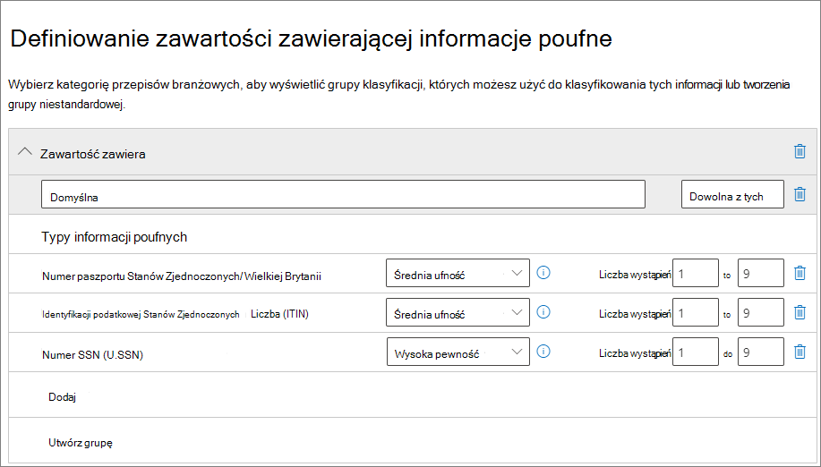
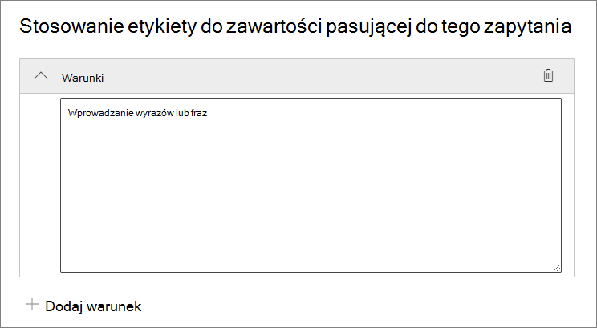

# <a name="automatically-apply-a-retention-label-to-retain-or-delete-content"></a>Automatyczne stosowanie etykiety przechowywania w celu zachowania lub usunięcia zawartości

>*[Microsoft 365 wskazówki dotyczące licencjonowania dotyczące zgodności & zabezpieczeń](/office365/servicedescriptions/microsoft-365-service-descriptions/microsoft-365-tenantlevel-services-licensing-guidance/microsoft-365-security-compliance-licensing-guidance).*

[!include[Purview banner](../includes/purview-rebrand-banner.md)]

> [!NOTE]
> Ten scenariusz nie jest obsługiwany w przypadku [rekordów regulacyjnych](records-management.md#records) ani etykiet domyślnych dla struktury organizacyjnej, takiej jak zestaw dokumentów lub biblioteka w SharePoint lub folder w Exchange. Te scenariusze wymagają [opublikowanych zasad etykiet przechowywania](create-apply-retention-labels.md).

Jedną z najbardziej zaawansowanych funkcji [etykiet przechowywania](retention.md) jest możliwość automatycznego stosowania ich do zawartości zgodnej z określonymi warunkami. W takim przypadku osoby w organizacji nie muszą stosować etykiet przechowywania. Microsoft 365 wykonuje dla nich pracę.

Automatyczne stosowanie etykiet przechowywania jest zaawansowane, ponieważ:

- Nie musisz szkolić użytkowników we wszystkich klasyfikacjach.
- Nie musisz polegać na użytkownikach, aby poprawnie klasyfikować całą zawartość.
- Użytkownicy nie muszą już wiedzieć o zasadach ładu danych — mogą skupić się na swojej pracy.

Etykiety przechowywania można stosować do zawartości automatycznie, gdy ta zawartość nie ma jeszcze zastosowanej etykiety przechowywania i zawiera informacje poufne, słowa kluczowe lub właściwości z możliwością wyszukiwania albo dopasowanie do [klasyfikatorów klasyfikujących.](classifier-get-started-with.md) Teraz w wersji zapoznawczej możesz również automatycznie zastosować etykietę przechowywania do załączników w chmurze przechowywanych w SharePoint lub OneDrive.

> [!TIP]
> Użyj właściwości z możliwością wyszukiwania, aby zidentyfikować [Teams nagrań spotkań](#microsoft-teams-meeting-recordings) i [elementów, które mają zastosowaną etykietę poufności](#identify-files-and-emails-that-have-a-sensitivity-label).

Procesy automatycznego stosowania etykiety przechowywania na podstawie następujących warunków:


Wykonaj poniższe instrukcje dla dwóch kroków administratora.

> [!NOTE]
> Zasady automatyczne używają etykietowania po stronie usługi z warunkami, aby automatycznie stosować etykiety przechowywania do elementów. Możesz również automatycznie zastosować etykietę przechowywania z zasadami etykiety, wykonując następujące czynności:
>
> - Stosowanie etykiety przechowywania do modelu zrozumienia dokumentu w SharePoint Syntex
> - Stosowanie domyślnej etykiety przechowywania dla SharePoint i Outlook
> - Stosowanie etykiety przechowywania do poczty e-mail przy użyciu reguł Outlook
>
> W przypadku tych scenariuszy zobacz [Publikowanie etykiet przechowywania i stosowanie ich w aplikacjach](create-apply-retention-labels.md).

## <a name="before-you-begin"></a>Przed rozpoczęciem

Administrator globalny organizacji ma pełne uprawnienia do tworzenia i edytowania etykiet przechowywania oraz ich zasad. Jeśli nie logujesz się jako administrator globalny, zobacz informacje o uprawnieniach do [zarządzania rekordami](get-started-with-records-management.md#permissions) lub [zarządzania cyklem życia danych](get-started-with-data-lifecycle-management.md#permissions-for-retention-policies-and-retention-labels), w zależności od używanego rozwiązania.

Upewnij się, że [utworzono etykiety przechowywania](file-plan-manager.md#create-retention-labels) , które chcesz zastosować do elementów.

## <a name="how-to-create-an-auto-apply-retention-label-policy"></a>Jak utworzyć zasady automatycznego stosowania etykiet przechowywania

Przed utworzeniem zasad etykiet przechowywania zdecyduj, czy będą **to zasady adaptacyjne** , czy **statyczne**. Aby uzyskać więcej informacji, zobacz [Adaptacyjne lub statyczne zakresy zasad przechowywania](retention.md#adaptive-or-static-policy-scopes-for-retention). Jeśli zdecydujesz się na korzystanie z zasad adaptacyjnych, musisz utworzyć co najmniej jeden zakres adaptacyjny przed utworzeniem zasad etykiet przechowywania, a następnie wybrać je podczas procesu tworzenia zasad etykiet przechowywania. Aby uzyskać instrukcje, zobacz [Informacje o konfiguracji dla zakresów adaptacyjnych](retention-settings.md#configuration-information-for-adaptive-scopes).

Podczas tworzenia zasad automatycznego stosowania należy wybrać etykietę przechowywania, która ma być automatycznie stosowana do zawartości, na podstawie określonych warunków.

1. W [portal zgodności Microsoft Purview](https://compliance.microsoft.com/) przejdź do jednej z następujących lokalizacji:

    - Jeśli używasz zarządzania rekordami:
        - **Rozwiązania** \> **Zarządzanie rekordami** \> Karta \> **Zasady etykiety** **Automatyczne stosowanie etykiety**

    - Jeśli używasz zarządzania cyklem życia danych:
        - **Rozwiązania** \> **Zarządzanie cyklem** \> życia danych Karta \> **Zasady etykiety** **Automatyczne stosowanie etykiety**

    Nie widzisz rozwiązania od razu w okienku nawigacji? Najpierw wybierz pozycję **Pokaż wszystko**.

2. Wprowadź nazwę i opis tych zasad automatycznego etykietowania, a następnie wybierz przycisk **Dalej**.

3. W obszarze **Wybierz typ zawartości, do których chcesz zastosować tę etykietę**, wybierz jeden z dostępnych warunków. Aby uzyskać więcej informacji o wyborach, zobacz sekcję [Konfigurowanie warunków automatycznego stosowania etykiet przechowywania](#configuring-conditions-for-auto-apply-retention-labels) na tej stronie.

4. Na stronie **Wybierz typ zasad przechowywania do utworzenia** wybierz pozycję **Adaptacyjne** lub **Statyczne**, w zależności od wyboru dokonanego z instrukcji [Przed rozpoczęciem](#before-you-begin) . Jeśli nie utworzono jeszcze zakresów adaptacyjnych, możesz wybrać opcję **Adaptive,ale** ponieważ nie będzie żadnych zakresów adaptacyjnych do wybrania, nie będzie można ukończyć pracy kreatora z tą opcją.

5. W zależności od wybranego zakresu:

    - Jeśli wybrano pozycję **Adaptacyjne**: na stronie **Wybieranie zakresów i lokalizacji zasad adaptacyjnych** wybierz pozycję **Dodaj zakresy** i wybierz co najmniej jeden utworzony zakres adaptacyjny. Następnie wybierz co najmniej jedną lokalizację. Lokalizacje, które można wybrać, zależą od [dodanych typów zakresów](retention-settings.md#configuration-information-for-adaptive-scopes) . Jeśli na przykład dodano tylko typ zakresu **Użytkownika**, będzie można wybrać **Exchange wiadomości e-mail**, ale nie **SharePoint witryn**.

    - Jeśli **wybrano pozycję Statyczne**: na stronie **Wybieranie lokalizacji** włącz lub wyłącz dowolną lokalizację. Dla każdej lokalizacji można pozostawić ją domyślną, aby [zastosować zasady do całej lokalizacji](retention-settings.md#a-policy-that-applies-to-entire-locations) lub [określić opcje dołączania i wykluczania](retention-settings.md#a-policy-with-specific-inclusions-or-exclusions)

    Aby uzyskać informacje o wyborze lokalizacji, zobacz [Lokalizacje](retention-settings.md#locations).

6. Postępuj zgodnie z monitami w kreatorze, aby wybrać etykietę przechowywania, a następnie przejrzyj i prześlij opcje konfiguracji.

Aby edytować istniejące zasady etykiet przechowywania (typ zasad to **Automatyczne stosowanie**), wybierz je, a następnie wybierz opcję **Edytuj** , aby uruchomić konfigurację **zasad przechowywania edycji** .

Gdy zawartość zostanie oznaczona etykietą przy użyciu zasad automatycznego stosowania etykiety, nie można automatycznie usunąć ani zmienić zastosowanej etykiety, zmieniając zawartość lub zasady albo przez nowe zasady automatycznego stosowania etykiet. Aby uzyskać więcej informacji, zobacz [Tylko jedna etykieta przechowywania jednocześnie](retention.md#only-one-retention-label-at-a-time).

> [!NOTE]
> Zasady automatycznego stosowania etykiet przechowywania nigdy nie zastąpią istniejącej etykiety przechowywania stosowanej do zawartości. Jeśli chcesz ponownie oznaczyć zawartość przy użyciu skonfigurowanych warunków, musisz ręcznie usunąć bieżącą etykietę przechowywania z istniejącej zawartości.

### <a name="configuring-conditions-for-auto-apply-retention-labels"></a>Konfigurowanie warunków dla etykiet przechowywania stosowanych automatycznie

Etykiety przechowywania można zastosować do zawartości automatycznie, gdy zawartość zawiera:

- [Określone typy informacji poufnych](#auto-apply-labels-to-content-with-specific-types-of-sensitive-information)

- [Określone słowa kluczowe lub właściwości z możliwością wyszukiwania, które pasują do utworzonego zapytania](#auto-apply-labels-to-content-with-keywords-or-searchable-properties)

- [Dopasowanie klasyfikatorów z możliwością trenowania](#auto-apply-labels-to-content-by-using-trainable-classifiers)

Możesz też automatycznie stosować etykiety przechowywania do nowo [udostępnionych załączników w chmurze](#auto-apply-labels-to-cloud-attachments).

Podczas konfigurowania etykiet przechowywania do automatycznego stosowania na podstawie poufnych informacji, słów kluczowych lub właściwości możliwych do wyszukiwania lub klasyfikatorów z możliwością trenowania użyj poniższej tabeli, aby określić, kiedy etykiety przechowywania mogą być stosowane automatycznie.

Exchange:

|Warunek|Elementy przesyłane (wysyłane lub odbierane) |Istniejące elementy (dane magazynowane)|
|:-----|:-----|:-----|
|Typy informacji poufnych — wbudowane| Tak | Nie |
|Typy informacji poufnych — niestandardowe| Tak | Nie |
|Określone słowa kluczowe lub właściwości z możliwością wyszukiwania| Tak |Tak |
|Klasyfikatory z możliwością szkolenia| Tak | Tak (tylko ostatnie sześć miesięcy) |

SharePoint i OneDrive:

|Warunek|Nowe lub zmodyfikowane elementy |Istniejące elementy |
|:-----|:-----|:-----|
|Typy informacji poufnych — wbudowane| Tak | Tak |
|Typy informacji poufnych — niestandardowe| Tak | Nie |
|Określone słowa kluczowe lub właściwości z możliwością wyszukiwania| Tak |Tak |
|Klasyfikatory z możliwością szkolenia| Tak | Tak (tylko ostatnie sześć miesięcy) |

Ponadto SharePoint elementów, które są w wersji roboczej lub które nigdy nie zostały opublikowane, nie są obsługiwane w tym scenariuszu.

#### <a name="auto-apply-labels-to-content-with-specific-types-of-sensitive-information"></a>Automatyczne stosowanie etykiet do zawartości z określonymi typami informacji poufnych

> [!IMPORTANT]
> W przypadku wiadomości e-mail automatycznie stosowanych przez identyfikowanie informacji poufnych wszystkie skrzynki pocztowe są automatycznie dołączane, w tym skrzynki pocztowe z Microsoft 365 grup.
>
> Mimo że skrzynki pocztowe grup zazwyczaj są uwzględniane przez wybranie lokalizacji **Grupy Microsoft 365**, dla tej konkretnej konfiguracji zasad lokalizacja grup obejmuje tylko SharePoint lokacji połączonych z grupą Microsoft 365.

Podczas tworzenia zasad automatycznego stosowania etykiet przechowywania dla informacji poufnych zostanie wyświetlona ta sama lista szablonów zasad, co podczas tworzenia zasad Ochrona przed utratą danych w Microsoft Purview (DLP). Każdy szablon jest wstępnie skonfigurowany do wyszukiwania określonych typów informacji poufnych. W poniższym przykładzie typy informacji poufnych pochodzą z kategorii **Prywatność** i szablonu **danych osobowych (PII):**



Aby dowiedzieć się więcej na temat typów informacji o poufności, zobacz [Dowiedz się więcej o typach informacji poufnych](sensitive-information-type-learn-about.md#learn-about-sensitive-information-types). Obecnie [dokładne typy informacji poufnych na podstawie dopasowania danych](sit-learn-about-exact-data-match-based-sits.md#learn-about-exact-data-match-based-sensitive-information-types) i [odciski palców dokumentów](document-fingerprinting.md) nie są obsługiwane w tym scenariuszu.

Po wybraniu szablonu zasad możesz dodać lub usunąć wszelkie typy informacji poufnych, a także zmienić poziom ufności i liczbę wystąpień. Na poprzednim przykładowym zrzucie ekranu te opcje zostały zmienione tak, aby etykieta przechowywania była automatycznie stosowana tylko wtedy, gdy:

- Typ wykrytych poufnych informacji ma dokładność dopasowania (lub [poziom ufności](sensitive-information-type-learn-about.md#more-on-confidence-levels)) co najmniej **Średni poziom ufności** dla dwóch typów informacji poufnych i **wysoką pewność** dla jednego. Wiele poufnych typów informacji jest definiowanych przy użyciu wielu wzorców, gdzie wzorzec o wyższej dokładności dopasowania wymaga znalezienia większej ilości dowodów (takich jak słowa kluczowe, daty lub adresy), podczas gdy wzorzec o niższej dokładności dopasowania wymaga mniejszej liczby dowodów. Im niższy poziom ufności, tym łatwiej jest dopasować zawartość do warunku, ale z możliwością zwiększenia liczby wyników fałszywie dodatnich.

- Zawartość zawiera od 1 do 9 wystąpień dowolnego z tych trzech poufnych typów informacji. Wartość domyślna wartości **to** **Dowolna**.

Aby uzyskać więcej informacji na temat tych opcji, zapoznaj się z poniższymi wskazówkami z dokumentacji DLP [Dostrajanie reguł, aby ułatwić lub utrudnić ich dopasowanie](data-loss-prevention-policies.md#tuning-rules-to-make-them-easier-or-harder-to-match).

> [!IMPORTANT]
> Typy informacji poufnych mają dwa różne sposoby definiowania maksymalnej liczby unikatowych parametrów liczby wystąpień. Aby dowiedzieć się więcej, zobacz [Liczba obsługiwanych wartości wystąpień dla usługi SIT](create-a-custom-sensitive-information-type.md#instance-count-supported-values-for-sit).

Aby wziąć pod uwagę użycie typów informacji poufnych do automatycznego stosowania etykiet przechowywania:

- Jeśli używasz niestandardowych typów informacji poufnych, nie mogą one automatycznie oznaczać istniejących elementów w SharePoint i OneDrive.

- W przypadku wiadomości e-mail nie można wybrać określonych adresatów do uwzględnienia lub wykluczenia; Obsługiwane jest tylko ustawienie **Wszyscy adresaci** i tylko dla tej konfiguracji obejmuje skrzynki pocztowe z grup Microsoft 365.

#### <a name="auto-apply-labels-to-content-with-keywords-or-searchable-properties"></a>Automatyczne stosowanie etykiet do zawartości za pomocą słów kluczowych lub właściwości możliwych do wyszukiwania

Etykiety można automatycznie stosować do zawartości przy użyciu zapytania zawierającego określone słowa, frazy lub wartości właściwości, które można przeszukiwać. Zapytanie można uściślić przy użyciu operatorów wyszukiwania, takich jak AND, OR i NOT.



Aby uzyskać więcej informacji na temat składni zapytań używających języka zapytań słów kluczowych (KQL), zobacz [Dokumentacja składni języka zapytań słów kluczowych (KQL).](/sharepoint/dev/general-development/keyword-query-language-kql-syntax-reference)

Zasady automatycznego stosowania oparte na zapytaniach używają tego samego indeksu wyszukiwania co wyszukiwanie zawartości zbierania elektronicznych materiałów dowodowych w celu identyfikowania zawartości. Aby uzyskać więcej informacji na temat właściwości, których można użyć, zobacz [Zapytania dotyczące słów kluczowych i warunki wyszukiwania dla wyszukiwania zawartości](keyword-queries-and-search-conditions.md).

Niektóre kwestie, które należy wziąć pod uwagę podczas używania słów kluczowych lub właściwości z możliwością wyszukiwania do automatycznego stosowania etykiet przechowywania:

- W przypadku SharePoint właściwości przeszukane i właściwości niestandardowe nie są obsługiwane dla tych zapytań KQL i należy używać tylko wstępnie zdefiniowanych właściwości zarządzanych dla dokumentów. Można jednak używać mapowań na poziomie dzierżawy ze wstępnie zdefiniowanymi właściwościami zarządzanymi, które są domyślnie włączone jako elementy uściślające (RefinableDate00-19, RefinableString00-99, RefinableInt00-49, RefinableDecimals00-09 i RefinableDouble00-09). Aby uzyskać więcej informacji, zobacz [Omówienie właściwości przeszukanych i zarządzanych na serwerze SharePoint,](/SharePoint/technical-reference/crawled-and-managed-properties-overview) a aby uzyskać instrukcje, zobacz [Tworzenie nowej właściwości zarządzanej](/sharepoint/manage-search-schema#create-a-new-managed-property).

- Jeśli mapujesz właściwość niestandardową na jedną z właściwości elementu uściślającego, poczekaj 24 godziny, zanim użyjesz jej w zapytaniu KQL dla etykiety przechowywania.

- Mimo że SharePoint właściwości zarządzane można zmienić przy użyciu aliasów, nie używaj ich do KQL zapytań w etykietach. Zawsze określ rzeczywistą nazwę właściwości zarządzanej, na przykład "RefinableString01".

- Aby wyszukać wartości zawierające spacje lub znaki specjalne, użyj podwójnego cudzysłowu (`" "`), aby zawierać frazę, na przykład `subject:"Financial Statements"`.

- Użyj właściwości *DocumentLink* zamiast *ścieżki* , aby dopasować element na podstawie jego adresu URL.

- Wyszukiwania symboli wieloznaczne sufiksu (takie jak `*cat`) lub podciągowe wyszukiwania z symbolami wieloznaczne (np `*cat*`. ) nie są obsługiwane. Obsługiwane są jednak wyszukiwania symboli wieloznacznych prefiksu (np `cat*`. ) .

- Należy pamiętać, że częściowo indeksowane elementy mogą być odpowiedzialne za brak etykiet elementów, których oczekujesz, lub etykietowanie elementów, których oczekujesz, że zostaną wykluczone z etykietowania podczas korzystania z operatora NOT. Aby uzyskać więcej informacji, zobacz [Częściowo zaindeksowane elementy w wyszukiwaniu zawartości](partially-indexed-items-in-content-search.md).

- Zalecamy, aby nie używać spacji między wyrazami w wartościach RefinableStrings w dokumentach. RefinableString nie jest właściwością dzielenia wyrazów.

Przykłady zapytań:

| Obciążenia | Przykład |
|:-----|:-----|
|Exchange   | `subject:"Financial Statements"` |
|Exchange   | `recipients:garthf@contoso.com` |
|SharePoint | `contenttype:document` |
|SharePoint | `site:https://contoso.sharepoint.com/sites/teams/procurement AND contenttype:document`|
|Exchange lub SharePoint | `"customer information" OR "private"`|

Bardziej złożone przykłady:

Następujące zapytanie dotyczące SharePoint identyfikuje dokumenty programu Word lub arkusze kalkulacyjne Excel, gdy te pliki zawierają **hasło**, **hasła** lub **pw** słów kluczowych:

```KQL
(password OR passwords OR pw) AND (filetype:doc* OR filetype:xls*)
```

Następujące zapytanie dotyczące Exchange identyfikuje dowolny dokument programu Word lub plik PDF zawierający słowo **nda** lub wyrażenie **umowy o zachowaniu poufności**, gdy dokumenty te są dołączone do wiadomości e-mail:

```KQL
(nda OR "non disclosure agreement") AND (attachmentnames:.doc* OR attachmentnames:.pdf)
```

Następujące zapytanie dotyczące SharePoint identyfikuje dokumenty zawierające numer karty kredytowej:

```KQL
sensitivetype:"credit card number"
```

Poniższe zapytanie zawiera niektóre typowe słowa kluczowe ułatwiające identyfikację dokumentów lub wiadomości e-mail zawierających zawartość prawną:

```KQL
ACP OR (Attorney Client Privilege*) OR (AC Privilege)
```

Następujące zapytanie zawiera typowe słowa kluczowe ułatwiające identyfikację dokumentów lub wiadomości e-mail dla zasobów ludzkich:

```KQL
(resume AND staff AND employee AND salary AND recruitment AND candidate)
```

Należy pamiętać, że w tym ostatnim przykładzie użyto najlepszego rozwiązania polegającego na tym, że zawsze uwzględniane są operatory między słowami kluczowymi. Odstęp między słowami kluczowymi (lub dwoma właściwościami:wyrażeniami wartości) jest taki sam jak w przypadku używania języka AND. Zawsze dodając operatory, łatwiej jest zobaczyć, że to przykładowe zapytanie będzie identyfikować tylko zawartość zawierającą wszystkie te słowa kluczowe, a nie zawartość zawierającą dowolne słowa kluczowe. Jeśli twoim zamiarem jest zidentyfikowanie zawartości zawierającej dowolne słowo kluczowe, określ wartość OR zamiast AND. Jak pokazuje ten przykład, zawsze po określeniu operatorów łatwiej jest poprawnie zinterpretować zapytanie.

##### <a name="microsoft-teams-meeting-recordings"></a>Microsoft Teams nagrania spotkań

> [!NOTE]
> Możliwość przechowywania i usuwania nagrań Teams spotkań nie będzie działać przed zapisaniem nagrań w OneDrive lub SharePoint. Aby uzyskać więcej informacji, zobacz [Use OneDrive dla Firm and SharePoint Online or Stream for meeting recordings (Używanie OneDrive dla Firm i SharePoint Online lub Stream do nagrywania spotkań](/MicrosoftTeams/tmr-meeting-recording-change)).

Aby zidentyfikować Microsoft Teams nagrania spotkań przechowywane na kontach OneDrive użytkowników lub w SharePoint, określ następujące informacje dla **edytora zapytań słowa kluczowego**:

```KQL
ProgID:Media AND ProgID:Meeting
```

W większości przypadków nagrania spotkań są zapisywane w OneDrive. Jednak w przypadku spotkań kanału są one zapisywane w SharePoint.

##### <a name="identify-files-and-emails-that-have-a-sensitivity-label"></a>Identyfikowanie plików i wiadomości e-mail z etykietą poufności

Aby zidentyfikować pliki w SharePoint lub OneDrive i Exchange wiadomości e-mail, które mają zastosowaną [określoną etykietę poufności](sensitivity-labels.md), określ następujące informacje dla **edytora zapytań słowa kluczowego**:

```KQL
InformationProtectionLabelId:<GUID>
```

Aby znaleźć identyfikator GUID, użyj polecenia cmdlet [Get-Label](/powershell/module/exchange/get-label) z programu [PowerShell Security & Compliance](/powershell/exchange/scc-powershell):

```powershell
Get-Label | Format-Table -Property DisplayName, Name, Guid
```

#### <a name="auto-apply-labels-to-content-by-using-trainable-classifiers"></a>Automatyczne stosowanie etykiet do zawartości przy użyciu klasyfikatorów z możliwością trenowania

Po wybraniu opcji klasyfikatora z możliwością trenowania można wybrać co najmniej jeden z wstępnie wytrenowanych lub niestandardowych klasyfikatorów trenowalnych:


> [!CAUTION]
> Wycofywamy wstępnie wytrenowany klasyfikator **języka obraźliwego** , ponieważ generuje on dużą liczbę wyników fałszywie dodatnich. Nie używaj tego klasyfikatora i jeśli obecnie go używasz, zalecamy przeniesienie procesów biznesowych poza ten proces i użycie wstępnie **wytrenowanych** klasyfikatorów targeted harassment, **profanity** i **Threat** .

Aby automatycznie zastosować etykietę przy użyciu tej opcji, SharePoint lokacje, a także skrzynki pocztowe, muszą mieć co najmniej 10 MB danych.

Aby uzyskać więcej informacji na temat klasyfikatorów z możliwością trenowania, zobacz [Learn about trainable classifiers (Informacje o klasyfikatorach z możliwością trenowania](classifier-learn-about.md)).

> [!TIP]
> Jeśli używasz klasyfikatorów z możliwością trenowania dla Exchange, zobacz [How to retrain a classifier in content explorer (Jak ponownie trenować klasyfikator w Eksploratorze zawartości](classifier-how-to-retrain-content-explorer.md)).

Aby wziąć pod uwagę użycie klasyfikatorów z możliwością trenowania do automatycznego stosowania etykiet przechowywania:

- Nie można automatycznie oznaczać etykietami SharePoint i OneDrive elementów starszych niż sześć miesięcy.

#### <a name="auto-apply-labels-to-cloud-attachments"></a>Automatyczne stosowanie etykiet do załączników w chmurze

> [!NOTE]
> Ta opcja jest stopniowo wdrażana w wersji zapoznawczej i może ulec zmianie.

Może być konieczne użycie tej opcji, jeśli musisz przechwycić i zachować wszystkie kopie plików w dzierżawie, które są wysyłane za pośrednictwem komunikacji przez użytkowników. Ta opcja jest używana w połączeniu z zasadami przechowywania dla samych usług komunikacyjnych, Exchange i Teams.

> [!IMPORTANT]
> Po wybraniu etykiety, która ma być używana do automatycznego stosowania etykiet przechowywania załączników w chmurze, upewnij się, że ustawienie przechowywania etykiet **Uruchom okres przechowywania na podstawie** wartości **Kiedy elementy zostały oznaczone etykietą**.

Załączniki w chmurze, czasami nazywane również nowoczesnymi załącznikami, są mechanizmem udostępniania, który używa osadzonych linków do plików przechowywanych w chmurze. Obsługują scentralizowany magazyn dla zawartości udostępnionej z korzyściami współpracy, takimi jak kontrola wersji. Załączniki w chmurze nie są dołączonymi kopiami pliku ani linkiem tekstowym adresu URL do pliku. Przydatne może okazać się odwoływanie się do wizualnych list kontrolnych obsługiwanych załączników w chmurze w [Outlook](/office365/troubleshoot/retention/cannot-retain-cloud-attachments#cloud-attachments-in-outlook) i [Teams](/office365/troubleshoot/retention/cannot-retain-cloud-attachments#cloud-attachments-in-teams).

Po wybraniu opcji zastosowania etykiety przechowywania do załączników w chmurze w celu zapewnienia zgodności kopia tego pliku jest tworzona w momencie udostępniania. Wybrana etykieta przechowywania jest następnie stosowana do kopii, którą można [następnie zidentyfikować przy użyciu zbierania elektronicznych materiałów dowodowych](advanced-ediscovery-cloud-attachments.md). Użytkownicy nie są świadomi kopii przechowywanej w bibliotece archiwum zachowywania. Etykieta przechowywania nie jest stosowana do samego komunikatu ani do oryginalnego pliku.

Jeśli plik zostanie ponownie zmodyfikowany i udostępniony, nowa kopia pliku jako nowej wersji zostanie zapisana w bibliotece archiwum konserwacji. Aby uzyskać więcej informacji, w tym dlaczego należy użyć ustawienia **Etykieta Kiedy elementy zostały oznaczone etykietą** , zobacz [Jak przechowywanie działa z załącznikami w chmurze](retention-policies-sharepoint.md#how-retention-works-with-cloud-attachments).

Załączniki w chmurze obsługiwane dla tej opcji to pliki, takie jak dokumenty, filmy wideo i obrazy przechowywane w SharePoint i OneDrive. W przypadku Teams obsługiwane są załączniki w chmurze udostępniane w wiadomościach czatów oraz standardowe i prywatne kanały. Załączniki w chmurze udostępniane przez zaproszenia na spotkania i aplikacje inne niż Teams lub Outlook nie są obsługiwane. Załączniki w chmurze muszą być współużytkowane przez użytkowników; załączniki w chmurze wysyłane za pośrednictwem botów nie są obsługiwane.

Chociaż ta opcja nie jest wymagana, zalecamy, aby upewnić się, że obsługa wersji jest włączona dla witryn SharePoint i kont OneDrive, aby umożliwić dokładne przechwycenie udostępnionej wersji. Jeśli przechowywanie wersji nie jest włączone, ostatnia dostępna wersja zostanie zachowana. Dokumenty w wersji roboczej lub, które nigdy nie zostały opublikowane, nie są obsługiwane.

Po wybraniu etykiety, która ma być używana do automatycznego stosowania etykiet przechowywania załączników w chmurze, upewnij się, że ustawienie przechowywania **etykiety Rozpocznij okres przechowywania na podstawie** wartości **Kiedy elementy zostały oznaczone etykietą**.

Podczas konfigurowania lokalizacji dla tej opcji można wybrać następujące opcje:

- **SharePoint witryny** dla udostępnionych plików przechowywanych w witrynach SharePoint komunikacji, witrynach zespołu, które nie są połączone przez grupy Microsoft 365 i lokacjach klasycznych.
- **Grupy Microsoft 365** dla plików udostępnionych przechowywanych w witrynach zespołu połączonych przez grupy Microsoft 365.
- **OneDrive konta** dla udostępnionych plików przechowywanych w OneDrive użytkowników.

Należy utworzyć oddzielne zasady przechowywania, jeśli chcesz zachować lub usunąć oryginalne pliki, wiadomości e-mail lub wiadomości Teams.

> [!NOTE]
> Jeśli chcesz, aby zachowane załączniki w chmurze wygasały w tym samym czasie co komunikaty, które je zawierały, skonfiguruj etykietę przechowywania tak, aby zachować tę samą wartość, a następnie usuń akcje i chronometraż co zasady przechowywania dla Exchange i Teams.

Do rozważenia podczas automatycznego stosowania etykiet przechowywania do załączników w chmurze:

- Tylko nowo udostępnione załączniki w chmurze zostaną automatycznie oznaczone do przechowywania.

- Po dodaniu użytkownika do konwersacji Teams i uzyskaniu dostępu do pełnej historii konwersacji ta historia może zawierać załączniki w chmurze. Jeśli zostały udostępnione w ciągu 48 godzin od dodania użytkownika do konwersacji, bieżące kopie załączników w chmurze są automatycznie oznaczane etykietami przechowywania. Załączniki w chmurze udostępnione przed tym okresem nie są obsługiwane dla nowo dodanych użytkowników.

- Załączniki w chmurze udostępnione poza Teams i Outlook nie są obsługiwane.

- Następujące elementy nie są obsługiwane jako załączniki w chmurze, które można przechowywać:
  - SharePoint witryn, stron, list, formularzy, folderów, zestawów dokumentów i stron OneNote.
  - Pliki udostępnione przez użytkowników, którzy nie mają dostępu do tych plików.
  - Pliki, które są usuwane lub przenoszone przed wysłaniem załącznika w chmurze. Na przykład użytkownik kopiuje i wkleja wcześniej udostępniony załącznik z innej wiadomości bez uprzedniego potwierdzenia, że plik jest nadal dostępny. Możesz też przekazać starą wiadomość, gdy plik zostanie usunięty.
  - Pliki udostępniane przez gości lub użytkowników spoza organizacji.
  - Pliki w roboczych wiadomościach e-mail i wiadomościach, które nie są wysyłane.
  - Puste pliki.

## <a name="how-long-it-takes-for-retention-labels-to-take-effect"></a>Jak długo trwa obowiązywanie etykiet przechowywania

W przypadku automatycznego stosowania etykiet przechowywania na podstawie poufnych informacji, słów kluczowych lub właściwości możliwych do wyszukania lub klasyfikatorów z możliwością trenowania zastosowanie etykiet przechowywania może potrwać do siedmiu dni:


Jeśli oczekiwane etykiety nie są wyświetlane po siedmiu dniach, sprawdź **stan** zasad automatycznego stosowania, wybierając je na stronie **Zasady etykiet** w portal zgodności Microsoft Purview. Jeśli w szczegółach lokalizacji zostanie wyświetlony komunikat o tym, że wdrażanie zasad (dla SharePoint **)** lub próba ponownego wdrożenia zasad (dla OneDrive) trwa dłużej niż oczekiwano, spróbuj uruchomić polecenie [Set-RetentionCompliancePolicy](/powershell/module/exchange/set-retentioncompliancepolicy) PowerShell, aby ponowić próbę dystrybucji zasad:

1. [Połączenie do programu PowerShell zgodności & zabezpieczeń](/powershell/exchange/connect-to-scc-powershell).

2. Uruchom następujące polecenie:

    ```PowerShell
    Set-RetentionCompliancePolicy -Identity <policy name> -RetryDistribution
    ```

## <a name="updating-retention-labels-and-their-policies"></a>Aktualizowanie etykiet przechowywania i ich zasad

W przypadku zasad automatycznego stosowania etykiet przechowywania, które są skonfigurowane pod kątem informacji poufnych, słów kluczowych lub właściwości możliwych do wyszukiwania lub dopasowania dla klasyfikatorów z możliwością trenowania: gdy etykieta przechowywania z zasad jest już stosowana do zawartości, zmiana konfiguracji wybranej etykiety i zasad zostanie automatycznie zastosowana do tej zawartości oprócz nowo zidentyfikowanej zawartości.

W przypadku zasad automatycznego stosowania etykiet przechowywania skonfigurowanych dla załączników w chmurze: ponieważ te zasady dotyczą nowo udostępnionych plików, a nie istniejących plików, zmiana konfiguracji wybranej etykiety i zasad zostanie automatycznie zastosowana tylko do nowo udostępnionej zawartości.

Niektórych ustawień nie można zmienić po utworzeniu i zapisaniu etykiety lub zasad, które obejmują:

- Nazwy etykiet przechowywania i ich zasad, typ zakresu (adaptacyjne lub statyczne) oraz ustawienia przechowywania z wyjątkiem okresu przechowywania. Nie można jednak zmienić okresu przechowywania, gdy okres przechowywania zależy od tego, kiedy elementy zostały oznaczone etykietą.
- Opcja oznaczania elementów jako rekordu.

### <a name="deleting-retention-labels"></a>Usuwanie etykiet przechowywania

Możesz usunąć etykiety przechowywania, które nie są obecnie uwzględnione w żadnych zasadach etykiet przechowywania, które nie są skonfigurowane do przechowywania na podstawie zdarzeń, lub oznaczyć elementy jako rekordy regulacyjne.

W przypadku etykiet przechowywania, które można usunąć, jeśli zostały one zastosowane do elementów, usunięcie kończy się niepowodzeniem i zostanie wyświetlony link do Eksploratora zawartości w celu zidentyfikowania elementów oznaczonych etykietą.

Jednak wyświetlenie elementów oznaczonych etykietą Eksploratora zawartości może potrwać do dwóch dni. W tym scenariuszu etykieta przechowywania może zostać usunięta bez wyświetlania linku do Eksploratora zawartości.

## <a name="locking-the-policy-to-prevent-changes"></a>Blokowanie zasad w celu zapobiegania zmianom

Jeśli musisz upewnić się, że nikt nie może wyłączyć zasad, usunąć zasad lub uczynić je mniej restrykcyjnym, zobacz [Używanie blokady zachowania, aby ograniczyć zmiany zasad przechowywania i zasad etykiet przechowywania](retention-preservation-lock.md).

## <a name="next-steps"></a>Następne kroki

Aby ułatwić śledzenie etykiet zastosowanych z zasad automatycznego etykietowania:

- [Monitorowanie etykiet przechowywania](retention.md#monitoring-retention-labels)
- [Wyszukiwanie zawartości przy użyciu funkcji wyszukiwania zawartości w celu znalezienia całej zawartości z określoną etykietą przechowywania](retention.md#using-content-search-to-find-all-content-with-a-specific-retention-label)
- [Inspekcja akcji przechowywania](retention.md#auditing-retention-actions)

Zobacz [Używanie etykiet przechowywania do zarządzania cyklem życia dokumentów przechowywanych w SharePoint, aby zapoznać](auto-apply-retention-labels-scenario.md) się z przykładowym scenariuszem, który używa zasad automatycznego stosowania etykiet przechowywania z właściwościami zarządzanymi w SharePoint i przechowywania opartego na zdarzeniach w celu rozpoczęcia okresu przechowywania.
