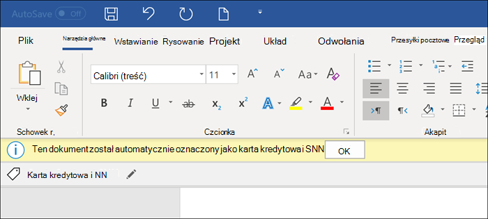
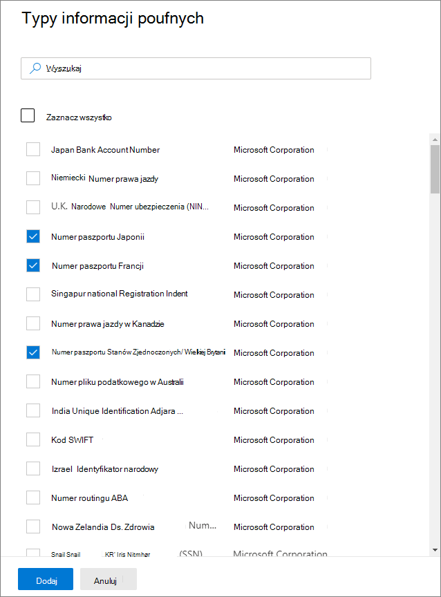
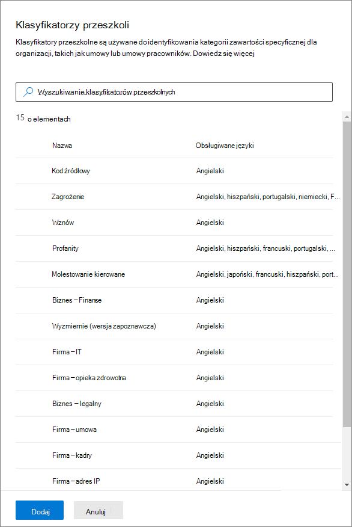
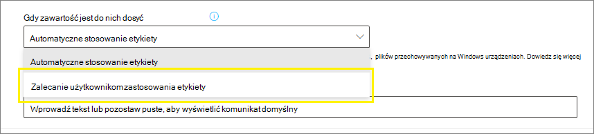
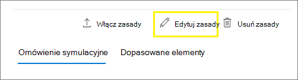

# <a name="apply-a-sensitivity-label-to-content-automatically"></a>Automatyczne stosowanie etykiety poufności do zawartości

>*[Wskazówki dotyczące licencjonowania platformy Microsoft 365 dotyczące zgodności & zabezpieczeń](/office365/servicedescriptions/microsoft-365-service-descriptions/microsoft-365-tenantlevel-services-licensing-guidance/microsoft-365-security-compliance-licensing-guidance).*

[!include[Purview banner](../includes/purview-rebrand-banner.md)]

> [!TIP]
> Aby uzyskać informacje na temat automatycznego stosowania etykiety poufności na mapie danych, zobacz [Etykietowanie w Mapa danych w Microsoft Purview](/azure/purview/create-sensitivity-label).

Podczas tworzenia etykiety poufności można automatycznie przypisywać tę etykietę do plików i wiadomości e-mail, gdy jest ona zgodna z określonymi warunkami.

Ta możliwość automatycznego stosowania etykiet poufności do zawartości jest ważna, ponieważ:

- Nie musisz szkolić użytkowników, kiedy używać każdej klasyfikacji.

- Nie musisz polegać na użytkownikach, aby poprawnie klasyfikować całą zawartość.

- Użytkownicy nie muszą już znać twoich zasad — zamiast tego mogą skupić się na swojej pracy.

Istnieją dwie różne metody automatycznego stosowania etykiety poufności do zawartości w usłudze Microsoft 365:

- **Etykietowanie po stronie klienta, gdy użytkownicy edytują dokumenty lub tworzą (również odpowiadają lub przesyłają dalej) wiadomości e-mail**: użyj etykiety skonfigurowanej do automatycznego etykietowania plików i wiadomości e-mail (w tym programów Word, Excel, PowerPoint i Outlook).

    Ta metoda obsługuje zalecanie etykiety użytkownikom, a także automatyczne stosowanie etykiety. Jednak w obu przypadkach użytkownik decyduje, czy zaakceptować lub odrzucić etykietę, aby zapewnić poprawne etykietowanie zawartości. To etykietowanie po stronie klienta ma minimalne opóźnienie dla dokumentów, ponieważ etykietę można zastosować jeszcze przed zapisaniem dokumentu. Jednak nie wszystkie aplikacje klienckie obsługują automatyczne etykietowanie. Ta funkcja jest obsługiwana przez wbudowane [etykietowanie z niektórymi wersjami pakietu Office](sensitivity-labels-office-apps.md#support-for-sensitivity-label-capabilities-in-apps), a także ujednoliconego klienta etykietowania usługi Azure Information Protection.

    Aby uzyskać instrukcje dotyczące konfiguracji, zobacz [Jak skonfigurować automatyczne etykietowanie dla aplikacji pakietu Office](#how-to-configure-auto-labeling-for-office-apps) na tej stronie.

- **Etykietowanie po stronie usługi, gdy zawartość jest już zapisywana (w programie SharePoint lub OneDrive) lub wysyłana pocztą e-mail (przetwarzana przez Exchange Online)**: użyj zasad automatycznego etykietowania.
    
    Ta metoda może również być nazywana automatycznym etykietowaniem danych magazynowanych (dokumentów w programach SharePoint i OneDrive) oraz przesyłanych danych (wiadomości e-mail wysyłane lub odbierane przez program Exchange). W przypadku programu Exchange nie zawiera on wiadomości e-mail magazynowanych (skrzynek pocztowych).
    
    Ponieważ to etykietowanie jest stosowane przez usługi, a nie przez aplikacje, nie musisz martwić się o to, jakie aplikacje mają użytkownicy i jaka wersja. W związku z tym ta funkcja jest natychmiast dostępna w całej organizacji i nadaje się do etykietowania na dużą skalę. Zasady automatycznego etykietowania nie obsługują zalecanego etykietowania, ponieważ użytkownik nie wchodzi w interakcję z procesem etykietowania. Zamiast tego administrator uruchamia zasady w symulacji, aby zapewnić poprawne etykietowanie zawartości przed faktycznym zastosowaniem etykiety.

    Aby uzyskać instrukcje dotyczące konfiguracji, zobacz [Jak skonfigurować zasady automatycznego etykietowania dla programów SharePoint, OneDrive i Exchange](#how-to-configure-auto-labeling-policies-for-sharepoint-onedrive-and-exchange) na tej stronie.
    
    Specyficzne dla automatycznego etykietowania dla programów SharePoint i OneDrive:
    
    - Obsługiwane są pliki pakietu Office dla programów Word (.docx), PowerPoint (.pptx) i Excel (.xlsx).
        - Te pliki mogą być automatycznie oznaczane etykietami magazynowanymi przed utworzeniem zasad automatycznego etykietowania lub po nich. Nie można automatycznie oznaczać plików, jeśli są częścią otwartej sesji (plik jest otwarty).
        - Obecnie załączniki do elementów listy nie są obsługiwane i nie będą oznaczone automatycznie.
    - Maksymalnie 25 000 automatycznie oznaczonych plików w dzierżawie dziennie.
    - Maksymalnie 100 zasad automatycznego etykietowania na dzierżawę, z których każda jest przeznaczona dla maksymalnie 100 witryn (SharePoint lub OneDrive), gdy są one określone indywidualnie. Można również określić wszystkie lokacje, a ta konfiguracja jest wykluczona z maksymalnej wartości 100 lokacji.
    - Istniejące wartości modyfikacji, modyfikacji i daty nie są zmieniane w wyniku zasad automatycznego etykietowania — zarówno w trybie symulacji, jak i w przypadku stosowania etykiet.
    - Gdy etykieta stosuje szyfrowanie, [wystawcą usługi Rights Management i właścicielem usługi Rights Management](/azure/information-protection/configure-usage-rights#rights-management-issuer-and-rights-management-owner) jest konto, które ostatnio zmodyfikowało plik.

    Specyficzne dla automatycznego etykietowania dla programu Exchange:
    
    - W przeciwieństwie do ręcznego etykietowania lub automatycznego etykietowania w aplikacjach pakietu Office, załączniki PDF oraz załączniki pakietu Office są również skanowane pod kątem warunków określonych w zasadach automatycznego etykietowania. W przypadku dopasowania wiadomość e-mail jest oznaczona etykietą, ale nie załącznikiem.
        - W przypadku plików PDF, jeśli etykieta stosuje szyfrowanie, te pliki, jeśli są niezaszyfrowane, są teraz szyfrowane przy użyciu [szyfrowania komunikatów](ome.md) , gdy dzierżawa jest [włączona dla załączników PDF](ome-faq.yml#are-pdf-file-attachments-supported-). Zastosowane ustawienia szyfrowania są dziedziczone z wiadomości e-mail.
        - W przypadku tych plików pakietu Office obsługiwane są programy Word, PowerPoint i Excel. Jeśli etykieta stosuje szyfrowanie, a te pliki są niezaszyfrowane, są teraz szyfrowane przy użyciu [szyfrowania komunikatów](ome.md). Ustawienia szyfrowania są dziedziczone z wiadomości e-mail.
    - Jeśli masz reguły przepływu poczty programu Exchange lub zasady Ochrona przed utratą danych w Microsoft Purview (DLP), które stosują szyfrowanie IRM: Gdy zawartość jest identyfikowana przez te reguły lub zasady i zasady automatycznego etykietowania, zostanie zastosowana etykieta. Jeśli ta etykieta stosuje szyfrowanie, ustawienia usługi IRM z reguł przepływu poczty programu Exchange lub zasad DLP są ignorowane. Jeśli jednak ta etykieta nie stosuje szyfrowania, oprócz etykiety zostaną zastosowane ustawienia usługi IRM z reguł przepływu poczty lub zasad DLP.
    - Wiadomość e-mail z szyfrowaniem IRM bez etykiety zostanie zastąpiona etykietą dowolnymi ustawieniami szyfrowania w przypadku dopasowania przy użyciu automatycznego etykietowania.
    - Przychodząca wiadomość e-mail jest oznaczona etykietą w przypadku dopasowania do warunków automatycznego etykietowania. Jeśli ta etykieta jest skonfigurowana pod kątem [szyfrowania](encryption-sensitivity-labels.md), to szyfrowanie jest zawsze stosowane, gdy nadawca pochodzi z organizacji. Domyślnie szyfrowanie nie jest stosowane, gdy nadawca znajduje się poza organizacją, ale można je zastosować, konfigurując **dodatkowe ustawienia poczty e-mail** i określając właściciela usługi Rights Management.
    - Gdy etykieta stosuje szyfrowanie, [wystawca usługi Rights Management i właściciel usługi Rights Management](/azure/information-protection/configure-usage-rights#rights-management-issuer-and-rights-management-owner) to osoba, która wysyła wiadomość e-mail, gdy nadawca pochodzi z własnej organizacji. Gdy nadawca znajduje się poza organizacją, możesz określić właściciela usługi Rights Management dla przychodzącej wiadomości e-mail, która jest oznaczona etykietą i szyfrowana przez zasady.
    - Jeśli etykieta jest skonfigurowana do stosowania [oznaczeń dynamicznych](sensitivity-labels-office-apps.md#dynamic-markings-with-variables), należy pamiętać, że w przypadku przychodzącej poczty e-mail ta konfiguracja może spowodować wyświetlenie nazwisk osób spoza organizacji.

## <a name="compare-auto-labeling-for-office-apps-with-auto-labeling-policies"></a>Porównanie automatycznego etykietowania dla aplikacji pakietu Office z zasadami automatycznego etykietowania

Poniższa tabela ułatwia zidentyfikowanie różnic w zachowaniu dwóch uzupełniających się metod automatycznego etykietowania:

|Funkcja lub zachowanie|Ustawienie etykiety: Automatyczne etykietowanie plików i wiadomości e-mail  |Zasady: automatyczne etykietowanie|
|:-----|:-----|:-----|
|Zależność aplikacji|Tak ([wersje minimalne](sensitivity-labels-office-apps.md#support-for-sensitivity-label-capabilities-in-apps)) |Nr \* |
|Ogranicz według lokalizacji|Nie |Tak |
|Warunki: Klasyfikatory z możliwością trenowania|Tak |Nie |
|Warunki: Opcje udostępniania i dodatkowe opcje poczty e-mail|Nie |Tak |
|Warunki: wyjątki|Nie |Tak (tylko wiadomość e-mail) |
|Zalecenia, etykietka narzędzia zasad i przesłonięcia użytkowników|Tak |Nie |
|Tryb symulacji|Nie |Tak |
|Załączniki programu Exchange sprawdzone pod kątem warunków|Nie | Tak|
|Stosowanie oznaczeń wizualnych |Tak |Tak (tylko wiadomość e-mail) |
|Zastępowanie szyfrowania IRM zastosowanego bez etykiety|Tak, jeśli użytkownik ma prawo do minimalnego użycia eksportu |Tak (tylko wiadomość e-mail) |
|Etykieta przychodzącej wiadomości e-mail|Nie |Tak|
|Przypisywanie właściciela usługi Rights Management do wiadomości e-mail wysyłanych z innej organizacji |Nie |Tak|
|W przypadku wiadomości e-mail zastąp istniejącą etykietę o tym samym lub niższym priorytecie |Nie |Tak (konfigurowalne)|

\* Automatyczne etykietowanie nie jest obecnie dostępne we wszystkich regionach ze względu na zależność zaplecza platformy Azure. Jeśli dzierżawa nie może obsługiwać tej funkcji, karta **Automatyczne etykietowanie** nie jest widoczna w portal zgodności Microsoft Purview. Aby uzyskać więcej informacji, zobacz [Dostępność zależności platformy Azure według kraju](/troubleshoot/azure/general/dependency-availability-by-country).

## <a name="how-multiple-conditions-are-evaluated-when-they-apply-to-more-than-one-label"></a>Jak wiele warunków jest ocenianych w przypadku zastosowania do więcej niż jednej etykiety

Etykiety są uporządkowane do oceny zgodnie z ich pozycją określoną w zasadach: etykieta umieszczona jako pierwsza ma najniższą pozycję (najmniej wrażliwą), a etykieta umieszczona jako ostatnia ma najwyższą pozycję (najbardziej wrażliwą). Aby uzyskać więcej informacji na temat priorytetu, zobacz [Priorytet etykiety (kolejność ma znaczenie)](sensitivity-labels.md#label-priority-order-matters).

## <a name="dont-configure-a-parent-label-to-be-applied-automatically-or-recommended"></a>Nie konfiguruj etykiety nadrzędnej, która ma być stosowana automatycznie lub zalecana

Pamiętaj, że nie można zastosować etykiety nadrzędnej (etykiety z etykietami podrzędnymi) do zawartości. Upewnij się, że nie konfigurujesz etykiety nadrzędnej do automatycznego stosowania lub zalecanego w aplikacjach pakietu Office i nie wybierasz etykiety nadrzędnej dla zasad automatycznego etykietowania. Jeśli to zrobisz, etykieta nadrzędna nie zostanie zastosowana do zawartości.

Aby użyć automatycznego etykietowania z etykietami podrzędnymi, należy opublikować etykietę nadrzędną i etykietę podrzędną.

Aby uzyskać więcej informacji na temat etykiet nadrzędnych i etykiet podrzędnych, zobacz [Etykiety podrzędne (etykiety grupowania)](sensitivity-labels.md#sublabels-grouping-labels).

## <a name="will-an-existing-label-be-overridden"></a>Czy istniejąca etykieta zostanie zastąpiona?

> [!NOTE]
> Niedawno dodane ustawienie zasad automatycznego etykietowania wiadomości e-mail pozwala określić, że zgodna etykieta poufności zawsze zastąpi istniejącą etykietę.

Domyślne zachowanie polegające na tym, że automatyczne etykietowanie zastąpi istniejącą etykietę:

- Gdy zawartość została ręcznie oznaczona etykietą, etykieta ta nie zostanie zastąpiona przez automatyczne etykietowanie.

- Automatyczne etykietowanie zastąpi [etykietę poufności o niższym priorytecie](sensitivity-labels.md#label-priority-order-matters) , która została automatycznie zastosowana, ale nie etykietę o wyższym priorytecie.
    
    > [!TIP]
    > Na przykład etykieta poufności w górnej części listy w portal zgodności Microsoft Purview ma nazwę **Public** z numerem zamówienia (priorytetem) 0, a etykieta poufności w dolnej części listy ma nazwę **Wysoce poufne** z numerem zamówienia (priorytet 4). Etykieta **Wysoce poufne** może zastąpić etykietę **Publiczna** , ale nie odwrotnie.

Tylko w przypadku zasad automatycznego etykietowania wiadomości e-mail można wybrać ustawienie, aby zawsze przesłaniać istniejącą etykietę poufności, niezależnie od sposobu jej stosowania.

|Istniejąca etykieta |Zastępowanie przy użyciu ustawienia etykiety: automatyczne etykietowanie plików i wiadomości e-mail  |Zastępowanie przy użyciu zasad: automatyczne etykietowanie|
|:-----|:-----|:-----|
|Zastosowane ręcznie— dowolny priorytet|Word, Excel, PowerPoint: Nie <br /><br> Outlook: Nie  |SharePoint i OneDrive: Nie <br /><br> Exchange: domyślnie nie, ale można go skonfigurować |
|Automatycznie stosowana lub domyślna etykieta z zasad, niższy priorytet |Word, Excel, PowerPoint: Tak <br /><br> Outlook: Tak | SharePoint i OneDrive: Tak <br /><br> Exchange: Tak |
|Automatycznie stosowana lub etykieta domyślna z zasad, wyższy priorytet |Word, Excel, PowerPoint: Nie <br /><br> Outlook: Nie |SharePoint i OneDrive: Nie <br /><br> Exchange: domyślnie nie, ale można go skonfigurować |

Konfigurowalne ustawienie zasad automatycznego etykietowania poczty e-mail znajduje się na stronie **Dodatkowe ustawienia poczty e-mail** . Ta strona jest wyświetlana po wybraniu etykiety poufności dla zasad automatycznego etykietowania zawierających lokalizację programu Exchange.

## <a name="how-to-configure-auto-labeling-for-office-apps"></a>Jak skonfigurować automatyczne etykietowanie dla aplikacji pakietu Office

Aby uzyskać wbudowane etykietowanie w aplikacjach pakietu Office, sprawdź [minimalne wersje wymagane](sensitivity-labels-office-apps.md#support-for-sensitivity-label-capabilities-in-apps) do automatycznego etykietowania w aplikacjach pakietu Office.

Klient ujednoliconego etykietowania platformy Azure Information Protection obsługuje automatyczne etykietowanie tylko dla wbudowanych i niestandardowych typów informacji poufnych oraz nie obsługuje klasyfikatorów z możliwością trenowania ani poufnych typów informacji korzystających z dokładnego dopasowania danych (EDM) lub nazwanych jednostek.

Ustawienia automatycznego etykietowania dla aplikacji pakietu Office są dostępne podczas [tworzenia lub edytowania etykiety poufności](create-sensitivity-labels.md). Upewnij się, że dla zakresu etykiety wybrano opcję **Pliki & wiadomości e-mail** :


Podczas przechodzenia przez konfigurację zostanie wyświetlona strona **Automatyczne etykietowanie plików i wiadomości e-mail** , na której można wybierać spośród listy typów informacji poufnych lub klasyfikatorów z możliwością trenowania:


Gdy ta etykieta poufności zostanie zastosowana automatycznie, użytkownik zobaczy powiadomienie w swojej aplikacji pakietu Office. Przykład:



### <a name="configuring-sensitive-info-types-for-a-label"></a>Konfigurowanie typów informacji poufnych dla etykiety

Po wybraniu opcji **Typy informacji poufnych** zostanie wyświetlona ta sama lista typów informacji poufnych, co podczas tworzenia zasad ochrony przed utratą danych (DLP). Możesz więc na przykład automatycznie zastosować etykietę Wysoce poufne do dowolnej zawartości zawierającej dane osobowe klientów, takie jak numery kart kredytowych, numery ubezpieczenia społecznego lub numery paszportów:



Podobnie jak w przypadku konfigurowania zasad DLP, można następnie uściślić warunek, zmieniając liczbę wystąpień i dokładność dopasowania. Przykład:


Więcej informacji na temat tych opcji konfiguracji można znaleźć w dokumentacji DLP: [Dostrajanie reguł, aby ułatwić ich dopasowanie lub utrudnić ich dopasowanie](data-loss-prevention-policies.md#tuning-rules-to-make-them-easier-or-harder-to-match).

> [!IMPORTANT]
> Typy informacji poufnych mają dwa różne sposoby definiowania maksymalnej liczby unikatowych parametrów liczby wystąpień. Aby dowiedzieć się więcej, zobacz [Liczba obsługiwanych wartości wystąpień dla usługi SIT](create-a-custom-sensitive-information-type.md#instance-count-supported-values-for-sit).

Podobnie jak w przypadku konfiguracji zasad DLP, można wybrać, czy warunek musi wykryć wszystkie typy informacji poufnych, czy tylko jeden z nich. Aby warunki były bardziej elastyczne lub złożone, można dodawać [grupy i używać operatorów logicznych między grupami](data-loss-prevention-policies.md).

> [!NOTE]
> Automatyczne etykietowanie oparte na niestandardowych typach informacji poufnych ma zastosowanie tylko do nowo utworzonej lub zmodyfikowanej zawartości w usłudze OneDrive i programie SharePoint; nie do istniejącej zawartości. To ograniczenie dotyczy również reguł automatycznego etykietowania.

#### <a name="custom-sensitive-information-types-with-exact-data-match"></a>Niestandardowe typy informacji poufnych z dokładnym dopasowaniem danych

Etykietę poufności można skonfigurować tak, aby [używała dokładnych typów informacji poufnych na podstawie dopasowania danych](sit-learn-about-exact-data-match-based-sits.md#learn-about-exact-data-match-based-sensitive-information-types) dla niestandardowych typów informacji poufnych. Jednak obecnie należy również określić co najmniej jeden typ informacji poufnych, który nie używa EDM. Na przykład jeden z wbudowanych typów informacji poufnych, takich jak **numer karty kredytowej**.

Jeśli skonfigurujesz etykietę poufności z tylko rozwiązaniem EDM dla warunków typów informacji poufnych, ustawienie automatycznego etykietowania zostanie automatycznie wyłączone dla etykiety.

### <a name="configuring-trainable-classifiers-for-a-label"></a>Konfigurowanie klasyfikatorów z możliwością trenowania dla etykiety

Jeśli używasz tej opcji z Aplikacje Microsoft 365 dla systemu Windows w wersji 2106 lub niższej lub Aplikacje Microsoft 365 dla komputerów Mac w wersji 16.50 lub niższej, upewnij się, że opublikowano w dzierżawie co najmniej jedną inną etykietę poufności skonfigurowaną do automatycznego etykietowania i [opcję typów informacji poufnych](#configuring-sensitive-info-types-for-a-label). To wymaganie nie jest konieczne, gdy na tych platformach są używane nowsze wersje.

Po wybraniu opcji **Trainable classifiers (Klasyfikatory trainable** ) wybierz co najmniej jeden z wstępnie wytrenowanych lub niestandardowych klasyfikatorów trenowalnych:



> [!CAUTION]
> Wycofywamy wstępnie wytrenowany klasyfikator **języka obraźliwego** , ponieważ generuje on dużą liczbę wyników fałszywie dodatnich. Nie używaj tego klasyfikatora i jeśli obecnie go używasz, zalecamy przeniesienie procesów biznesowych poza ten proces i użycie wstępnie **wytrenowanych** klasyfikatorów targeted harassment, **profanity** i **Threat** .

Aby uzyskać więcej informacji na temat tych klasyfikatorów, zobacz [Learn about trainable classifiers (Informacje o klasyfikatorach z możliwością trenowania](classifier-learn-about.md)).

### <a name="recommend-that-the-user-applies-a-sensitivity-label"></a>Zaleca się, aby użytkownik zastosował etykietę poufności

Jeśli wolisz, możesz zalecić użytkownikom zastosowanie etykiety. Dzięki tej opcji użytkownicy mogą zaakceptować klasyfikację i skojarzoną ochronę lub odrzucić zalecenie, jeśli etykieta nie jest odpowiednia dla ich zawartości.



Oto przykład monitu z klienta ujednoliconego etykietowania usługi Azure Information Protection podczas konfigurowania warunku stosowania etykiety jako zalecanej akcji z poradą dotyczącą zasad niestandardowych. Możesz wybrać tekst wyświetlany w poradzie zasad.


### <a name="when-automatic-or-recommended-labels-are-applied"></a>Po zastosowaniu etykiet automatycznych lub zalecanych

Implementacja automatycznego i zalecanego etykietowania w aplikacjach pakietu Office zależy od tego, czy używasz etykietowania wbudowanego w pakiet Office, czy Information Protection klienta ujednoliconego etykietowania platformy Azure. Jednak w obu przypadkach:

- Nie można używać automatycznego etykietowania dla dokumentów i wiadomości e-mail, które zostały wcześniej oznaczone ręcznie lub wcześniej automatycznie oznaczone większą poufnością. Pamiętaj, że do dokumentu lub wiadomości e-mail można zastosować tylko jedną etykietę poufności (oprócz pojedynczej etykiety przechowywania).

- Nie można używać zalecanego etykietowania dla dokumentów lub wiadomości e-mail, które zostały wcześniej oznaczone z większą poufnością. Gdy zawartość jest już oznaczona wyższą poufnością, użytkownik nie zobaczy monitu z zaleceniem i poradą dotyczącą zasad.

Specyficzne dla wbudowanego etykietowania:

- Nie wszystkie aplikacje pakietu Office obsługują automatyczne (i zalecane) etykietowanie. Aby uzyskać więcej informacji, zobacz [Obsługa funkcji etykiet poufności w aplikacjach](sensitivity-labels-office-apps.md#support-for-sensitivity-label-capabilities-in-apps).

- W przypadku zalecanych etykiet w klasycznych wersjach programu Word zawartość poufna, która wyzwoliła zalecenie, jest oflagowana, aby użytkownicy mogli przeglądać i usuwać zawartość poufną zamiast stosować zalecaną etykietę poufności.

- Aby uzyskać szczegółowe informacje o sposobie stosowania tych etykiet w aplikacjach pakietu Office, przykładowych zrzutach ekranu i sposobie wykrywania informacji poufnych, zobacz [Automatyczne stosowanie lub zalecanie etykiet poufności do plików i wiadomości e-mail w pakiecie Office](https://support.microsoft.com/office/automatically-apply-or-recommend-sensitivity-labels-to-your-files-and-emails-in-office-622e0d9c-f38c-470a-bcdb-9e90b24d71a1).

Specyficzne dla klienta ujednoliconego etykietowania usługi Azure Information Protection:

- Automatyczne i zalecane etykietowanie dotyczy programów Word, Excel i PowerPoint podczas zapisywania dokumentu oraz w programie Outlook podczas wysyłania wiadomości e-mail.

- Aby program Outlook obsługiwał zalecane etykietowanie, musisz najpierw skonfigurować [zaawansowane ustawienie zasad](/azure/information-protection/rms-client/clientv2-admin-guide-customizations#enable-recommended-classification-in-outlook).

- Poufne informacje można wykryć w tekście treści w dokumentach i wiadomościach e-mail oraz nagłówkach i stopkach — ale nie w wierszu tematu lub załącznikach wiadomości e-mail.

### <a name="convert-your-label-settings-into-an-auto-labeling-policy"></a>Konwertowanie ustawień etykiety na zasady automatycznego etykietowania

> [!NOTE]
> Ta opcja jest stopniowo wdrażana.

Jeśli etykieta zawiera typy informacji poufnych dla skonfigurowanych warunków, na końcu procesu tworzenia lub edytowania etykiet zostanie wyświetlona opcja automatycznego tworzenia zasad etykietowania oparta na tych samych ustawieniach automatycznego etykietowania.

Ponieważ zasady automatycznego etykietowania nie obsługują klasyfikatorów z możliwością trenowania:

- Jeśli warunki etykiety zawierają tylko klasyfikatory z możliwością trenowania, nie będzie widoczna opcja automatycznego tworzenia zasad automatycznego etykietowania.

- Jeśli warunki etykiety zawierają klasyfikatory z możliwością trenowania i typy informacji o poufności, zostaną utworzone zasady automatycznego etykietowania tylko dla typów informacji poufnych. 

Mimo że zasady automatycznego etykietowania są tworzone automatycznie przez automatyczne wypełnianie wartości, które należy wybrać ręcznie, jeśli zasady zostały utworzone od podstaw, nadal można wyświetlać i edytować wartości przed ich zapisaniem.

Domyślnie wszystkie lokalizacje dla programów SharePoint, OneDrive i Exchange są uwzględniane w zasadach automatycznego etykietowania, a po zapisaniu zasad są one uruchamiane w [trybie symulacji](#learn-about-simulation-mode). Nie ma żadnej kontroli, czy [włączono etykiety poufności dla plików pakietu Office w programach SharePoint i OneDrive](sensitivity-labels-sharepoint-onedrive-files.md), co jest jednym z wymagań wstępnych dotyczących automatycznego etykietowania w celu zastosowania do zawartości w programach SharePoint i OneDrive.

## <a name="how-to-configure-auto-labeling-policies-for-sharepoint-onedrive-and-exchange"></a>Jak skonfigurować zasady automatycznego etykietowania dla programów SharePoint, OneDrive i Exchange

Przed skonfigurowaniem zasad automatycznego etykietowania upewnij się, że znasz wymagania wstępne.

### <a name="prerequisites-for-auto-labeling-policies"></a>Wymagania wstępne dotyczące zasad automatycznego etykietowania

- Tryb symulacji:
  - Inspekcja dla platformy Microsoft 365 musi być włączona. Jeśli chcesz włączyć inspekcję lub nie masz pewności, czy inspekcja jest już włączona, zobacz [Włączanie lub wyłączanie wyszukiwania dzienników inspekcji](turn-audit-log-search-on-or-off.md).
  - Aby wyświetlić zawartość pliku lub wiadomości e-mail w widoku źródłowym, musisz mieć rolę **Podgląd zawartości klasyfikacji danych**, która jest uwzględniona w grupie ról **Podgląd zawartości Eksploratora zawartości**, lub **Information Protection** i Information Protection grupy ról **badaczy** (obecnie w wersji zapoznawczej). Bez wymaganej roli okienko podglądu nie jest widoczne po wybraniu elementu na karcie **Dopasowane elementy** . Administratorzy globalni domyślnie nie mają tej roli.

- Aby automatycznie etykietować pliki w programach SharePoint i OneDrive:
  - Włączono [etykiety poufności dla plików pakietu Office w programach SharePoint i OneDrive](sensitivity-labels-sharepoint-onedrive-files.md).
  - W momencie uruchamiania zasad automatycznego etykietowania plik nie może być otwarty przez inny proces lub użytkownika. Plik wyewidencjonowany do edycji należy do tej kategorii.

- Jeśli planujesz używać [niestandardowych typów informacji poufnych](sensitive-information-type-learn-about.md) , a nie wbudowanych typów poufności:
  - Niestandardowe typy informacji o poufności mają zastosowanie tylko do zawartości dodawanej lub modyfikowanej w programie SharePoint lub OneDrive po utworzeniu niestandardowych typów informacji o poufności.
  - Aby przetestować nowe niestandardowe typy informacji poufnych, utwórz je przed utworzeniem zasad automatycznego etykietowania, a następnie utwórz nowe dokumenty z przykładowymi danymi do testowania.

- Co najmniej jedna etykieta poufności [utworzona i opublikowana](create-sensitivity-labels.md) (dla co najmniej jednego użytkownika), którą można wybrać dla zasad automatycznego etykietowania. Dla następujących etykiet:
  - Nie ma znaczenia, czy ustawienie etykiety automatycznego etykietowania w aplikacjach pakietu Office jest włączone lub wyłączone, ponieważ to ustawienie etykiety uzupełnia zasady automatycznego etykietowania, jak wyjaśniono we wprowadzeniu.
  - Jeśli etykiety, których chcesz używać do automatycznego etykietowania, są skonfigurowane do używania oznaczeń wizualnych (nagłówków, stopek, znaków wodnych), pamiętaj, że nie są one stosowane do dokumentów.
  - Jeśli etykiety stosują [szyfrowanie](encryption-sensitivity-labels.md):
    - Jeśli zasady automatycznego etykietowania zawierają lokalizacje dla programu SharePoint lub OneDrive, etykieta musi być skonfigurowana dla ustawienia **Przypisz uprawnienia teraz** , a **dostęp użytkownika do zawartości wygaśnie** na **Wartość Nigdy**.
    - Gdy zasady automatycznego etykietowania są przeznaczone tylko dla programu Exchange, etykietę można skonfigurować dla opcji **Przypisz uprawnienia teraz** lub **Zezwalaj użytkownikom na przypisywanie uprawnień** (dla opcji Nie przesyłaj dalej lub Encrypt-Only). Nie można automatycznie zastosować [etykiety skonfigurowanej do stosowania ochrony S/MIME](sensitivity-labels-office-apps.md#configure-a-label-to-apply-smime-protection-in-outlook).

### <a name="learn-about-simulation-mode"></a>Dowiedz się więcej o trybie symulacji

Tryb symulacji jest unikatowy dla zasad automatycznego etykietowania i wpleciony w przepływ pracy. Nie można automatycznie oznaczać etykietami dokumentów i wiadomości e-mail, dopóki zasady nie uruchomią co najmniej jednej symulacji.

Tryb symulacji obsługuje do 1 000 000 dopasowanych plików. Jeśli więcej niż ta liczba plików jest dopasowanych z zasad automatycznego etykietowania, nie można włączyć zasad w celu zastosowania etykiet. W takim przypadku należy ponownie skonfigurować zasady automatycznego etykietowania, aby dopasować mniejszą liczbę plików i ponownie uruchomić symulację. Maksymalnie 1 000 000 dopasowanych plików dotyczy tylko trybu symulacji, a nie zasad automatycznego etykietowania, które zostały już włączone w celu zastosowania etykiet poufności.

Przepływ pracy dla zasad automatycznego etykietowania:

1. Utwórz i skonfiguruj zasady automatycznego etykietowania.

2. Uruchom zasady w trybie symulacji, co może potrwać 12 godzin. Ukończona symulacja wyzwala powiadomienie e-mail wysyłane do użytkownika skonfigurowanego do otrzymywania [alertów aktywności](alert-policies.md).

3. Przejrzyj wyniki i w razie potrzeby uściślij zasady. Na przykład może być konieczne edytowanie reguł zasad w celu zmniejszenia liczby fałszywie dodatnich lub usunięcie niektórych witryn, aby liczba dopasowanych plików nie przekraczała 1 000 000. Uruchom ponownie tryb symulacji i poczekaj na jego ponowne zakończenie.

4. Powtórz krok 3 zgodnie z potrzebami.

5. Wdrażanie w środowisku produkcyjnym.

Symulowane wdrożenie działa jak parametr WhatIf dla programu PowerShell. Wyniki są zgłaszane tak, jakby zasady automatycznego etykietowania zastosowały wybraną etykietę przy użyciu zdefiniowanych reguł. W razie potrzeby można dostosować reguły dokładności i ponownie uruchomić symulację. Jednak ponieważ automatyczne etykietowanie dla programu Exchange dotyczy wiadomości e-mail wysyłanych i odbieranych, a nie wiadomości e-mail przechowywanych w skrzynkach pocztowych, nie oczekuj spójności wyników dla wiadomości e-mail w symulacji, chyba że możesz wysyłać i odbierać dokładnie te same wiadomości e-mail.

Tryb symulacji umożliwia również stopniowe zwiększanie zakresu zasad automatycznego etykietowania przed wdrożeniem. Na przykład możesz zacząć od jednej lokalizacji, takiej jak witryna programu SharePoint, z pojedynczą biblioteką dokumentów. Następnie, wraz ze zmianami iteracyjnymi, zwiększ zakres do wielu lokacji, a następnie do innej lokalizacji, takiej jak OneDrive.

Na koniec możesz użyć trybu symulacji, aby zapewnić przybliżenie czasu potrzebnego do uruchomienia zasad automatycznego etykietowania, aby ułatwić planowanie i planowanie uruchamiania ich bez trybu symulacji.

### <a name="creating-an-auto-labeling-policy"></a>Tworzenie zasad automatycznego etykietowania

1. W <a href="https://go.microsoft.com/fwlink/p/?linkid=2077149" target="_blank">portal zgodności Microsoft Purview</a> przejdź do etykiet poufności:

    - **Rozwiązania** >  **Ochrona informacji**

    Jeśli ta opcja nie zostanie od razu wyświetlona, najpierw wybierz pozycję **Pokaż wszystko**.

2. Wybierz kartę **Automatyczne etykietowanie** :

    

    > [!NOTE]
    > Jeśli nie widzisz karty **Automatyczne etykietowanie** , ta funkcja nie jest obecnie dostępna w Twoim regionie ze względu na zależność zaplecza platformy Azure. Aby uzyskać więcej informacji, zobacz [Dostępność zależności platformy Azure według kraju](/troubleshoot/azure/general/dependency-availability-by-country).

3. Wybierz pozycję **+ Utwórz zasady automatycznego etykietowania**. Spowoduje to uruchomienie konfiguracji nowych zasad:

    

4. Na stronie **Wybierz informacje, do których ma zostać zastosowana ta etykieta**: wybierz jeden z szablonów, na przykład **Financial** lub **Privacy**. Wyszukiwanie można uściślić, korzystając z listy rozwijanej **Pokaż opcje** . Możesz też wybrać pozycję **Zasady niestandardowe** , jeśli szablony nie spełniają Twoich wymagań. Wybierz pozycję **Dalej**.

5. Na stronie **Nazwa zasad automatycznego etykietowania**: podaj unikatową nazwę i opcjonalnie opis, aby ułatwić identyfikację automatycznie stosowanej etykiety, lokalizacji i warunków identyfikujących zawartość do etykiety.

6. Na stronie **Wybierz lokalizacje, w których chcesz zastosować etykietę**: wybierz i określ lokalizacje dla programów Exchange, SharePoint i OneDrive. Jeśli nie chcesz zachować wartości domyślnej **Wszystkie** uwzględnione dla wybranych lokalizacji, wybierz link, aby wybrać określone wystąpienia do uwzględnienia, lub wybierz link, aby wybrać określone wystąpienia do wykluczenia. Następnie wybierz pozycję **Dalej**.

    
    
    Jeśli zmienisz ustawienia domyślne przy użyciu opcji **Dołączone** lub **Wykluczone**:
    
    - W przypadku lokalizacji **programu Exchange** zasady są stosowane zgodnie z adresem nadawcy określonych adresatów. W większości przypadków należy zachować wartość domyślną **opcji Wszystkie** dołączone do pozycji **Brak** wykluczone. Ta konfiguracja jest odpowiednia nawet w przypadku testowania podzestawu użytkowników. Zamiast tutaj określać podzestaw użytkowników, użyj zaawansowanych reguł w następnym kroku, aby skonfigurować warunki dołączania lub wykluczania adresatów w organizacji. W przeciwnym razie po zmianie ustawień domyślnych w tym miejscu:
        -  Jeśli zmienisz wartość domyślną **Wszystkie** uwzględnione, a zamiast tego wybierzesz określonych użytkowników lub grupy, wiadomości e-mail wysyłane spoza organizacji zostaną wykluczone z zasad. 
        -  Jeśli zachowasz wartość domyślną **Wszystkie** uwzględnione, ale określisz użytkowników lub grupy do wykluczenia, wiadomości e-mail wysyłane przez wykluczonych użytkowników zostaną wykluczone z zasad, ale nie wiadomości e-mail, które otrzymają.
    
    - W przypadku kont usługi OneDrive zobacz [Pobieranie listy wszystkich adresów URL usługi OneDrive użytkownika w organizacji](/onedrive/list-onedrive-urls) , aby ułatwić określenie poszczególnych kont usługi OneDrive do uwzględnienia lub wykluczenia.

7. Na stronie **Konfigurowanie reguł typowych lub zaawansowanych** zachowaj wartość domyślną **Reguły wspólne** , aby zdefiniować reguły identyfikujące zawartość do etykietowania we wszystkich wybranych lokalizacjach. Jeśli potrzebujesz różnych reguł na lokalizację, w tym więcej opcji dla programu Exchange, wybierz pozycję **Reguły zaawansowane**. Następnie wybierz pozycję **Dalej**.

    Reguły używają warunków obejmujących typy informacji poufnych i opcje udostępniania:
    - W przypadku typów informacji poufnych można wybrać zarówno wbudowane, jak i niestandardowe typy informacji poufnych.
    - W przypadku opcji udostępnionych możesz wybrać **tylko osoby w mojej organizacji** lub **osoby spoza mojej organizacji**.

    Jeśli lokalizacja to **Exchange** i **wybrano opcję Reguły zaawansowane**, można wybrać inne warunki:
    - Adres IP nadawcy jest
    - Domena adresata jest
    - Adresat jest
    - Rozszerzenie pliku załącznika to
    - Załącznik jest chroniony hasłem
    - Nie można skanować zawartości załącznika wiadomości e-mail
    - Zawartość załącznika wiadomości e-mail nie została ukończona podczas skanowania
    - Nagłówek pasuje do wzorców
    - Temat pasuje do wzorców
    - Adres odbiorcy zawiera wyrazy
    - Adres odbiorcy pasuje do wzorców
    - Adres nadawcy pasuje do wzorców
    - Domena nadawcy jest
    - Adresat jest członkiem
    - Nadawca jest

    Dla każdego z tych warunków można określić wyjątki.

8. W zależności od poprzednich opcji będziesz mieć teraz możliwość tworzenia nowych reguł przy użyciu warunków i wyjątków.

    Opcje konfiguracji dla typów informacji poufnych są takie same, jak te wybrane do automatycznego etykietowania dla aplikacji pakietu Office. Jeśli potrzebujesz więcej informacji, zobacz [Konfigurowanie typów informacji poufnych dla etykiety](#configuring-sensitive-info-types-for-a-label).

    Po zdefiniowaniu wszystkich potrzebnych reguł i potwierdzeniu ich stanu wybierz pozycję **Dalej** , aby przejść do wybierania etykiety do automatycznego zastosowania.

9. Na stronie **Wybierz etykietę do automatycznego zastosowania** : wybierz **pozycję + Wybierz etykietę**, wybierz etykietę w okienku **Wybierz etykietę poufności** , a następnie wybierz pozycję **Dalej**.

10. Jeśli zasady zawierają lokalizację programu Exchange: określ opcjonalne konfiguracje na stronie **Dodatkowe ustawienia poczty e-mail** :
    
    - **Automatycznie zastąp istniejące etykiety o tym samym lub niższym priorytecie**: Dotyczy to zarówno przychodzących, jak i wychodzących wiadomości e-mail, po wybraniu tego ustawienia gwarantuje, że etykieta poufności będzie zawsze stosowana. Jeśli to ustawienie nie zostanie wybrane, pasujące etykiety poufności nie będą stosowane do wiadomości e-mail, które mają istniejącą etykietę poufności o [wyższym priorytecie](sensitivity-labels.md#label-priority-order-matters) lub które zostały oznaczone ręcznie.
    
    - **Zastosuj szyfrowanie do wiadomości e-mail odebranych spoza organizacji**: po wybraniu tej opcji musisz przypisać [właściciela usługi Rights Management](/azure/information-protection/configure-usage-rights#rights-management-issuer-and-rights-management-owner) , aby upewnić się, że autoryzowana osoba w organizacji ma [prawa do pełnej kontroli użycia](/azure/information-protection/configure-usage-rights#usage-rights-and-descriptions) wiadomości e-mail wysyłanych spoza organizacji i etykiet zasad za pomocą szyfrowania. Ta rola może być potrzebna do późniejszego usunięcia szyfrowania lub przypisania różnych praw użytkowania dla użytkowników w organizacji.
        
        W obszarze **Przypisywanie właściciela usługi Rights Management** określ pojedynczego użytkownika za pomocą adresu e-mail należącego do Organizacji. Nie określaj kontaktu pocztowego, udostępnionej skrzynki pocztowej ani żadnego typu grupy, ponieważ nie są one obsługiwane dla tej roli.

10. Na stronie **Zdecyduj, czy chcesz przetestować zasady teraz, czy później** : wybierz pozycję **Uruchom zasady w trybie symulacji** , jeśli chcesz teraz uruchomić zasady automatycznego etykietowania w trybie symulacji. Następnie zdecyduj, czy zasady mają być automatycznie włączane, jeśli nie są edytowane przez 7 dni:
    
    
    
    Jeśli nie możesz uruchomić symulacji, wybierz pozycję **Pozostaw wyłączone zasady**. 

11. Na stronie **Podsumowanie** : przejrzyj konfigurację zasad automatycznego etykietowania i wprowadź wszelkie wymagane zmiany, a następnie ukończ konfigurację.

Teraz na stronie **Automatyczne etykietowanie** **ochrony** >  informacji zobaczysz zasady automatycznego **etykietowania w sekcji Symulacja** lub **Wył**., w zależności od tego, czy wybrano jej uruchomienie w trybie symulacji, czy nie. Wybierz zasady, aby wyświetlić szczegóły konfiguracji i stanu (na przykład **symulacja zasad jest nadal uruchomiona**). W przypadku zasad w trybie symulacji wybierz kartę **Dopasowane elementy** , aby zobaczyć, które wiadomości e-mail lub dokumenty pasują do określonych reguł.

Zasady można modyfikować bezpośrednio z tego interfejsu:

- W przypadku zasad w sekcji **Wył** . wybierz przycisk **Edytuj zasady** .

- W przypadku zasad w sekcji **Symulacja** wybierz opcję **Edytuj zasady** w górnej części strony na dowolnej karcie:

    

    Gdy wszystko będzie gotowe do uruchomienia zasad bez symulacji, wybierz opcję **Włącz zasady** .

Zasady automatycznego etykietowania są uruchamiane w sposób ciągły, dopóki nie zostaną usunięte. Na przykład nowe i zmodyfikowane pliki zostaną dołączone do bieżących ustawień zasad.

### <a name="monitoring-your-auto-labeling-policy"></a>Monitorowanie zasad automatycznego etykietowania

Po włączeniu zasad automatycznego etykietowania można wyświetlić postęp etykietowania plików w wybranych lokalizacjach programu SharePoint i usługi OneDrive. Wiadomości e-mail nie są uwzględniane w postępie etykietowania, ponieważ są automatycznie oznaczone jako wysyłane.

Postęp etykietowania obejmuje pliki, które mają być oznaczone przez zasady, pliki oznaczone etykietą w ciągu ostatnich siedmiu dni oraz łączną liczbę plików oznaczonych etykietą. Ze względu na maksymalne etykietowanie 25 000 plików dziennie te informacje zapewniają wgląd w bieżący postęp etykietowania zasad oraz liczbę plików, które mają być nadal oznaczone etykietami.

Po pierwszym włączeniu zasad początkowo zobaczysz wartość 0, aby pliki były oznaczone etykietami do momentu pobrania najnowszych danych. Te informacje o postępie są aktualizowane co 48 godzin, więc możesz spodziewać się najbardziej aktualnych danych co drugi dzień. Po wybraniu zasad automatycznego etykietowania można wyświetlić więcej szczegółów dotyczących zasad w okienku wysuwanym, które obejmuje postęp etykietowania według 10 pierwszych witryn. Informacje w tym okienku wysuwanym mogą być bardziej aktualne niż zagregowane informacje o zasadach wyświetlane na stronie głównej **Automatycznego etykietowania** .

Wyniki zasad automatycznego etykietowania można również wyświetlić za pomocą [Eksploratora zawartości](data-classification-content-explorer.md) , jeśli masz odpowiednie [uprawnienia](data-classification-content-explorer.md#permissions):

- Grupa ról **Podgląd listy Eksploratora zawartości** umożliwia wyświetlenie etykiety pliku, ale nie jego zawartości.
- **Grupa ról Przeglądarki zawartości Eksploratora zawartości** oraz **grupy ról Information Protection** i **Information Protection Badacze** (obecnie w wersji zapoznawczej) umożliwiają wyświetlenie zawartości pliku.

> [!TIP]
> Możesz również użyć Eksploratora zawartości, aby zidentyfikować lokalizacje, w których znajdują się dokumenty z poufnymi informacjami, ale nie są oznaczane etykietami. Korzystając z tych informacji, rozważ dodanie tych lokalizacji do zasad automatycznego etykietowania i uwzględnij zidentyfikowane typy informacji poufnych jako reguły.

### <a name="use-powershell-for-auto-labeling-policies"></a>Używanie programu PowerShell do automatycznego etykietowania zasad

Do tworzenia i konfigurowania zasad automatycznego etykietowania można użyć programu [PowerShell security & Compliance](/powershell/exchange/scc-powershell) . Oznacza to, że można w pełni wykonywać skrypty tworzenia i konserwacji zasad automatycznego etykietowania, co zapewnia również bardziej wydajną metodę określania wielu adresów URL dla lokalizacji usługi OneDrive i programu SharePoint.

Przed uruchomieniem poleceń w programie PowerShell należy najpierw [nawiązać połączenie z programem PowerShell security & Compliance](/powershell/exchange/connect-to-scc-powershell).

Aby utworzyć nowe zasady automatycznego etykietowania:

```powershell
New-AutoSensitivityLabelPolicy -Name <AutoLabelingPolicyName> -SharePointLocation "<SharePointSiteLocation>" -ApplySensitivityLabel <Label> -Mode TestWithoutNotifications
```

To polecenie tworzy zasady automatycznego etykietowania dla określonej witryny programu SharePoint. W przypadku lokalizacji usługi OneDrive użyj parametru *OneDriveLocation* .

Aby dodać więcej witryn do istniejących zasad automatycznego etykietowania:

```powershell
$spoLocations = @("<SharePointSiteLocation1>","<SharePointSiteLocation2>")
Set-AutoSensitivityLabelPolicy -Identity <AutoLabelingPolicyName> -AddSharePointLocation $spoLocations -ApplySensitivityLabel <Label> -Mode TestWithoutNotifications
```

To polecenie określa nowe adresy URL programu SharePoint w zmiennej, która jest następnie dodawana do istniejących zasad automatycznego etykietowania. Aby zamiast tego dodać lokalizacje usługi OneDrive, użyj parametru *AddOneDriveLocation* z inną zmienną, taką jak *$OneDriveLocations*.

Aby utworzyć nową regułę zasad automatycznego etykietowania:

```powershell
New-AutoSensitivityLabelRule -Policy <AutoLabelingPolicyName> -Name <AutoLabelingRuleName> -ContentContainsSensitiveInformation @{"name"= "a44669fe-0d48-453d-a9b1-2cc83f2cba77"; "mincount" = "2"} -Workload SharePoint
```

W przypadku istniejących zasad automatycznego etykietowania to polecenie tworzy nową regułę zasad w celu wykrywania poufnego typu informacji **numeru ubezpieczenia społecznego (SSN) w Stanach Zjednoczonych**, który ma identyfikator jednostki a44669fe-0d48-453d-a9b1-2cc83f2cba77. Aby znaleźć identyfikatory jednostek dla innych typów informacji poufnych, zapoznaj się z [definicjami jednostek typów informacji poufnych](sensitive-information-type-entity-definitions.md).

Aby uzyskać więcej informacji na temat poleceń cmdlet programu PowerShell obsługujących zasady automatycznego etykietowania, ich dostępne parametry i kilka przykładów, zobacz następującą pomoc dotyczącą poleceń cmdlet:

- [Get-AutoSensitivityLabelPolicy](/powershell/module/exchange/get-autosensitivitylabelpolicy)
- [New-AutoSensitivityLabelPolicy](/powershell/module/exchange/new-autosensitivitylabelpolicy)
- [New-AutoSensitivityLabelRule](/powershell/module/exchange/new-autosensitivitylabelrule)
- [Remove-AutoSensitivityLabelPolicy](/powershell/module/exchange/remove-autosensitivitylabelpolicy)
- [Remove-AutoSensitivityLabelRule](/powershell/module/exchange/remove-autosensitivitylabelrule)
- [Set-AutoSensitivityLabelPolicy](/powershell/module/exchange/set-autosensitivitylabelpolicy)
- [Set-AutoSensitivityLabelRule](/powershell/module/exchange/set-autosensitivitylabelrule)

## <a name="tips-to-increase-labeling-reach"></a>Porady dotyczące zwiększania zasięgu etykietowania

Chociaż automatyczne etykietowanie jest jednym z najbardziej wydajnych sposobów klasyfikowania, etykietowania i ochrony plików pakietu Office, które są własnością organizacji, sprawdź, czy można uzupełnić je o dowolną z następujących metod w celu zwiększenia zasięgu etykietowania:

- Za pomocą SharePoint Syntex można [zastosować etykietę poufności do modelu zrozumienia dokumentów](/microsoft-365/contentunderstanding/apply-a-sensitivity-label-to-a-model), aby identyfikowane dokumenty w bibliotece programu SharePoint były automatycznie oznaczone etykietami.

- W przypadku korzystania z [klienta ujednoliconego etykietowania usługi Azure Information Protection](/azure/information-protection/rms-client/aip-clientv2):

  - W przypadku plików w lokalnych magazynach danych, takich jak udziały sieciowe i biblioteki programu SharePoint Server: użyj [skanera](/azure/information-protection/deploy-aip-scanner) , aby odnaleźć poufne informacje w tych plikach i odpowiednio je oznaczyć etykietami. Jeśli planujesz migrację lub przekazanie tych plików do programu SharePoint na platformie Microsoft 365, użyj skanera, aby oznaczyć pliki etykietami przed przeniesieniem ich do chmury.

  - Jeśli używasz innego rozwiązania do etykietowania przed użyciem etykiet poufności: użyj programu PowerShell i [ustawienia zaawansowanego do ponownego użycia etykiet](/azure/information-protection/rms-client/clientv2-admin-guide-customizations#migrate-labels-from-secure-islands-and-other-labeling-solutions) z tych rozwiązań.

- Zachęcaj do [ręcznego etykietowania](https://support.microsoft.com/office/apply-sensitivity-labels-to-your-files-and-email-in-office-2f96e7cd-d5a4-403b-8bd7-4cc636bae0f9) po zapewnieniu użytkownikom trenowania, które etykiety poufności mają być stosowane. Jeśli masz pewność, że użytkownicy zrozumieją, która etykieta ma zostać zastosowana, rozważ skonfigurowanie etykiety domyślnej i obowiązkowego etykietowania jako [ustawień zasad](sensitivity-labels.md#what-label-policies-can-do).

Ponadto należy rozważyć [domyślne oznaczenie nowych plików jako poufnych w programie](/sharepoint/sensitive-by-default) SharePoint, aby uniemożliwić gościom dostęp do nowo dodanych plików, dopóki co najmniej jedna zasada DLP nie przeskanuje zawartości pliku.
