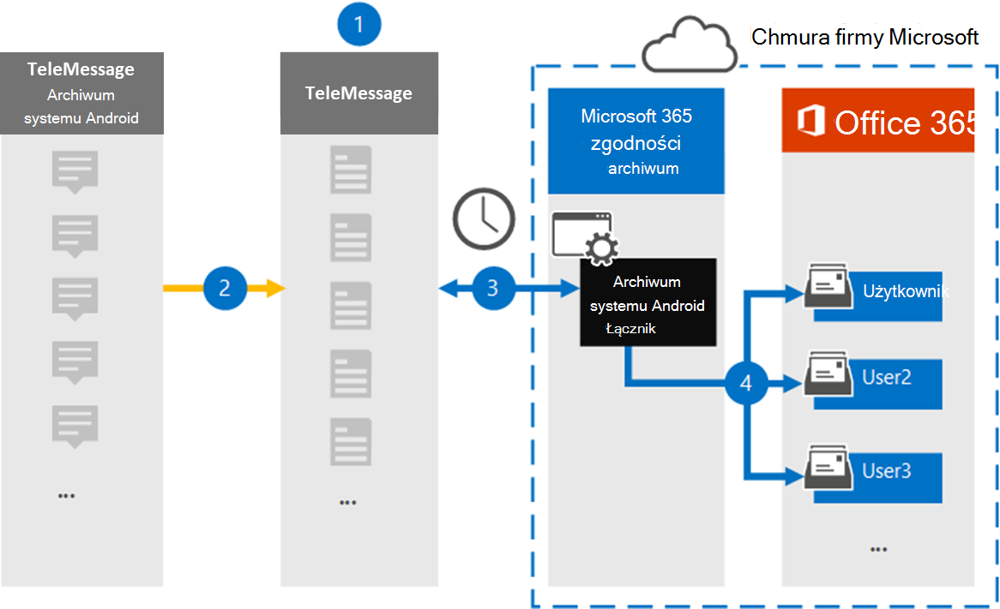

# Konfigurowanie łącznika do archiwizowania danych mobilnych systemu Android

Użyj łącznika TeleMessage w aplikacji Centrum zgodności platformy Microsoft 365, aby importować i archiwizować wiadomości SMS, MMS, połączenia głosowe i dzienniki połączeń z telefonów komórkowych z systemem Android. Po skonfigurowaniu i skonfigurowaniu łącznika łączy się on z kontem TeleMessage Twojej organizacji raz dziennie i importuje wiadomości mobilne pracowników za pomocą archiwum systemu Android TeleMessage do skrzynek pocztowych w usłudze Microsoft 365.

Po zapisaniu danych z telefonów komórkowych z systemem Android w skrzynkach pocztowych użytkowników możesz zastosować funkcje zgodności aplikacji Microsoft 365, takie jak Archiwizacja w związku z postępowaniem sądowym, Wyszukiwanie zawartości i zasady przechowywania Microsoft 365 do danych archiwum systemu Android. Można na przykład przeszukać komunikację w urządzeniu przenośnym z archiwum systemu Android przy użyciu funkcji przeszukiwania zawartości lub skojarzyć skrzynkę pocztową zawierającą dane łącznika funkcji Archiwum systemu Android ze współpracownikiem w Advanced eDiscovery przypadku. Importowanie i archiwizowanie danych w aplikacji Microsoft 365 za pomocą łącznika archiwum systemu Android może ułatwić organizacji zachowania zgodności z zasadami rządowymi i przepisami.

## Omówienie archiwizowania danych mobilnych w systemie Android

W poniższym o omówieniem wyjaśniono proces używania łącznika do archiwizowania danych mobilnych z systemu Android w Microsoft 365.

1. Twoja organizacja współpracuje z usługą TeleMessage w celu skonfigurowania łącznika archiwum systemu Android. Aby uzyskać więcej informacji, zobacz Archiwum [systemu Android](https://www.telemessage.com/office365-activation-for-android-archiver/).

2. W czasie rzeczywistym wiadomości SMS, MMS, połączenia głosowe i dzienniki połączeń z telefonów komórkowych z systemem Android organizacji są kopiowane do witryny TeleMessage.

3. Łącznik archiwum systemu Android, który tworzysz w usłudze Centrum zgodności platformy Microsoft 365, łączy się z witryną TeleMessage codziennie i przesyła dane z systemu Android z poprzednich 24 godzin do bezpiecznej lokalizacji usługi Azure Storage w chmurze firmy Microsoft. Łącznik konwertuje również dane systemu Android na format wiadomości e-mail.

4. Łącznik importuje elementy komunikacji mobilnej do skrzynki pocztowej określonego użytkownika. W skrzynce pocztowej określonego użytkownika jest tworzony nowy folder o nazwie Archiwum systemu Android i elementy są do niego importowane. Łącznik mapuje dane przy użyciu wartości *właściwości Adres e-mail* użytkownika. Każda wiadomość e-mail zawiera tę właściwość, która jest wypełniana adresem e-mail każdego uczestnika wiadomości e-mail. Oprócz automatycznego mapowania użytkowników przy użyciu wartości właściwości Adres e-mail użytkownika możesz również zdefiniować mapowanie niestandardowe, przesyłając plik mapowania plików CSV. Ten plik mapowania powinien zawierać numer telefonu komórkowego i Microsoft 365 adres skrzynki pocztowej dla każdego użytkownika. Jeśli włączysz automatyczne mapowanie użytkowników i udostępnisz mapowanie niestandardowe, dla każdego elementu poczty e-mail łącznik najpierw przyjrzy się plikowi mapowania niestandardowego. Jeśli użytkownik nie znajdzie prawidłowego Microsoft 365 odpowiadającego numerowi telefonu komórkowego użytkownika, łącznik użyje właściwości adresu e-mail użytkownika elementu poczty e-mail. Jeśli łącznik nie znajdzie prawidłowego użytkownika Microsoft 365 w pliku mapowania niestandardowego lub właściwości Adres e-mail użytkownika elementu  poczty e-mail, element nie zostanie zaimportowany.

## Przed skonfigurowaniem łącznika

Niektóre kroki implementacji wymagane do archiwizowania danych komunikacyjnych systemu Android są zewnętrzne Microsoft 365 i muszą zostać ukończone, zanim będzie można utworzyć łącznik w centrum zgodności.

- Zamów [usługę Android Archiver w serwisie TeleMessage](https://www.telemessage.com/mobile-archiver/order-mobile-archiver-for-o365) i uzyskaj prawidłowe konto administracyjne dla twojej organizacji. Podczas tworzenia łącznika musisz zalogować się do tego konta.

- Zarejestruj wszystkich użytkowników, którzy wymagają usługi Archiver systemu Android, na koncie TeleMessage. Podczas rejestrowania użytkowników pamiętaj, aby używać tego samego adresu e-mail, który jest używany na ich Microsoft 365 kontach.

- Zainstaluj i aktywuj aplikację TeleMessage Android Archiver na telefonach komórkowych pracowników.

- Użytkownik, który tworzy łącznik funkcji Archiwum systemu Android, musi mieć przypisaną rolę importowania i eksportowania skrzynek pocztowych w aplikacji Exchange Online. Jest to wymagane do dodawania łączników na **stronie Łączniki** danych w Centrum zgodności platformy Microsoft 365. Domyślnie ta rola nie jest przypisana do żadnej grupy ról w Exchange Online. Rolę importowania i eksportowania skrzynek pocztowych możesz dodać do grupy ról Zarządzanie organizacją w programie Exchange Online. Możesz też utworzyć grupę ról, przypisać rolę importowania i eksportowania skrzynek pocztowych, a następnie dodać odpowiednich użytkowników jako członków. Aby uzyskać więcej informacji, zobacz sekcje [Tworzenie grup ról](/Exchange/permissions-exo/role-groups#create-role-groups) [lub](/Exchange/permissions-exo/role-groups#modify-role-groups) Modyfikowanie grup ról w artykule "Zarządzanie grupami ról w aplikacji Exchange Online".

- Ten łącznik danych TeleMessage jest dostępny w GCC w chmurze dla instytucji rządowych Microsoft 365 USA. Aplikacje i usługi innych firm mogą obejmować przechowywanie, przekazywanie i przetwarzanie danych klienta Organizacji w systemach innych firm, które znajdują się poza infrastrukturą firmy Microsoft 365 i dlatego nie są objęte zobowiązaniami firmy Microsoft 365 w zakresie zgodności z przepisami i ochrony danych. Firma Microsoft nie zapewnia, że używanie tego produktu do łączenia się z aplikacjami innych firm oznacza, że te aplikacje innych firm są zgodne z fedRAMP.

## Tworzenie łącznika archiwum systemu Android

Ostatnim krokiem jest utworzenie łącznika programu Android Archiver w Centrum zgodności platformy Microsoft 365. Łącznik używa podanej informacji do nawiązania połączenia z witryną TeleMessage i przeniesienia komunikacji z systemem Android do odpowiednich skrzynek pocztowych użytkowników w Microsoft 365.

1. Przejdź do i [https://compliance.microsoft.com](https://compliance.microsoft.com) kliknij pozycję **Łączniki** **danychArchiwizatorandroidu** > .

2. Na stronie **opis produktu archiwum systemu Android** kliknij pozycję **Dodaj łącznik**.

3. Na stronie **Warunki użytkowania usługi** kliknij pozycję **Zaakceptuj**.

4. Na stronie **Login to TeleMessage** (Logowanie do telemessage) w obszarze Krok 3 wprowadź wymagane informacje w następujących polach, a następnie kliknij przycisk **Dalej**.

   - **Nazwa użytkownika:** Twoja nazwa użytkownika aplikacji TeleMessage.

   - **Hasło:** Hasło aplikacji TeleMessage.

5. Po utworzeniu łącznika zamknij okno podręczne i kliknij przycisk **Dalej**.

6. Na stronie **Mapowanie użytkowników** włącz automatyczne mapowanie użytkowników i kliknij przycisk **Dalej**. Jeśli potrzebujesz mapowania niestandardowego, przekaż plik CSV i kliknij przycisk **Dalej**.

7. Przejrzyj ustawienia, a następnie kliknij przycisk **Zakończ,** aby utworzyć łącznik.

8. Przejdź do karty Łączniki na **stronie Łączniki** danych, aby wyświetlić postęp procesu importowania nowego łącznika.

## Znane problemy

- Obecnie importowanie załączników ani elementów większych niż 10 MB nie jest obsługuje. Obsługa większych elementów będzie dostępna w późniejszym terminie.
