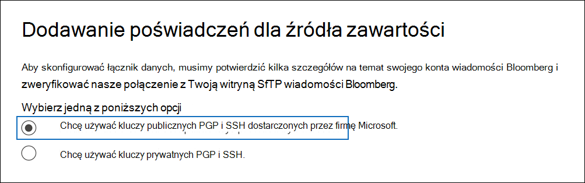
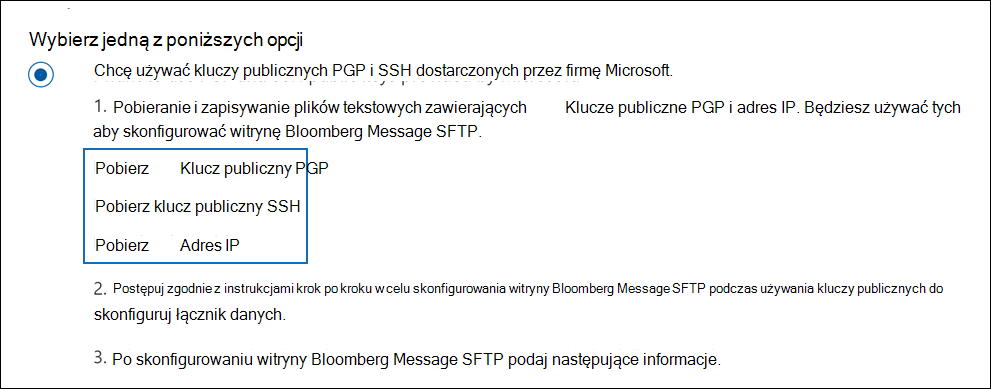
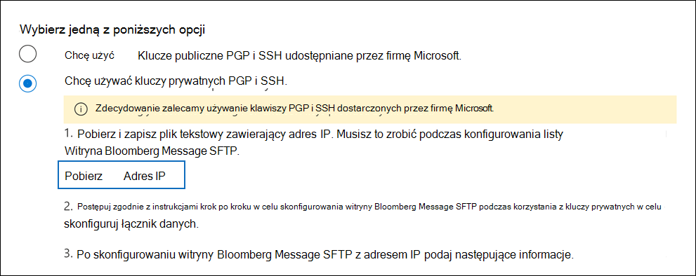
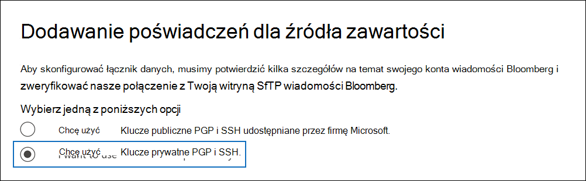

# Konfigurowanie łącznika do archiwizowania danych wiadomości Bloomberga

Użyj łącznika danych w centrum Centrum zgodności platformy Microsoft 365 i zarchiwizuj dane poczty e-mail usług finansowych za pomocą narzędzia do współpracy nad wiadomościami [Bloomberg](https://www.bloomberg.com/professional/product/collaboration/). Po skonfigurowaniu i skonfigurowaniu łącznika połączy się on z witryną Bloomberg secure FTP (SFTP) Twojej organizacji raz dziennie i importuje elementy poczty e-mail do skrzynek pocztowych w programie Microsoft 365.

Po zapisaniu danych wiadomości Bloomberga W skrzynkach pocztowych użytkowników można stosować funkcje zgodności usługi Microsoft 365, takie jak archiwizacja w związku z postępowaniem sądowym, wyszukiwanie zawartości, archiwizowanie w miejscu, inspekcja, zgodność z komunikacją i zasady przechowywania Microsoft 365 do danych wiadomości Bloomberga. Możesz na przykład wyszukać wiadomości e-mail Bloomberg Message za pomocą narzędzia do wyszukiwania zawartości lub skojarzyć skrzynkę pocztową zawierającą dane wiadomości Bloomberga ze współpracownikiem w Advanced eDiscovery przypadku. Importowanie i archiwizowanie danych w programie Microsoft 365 za pomocą łącznika wiadomości bloomberga może ułatwić organizacji zgodność z zasadami rządowymi i przepisami.

## Omówienie archiwizowania danych wiadomości kwiatowych

Poniższe omówienie przedstawia proces używania łącznika do archiwizowania danych wiadomości bloomberg w programie Microsoft 365.

1. Twoja organizacja współpracuje z Bloombergiem, aby skonfigurować witrynę Bloomberg SFTP. Wraz z Bloombergiem skonfigurujesz wiadomość bloomberg w celu kopiowania wiadomości e-mail do witryny Bloomberg SFTP.

2. Wiadomości e-mail od użytkownika Bloomberg Message są kopiowane do witryny Bloomberg SFTP co 24 godziny.

3. Łącznik wiadomości Bloomberg, który tworzysz w programie Centrum zgodności platformy Microsoft 365, łączy się z witryną Bloomberg SFTP codziennie i przesyła wiadomości e-mail z poprzednich 24 godzin do bezpiecznego obszaru usługi Azure Storage w chmurze firmy Microsoft.

4. Łącznik zaim importuje elementy wiadomości e-mail do skrzynki pocztowej określonego użytkownika. W skrzynce pocztowej określonego użytkownika jest tworzony nowy folder o nazwie BloombergMessage, do których elementy zostaną zaimportowane.

   Łącznik działa przy użyciu wartości właściwości CorporateEmailAddress. Każda wiadomość e-mail zawiera tę właściwość, która jest wypełniana adresem e-mail każdego uczestnika wiadomości e-mail. Oprócz automatycznego mapowania użytkowników przy użyciu wartości właściwości *CorporateEmailAddress* możesz również zdefiniować mapowanie niestandardowe, przesyłając plik mapowania CSV. Ten plik mapowania zawiera identyfikator UUID Bloomberga oraz Microsoft 365 adres skrzynki pocztowej dla każdego użytkownika w organizacji. Jeśli włączysz automatyczne mapowanie użytkowników i udostępnisz mapowanie niestandardowe, dla każdego elementu poczty e-mail łącznik najpierw przyjrzy się plikowi mapowania niestandardowego. Jeśli użytkownik nie znajdzie prawidłowego Microsoft 365 odpowiadającego identyfikatorowi UUID użytkownika Bloomberga, łącznik użyje właściwości *CorporateEmailAddress* elementu poczty e-mail. Jeśli łącznik nie znajdzie prawidłowego użytkownika Microsoft 365 w pliku mapowania niestandardowego lub właściwości *CorporateEmailAddress* elementu poczty e-mail, element nie zostanie zaimportowany.

## Przed skonfigurowaniem łącznika

Niektóre kroki implementacji wymagane do archiwizacji danych wiadomości Bloomberga są zewnętrzne Microsoft 365 i muszą zostać ukończone, zanim będzie można utworzyć łącznik w centrum zgodności.

- Aby skonfigurować łącznik wiadomości programu Bloomberg, musisz używać klawiszy i kluczowych zwrotów dla plików PGP (Pretty Good Privacy) i Secure Shell (SSH). Te klucze są używane do konfigurowania witryny Bloomberg SFTP i używane przez łącznik do łączenia się z witryną Bloomberg SFTP w celu importowania danych do Microsoft 365. Klawisz PGP służy do konfigurowania szyfrowania danych przesyłanych z witryny Bloomberg SFTP do Microsoft 365. Klawisz SSH służy do konfigurowania bezpiecznej powłoki w celu umożliwienia bezpiecznego logowania zdalnego, gdy łącznik łączy się z witryną Bloomberg SFTP.

  Podczas konfigurowania łącznika możesz używać kluczy publicznych i kluczowych zwrotów dostarczanych przez firmę Microsoft lub możesz używać własnych kluczy prywatnych i zwrotów. Zalecamy używanie kluczy publicznych dostarczonych przez firmę Microsoft. Jednak jeśli organizacja skonfigurowała już witrynę Bloomberg SFTP przy użyciu kluczy prywatnych, możesz utworzyć łącznik, używając tych samych kluczy prywatnych.

- [Zasubskrybuj usługę Bloomberg Anywhere](https://www.bloomberg.com/professional/product/remote-access/?bbgsum-page=DG-WS-PROF-PROD-BBA). Jest to wymagane, aby można było zalogować się do bloomberg Anywhere, aby uzyskać dostęp do witryny Bloomberg SFTP, która jest wymagana do skonfigurowania i skonfigurowania.

- Skonfiguruj witrynę Bloomberg SFTP (Secure file transfer protocol). Po pracy z Bloombergiem w celu skonfigurowania witryny SFTP dane z Bloomberg Message są codziennie przekazywane do witryny SFTP. Łącznik, który tworzysz w kroku 2, łączy się z tą witryną SFTP i przesyła dane poczty e-mail do Microsoft 365 pocztowych. SfTP szyfruje również dane wiadomości Bloomberga, które są wysyłane do skrzynek pocztowych w trakcie procesu przenoszenia.

  Aby uzyskać informacje na temat Bloomberg SFTP (nazywanej również *BB-SFTP*):

  - Zobacz dokument "SFTP Connectivity Standards" (Standardy łączności SFTP) w oknie [pomocy technicznej Bloomberga](https://www.bloomberg.com/professional/support/documentation/).

  - Skontaktuj [się z działem obsługi klienta Bloomberg](https://service.bloomberg.com/portal/sessions/new?utm_source=bloomberg-menu&utm_medium=csc).

- Po zakończeniu współpracy z Bloombergiem w celu skonfigurowania witryny SFTP, Bloomberg udostępni Ci pewne informacje, gdy odpowiesz na wiadomość e-mail implementacji Bloomberga. Zapisz kopię poniższych informacji. Za jego pomocą możesz skonfigurować łącznik w kroku 3.

  - Firmowy kod, który jest identyfikatorem Twojej organizacji i jest używany do logowania się do witryny Bloomberg SFTP.

  - Hasło do witryny Bloomberg SFTP

  - Adres URL witryny Bloomberg SFTP (na przykład sftp.bloomberg.com). Ponadto Bloomberg może także podać odpowiedni adres IP dla witryny Bloomberg SFTP, za pomocą której można również skonfigurować łącznik.

  - Numer portu witryny Bloomberg SFTP

- Łącznik Wiadomości Bloomberga może zaimportować łącznie 200 000 elementów w jednym dniu. Jeśli w witrynie SFTP istnieje więcej niż 200 000 elementów, żadne z tych elementów nie zostaną zaimportowane do Microsoft 365.

- Użytkownik, który w kroku 3 (i który pobiera klucze publiczne i adres IP w kroku 1), musi mieć przypisaną rolę administratora łącznika danych. Ta rola jest wymagana do dodawania łączników na **stronie Łączniki** danych w Centrum zgodności platformy Microsoft 365. Ta rola jest domyślnie dodawana do wielu grup ról. Aby uzyskać listę tych grup ról, zobacz sekcję "Role w centrach zabezpieczeń i zgodności" w sekcji Uprawnienia w Centrum zabezpieczeń & [zgodności](../security/office-365-security/permissions-in-the-security-and-compliance-center.md#roles-in-the-security--compliance-center). Administrator w organizacji może również utworzyć niestandardową grupę ról, przypisać rolę administrator łącznika danych, a następnie dodać odpowiednich użytkowników jako członków. Aby uzyskać instrukcje, zobacz sekcję "Tworzenie niestandardowej grupy ról" w sekcji Uprawnienia [w Centrum zgodności platformy Microsoft 365](microsoft-365-compliance-center-permissions.md#create-a-custom-role-group).

## Konfigurowanie łącznika przy użyciu kluczy publicznych

W tej sekcji opisano sposób skonfigurowania łącznika wiadomości Bloomberga przy użyciu kluczy publicznych w celu zapewnienia dobrej ochrony prywatności (PGP) i bezpiecznego powłoki (SSH, Secure Shell).

### Krok 1. Uzyskiwanie kluczy publicznych PGP i SSH

Pierwszym krokiem jest uzyskanie kopii kluczy publicznych PGP i SSH. Za pomocą tych kluczy w kroku 2 konfigurujesz witrynę Bloomberg SFTP, aby umożliwić łącznikowi (który został przez Ciebie utworzyć w kroku 3) łączenie się z witryną SFTP i przesyłanie danych e-mail wiadomości Bloomberga do skrzynek pocztowych Microsoft 365 pocztowych. Adres IP uzyskasz również w tym kroku, którego używasz podczas konfigurowania witryny Bloomberg SFTP.

1. Przejdź do łączników <https://compliance.microsoft.com> **danych w lewym okienku narracji i** kliknij je.

2. Na stronie **Łączniki danych** w obszarze **Wiadomość kwiatowej góry** kliknij pozycję **Widok**.

3. Na stronie **Opis produktu wiadomości bloomberga** kliknij pozycję **Dodaj łącznik**

4. Na stronie **Warunki użytkowania usługi** kliknij pozycję **Zaakceptuj**.

5. Na stronie **Dodaj poświadczenia dla źródła** zawartości kliknij pozycję Chcę używać kluczy publicznych **PGP i SSH dostarczonych przez firmę Microsoft**.

   

6. W obszarze krok 1 kliknij linki Pobierz **klucz SSH**, Pobierz klucz **PGP** i Pobierz adres **IP** , aby zapisać kopię każdego pliku na komputerze lokalnym.

   

   Te pliki zawierają następujące elementy używane do konfigurowania witryny Bloomberg SFTP w kroku 2:

   - Klucz publiczny PGP: Ten klucz służy do konfigurowania szyfrowania danych przesyłanych z witryny Bloomberg SFTP do Microsoft 365.

   - Klucz publiczny SSH: Ten klucz służy do konfigurowania bezpiecznej powłoki w celu umożliwienia bezpiecznego logowania zdalnego, gdy łącznik łączy się z witryną Bloomberg SFTP.

   - Adres IP: Witryna Bloomberg SFTP jest skonfigurowana do akceptowania żądań połączenia z tego adresu IP. Ten sam adres IP jest używany przez łącznik wiadomości Bloomberga do łączenia się z witryną SFTP i przesyłania danych wiadomości Bloomberga do Microsoft 365.

7. Kliknij **przycisk Anuluj** , aby zamknąć kreatora. Powrócisz do tego kreatora w kroku 3, aby utworzyć łącznik.

### Krok 2. Konfigurowanie witryny Bloomberg SFTP

> [!NOTE]
> Jeśli Twoja organizacja schował wcześniej witrynę Bloomberg SFTP do archiwizowania danych Instant Bloomberga przy użyciu publicznych kluczy PGP i SSH, nie musisz  skonfigurować innej. Tę samą witrynę SFTP można określić podczas tworzenia łącznika w kroku 3.

Następnym krokiem jest użycie kluczy publicznych PGP i SSH oraz adresu IP uzyskanego w kroku 1 w celu skonfigurowania szyfrowania PGP i uwierzytelniania SSH dla witryny Bloomberg SFTP. Dzięki temu łącznik wiadomości bloomberga (Bloomberg Message) utworzeniu w kroku 3 połączy się z witryną Bloomberg SFTP i przekieruje dane wiadomości Bloomberga do Microsoft 365. Aby skonfigurować witrynę Bloomberg SFTP, musisz współpracować z działem obsługi klienta Bloomberg. Skontaktuj [się z działem obsługi klienta Bloomberg,](https://service.bloomberg.com/portal/sessions/new?utm_source=bloomberg-menu&utm_medium=csc) aby uzyskać pomoc.

> [!IMPORTANT]
> Bloomberg zaleca, aby dołączyć trzy pliki pobrane w kroku 1 do wiadomości e-mail i wysłać je do zespołu obsługi klienta podczas współpracy z nimi w celu skonfigurowania witryny Bloomberg SFTP.

### Krok 3. Tworzenie łącznika wiadomości bloomberga

Ostatnim krokiem jest utworzenie łącznika Wiadomości Kwiatberga w Centrum zgodności platformy Microsoft 365. Łącznik używa podanych informacji do nawiązania połączenia z witryną Bloomberg SFTP i przeniesienia wiadomości e-mail do odpowiednich skrzynek pocztowych użytkowników w programie Microsoft 365.

1. Przejdź do łączników <https://compliance.microsoft.com> **danych w lewym okienku narracji i** kliknij je.

2. Na stronie **Łączniki danych** w obszarze **Wiadomość kwiatowej góry** kliknij pozycję **Widok**.

3. Na stronie **Opis produktu wiadomości bloomberga** kliknij pozycję **Dodaj łącznik**

4. Na stronie **Warunki użytkowania usługi** kliknij pozycję **Zaakceptuj**.

5. Na stronie **Dodaj poświadczenia dla źródła** zawartości kliknij pozycję Chcę używać kluczy publicznych **PGP i SSH dostarczonych przez firmę Microsoft**.

6. W obszarze Krok 3 wprowadź wymagane informacje w następujących polach, a następnie kliknij pozycję **Sprawdź poprawność połączenia**.

      - **Nazwa:** Nazwa łącznika. Musi być unikatowy w Twojej organizacji.

      - **Kod firmy:** Identyfikator organizacji używany jako nazwa użytkownika witryny Bloomberg SFTP.

      - **Hasło:** Hasło do witryny Bloomberg SFTP Twojej organizacji.

      - **SFTP URL:** Adres URL witryny Bloomberg SFTP (na przykład `sftp.bloomberg.com`). W tej wartości możesz również użyć adresu IP.

      - **Port SFTP:** Numer portu witryny Bloomberg SFTP. Łącznik używa tego portu do łączenia się z witryną SFTP.

7. Po pomyślnym weryfikacji połączenia kliknij przycisk **Dalej**.

8. Na stronie **Map Bloomberg Message users to Microsoft 365 users (Wiadomości bloomberga**) włącz automatyczne mapowanie użytkowników i zapewnij niestandardowe mapowanie użytkowników zgodnie z wymaganiami.

   > [!NOTE]
   > Łącznik zaim importuje elementy wiadomości do skrzynki pocztowej określonego użytkownika. W skrzynce pocztowej określonego użytkownika jest tworzony nowy folder o nazwie **BloombergMessage** , do których elementy zostaną zaimportowane. Łącznik działa przy użyciu wartości właściwości *CorporateEmailAddress* . Każda wiadomość czatu zawiera tę właściwość, a jej adres e-mail zostanie wypełniony adresem e-mail każdego uczestnika wiadomości czatu. Oprócz automatycznego mapowania użytkowników przy użyciu wartości właściwości *CorporateEmailAddress* możesz także zdefiniować mapowanie niestandardowe, przesyłając plik mapowania plików CSV. Plik mapowania powinien zawierać identyfikator UUID Bloomberga i odpowiedni Microsoft 365 adres skrzynki pocztowej dla każdego użytkownika. Jeśli włączysz automatyczne mapowanie użytkowników i udostępnisz mapowanie niestandardowe, dla każdego elementu wiadomości łącznik najpierw przyjrzy się plikowi mapowania niestandardowego. Jeśli użytkownik nie znajdzie prawidłowego Microsoft 365 odpowiadającego identyfikatorowi UUID użytkownika Bloomberga, łącznik użyje właściwości *CorporateEmailAddress* elementu czatu. Jeśli łącznik nie znajdzie prawidłowego użytkownika Microsoft 365 w pliku mapowania niestandardowego lub właściwości *CorporateEmailAddress* elementu wiadomości, element nie zostanie zaimportowany.

9. Kliknij **przycisk Dalej**, przejrzyj ustawienia, a następnie kliknij przycisk **Zakończ,** aby utworzyć łącznik.

10. Przejdź do **strony Łączniki** danych, aby wyświetlić postęp procesu importowania nowego łącznika. Kliknij łącznik, aby wyświetlić stronę wysuwu zawierającą informacje o łączniku.

## Konfigurowanie łącznika przy użyciu kluczy prywatnych

W tej sekcji popisano, jak skonfigurować łącznik wiadomości Bloomberga przy użyciu kluczy prywatnych PGP i SSH. Ta opcja konfiguracji łącznika jest przeznaczona dla organizacji, które już skonfigurowały witrynę Bloomberg SFTP przy użyciu kluczy prywatnych.

### Krok 1. Uzyskiwanie adresu IP w celu skonfigurowania witryny Bloomberg SFTP

> [!NOTE]
> Jeśli twoja organizacja skonfigurowała wcześniej witrynę Bloomberg SFTP do archiwizowania danych Instant Bloomberga przy użyciu kluczy prywatnych PGP i SSH, nie musisz konfigurować innej. Tę samą witrynę SFTP można określić podczas tworzenia łącznika w kroku 2.

Jeśli Twoja organizacja użyła kluczy prywatnych PGP i SSH do skonfigurowania witryny Bloomberg SFTP, musisz uzyskać adres IP i przekazać go działowi obsługi klienta Bloomberg. Witryna Bloomberg SFTP musi być skonfigurowana do akceptowania żądań połączeń z tego adresu IP. Ten sam adres IP jest używany przez łącznik wiadomości Bloomberga do łączenia się z witryną SFTP i przesyłania danych wiadomości Bloomberga do Microsoft 365.

Aby uzyskać adres IP:

1. Przejdź do łączników <https://compliance.microsoft.com> **danych w lewym okienku narracji i** kliknij je.

2. Na stronie **Łączniki danych** w obszarze **Wiadomość kwiatowej góry** kliknij pozycję **Widok**.

3. Na stronie **Opis produktu wiadomości bloomberga** kliknij pozycję **Dodaj łącznik**

4. Na stronie **Warunki użytkowania usługi** kliknij pozycję **Zaakceptuj**.

5. Na stronie **Dodaj poświadczenia dla źródła zawartości** kliknij pozycję **Chcę używać kluczy prywatnych PGP i SSH**.

6. W obszarze krok 1 kliknij pozycję **Pobierz adres IP** , aby zapisać kopię pliku adresu IP na komputerze lokalnym.

   

7. Kliknij **przycisk Anuluj** , aby zamknąć kreatora. Powrócisz do tego kreatora w kroku 2, aby utworzyć łącznik.

Musisz współpracować z działem obsługi klienta Bloomberg, aby skonfigurować witrynę Bloomberg SFTP w celu akceptowania żądań połączeń z tego adresu IP. Skontaktuj [się z działem obsługi klienta Bloomberg,](https://service.bloomberg.com/portal/sessions/new?utm_source=bloomberg-menu&utm_medium=csc) aby uzyskać pomoc.

### Krok 2. Tworzenie łącznika wiadomości bloomberga

Po skonfigurowaniu witryny Bloomberg SFTP kolejnym krokiem jest utworzenie łącznika Bloomberg Message w Centrum zgodności platformy Microsoft 365. Łącznik używa podanych informacji do nawiązania połączenia z witryną Bloomberg SFTP i przeniesienia wiadomości e-mail do odpowiednich skrzynek pocztowych użytkowników w programie Microsoft 365. Aby wykonać ten krok, upewnij się, że masz kopie tych samych kluczy prywatnych i kluczowych zwrotów, które zostały użyte do skonfigurowania Twojej witryny Bloomberg SFTP.

1. Przejdź do łączników <https://compliance.microsoft.com> **danych w lewym okienku narracji i** kliknij je.

2. Na stronie **Łączniki danych** w obszarze **Wiadomość kwiatowej góry** kliknij pozycję **Widok**.

3. Na stronie **Opis produktu wiadomości bloomberga** kliknij pozycję **Dodaj łącznik**

4. Na stronie **Warunki użytkowania usługi** kliknij pozycję **Zaakceptuj**.

5. Na stronie **Dodaj poświadczenia dla źródła zawartości** kliknij pozycję **Chcę używać kluczy prywatnych PGP i SSH**.

   

6. W obszarze Krok 3 wprowadź wymagane informacje w następujących polach, a następnie kliknij pozycję **Sprawdź poprawność połączenia**.

      - **Nazwa:** Nazwa łącznika. Musi być unikatowy w Twojej organizacji.

      - **Kod firmy:** Identyfikator organizacji używany jako nazwa użytkownika witryny Bloomberg SFTP.

      - **Hasło:** Hasło do witryny Bloomberg SFTP Twojej organizacji.

      - **SFTP URL:** Adres URL witryny Bloomberg SFTP (na przykład `sftp.bloomberg.com`). W tej wartości możesz również użyć adresu IP.

      - **Port SFTP:** Numer portu witryny Bloomberg SFTP. Łącznik używa tego portu do łączenia się z witryną SFTP.

      - **Klucz prywatny PGP:** Klucz prywatny PGP dla witryny Bloomberg SFTP. Pamiętaj o uwzględnieniu całej wartości klucza prywatnego, łącznie z pierwszym i końcową łącznie z blokiem klucza.

      - **Hasło klucza PGP:** Kod dostępu do klucza prywatnego PGP.

      - **Klucz prywatny SSH:** Klucz prywatny SSH dla witryny Bloomberg SFTP. Pamiętaj o uwzględnieniu całej wartości klucza prywatnego, łącznie z pierwszym i końcową łącznie z blokiem klucza.

      - **Kluczowy zwrot SSH:** Kod dostępu do klucza prywatnego SSH.

7. Po pomyślnym weryfikacji połączenia kliknij przycisk **Dalej**.

8. Na stronie **Map Bloomberg Message users to Microsoft 365 users (Wiadomości bloomberga**) włącz automatyczne mapowanie użytkowników i zapewnij niestandardowe mapowanie użytkowników zgodnie z wymaganiami.

   > [!NOTE]
   > Łącznik zaim importuje elementy wiadomości do skrzynki pocztowej określonego użytkownika. W skrzynce pocztowej określonego użytkownika jest tworzony nowy folder o nazwie **BloombergMessage** , do których elementy zostaną zaimportowane. Łącznik działa przy użyciu wartości właściwości *CorporateEmailAddress* . Każda wiadomość czatu zawiera tę właściwość, a jej adres e-mail zostanie wypełniony adresem e-mail każdego uczestnika wiadomości czatu. Oprócz automatycznego mapowania użytkowników przy użyciu wartości właściwości *CorporateEmailAddress* możesz także zdefiniować mapowanie niestandardowe, przesyłając plik mapowania plików CSV. Plik mapowania powinien zawierać identyfikator UUID Bloomberga i odpowiedni Microsoft 365 adres skrzynki pocztowej dla każdego użytkownika. Jeśli włączysz automatyczne mapowanie użytkowników i udostępnisz mapowanie niestandardowe, dla każdego elementu wiadomości łącznik najpierw przyjrzy się plikowi mapowania niestandardowego. Jeśli użytkownik nie znajdzie prawidłowego Microsoft 365 odpowiadającego identyfikatorowi UUID użytkownika Bloomberga, łącznik użyje właściwości *CorporateEmailAddress* elementu czatu. Jeśli łącznik nie znajdzie prawidłowego użytkownika Microsoft 365 w pliku mapowania niestandardowego lub właściwości *CorporateEmailAddress* elementu wiadomości, element nie zostanie zaimportowany.

9. Kliknij **przycisk Dalej**, przejrzyj ustawienia, a następnie kliknij przycisk **Zakończ,** aby utworzyć łącznik.

10. Przejdź do **strony Łączniki** danych, aby wyświetlić postęp procesu importowania nowego łącznika. Kliknij łącznik, aby wyświetlić stronę wysuwu zawierającą informacje o łączniku.

## Znane problemy

- Wątkowanie wiadomości Bloomberg Message importowanych do Microsoft 365 nie jest obsługiwane. Poszczególne wiadomości wysłane do poszczególnych osób są importowane, ale nie są prezentowane w konwersacji z wątkami. Firma Microsoft pracuje nad obsługą wątków w nowszych wersjach łącznika danych wiadomości Bloomberg.
