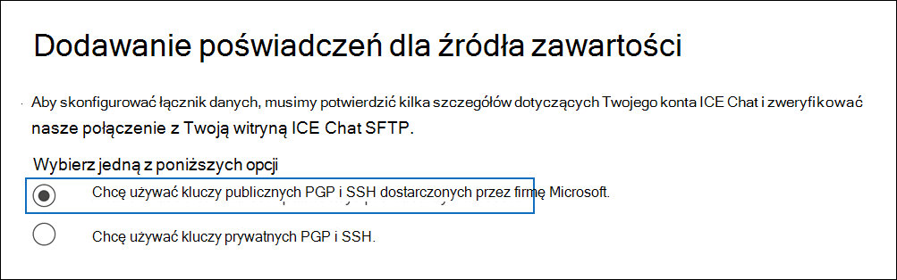
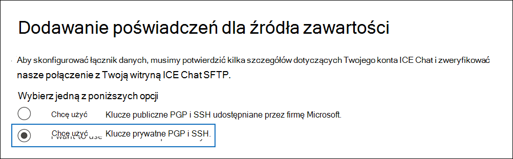
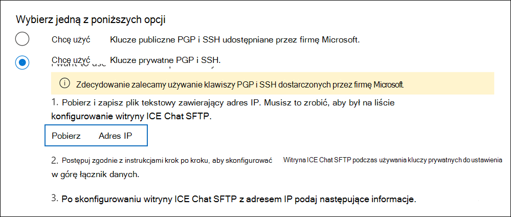

# Konfigurowanie łącznika do archiwizowania danych czatu ICE

Użyj natywnego łącznika w portal zgodności Microsoft Purview, aby zaimportować i zarchiwizować dane czatu usług finansowych z narzędzia do współpracy ICE Chat. Po skonfigurowaniu i skonfigurowaniu łącznika łączy się on z bezpieczną witryną FTP (SFTP) w organizacji raz dziennie, konwertuje zawartość wiadomości czatu na format wiadomości e-mail, a następnie importuje te elementy do skrzynek pocztowych na platformie Microsoft 365.

Po przechowywaniu danych czatu ICE w skrzynkach pocztowych użytkowników można zastosować funkcje usługi Microsoft Purview, takie jak blokada postępowania sądowego, zbieranie elektronicznych materiałów dowodowych, archiwizowanie, inspekcja, zgodność z komunikacją i zasady przechowywania usługi Microsoft 365 do danych czatu ICE. Na przykład możesz wyszukiwać wiadomości ICE Chat przy użyciu wyszukiwania zawartości lub skojarzyć skrzynkę pocztową zawierającą dane czatu ICE z opiekunem w przypadku zbierania elektronicznych materiałów dowodowych (Premium). Importowanie i archiwizowanie danych na platformie Microsoft 365 przy użyciu łącznika ICE Chat może pomóc Twojej organizacji zachować zgodność z zasadami rządowymi i regulacyjnymi.

## Omówienie archiwizacji danych czatu ICE

W poniższym omówieniu wyjaśniono proces korzystania z łącznika do archiwizowania danych czatu ICE na platformie Microsoft 365.

1. Twoja organizacja współpracuje z ICE Chat, aby skonfigurować witrynę ICE Chat SFTP. Będziesz również współpracować z ICE Chat, aby skonfigurować ice chat do kopiowania wiadomości czatu do witryny ICE Chat SFTP.

2. Raz na 24 godziny wiadomości czatu z ICE Chat są kopiowane do witryny ICE Chat SFTP.

3. Łącznik ICE Chat tworzony w portalu zgodności codziennie łączy się z witryną ICE Chat SFTP i przesyła komunikaty rozmów z poprzednich 24 godzin do bezpiecznej lokalizacji usługi Azure Storage w chmurze firmy Microsoft. Łącznik konwertuje również zawartość masażu czatu na format wiadomości e-mail.

4. Łącznik importuje elementy wiadomości czatu do skrzynek pocztowych określonych użytkowników. Nowy folder o nazwie **ICE Chat** jest tworzony w skrzynkach pocztowych użytkownika, a elementy wiadomości czatu są importowane do tego folderu. Łącznik jest używany przy użyciu wartości właściwości *SenderEmail* i *RecipientEmail* . Każda wiadomość czatu zawiera te właściwości, które są wypełniane adresem e-mail nadawcy i każdego adresata/uczestnika wiadomości czatu.

   Oprócz automatycznego mapowania użytkownika korzystającego z wartości właściwości *SenderEmail* i *RecipientEmail* (co oznacza, że łącznik importuje wiadomość czatu do skrzynki pocztowej nadawcy i skrzynek pocztowych każdego adresata), możesz również zdefiniować mapowanie użytkownika niestandardowego, przekazując plik mapowania CSV. Ten plik mapowania zawiera identyfikator *IMId* czatu ICE i odpowiedni adres skrzynki pocztowej platformy Microsoft 365 dla każdego użytkownika w organizacji. Jeśli włączysz automatyczne mapowanie użytkowników i udostępnisz plik mapowania niestandardowego, dla każdego elementu czatu łącznik najpierw przyjrzy się plikowi mapowania niestandardowego. Jeśli nie znajdzie prawidłowego konta użytkownika platformy Microsoft 365, które odpowiada identyfikatorowi IMId czatu ICE użytkownika, łącznik *użyje właściwości SenderEmail* i *RecipientEmail* elementu czatu, aby zaimportować element do skrzynek pocztowych uczestników czatu. Jeśli łącznik nie znajdzie prawidłowego użytkownika platformy Microsoft 365 w pliku mapowania niestandardowego lub we właściwościach *SenderEmail* i *RecipientEmail* , element nie zostanie zaimportowany.

## Przed skonfigurowaniem łącznika

Niektóre kroki implementacji wymagane do archiwizacji danych usługi ICE Chat są zewnętrzne dla platformy Microsoft 365 i muszą zostać ukończone przed utworzeniem łącznika w Centrum zgodności.

- Ice Chat pobiera od klientów opłatę za zgodność zewnętrzną. Twoja organizacja powinna skontaktować się z grupą sprzedaży ICE Chat w celu omówienia i podpisania umowy dotyczącej usług danych ICE Chat, którą można uzyskać pod adresem [https://www.theice.com/publicdocs/agreements/ICE\_Data\_Services\_Agreement.pdf](https://www.theice.com/publicdocs/agreements/ICE\_Data\_Services\_Agreement.pdf). Niniejsza umowa jest zawarta między ICE Chat i Twoją organizacją i nie obejmuje firmy Microsoft. Po skonfigurowaniu witryny ICE Chat SFTP w kroku 2 usługa ICE Chat udostępnia poświadczenia FTP bezpośrednio twojej organizacji. Następnie możesz podać te poświadczenia firmie Microsoft podczas konfigurowania łącznika w kroku 3.

- Przed utworzeniem łącznika w kroku 3 należy skonfigurować witrynę ICE Chat SFTP. Po współpracy z ICE Chat w celu skonfigurowania witryny SFTP dane z ice chat są codziennie przekazywane do witryny SFTP. Łącznik utworzony w kroku 3 łączy się z tą witryną SFTP i przesyła dane czatu do skrzynek pocztowych platformy Microsoft 365. Protokół SFTP szyfruje również dane czatu ICE, które są wysyłane do skrzynek pocztowych podczas procesu transferu.

- Aby skonfigurować łącznik ICE Chat, należy użyć kluczy i haseł kluczy w celu zapewnienia dobrej prywatności (PGP) i protokołu Secure Shell (SSH). Te klucze są używane do konfigurowania witryny ICE Chat SFTP i używane przez łącznik do nawiązywania połączenia z witryną ICE Chat SFTP w celu zaimportowania danych do platformy Microsoft 365. Klucz PGP służy do konfigurowania szyfrowania danych przesyłanych z witryny ICE Chat SFTP na platformę Microsoft 365. Klucz SSH służy do konfigurowania bezpiecznej powłoki w celu włączenia bezpiecznego zdalnego logowania, gdy łącznik nawiązuje połączenie z witryną ICE Chat SFTP.

  Podczas konfigurowania łącznika możesz użyć kluczy publicznych i haseł kluczy udostępnianych przez firmę Microsoft lub użyć własnych kluczy prywatnych i haseł. Zalecamy użycie kluczy publicznych dostarczonych przez firmę Microsoft. Jeśli jednak organizacja już skonfigurowała witrynę ICE Chat SFTP przy użyciu kluczy prywatnych, możesz utworzyć łącznik przy użyciu tych samych kluczy prywatnych.

- Łącznik ICE Chat może zaimportować łącznie 200 000 elementów w ciągu jednego dnia. Jeśli w witrynie SFTP znajduje się więcej niż 200 000 elementów, żaden z tych elementów nie zostanie zaimportowany do platformy Microsoft 365.

- Administratorowi, który tworzy łącznik ice chat w kroku 3 (i który pobiera klucze publiczne i adres IP w kroku 1) musi mieć przypisaną rolę łącznika danych Administracja. Ta rola jest wymagana do dodawania łączników na stronie **Łączniki danych** w portalu zgodności. Ta rola jest domyślnie dodawana do wielu grup ról. Aby uzyskać listę tych grup ról, zobacz sekcję "Role w centrach zabezpieczeń i zgodności" w obszarze [Uprawnienia w Centrum zgodności & zabezpieczeń](../security/office-365-security/permissions-in-the-security-and-compliance-center.md#roles-in-the-security--compliance-center). Alternatywnie administrator w organizacji może utworzyć niestandardową grupę ról, przypisać rolę Administracja łącznika danych, a następnie dodać odpowiednich użytkowników jako członków. Aby uzyskać instrukcje, zobacz sekcję "Tworzenie niestandardowej grupy ról" w obszarze [Uprawnienia w portal zgodności Microsoft Purview](microsoft-365-compliance-center-permissions.md#create-a-custom-role-group).

## Konfigurowanie łącznika przy użyciu kluczy publicznych

W krokach opisanych w tej sekcji pokazano, jak skonfigurować łącznik ICE Chat przy użyciu kluczy publicznych dla funkcji Pretty Good Privacy (PGP) i Secure Shell (SSH).

### Krok 1. Uzyskiwanie kluczy publicznych PGP i SSH

Pierwszym krokiem jest uzyskanie kopii kluczy publicznych dla bardzo dobrej prywatności (PGP) i bezpiecznej powłoki (SSH). Te klucze są używane w kroku 2, aby skonfigurować witrynę ICE Chat SFTP, aby umożliwić łącznikowi (utworzonemu w kroku 3) łączenie się z witryną SFTP i przesyłanie danych czatu ICE do skrzynek pocztowych platformy Microsoft 365. W tym kroku uzyskasz również adres IP używany podczas konfigurowania witryny ICE Chat SFTP.

1. Przejdź do strony [https://compliance.microsoft.com](https://compliance.microsoft.com) i kliknij pozycję **Łączniki danych** w lewym pasku nawigacyjnym.

2. Na stronie **Łączniki danych** w obszarze **ICE Chat** kliknij pozycję **Wyświetl**.

3. Na stronie **ICE Chat** kliknij pozycję **Dodaj łącznik**.

4. Na stronie **Warunki korzystania z usługi** kliknij pozycję **Akceptuj**.

5. Na stronie **Dodawanie poświadczeń dla źródła zawartości** kliknij **pozycję Chcę użyć kluczy publicznych PGP i SSH dostarczonych przez firmę Microsoft**.

   

6. W kroku 1 kliknij **pozycję Pobierz klucz SSH**, **pobierz klucz PGP** i pobierz linki **adresów IP** , aby zapisać kopię każdego pliku na komputerze lokalnym.

   

   Te pliki zawierają następujące elementy, które są używane do konfigurowania witryny ICE Chat SFTP w kroku 2:

   - Klucz publiczny PGP: ten klucz służy do konfigurowania szyfrowania danych przesyłanych z witryny ICE Chat SFTP na platformę Microsoft 365.

   - Klucz publiczny SSH: ten klucz służy do konfigurowania protokołu Secure SSH w celu włączenia bezpiecznego zdalnego logowania, gdy łącznik nawiązuje połączenie z witryną ICE Chat SFTP.

   - Adres IP: witryna ICE Chat SFTP jest skonfigurowana do akceptowania żądania połączenia tylko z tego adresu IP, który jest używany przez łącznik ICE Chat utworzony w kroku 3.

7. Kliknij **przycisk Anuluj** , aby zamknąć kreatora. Wrócisz do tego kreatora w kroku 3, aby utworzyć łącznik.

### Krok 2. Konfigurowanie witryny ICE Chat SFTP

Następnym krokiem jest użycie kluczy publicznych PGP i SSH oraz adresu IP uzyskanego w kroku 1 w celu skonfigurowania szyfrowania PGP i uwierzytelniania SSH dla witryny ICE Chat SFTP. Dzięki temu łącznik ICE Chat utworzony w kroku 3 łączy się z witryną ICE Chat SFTP i przesyła dane ice chat na platformę Microsoft 365. Aby skonfigurować witrynę ICE Chat SFTP, musisz współpracować z działem obsługi klienta ICE Chat.

### Krok 3. Tworzenie łącznika ice chat

Ostatnim krokiem jest utworzenie łącznika ICE Chat w portalu zgodności. Łącznik używa podanych informacji, aby nawiązać połączenie z witryną ICE Chat SFTP i przenieść wiadomości czatu do odpowiednich skrzynek pocztowych użytkownika w usłudze Microsoft 365.

1. Przejdź do strony [https://compliance.microsoft.com](https://compliance.microsoft.com) i kliknij pozycję **Łączniki danych** w lewym pasku nawigacyjnym.

2. Na stronie **Łączniki danych** w obszarze **ICE Chat** kliknij pozycję **Wyświetl**.

3. Na stronie **ICE Chat** kliknij pozycję **Dodaj łącznik**.

4. Na stronie **Warunki korzystania z usługi** kliknij pozycję **Akceptuj**.

5. Na stronie **Dodawanie poświadczeń dla źródła zawartości** kliknij **pozycję Chcę użyć kluczy publicznych PGP i SSH**.

6. W obszarze Krok 3 wprowadź wymagane informacje w poniższych polach, a następnie kliknij pozycję **Weryfikuj połączenie**.

   - **Kod firmy:** Identyfikator organizacji, który jest używany jako nazwa użytkownika witryny ICE Chat SFTP.

   - **Hasło:** Hasło do witryny ICE Chat SFTP.

   - **Adres URL protokołu SFTP:** Adres URL witryny ICE Chat SFTP (na przykład `sftp.theice.com`). Możesz również użyć adresu IP dla tej wartości.

   - **Port SFTP:** Numer portu witryny ICE Chat SFTP. Łącznik używa tego portu do nawiązywania połączenia z lokacją SFTP.

7. Po pomyślnym zweryfikowaniu połączenia kliknij przycisk **Dalej**.

8. Na stronie **Definiowanie użytkownika** określ użytkowników do zaimportowania danych.

     - **Wszyscy użytkownicy w organizacji**. Wybierz tę opcję, aby zaimportować dane dla wszystkich użytkowników.

     - **Blokada dotyczy tylko użytkowników w postępowaniu sądowym**. Wybierz tę opcję, aby zaimportować dane tylko dla użytkowników, których skrzynki pocztowe zostały wstrzymane w postępowaniu sądowym. Ta opcja importuje dane do skrzynek pocztowych użytkowników z właściwością LitigationHoldEnabled ustawioną na wartość True. Aby uzyskać więcej informacji, zobacz [Tworzenie blokady postępowania sądowego](create-a-litigation-hold.md).

9. Na stronie **Mapowanie użytkowników zewnętrznych na użytkowników platformy Microsoft 365** włącz automatyczne mapowanie użytkowników i w razie potrzeby udostępnij niestandardowe mapowanie użytkowników. Możesz pobrać kopię pliku CSV mapowania użytkownika na tej stronie. Możesz dodać mapowania użytkowników do pliku, a następnie przekazać je.

   > [!NOTE]
   > Jak wyjaśniono wcześniej, plik CSV pliku mapowania niestandardowego zawiera identyfikator ICE Chat i odpowiadający mu adres skrzynki pocztowej platformy Microsoft 365 dla każdego użytkownika. Jeśli włączysz automatyczne mapowanie użytkowników i udostępnisz mapowanie niestandardowe, dla każdego elementu czatu łącznik najpierw przyjrzy się niestandardowemu plikowi mapowania. Jeśli nie znajdzie prawidłowego użytkownika platformy Microsoft 365, który odpowiada identyfikatorowi ice chat użytkownika, łącznik zaimportuje element do skrzynek pocztowych dla użytkowników określonych we właściwościach *SenderEmail* i *RecipientEmail* elementu czatu. Jeśli łącznik nie znajdzie prawidłowego użytkownika platformy Microsoft 365 przez automatyczne lub niestandardowe mapowanie użytkownika, element nie zostanie zaimportowany.

10. Kliknij **przycisk Dalej**, przejrzyj ustawienia, a następnie kliknij przycisk **Zakończ** , aby utworzyć łącznik.

11. Przejdź do strony **Łączniki danych** , aby zobaczyć postęp procesu importowania nowego łącznika.

## Konfigurowanie łącznika przy użyciu kluczy prywatnych

Kroki opisane w tej sekcji pokazują, jak skonfigurować łącznik ICE Chat przy użyciu kluczy prywatnych PGP i SSH. Ta opcja konfiguracji łącznika jest przeznaczona dla organizacji, które już skonfigurowały witrynę ICE Chat SFTP przy użyciu kluczy prywatnych.

### Krok 1. Uzyskiwanie adresu IP w celu skonfigurowania witryny ICE Chat SFTP

Jeśli Twoja organizacja użyła kluczy prywatnych PGP i SSH do skonfigurowania witryny ICE Chat SFTP, musisz uzyskać adres IP i przekazać go do pomocy technicznej ice chat. Witryna ICE Chat SFTP musi być skonfigurowana do akceptowania żądań połączenia z tego adresu IP. Ten sam adres IP jest używany przez łącznik ICE Chat do nawiązywania połączenia z witryną SFTP i przesyłania danych ice chat na platformę Microsoft 365.

Aby uzyskać adres IP:

1. Przejdź do strony <https://compliance.microsoft.com> i kliknij pozycję **Łączniki danych** w lewym pasku nawigacyjnym.

2. Na stronie **Łączniki danych** w obszarze **ICE Chat** kliknij pozycję **Wyświetl**.

3. Na stronie opisu produktu **ICE Chat** kliknij pozycję **Dodaj łącznik**

4. Na stronie **Warunki korzystania z usługi** kliknij pozycję **Akceptuj**.

5. Na stronie **Dodawanie poświadczeń dla źródła zawartości** kliknij **pozycję Chcę używać kluczy prywatnych PGP i SSH**.

   

6. W kroku 1 kliknij pozycję **Pobierz adres IP** , aby zapisać kopię pliku adresu IP na komputerze lokalnym.

   

7. Kliknij **przycisk Anuluj** , aby zamknąć kreatora. Wrócisz do tego kreatora w kroku 2, aby utworzyć łącznik.

Aby skonfigurować witrynę ICE Chat SFTP do akceptowania żądań połączenia z tego adresu IP, musisz współpracować z działem obsługi klienta ICE Chat.

### Krok 2. Tworzenie łącznika ice chat

Po skonfigurowaniu witryny ICE Chat SFTP następnym krokiem jest utworzenie łącznika ICE Chat w portalu zgodności. Łącznik używa podanych informacji, aby nawiązać połączenie z witryną ICE Chat SFTP i przenieść wiadomości e-mail do odpowiednich skrzynek pocztowych użytkownika w usłudze Microsoft 365. Aby wykonać ten krok, upewnij się, że masz kopie tych samych kluczy prywatnych i haseł kluczy, które zostały użyte do skonfigurowania witryny ICE Chat SFTP.

1. Przejdź do strony <https://compliance.microsoft.com> i kliknij pozycję **Łączniki danych** w lewym pasku nawigacyjnym.

2. Na stronie **Łączniki danych** w obszarze **ICE Chat** kliknij pozycję **Wyświetl**.

3. Na stronie opisu produktu **ICE Chat** kliknij pozycję **Dodaj łącznik**

4. Na stronie **Warunki korzystania z usługi** kliknij pozycję **Akceptuj**.

5. Na stronie **Dodawanie poświadczeń dla źródła zawartości** kliknij **pozycję Chcę używać kluczy prywatnych PGP i SSH**.

6. W obszarze Krok 3 wprowadź wymagane informacje w poniższych polach, a następnie kliknij pozycję **Weryfikuj połączenie**.

      - **Nazwa:** Nazwa łącznika. Musi być unikatowa w organizacji.

      - **Kod firmy:** Identyfikator organizacji, który jest używany jako nazwa użytkownika witryny ICE Chat SFTP.

      - **Hasło:** Hasło do witryny ICE Chat SFTP organizacji.

      - **Adres URL protokołu SFTP:** Adres URL witryny ICE Chat SFTP (na przykład `sftp.theice.com`). Możesz również użyć adresu IP dla tej wartości.

      - **Port SFTP:** Numer portu witryny ICE Chat SFTP. Łącznik używa tego portu do nawiązywania połączenia z lokacją SFTP.

      - **Klucz prywatny PGP:** Klucz prywatny PGP dla witryny ICE Chat SFTP. Pamiętaj o uwzględnieniu całej wartości klucza prywatnego, w tym początkowych i końcowych wierszy bloku kluczy.

      - **Hasło klucza PGP:** Hasło klucza prywatnego PGP.

      - **Klucz prywatny SSH:** Klucz prywatny SSH dla witryny ICE Chat SFTP. Pamiętaj o uwzględnieniu całej wartości klucza prywatnego, w tym początkowych i końcowych wierszy bloku kluczy.

      - **Hasło klucza SSH:** Hasło klucza prywatnego SSH.

7. Po pomyślnym zweryfikowaniu połączenia kliknij przycisk **Dalej**.

8. Na stronie **Definiowanie użytkownika** określ użytkowników do zaimportowania danych.

     - **Wszyscy użytkownicy w organizacji**. Wybierz tę opcję, aby zaimportować dane dla wszystkich użytkowników.

     - **Blokada dotyczy tylko użytkowników w postępowaniu sądowym**. Wybierz tę opcję, aby zaimportować dane tylko dla użytkowników, których skrzynki pocztowe zostały wstrzymane w postępowaniu sądowym. Ta opcja importuje dane do skrzynek pocztowych użytkowników z właściwością LitigationHoldEnabled ustawioną na wartość True. Aby uzyskać więcej informacji, zobacz [Tworzenie blokady postępowania sądowego](create-a-litigation-hold.md).

9. Na stronie **Mapuj użytkowników czatu ICE na użytkowników platformy Microsoft 365** włącz automatyczne mapowanie użytkowników i w razie potrzeby udostępnij niestandardowe mapowanie użytkowników.

   > [!NOTE]
   > Jak wyjaśniono wcześniej, plik CSV pliku mapowania niestandardowego zawiera identyfikator ICE Chat i odpowiadający mu adres skrzynki pocztowej platformy Microsoft 365 dla każdego użytkownika. Jeśli włączysz automatyczne mapowanie użytkowników i udostępnisz mapowanie niestandardowe, dla każdego elementu czatu łącznik najpierw przyjrzy się niestandardowemu plikowi mapowania. Jeśli nie znajdzie prawidłowego użytkownika platformy Microsoft 365, który odpowiada identyfikatorowi ice chat użytkownika, łącznik zaimportuje element do skrzynek pocztowych dla użytkowników określonych we właściwościach *SenderEmail* i *RecipientEmail* elementu czatu. Jeśli łącznik nie znajdzie prawidłowego użytkownika platformy Microsoft 365 przez automatyczne lub niestandardowe mapowanie użytkownika, element nie zostanie zaimportowany.

10. Kliknij **przycisk Dalej**, przejrzyj ustawienia, a następnie kliknij przycisk **Zakończ** , aby utworzyć łącznik.

11. Przejdź do strony **Łączniki danych** , aby zobaczyć postęp procesu importowania nowego łącznika. Kliknij łącznik, aby wyświetlić stronę wysuwaną zawierającą informacje o łączniku.
