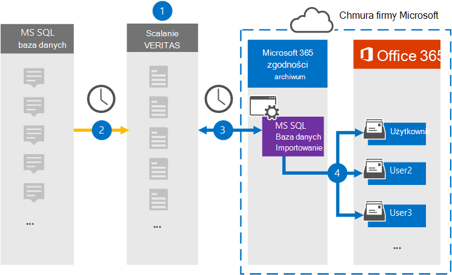

# Konfigurowanie łącznika do archiwizowania danych z usługi MS SQL Database

Użyj łącznika veritas w centrum Centrum zgodności platformy Microsoft 365 do importowania i archiwizowania danych z usługi Ms SQL Database do skrzynek pocztowych użytkowników w Microsoft 365 organizacji. Veritas zapewnia łącznik narzędzia importowania SQL Database ms, który jest skonfigurowany do przechwytywania elementów z bazy danych przy użyciu pliku konfiguracji XML i importowania ich do Microsoft 365. Łącznik konwertuje zawartość z pliku MS SQL Database na format wiadomości e-mail, a następnie importuje te elementy do skrzynek pocztowych użytkowników w programie Microsoft 365.

Po przechowywaniu zawartości z konta SQL Database w skrzynkach pocztowych użytkowników możesz stosować funkcje zgodności, Microsoft 365 takie jak Zastosowanie w związku z postępowaniem sądowym, zbierania elektronicznych materiałów dowodowych, zasady przechowywania i etykiety przechowywania. Importowanie i archiwizowanie danych SQL Database w programie Microsoft 365 za pomocą łącznika sieci SQL Database ms może ułatwić organizacji zachowania zgodności z zasadami rządowymi i przepisami regulacyjną.

## Omówienie archiwizowania danych SQL MS

W poniższym o omówieniem wyjaśniono proces używania łącznika do archiwizowania danych SQL w programie Microsoft 365.

1. Twoja organizacja współpracuje z dostawcą SQL Database ms w celu skonfigurowania i skonfigurowania witryny sieci SQL Database MS.

2. Co 24 godziny ms SQL Database są kopiowane do witryny Veritas Merge1. Łącznik konwertuje również tę zawartość na format wiadomości e-mail.

3. Łącznik narzędzia importowania w usłudze MS SQL Database, który tworzysz w usłudze Centrum zgodności platformy Microsoft 365, łączy się z witryną veritas merge1 każdego dnia i przesyła wiadomości do bezpiecznej lokalizacji usługi Azure Storage w chmurze firmy Microsoft.

4. Łącznik zaim importuje przekonwertowane elementy SQL Database do skrzynek pocztowych określonych użytkowników przy użyciu wartości właściwości Email (Poczta e-mail) automatycznego mapowania użytkowników zgodnie z opisem w [kroku 3](#step-3-map-users-and-complete-the-connector-setup). W skrzynkach pocztowych użytkowników jest tworzony podfolder w folderze Skrzynka odbiorcza o nazwie **MS SQL Database**, a elementy są importowane do tego folderu. Łącznik określa skrzynkę pocztową, do której mają być importowane elementy, przy użyciu wartości właściwości *Email* . Każdy element z listy SQL Database zawiera tę właściwość, która jest wypełniana adresem e-mail każdego uczestnika elementu.

## Przed rozpoczęciem

- Utwórz konto korespondencji seryjnej Veritas merge1 dla łączników firmy Microsoft. Aby utworzyć konto, skontaktuj się z działem [obsługi klienta firmy Veritas](https://www.veritas.com/content/support/). Podczas tworzenia łącznika w kroku 1 należy zalogować się do tego konta.

- Użytkownik, który tworzy łącznik funkcji importowania SQL Database usługi MS w kroku 1 (i ukończy go w kroku 3), musi mieć przypisaną rolę administratora łącznika danych. Ta rola jest wymagana do dodawania łączników na **stronie Łączniki** danych w Centrum zgodności platformy Microsoft 365. Ta rola jest domyślnie dodawana do wielu grup ról. Aby uzyskać listę tych grup ról, zobacz sekcję "Role w centrach zabezpieczeń i zgodności" w sekcji Uprawnienia w Centrum zabezpieczeń & [zgodności](../security/office-365-security/permissions-in-the-security-and-compliance-center.md#roles-in-the-security--compliance-center). Administrator w organizacji może również utworzyć niestandardową grupę ról, przypisać rolę administrator łącznika danych, a następnie dodać odpowiednich użytkowników jako członków. Aby uzyskać instrukcje, zobacz sekcję "Tworzenie niestandardowej grupy ról" w sekcji Uprawnienia [w Centrum zgodności platformy Microsoft 365](microsoft-365-compliance-center-permissions.md#create-a-custom-role-group).

- Ten łącznik danych usługi Veritas jest w publicznej wersji zapoznawczej GCC w środowisku danych Microsoft 365 chmurze dla instytucji rządowych Stanów Zjednoczonych. Aplikacje i usługi innych firm mogą obejmować przechowywanie, przekazywanie i przetwarzanie danych klienta Organizacji w systemach innych firm, które znajdują się poza infrastrukturą firmy Microsoft 365 i dlatego nie są objęte zobowiązaniami firmy Microsoft 365 w zakresie zgodności z przepisami i ochrony danych. Firma Microsoft nie zapewnia, że używanie tego produktu do łączenia się z aplikacjami innych firm oznacza, że te aplikacje innych firm są zgodne z fedRAMP.

## Krok 1. Konfigurowanie łącznika usługi importowania SQL Database MS

Pierwszym krokiem jest uzyskanie dostępu do strony **łączników** danych w Centrum zgodności platformy Microsoft 365 i utworzenie łącznika dla karty SQL Database.

1. Przejdź do, [https://compliance.microsoft.com](https://compliance.microsoft.com) a następnie kliknij pozycję **Łączniki danychMS** >  **SQL Database importowania**.

2. Na stronie **SQL Database produktu importowania** w aplikacji Ms kliknij pozycję **Dodaj nowy łącznik**.

3. Na stronie **Warunki użytkowania usługi** kliknij pozycję **Zaakceptuj**.

4. Wprowadź unikatową nazwę identyfikującą łącznik, a następnie kliknij przycisk **Dalej**.

5. Zaloguj się do konta korespondencji seryjnej1, aby skonfigurować łącznik.

## Krok 2. Konfigurowanie łącznika usługi SQL Database importowania w witrynie Veritas Merge1

Drugim krokiem jest skonfigurowanie łącznika usługi ms SQL Database importowania w witrynie Merge1. Aby uzyskać informacje o tym, jak skonfigurować usługę MS SQL Database importowania, zobacz Przewodnik użytkownika dotyczący [scalania1 łączników innych firm](https://docs.ms.merge1.globanetportal.com/Merge1%20Third-Party%20Connectors%20MS%20SQL%20Database%20Importer%20User%20Guide%20.pdf).

Po kliknięciu **przycisku Zapisz & zakończ** zostanie **wyświetlona** strona Mapowanie użytkowników w kreatorze łączników w Centrum zgodności platformy Microsoft 365 stronie.

## Krok 3. Mapowanie użytkowników i ukończenie konfiguracji łącznika

Aby zamapować użytkowników i ukończyć konfigurację łącznika, wykonaj następujące czynności:

1. Na stronie **Mapowanie SQL Database użytkowników do Microsoft 365 użytkowników** włącz automatyczne mapowanie użytkowników. Elementy listy SQL Database zawierają właściwość *o nazwie Poczta* e-mail, która zawiera adresy e-mail użytkowników w organizacji. Jeśli łącznik może skojarzyć ten adres z Microsoft 365, elementy są importowane do skrzynki pocztowej tego użytkownika.

2. Kliknij **przycisk** Dalej, przejrzyj ustawienia i przejdź do strony Łączniki danych, aby wyświetlić postęp procesu importowania nowego łącznika.

## Krok 4. Monitorowanie łącznika usługi importowania SQL Database MS

Po utworzeniu łącznika SQL Database importowania w aplikacji ms można sprawdzić stan łącznika w Centrum zgodności platformy Microsoft 365.

1. Przejdź do łączników <https://compliance.microsoft.com/> **danych w lewym okienku narracji i** kliknij je.

2. Kliknij **kartę Łączniki**, a następnie wybierz łącznik **ms SQL Database** **importowania**, aby wyświetlić stronę wysuwu zawierającą właściwości i informacje o łączniku.

3. W **obszarze Stan łącznika ze** źródłem **kliknij link Pobierz** dziennik, aby otworzyć (lub zapisać) dziennik stanu łącznika. Ten dziennik zawiera dane, które zostały zaimportowane do chmury firmy Microsoft.

## Znane problemy

- Obecnie importowanie załączników ani elementów większych niż 10 MB nie jest obsługuje. Obsługa większych elementów będzie dostępna w późniejszym terminie.